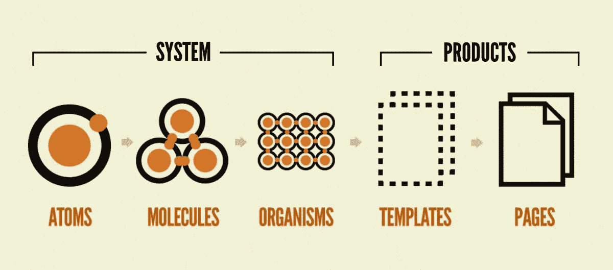
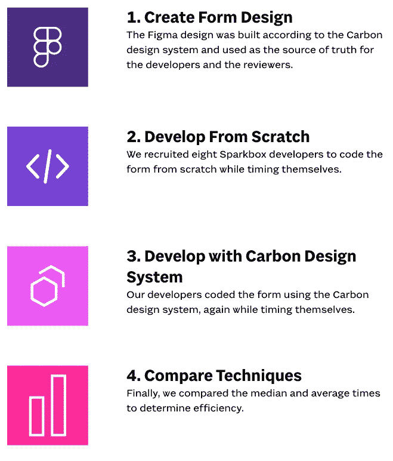

# 前端的前端:为什么设计系统对前端开发至关重要

> 原文：<https://levelup.gitconnected.com/front-of-the-frontend-why-the-design-system-is-essential-for-frontend-development-83b749eddf50>

欢迎来到激动人心的设计系统世界:一个可重用资产、指南、模式和组件、哲学和其他代表产品设计标准的数字资产的集合。对于前端开发人员(比如你自己)，一个设计系统可以通过构建一个单一的事实来源，提供更好的文档，可重用性，沟通等等，极大地支持你的工作。让我们进入细节！

# 文件清单

设计系统既是内部工具，也是文档清单，使团队成员能够解决问题和集思广益。

"*设计系统不是一个项目。这是一个为产品服务的产品。”*

*—内森·柯蒂斯，八个形状*

为了更好地描述设计系统的好处，我们将看看原子设计的方法来创建一个。原子设计是一个设计系统框架，基于“原子、分子、有机体、模板和页面同时一起工作来创建有效的界面设计系统”的概念

**原子**
原子是物质的基本构成元素。应用于 web 界面，这些构成了我们的 HTML 标签，如表单标签、输入或按钮。

**分子** 分子是结合在一起的原子团，构成化合物的最小基本单位。这些分子具有自己的特性，是我们设计系统的支柱。

分子给了我们工作的基础，我们现在可以把它们组合起来形成有机体。这些分子组合在一起形成一个相对复杂、独特的界面。

**模板**此时，我们开始看到设计和布局逐渐成形。
*(来源:***)**

***页面
页面**页面是模板的具体实例。占位符内容现在被替换为代表性内容，以准确描述用户最终将看到的内容。*

**

*设计系统过程，作者布拉德·弗罗斯特*

## *渴望了解更多信息？*看这一集的状态网* 👇*

## *何时不使用设计系统*

*如果一个团队预期一个小的项目规模并且没有大量的新开发，那么一个健壮的设计系统可能是多余的。但是可以说，无论规模如何，遵循某种“设计系统”或原则总是有益于你的工作。*

# ***设计系统有什么好处，为什么对研发如此重要？***

*设计系统有助于共享要重用的组件库，为前端开发团队节省大量时间。有了更快的产品构建过程，开发人员可以更有效地投入时间，而不是徒劳地争论。*

*团队成员(PM、设计师、开发人员)之间的协作也在创建和测试过程中得到改善，因为设计系统有助于创建一个通用的术语。此外，设计系统提供了一个优秀的学习工具，使新的开发人员更容易上手。*

*当然，如果一个产品被设定为规模化，设计系统是一个关键的工具。通过创建一个坚实的视觉语言和跨页面和布局的一致性，减少了冗余工作，前端开发过程更加一致。在开发人员打开代码编辑器之前，为 web 产品实现一个设计系统就已经开始了，因为强大的基础创造了长期的清晰和自信。*

# *设计系统帮助开发者更快地产生更好的代码。*

*Sparkbox 进行了一个有趣的实验来测试他们的假设，“设计系统帮助开发人员更快地产生更好的代码。”*

**

*查看完整流程[此处](https://sparkbox.com/foundry/design_system_roi_impact_of_design_systems_business_value_carbon_design_system)*

*他们发现，通过使用设计系统，表单的开发速度比从头开始编码快 47%。“划痕提交的平均时间为 4.2 小时，而[碳](https://www.carbondesignsystem.com/)提交的平均时间为 2 小时。碳计时包括开发人员花在熟悉设计系统上的时间。*

# ***加强工程师和设计师之间的联盟。***

*设计系统不是一个附带项目，它是一个产品。一个有助于构建产品的平台，可以促进工程师和设计师之间的合作。*

*对于前端开发者来说，有很多 UI 组件库，非常依赖流行的设计系统。这些库适用于所有主要的前端框架，促进了代码的可重用性，加速了开发，并确保了跨应用的前端设计的一致性。在下一篇文章中，我们将讨论这些库，以及如何创建一致性和可重用性，并促进工程师和设计师之间更好的合作。*

*你在当前的项目中使用设计系统了吗？在评论中分享它如何支持你的产品和开发。*

*如果你已经走了这么远，学到了一些新东西，你可以通过以下方式来表达你的感激👏为这篇文章鼓掌几十次——这样，其他人也将有机会看到它并学到一些新东西。如果你想读更多我写的东西，请点击**跟随**按钮。*