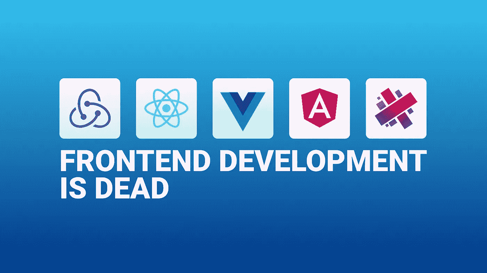
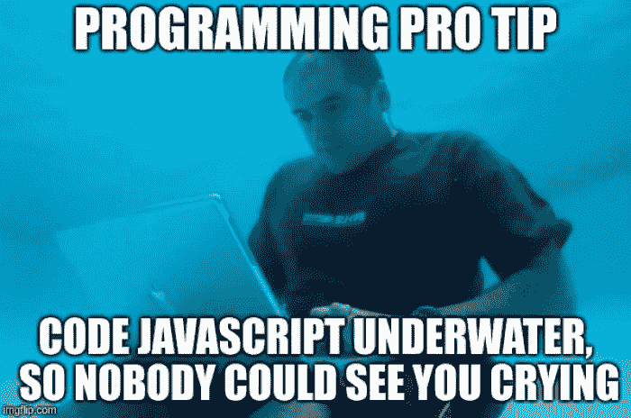
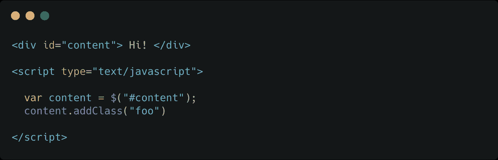
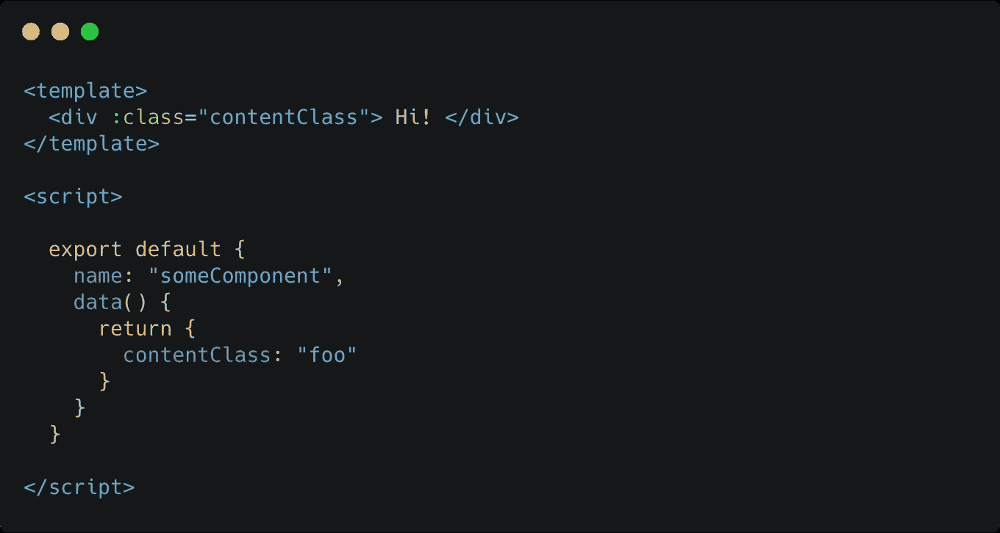

# 前端开发已死。前端工程万岁！

> 原文：<https://levelup.gitconnected.com/frontend-development-is-dead-long-live-to-frontend-engineering-67760168cc0d>

你还记得过去的好时光吗？那时你需要做的就是写一些好的 CSS 和 HTML。也许会一点 PHP、JSP 或者(如果你是一个熟练的前端开发人员)一些 Jade/Pug 变量、导入和一些 jQuery 代码…

…嗯，都死了。这是前端开发可能发生的最伟大的事情。

# 遗留问题是开发人员的问题

作为一名开发者意味着“**永远不要停止学习**”。

在后端，一些技术将持续几十年。只要想想 Java、PHP、Ruby(等等……)；一旦你设置了你的服务器，它将永远为你的应用服务。

前端是完全不同的:一些 API 将在几年后被废弃，一些浏览器将会发展，一些将会失去支持。一些新的前端框架将取代一些旧的/丑陋的/过时的库，并将帮助你更有效率。**你不能忽视那个**。

**驾驭创新浪潮是开发者的责任**。虽然 jQuery 在 2010 年是一个很棒的库，但今天它已经非常无用、丑陋和过时了。一些前端开发人员在尝试用 React、Vue 或 Angular 引导现代用户界面时会遇到困难，这完全没问题。
他们只需要学习新的东西，因为**这就是开发人员要做的事情**。

# **对 JavaScript 的恐惧**

近年来，JavaScript 已经成为最流行的编程语言之一。一些前端开发者仍然拒绝采用它作为前端的基本语言，这是极其错误的。

仅仅用 HTML(或 Jade/Pug)和 CSS (SASS/Less)就可以编写整个用户界面的日子已经一去不复返了。克服它。

作为一个开发者，有时候你需要忘记过去所学的一切。擅长用 jQuery/Zepto/MooTools 编码，并不意味着你会成为一个好的 React/Vue/Angular 开发者。

几年后写下这些:

这很难理解:

但是没关系，你只需要学习新的东西。

随着您继续学习反应式编程、基于组件的开发和其他新技术/思想，编写 Vue/React/Angular 组件而不是一些混乱的 jQuery 代码的优势将很快变得清晰。

擅长 JavaScript 编码，如今是每个前端开发者的必备技能。

**我再说一遍:SASS，Pug，jQuery 已经不够用了。**

# 前端工程

有了骨气和棱角，我们绝对告别了前端开发。这两个库引发了一场革命，导致了前端工程的出现，在这种情况下，网络知识很重要，但还不够。

今天，你需要知道如何设置 **WebPack** 或 **Rollup** 来捆绑你的应用。你可能需要知道如何使用 **Lerna** 来管理多个软件包。而 **ESLint** 呢？**更漂亮**？**打字稿还是流程**？**纱线**还是 **NPM** ？**巴别塔**？

JavaScript 并不像许多开发者所说的那样仅仅是一种糟糕的前端语言。这是一种复杂的、快速发展的编程语言，它对你的帮助超乎你的想象。它的社区充满了聪明的工程师，他们来自不同的经历，会帮助你找到语言之路。

**前端工程**的目的很简单。用户界面变得越来越复杂，用户体验将受到损害，直到你找到优化代码的方法。想想你在 2005 年是如何写代码的:你真的关心可伸缩性吗？表演？干净的代码？测试？

今天，我们经常在前端工作，编写复杂的算法、单元测试，关心性能和页面/包的大小。

在 2005 年，编写好的前端代码更容易，但即使是丑陋的代码也是可以接受的(在大多数情况下)。

2019 年，写好的前端代码极其辛苦，难看的代码再也不能接受了。为什么？因为今天的用户有很高的标准，性能，可扩展性，流畅的动画，快速的执行…一切都很重要。

诚实地说出来:在将库导入到您的项目中之前，您有多少次关心过库的大小？

有多少次你仅仅为了提高可维护性而重构了整个脚本？

有多少次你关心单元测试？表演呢？

老实说:我经常写下一个快速而肮脏的解决方案，因为我遇到的每个开发人员都是这样做的。在过去的 5 年里，我意识到我不能再这样下去了，所以我离开了 jQuery、Zepto，转而拥抱 React 和 Vue。学习了 ESLint，单元测试，干净代码，学习了算法和数据结构。

这改变了我的生活和我对编程的热情。

# 2020 前端工程师口号

*   旧技术暴露出指数级问题。一旦你离开他们，你就会把你的问题抛在脑后。
*   SEO 很重要，但它不是逃避 React/Vue/Angular 的借口。我们有 **SSR** 它解决了问题。
*   **JSP** ， **ERB** ， **PHP** 都不够用。我们在 2019 年，我们有 **Nuxt** 、 **Next、**等伟大的服务器端技术。收养他们。
*   干净的代码是必须的。
*   算法和数据结构可以挽救你的工作。字面上。研究他们！
*   测试至关重要。
*   JavaScript 是你的朋友。

自 2019 年 2 月以来，我决定写一系列名为 [**JSMonday**](https://www.jsmonday.dev) 的文章，谈论现代 JavaScript、gotchas、生态系统等等。
你可以在我的中型档案上找到所有的文章！

 [## 学习 JavaScript -最佳 JavaScript 教程(2019) | gitconnected

### 67 大 JavaScript 教程-免费学习 JavaScript。课程由开发人员提交并投票，从而实现…

gitconnected.com](https://gitconnected.com/learn/javascript)