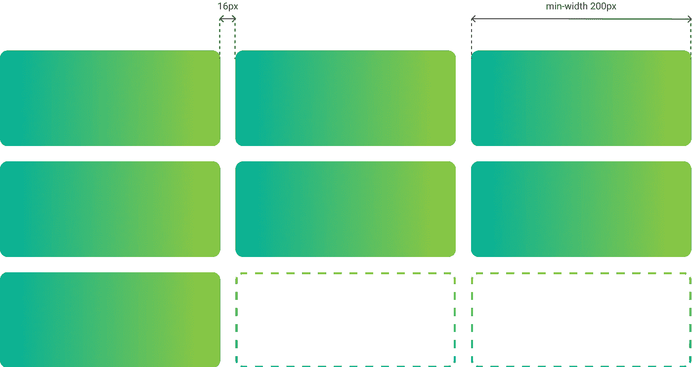

# 前端驱动的设计分析

> 原文：<https://levelup.gitconnected.com/frontend-driven-design-analysis-3cb0697d8f01>

## 在创建设计或分析设计需求时，作为前端开发人员进行思考

# 从设计到产品

从设计到最终产品的过程包括

1.  设计的创造
2.  设计分析
3.  制定组件的要求
4.  组件的实现

正如我们所看到的，设计的创建和组件的实现之间有很大的差距。我们将组件定义为一个封装的功能块。这可以小到一个按钮，也可以大到一个表单。一个页面被分成逻辑单元，我们称之为组件。

如何解释某个设计通常很简单，但不太清楚的是，在不同的内容或不同的屏幕尺寸下，该设计应该如何变得生动。因此，我们可以通过教授如何实现组件以及如何自动化某些设计规则来缩小差距。应该注意的是，我们试图实现一个 CSS 优先的方法。

我们希望通过这种方法实现的主要目标如下

1.  组件应**一致**
2.  组件应该对任何内容和屏幕尺寸做出**响应**
3.  **元素之间的间距**应该均匀

考虑到这一点，下面的陈述应该是主要的指导方针。

> 实现应该基于设计规则，而不是绝对值

# 组件应该一致

组件(变体)的每个实例都应该遵循相同的规则。这意味着您应该以这样一种方式来分析需求，即它们适合组件的所有出现。

任何无意的偏差都应该与设计师讨论和协调，以确保我们创建一个可维护的系统。

# 组件应该对任何内容和屏幕尺寸做出响应

如今，一个网站可以在过多的屏幕上浏览。我们需要确保无论网站在多大的屏幕上显示，都没有视觉上的瑕疵。

最重要的是，大多数应用程序都由某种 CMS 支持。因此，组件应该能够处理任何类型的内容。

我们应该问的主要问题是

> 如果…会发生什么

*   屏幕更小
*   屏幕更大
*   组件是嵌入的
*   还有更多内容
*   内容少了
*   没有内容

# **元素之间的间距**应一致

理想情况下，组件是独立创建的，但是一旦我们开始组合页面，这就会产生问题。因此，我们需要考虑一个组件将如何与其兄弟组件交互。最好从所有组件之间的默认间距开始，然后使用以下一种或多种方法进行扩展。

## 相对于字体大小的方法

当我们看文本时，标题通常意味着一个新的部分。为了形象化这个新部分，在标题上方增加了更多的空间。标题越大，间距越大。这个逻辑允许我们定义每个元素顶部相对于该元素字体大小的间距。HTML 中的每个元素都有字体大小，不仅仅是文本元素，所以这可以应用于所有组件。我们可以用下面这段 CSS 对每个前面有元素的元素应用这个方法。

任何有在先元素的元素都将获得相对于其字体大小的上边距

试试看:[https://codepen.io/RobinAlaerts/full/bGqzJLz](https://codepen.io/RobinAlaerts/full/bGqzJLz)

## 特定组件方法

当您知道某个组件需要比平常更多的间距时，您可以专门为此组件定义间距。

目标元素将获得特定的上边距

## 组件组合方法

这种方法更难预测，但在某些情况下是可行的。假设你想要两个组件之间有一个特定的空间，你可以确保这个空间总是被尊重。

如果组件 X 位于组件 Y 之前，组件 Y 将获得特定的上边距

# 例子

## 容器

让我们看看容器的第一个例子，它可以是横幅、卡片、文章……任何包含内容的容器都可以应用于此。

通用横幅示例

带有可见规则的通用横幅

如果我们定义了正确的设计规则(左)，那么它将应用下面的例子。然而，如果我们选择了错误的设计规则(正确的)，每个横幅都需要自己的规格。

不同内容的横幅示例

试试看:【https://codepen.io/RobinAlaerts/full/wvgNBpP 

## 小跟班

这是按钮的第二个例子。我添加了一个带有图标的例子来展示灵活规则的重要性。

按钮的示例

具有可见规则的按钮

不正确的设计规则(右)仅适用于第一个按钮(文本 ok)，而正确的规则(左)适用于所有实例。这条规则甚至支持全角按钮和图标。

试试吧欧:【https://codepen.io/RobinAlaerts/full/qBreNbX】

## 网格

在分析网格时，有一种方法可以避免为每个断点定义网格。我们将定义列的最小宽度以及列和行之间的间距，而不是说我们期望在每个断点上有多少列。

只要满足所需的最小宽度，网格将尝试在一行中容纳尽可能多的列。行为有两种类型，`auto-fit`和`auto-fill`。第一个会在可能的情况下不断添加列，即使这些列中没有要放置的项目。第二种方法将只添加与填充这些列的项目一样多的列。如果没有更多的项目，网格将拉伸现有的列，而不是添加新的列。

这种方法的优点是网格现在独立于断点。网格列将根据网格的大小而不是屏幕宽度来增长或收缩。例如，当你的网格被嵌入到一个弹出窗口中，并且它不再与屏幕大小相关时，这是很有用的。

使用下面的 CSS 代码可以很容易地实现这一点。

试试看:【https://codepen.io/RobinAlaerts/full/vYypNJj 

# 测量两次，切割一次

通过实施简单、一致且可扩展的规则，我们避免了过多的迭代并防止了设计的不一致性。让您的设计师、分析师和开发人员步调一致，缩短上市时间。