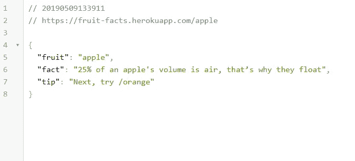
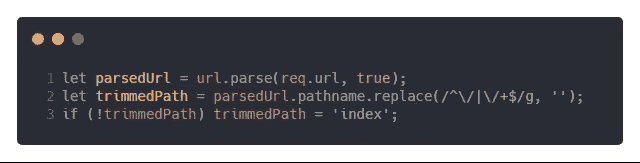
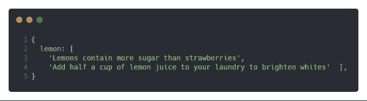
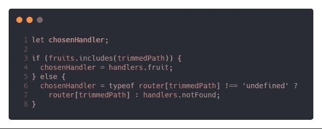
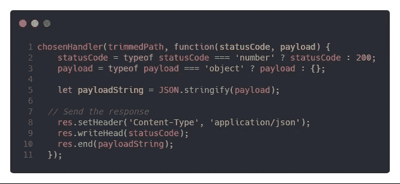

# 用 Pure Node.js 构建的水果忍者随机水果事实 API

> 原文：<https://levelup.gitconnected.com/fruit-ninja-random-fruit-facts-api-built-with-pure-node-js-5bff9c0e62a5>

## 仅使用普通节点构建 web 服务器，不使用任何第三方软件包或库

我开始学习如何使用纯节点 web 服务器(没有 Express 或任何其他包)。巩固学习的最佳方式是用知识构建一些东西。然而，由于课程范围有限，我无法找到要构建的项目。

这几天在玩水果忍者。在每一轮之后，它显示有趣的水果事实。我有一个想法，制作一个 API，以 JSON 格式显示随机的水果事实。这样我就可以在创造一些有趣的东西的同时运用我的知识。


我构建了这个简单的 API，它以 JSON 格式显示有趣的水果事实。当你输入`localhost:3000/apple`或者其他任何可用的水果，它都会吐出这个数据。



该 API 简单而复杂。这是我第一次构建一个 URL slug 作为一个变量。和 express.js 里的`/:fruit`一样。

**我建议你** [**打开代码**](https://github.com/TamalAnwar/fruit-facts/blob/master/index.js) **跟随着这篇帖子。**

这个想法是把完整的网址`http://localhost:3000/mango`分成几个部分。然后我选择路径`/mango`，去掉所有斜线，得到一个最终干净的修剪过的路径`mango`，之后我可以将这个 slug 与我的路径处理程序进行匹配。我从 [Pirple 的节点大师班课程](https://pirple.thinkific.com/courses/the-nodejs-master-class)中学到了这种方法。



我从维基页面上收集了这些水果信息。我将在另一篇文章中讲述我是如何用 JavaScript 放弃这些事实的。

我创建了一个可用水果的数组。许多水果有不止一个事实，所以我创建了一个水果对象，每个水果都有一组事实:



除了水果事实，API 还有 3 个额外的页面——主页、一个未找到的页面和一个帮助页面。首先，我检查给定的 URL 是否是匹配的水果。如果是匹配的水果，它将把给定的水果提供给水果处理员。如果它不包含匹配的水果，但与其他处理程序匹配，它将相应地为它们提供服务:



然后剩下要做的就是调用`chosenHandler`函数并传入回调函数:



我们使用原生的`http`包来创建一个 web 服务器。服务器是使用`http.createServer`构建的。`createServer`函数接受回调，在回调中我们可以处理请求并提供来自`chosenHandler`的水果事实或其他页面。然后我们使用`server.listen`监听端口 3000。

```
const server = http.createServer(function(req, res) { 
  /* Callback to handle requests with chosenHandler */
}server.listen(3000, () => { console.log('Server started') })
```

你可以修改我的 Github 页面上的代码。我建议你[安装 JSON 查看器扩展](https://chrome.google.com/webstore/detail/json-viewer/gbmdgpbipfallnflgajpaliibnhdgobh)，以一种漂亮的格式化方式查看 JSON。

如果你喜欢这篇文章，你可以看看我的博客，了解更多与节点 JS 相关的文章。

[](https://gitconnected.com/learn/node-js) [## 学习 Node.js -最佳 Node.js 教程(2019) | gitconnected

### 前 33 个 Node.js 教程-免费学习 Node.js。课程由开发人员提交和投票，使您能够…

gitconnected.com](https://gitconnected.com/learn/node-js)