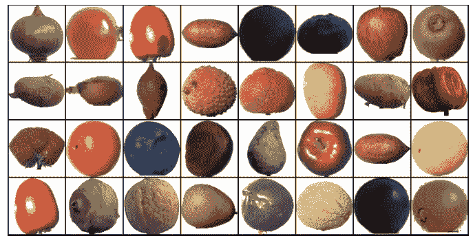
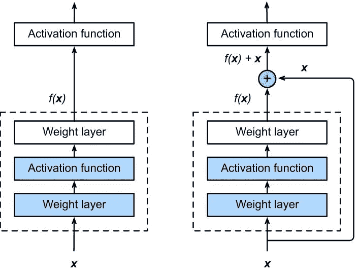

# 水果、蔬菜和深度学习

> 原文：<https://levelup.gitconnected.com/fruits-vegetables-and-deep-learning-c5814c59fcc9>

## 用 PyTorch 卷积神经网络处理图像数据集

水果 360 数据集样本

*免责声明:此作品是由* [*Aakash N S*](https://jovian.ml/forum/u/aakashns/summary) *用 PyTorch 完成的深度学习课程的最终项目，该课程在*[*jovian . ml*](https://jovian.ml/forum/c/pytorch-zero-to-gans/18)*上举办，并在*[*【freeCodeCamp.org*](https://www.freecodecamp.org/)*[*YouTube*](https://www.youtube.com/watch?v=vo_fUOk-IKk&list=PLWKjhJtqVAbm3T2Eq1_KgloC7ogdXxdRa)*频道上免费提供。**

# *1.介绍*

*如果你正在阅读这篇文章，那是因为你可能想知道，你如何用水果和蔬菜来学习深度学习呢？好吧，听起来很疯狂，现实世界中的物体分类是一个人类认为理所当然的琐碎问题。这是因为人类的大脑接受过这样的训练。*

*作为人类，我们喜欢对事物进行分类，你能想到的任何东西都可以被归类到一个类别或类中。在行业中，这是一个日常问题:零件、夹具、组件和货物的分类是日常工作的一部分。这就是为什么人类已经推出了机器学习(ML) [1]、神经网络(NN) [2]和深度学习(DL) [3]等技术，以及其他算法来自动化分类过程。*

*在这篇文章中，(1)讨论了**卷积神经网络** (CNN)的概念。(2)以 PyTorch [4]为基础的代码编写了两种不同的 CNN 架构，其中第一种是作者提出的定制架构，第二种是所谓“ResNet”的标准架构[5]。(3)讨论了精度方面的结果。*

*本文的主要目的是说明如何建立一个用于图像检测和分类的 CNN 模型。出于这项工作的目的，实现了一个定制 CNN，然后与一个 ResNet CNN 进行比较。*

## *什么是卷积神经网络？*

*卷积神经网络或深度学习架构是从人脑如何处理信息的灵感中发展而来的。CNN 是一种在图像处理、图像识别和图像分类等领域提供良好结果的神经网络。这就是为什么根据这篇文章的标题，需要一个 CNN 模型的原因。*

*深度学习应用在行业中应用广泛。CNN 的一些应用包括人工智能(AI)系统，如机器人、虚拟助理、自动驾驶汽车等。*

*由于这一块的目的是分析图像分类，将使用“水果 360 数据集”[6]。该数据集可从 Kaggle 获得，它包含水果和蔬菜的图像，其主要属性如下:*

***图像总数** : 90483。*

***训练集大小** : 67692 张图片(每张图片一个水果或蔬菜)。*

***测试集大小** : 22688 张图片(每张图片一个水果或蔬菜)。*

***类别数量** : 131(水果和蔬菜)。*

***图像尺寸** : 100x100 像素。*

*这篇文章中讨论的所有过程都可以在 Jupyter 笔记本中找到，在那里你可以在阅读本文的同时运行代码块。*

# *2.将数据集导入 Jupyter 环境*

*如果你点击了 Jupyter 笔记本的链接，你会发现一个“运行”的底部，这将允许你在三个不同的平台上运行笔记本。建议在 [Kaggle](https://www.kaggle.com/) 或 [Colab](https://colab.research.google.com/) 上运行。该笔记本包括有关如何将数据集导入两个云中的说明。你只需要根据你工作的平台来运行代码块。*

*如果您对本地运行感兴趣，您可以从这里的[下载数据集](https://www.kaggle.com/moltean/fruits)，您必须安装并导入到 python 文件的模块如下:*

*根据您运行笔记本的位置和方式，您将必须声明数据集的路径，例如，如果您在 Google Colab 中运行，您将必须运行以下内容:*

# *3.数据处理—训练和验证数据集*

*在构建真实世界的机器学习模型时，通常会将数据集分成 3 个部分:*

1.  ***训练集**:用于训练模型，即使用梯度下降计算损失并调整模型的权重。*
2.  ***验证集**:用于训练时评估模型，调整超参数(学习率等)。)并挑选模型的最佳版本。*
3.  ***测试集**:用于比较不同的模型，或不同类型的建模方法，并报告模型的最终精度。*

*出于本文的目的，包含在`Trining`目录中的所有图像都将被用作 Trining 数据集，对于作为验证数据集的`Test`目录也是如此，它稍后将被用作测试集。*

## *3.1 数据转换*

**从训练数据集中加载图像时，随机数据扩充*将应用随机选择的变换。具体来说，每个图像将被填充 10 个像素，然后以 50%的概率水平翻转图像。最后，随机旋转 20 度将适用。由于每次加载特定图像时都会随机和动态地应用变换，因此该模型在每个训练时期看到的图像略有不同，这使得它可以更好地进行归纳。*

*设置数据扩充后，可以使用 PyTorch 提供的`ImageFolder`模块将数据集加载为张量:*

*一旦数据以张量的形式出现，你就可以观察数据的样子了。在训练数据集的情况下，已经对每个图像应用了变换，例如:*

*带有变换的训练数据集中的图像。*

*同时，验证数据集保持其原始格式:*

*带有转换的验证数据集中的图像。*

## *3.2 数据加载器*

*既然数据已经被加载和转换，就差不多可以开始训练了，但是首先您必须定义什么叫做数据加载器。*

*通常，当你运行机器学习模型时，你会处理大量的数据。这些数据必须由计算机处理，而计算机的资源是有限的。机器不可能一次运行该数据集中包含的所有 67692 幅图像。因此，您需要数据加载器。*

*幸运的是，PyTorch 自带了相应的模块，您所要做的就是定义一个数据集(已经在上一节中定义了)和一个批处理大小。*

*批量大小是每次要处理的数据量。如果您设置了一个大的批处理，您可能会耗尽内存，所以尝试根据您的数据设置一个合理的数字。这一次，这两批将有相同的大小，但你可以改变这些数字，如果你喜欢。*

*由于本研究将讨论和比较两种不同的 CNN 架构，因此有必要定义两个不同的批次:*

*   *`train_dl_custom`和`valid_dl_custom`为定制 CNN 模式*

*   *resnet CNN 型号的`train_dl_resnet`和`valid_dl_resnet`*

*注意`shuffle=True`是为训练数据加载器设置的，因此每个时期生成的批次是不同的，这种随机化有助于概括和加速训练过程。*

*另一方面，由于验证数据加载器仅用于评估模型，因此不需要打乱图像。*

*让我们来看看来自训练数据加载器的一些样本图像。*

*定型 Dataloader 批处理示例。*

*验证数据加载器批处理示例。*

*注意`train_dl_*`样本是如何应用数据扩充的。*

# ***4。使用 GPU***

*随着模型和数据集大小的增加，您将需要使用 GPU 在合理的时间内训练您的模型。GPU 包含数百个内核，这些内核针对在短时间内对浮点数执行昂贵的矩阵运算进行了优化，这使得它们非常适合训练具有许多层的 CNN。*

*你可以在 [Kaggle 内核](https://www.kaggle.com/kernels)或者 [Google Colab](https://colab.research.google.com/) 上免费使用 GPU。您可以使用`torch.cuda.is_available`检查 GPU 是否可用以及所需的 [NVIDIA CUDA](https://developer.nvidia.com/cuda-zone) 驱动程序是否已安装。*

*如果 GPU 可用，您可以定义几个助手函数(`get_default_device` & `to_device`)和一个助手类`DeviceDataLoader`，根据需要将模型和数据移动到 GPU。*

*`DeviceDataLoader`类用于包装现有的数据加载器，并在访问批处理时将数据移动到所选设备。有趣的是，您不需要扩展现有的类来创建 PyTorch 数据加载器。所需要的只是一个检索数据批次的`__iter__`方法和一个获取批次数量的`__len__`方法。*

*根据您运行该笔记本的位置，您的默认设备可能是 CPU ( `torch.device('cpu')`)或 GPU ( `torch.device('cuda')`)*

*现在，您可以使用`DeviceDataLoader`包装训练和验证数据加载器，以便自动将数据批量传输到 GPU(如果可用的话)。*

# *5.定义模型*

*如前所述，这项工作实现了 CNN，这是一类人工神经网络，它使用卷积层来过滤数据以达到学习目的。这包括将输入数据(特征图)与卷积核(过滤器)相结合以形成变换图。*

*CNN 的主要组件是输入层、隐藏层(可以从 1 到应用程序所需的层)和输出层。*

**

*卷积神经网络——图片由 Maurice Peemen 提供。*

*CNN 和常规神经网络之间的主要区别在于，CNN 层是以三维(宽度、高度和深度)排列的。隐藏层是卷积、池化、归一化和完全连接层的组合[7]。*

*换句话说，CNN 是一种深度学习算法，能够使用图像作为输入，以各种方式检查它们以检测模式或对象，并作为输出获得区分彼此的能力。*

*在进入每个模型的细节之前，让我们为模型定义一个`ImageClassificationBase`类和一个`accuracy`函数。*

*   *`accuracy`函数将作为一种评估模型性能的方法。一种自然的方法是找到被正确预测的标签的百分比，即预测的准确性。*
*   *`ImageClassification`级将作为两种型号的训练器、验证和损失计算器。*

## *5.1 定制 CNN 模型*

*为该定制 CNN 模型考虑的架构将基于*剩余块*和*批量归一化*。这是为了能够实际比较定制 CNN 和 ResNet 模型的结果。*

*   **残差块*将原始输入添加回输出特征图，该输出特征图是通过将输入通过一个或多个卷积层而获得的[8]。*

**

*常规块(左)和残差块(右)的区别，([图像来源](https://d2l.ai/_images/residual-block.svg))。*

*   **批量标准化*顾名思义，通过将卷积层的输入调整到相同的比例来进行标准化。这减少了神经网络的训练时间[9]。*

*要定义自定义 CNN，您只需运行以下代码:*

## *5.2.ResNet CNN 模型*

**ResNet* 代表残差神经网络，它是 ImageNet 数据集[5]中预训练的模型。你可以在[这里](https://d2l.ai/chapter_convolutional-modern/resnet.html)找到关于这个架构如何工作的深入解释。*

*PyTorch 提供了 resnet 的 5 个版本的实现，分别包含 5、34、50、101、152 层[10]。出于这项工作的目的，resnet34 将用于其`pretrained`版本，其中最后一层将被修改以适应所使用的数据集。*

# *6.训练模型*

*在训练模型之前，让我们定义一个`fit_one_cicle`函数，它将执行整个训练过程。该函数记录每个时期的验证损失和度量，并返回训练过程的历史。这对于调试和可视化训练过程非常有用。*

*像批量大小、最大学习率等配置。训练机器学习时需要预先挑选模型，并称为*。**

**选择正确的超参数对于在合理的时间内训练准确的模型至关重要，并且是研究和实验的活跃领域。随意尝试不同的学习速度，看看它是如何影响训练过程的。**

*   ****学习率调度**:模型不使用固定的学习率，而是使用一个学习率调度器，它会在每一批训练后改变学习率。在训练过程中有许多改变学习率的策略，本研究中使用的一种是所谓的“*单周期学习率策略*”，它涉及从低学习率开始，在大约 30%的时期内逐批逐渐增加到高学习率，然后在剩余时期内逐渐减少到非常低的值[11]。**
*   ****权重衰减**:这是另一种正则化技术，通过在损失函数中增加附加项来防止权重变得过大【12】。**
*   ****渐变剪辑**:该技术有助于将渐变值限制在一个小范围内，以防止由于大的渐变值而导致参数发生不希望的变化。[13].**

**另外，是时候定义另外两个有用的函数了:`evaluate`和`get_lr`:**

*   **`evaluate`功能将在每个时期评估训练模型。这将作为输出提供训练模型做得有多好或有多差。**
*   **`get_lr`或“获得学习率”，将优化每个时代的学习率。**

**现在，是时候为训练过程定义超参数了。**

**请注意，选择的训练器优化器是 ***Adam 优化器*** 、，它使用动量和自适应学习率等技术来加快训练速度[14]。**

## **6.1.训练自定义 CNN 模型**

**至此，除了一个小细节之外，定制模型的训练已经准备就绪。定制模型是基于期望的输入(3 个图像通道)和特定的输出(图像上水果的类别)构建的。**

**需要指定模型的输入为`3` *通道*，输出为`131`类水果。**

**一旦指定了这两个参数，只需将它们加载到 CNN 模型中，然后将模型移动到之前选择的设备(`cpu`或`cuda` GPU)中。**

**既然模型已经加载到了所需的设备中，让我们检查输入和输出数据是否正确。**

**如前块所示，输入数据加载器的`images.shape`为:**

*   **32 =批量大小**
*   **3 =图像通道(RGB)**
*   **100 x 100 =图像尺寸(宽度、高度)**

**另一方面，CNN 模型的输出显示:**

*   **32 =批量大小**
*   **131 =水果类的数量**

**让我们来评估一下这个模型:**

**注意，最初的评估结果非常糟糕。验证损失为 4.875，而模型的准确率仅为 1.72%。**

**现在，您可以运行下面的块来执行自定义 CNN 模型的定型。**

***注意:考虑到培训过程可能需要几分钟*。**

**大约 1 小时 20 分钟后，您将获得培训的最终结果，该结果应该类似于以下内容:**

*   **上次学习率:4e-9**
*   **培训损失:0.0013**
*   **验证损失:0.0465**
*   **验证准确率:99.21%**

## **6.2.训练 ResNet CNN 模型**

**至此，ResNet CNN 模型的训练一切就绪。**

**与定制 CNN 模型类似，只需将它们加载到 CNN 模型中，然后将模型移动到之前选择的设备(cpu 或 cuda GPU)上。**

**现在，让我们评估该模型，看看它的表现如何。**

**注意，最初的评估结果非常糟糕。验证损失为 4.8911，同时模型的准确率仅为 1.25%，与定制的 CNN 模型初始值非常接近。**

**首先，冻结 ResNet 层，并训练一些纪元。这只训练最后一层开始分类图像。**

**训练最后一层几个纪元。**

**现在，解冻并多训练一些。**

**大约 30 分钟后，您将获得培训的最终结果，看起来应该类似于以下内容:**

*   **上次学习率:4e-9**
*   **培训损失:3.9102**
*   **验证损失:3.9111**
*   **验证准确率:92.45%**

# **7.结果可视化**

**现在是时候看看哪个模型表现更好了。**

**自定义模型训练所消耗的时间几乎是 ResNet 模型的 3 倍，但自定义模型的结果更好。**

**准确性—定制 CNN 模型。**

**准确性— ResNet CNN 模型。**

**如上图所示，**定制模型**的精度达到了 **99.21%** ，而 **ResNet 模型**的精度仅为 **92.45%** 。**

**训练和验证损失-定制 CNN 模型。**

**训练和验证损失 ResNet CNN 模型。**

**另一件相当重要的事情是，定制模型很好地减少了训练和验证损失，而 ResNet 模型没有那么好。**

**最后，用于两种模型的学习率如下所示:**

**学习率变化-定制 CNN 模型。**

**学习率变化——ResNet CNN 模型。**

# **8.使用训练好的模型进行预测**

**现在，您可以使用经过训练的模型通过验证数据集进行预测。由于两个模型都达到了 90%以上的准确性，预测将是相似的。**

**这是自定义模型的预测:**

**自定义 CNN 训练模型预测。**

**这是 ResNet 模型的预测:**

**ResNet CNN 训练模型预测。**

# **9.未来的工作**

**即使结果非常好，仍有一些机会领域需要关注:**

*   **使用 ResNet 模型减少培训和验证损失。**
*   **减少定制模型训练所需的时间。**
*   **使用不同的数据集测试自定义模型以评估其性能。**

# **10.结论**

**在这篇文章中，提出了用于图像分类目的的两种不同的卷积神经网络(CNN)架构。作者提出的定制模型和 PyTroch 模块中包含的 ResNet 模型。**

**结果表明，自定义模型，即使花费更长的训练时间，也比 PyTorch 模块中实现的 ResNet 模型显示出更好的结果。**

****定制模型**达到了 **99.21%** 的准确率，而 **ResNet 模型**只达到了 **92.45%。****

**与 ResNet 模型相比，自定义模型设法减少了培训和验证损失。**

**有完整代码的 Jupyter 笔记本可供读者在下面的链接中做进一步的修改。**

# **11.承认**

**感谢 [Aakash N S](https://medium.com/@aakashns) 和 [Jovian.ml](https://jovian.ml/forum/c/pytorch-zero-to-gans/18) 团队用 PyTorch 制作《深度学习》课程。**

# **参考**

**[1]郝，K，“什么是机器学习？”, 2018.【在线】。可用:[https://www . technology review . com/2018/11/17/103781/what-is-machine-learning-we-draw-you-another-flow trade/](https://www.technologyreview.com/2018/11/17/103781/what-is-machine-learning-we-drew-you-another-flowchart/.)。[2020 年 6 月 22 日访问]。**

**[2] Hadesty，l .《被解释的:神经网络》，2017 年。【在线】。可用:[http://news . MIT . edu/2017/explained-neural-networks-deep-learning-0414](http://news.mit.edu/2017/explained-neural-networks-deep-learning-0414.)。[2020 年 6 月 22 日访问]。**

**[3] Sharma，v .《深度学习——卷积神经网络导论》，2018 年。【在线】。可用:[https://vinodsblog . com/2018/10/15/everything-you-neural-networks/](https://vinodsblog.com/2018/10/15/everything-you-need-to-know-about-convolutional-neural-networks/.)。[2020 年 6 月 22 日访问]。**

**[4] PyTorch 贡献者，“PyTorch 文档”，2019 年。【在线】。可用:【https://pytorch.org/docs/stable/index.html】T2。[2020 年 6 月 22 日访问]。**

**[5]何等。艾尔。，“用于图像识别的深度残差学习”，2015。【在线】。可用:【https://arxiv.org/abs/1512.03385】T4。[于 2020 年 4 月 15 日获取]。**

**[6] Muresan，h .，Oltean，m .“使用深度学习从图像中识别水果”，2018 年，载于 *Acta Univ. Sapientiae，Informatica* 。第 10 卷，第 1 期，第 26-42 页。【在线】可用:[https://arxiv.org/abs/1712.00580](https://arxiv.org/abs/1712.00580)。**

**[7]英伟达公司。*《卷积神经网络(CNN)》*，2020。[在线]英伟达开发者。可用:[https://developer . NVIDIA . com/discover/卷积神经网络](https://developer.nvidia.com/discover/convolutional-neural-network)，【2020 年 6 月 22 日访问】。**

**[8] Sahoo，S. *《剩余块 ResNet 的积木块》*，2018。[在线]走向数据科学。可用:[https://towardsdatascience . com/residual-blocks-building-blocks-of-resnet-FD 90 ca 15d 6 EC](https://towardsdatascience.com/residual-blocks-building-blocks-of-resnet-fd90ca15d6ec)，【2020 年 6 月 22 日访问】。**

**[9] Kumar，N. *《用 Pytorch 实现神经网络中的批量归一化和剔除》*，2019。[在线]走向数据科学。可用:[https://towards data science . com/batch-normalization-and-dropout-in-neural-networks-explained-with-py torch-47d 7a 8459 BCD](https://towardsdatascience.com/batch-normalization-and-dropout-in-neural-networks-explained-with-pytorch-47d7a8459bcd)，【2020 年 6 月 22 日获取】。**

**10 py torch 文件。“RESNET”。[在线]可用:[https://pytorch.org/hub/pytorch_vision_resnet/](https://pytorch.org/hub/pytorch_vision_resnet/)，【2020 年 6 月 22 日获取】。**

**[11]古格，s .*《1 周期政策》*，2018 年。[在线]可用:[https://sgugger.github.io/the-1cycle-policy.html](https://sgugger.github.io/the-1cycle-policy.html)，【2020 年 6 月 22 日获取】。**

**[12] Vasani，d .，*《这东西叫重量衰减》*，2019。[在线]走向数据科学。可用:[https://towards data science . com/this-thing-thing-called-weight-decay-a 7 CD 4 BCF cab](https://towardsdatascience.com/this-thing-called-weight-decay-a7cd4bcfccab)，【2020 年 6 月 22 日访问】。**

**[13] Wong，w .，*“什么是渐变裁剪？”*，2019。[在线]走向数据科学。可用:[https://towards data science . com/what-is-gradient-clipping-b 8 e 815 cdfb 48](https://towardsdatascience.com/what-is-gradient-clipping-b8e815cdfb48)，【2020 年 6 月 22 日获取】。**

**[14] Ruder，s .，*《梯度下降优化算法综述》*，2016。[在线]塞巴斯蒂安·鲁德，可在:[https://ruder.io/optimizing-gradient-descent/index.html](https://ruder.io/optimizing-gradient-descent/index.html)，【2020 年 6 月 22 日访问】。**