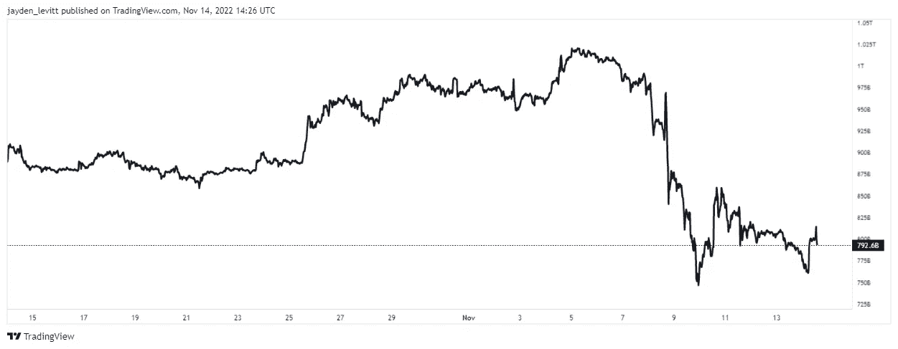

# FTX 暴跌凸显了比特币的优点和加密技术的脆弱性(迈克尔·塞勒)

> 原文：<https://levelup.gitconnected.com/ftx-plummeting-highlights-the-virtues-of-bitcoin-and-the-fragility-of-crypto-michael-saylor-df30c91509ab>

你会看到为什么这次崩溃加强了塞勒的叙述。

来源—[michael.com 的公共图像](http://michael.com)

[迈克尔·塞勒](http://michael.com/)是比特币最大化的坚定支持者。

在 FTX 丑闻之后，比特币的巨大投资者表示，加密货币市场是时候“成长”了。

这位科技大亨和 [MicroStrategy](https://www.microstrategy.com/en) 董事长是 45 多项专利的知名发明者，也是世界上最大的比特币公司持有者之一。

塞勒和他的公司 MicroStrategy 从未远离争议，但他们现在拥有 13 万枚比特币，价值 18 亿美元

MicroStrategy 对比特币的总收购价格几乎是 40 亿美元，这使得 Saylor 的平均收购价格约为每比特币 30，623 美元。

截至发稿时，比特币的价格为 16，700 美元，比塞勒的平均购买价格低了近 50%，他有一笔保证金贷款。

价格下降主要是由于宏观经济问题，如利率上升和创纪录的通货膨胀。

最近加密市场的投降是因为美国交易所 FTX 从价值 320 亿美元一夜之间到零。

该公司的流动资产不到 10 亿美元，负债为 90 亿美元。

在某个地方，在某个时候，你可能听说过 FTX 和他们的创始人萨姆·班克曼-弗里德，他用客户的资金交易 FTX 的本土货币 FTT。

除此之外，FTX 或其姊妹公司 Alameda Research 对 FTT 进行了贷款抵押。这意味着，如果出现像这样的抛售，FTX 将永远无法偿还他们的客户。

像比特币基地和币安这样健康的交易公司通常拥有相当于或超过负债的资产。他们会有现金储备，可以支付所有客户的提款。

你会希望。

FTX 流动性的巨大缺口导致该公司破产，并拖累了整个加密货币市场。

在经历了相当于“银行挤兑”的加密操作后，FTX 现在短缺数十亿美元。

当许多人因为认为银行可能很快停止运作而同时取款时，就会发生银行挤兑。

班克曼-弗里德因其巨大的成功获得了亿万富翁的地位，并表现出热衷于将狂野的西部加密市场与主流监管相一致的人。

他在 FTX 崩盘后发了微博。

> 山姆·班克曼-弗里德:
> 
> “我很抱歉。
> 
> 这是最重要的。
> 
> 我搞砸了，应该做得更好。"
> 
> “我仍在充实整个故事的每一个细节，但在很高的层面上，我搞砸了两次。
> 
> 第一次，银行相关账户糟糕的内部标记意味着，我对用户利润的感觉大打折扣。
> 
> 我以为会低很多。"

由于 FTX 的崩溃，2000 亿美元被从加密货币市场抹去。

来源— [交易视图](https://www.tradingview.com/symbols/TOTAL/)

# 迈克尔·塞勒——FTX 内爆凸显了比特币的优点和加密生态系统的脆弱性

Saylor 呼吁对加密货币进行更多的监管，他认为大多数加密货币都是证券——广义而言，证券是持有价值的金融工具，可以在各方之间交易，并受 SEC 监管。

塞勒认为，如果不是因为集中化的失败，如果人们选择自我监管并投资于不需要发行者的比特币，FTX 的内爆就不会发生。

> 迈克尔·塞勒:
> 
> “比特币是一种商品，你可以在没有发行者的情况下自行保管。
> 
> 大多数加密令牌是未注册的证券，在不受监管的交易所交易。"

塞勒认为，FTX 丑闻震撼了加密货币领域，让整个行业倒退了数年，但面对环境因素，这加强了比特币的叙事。

他认为比特币创造者与市场其他人的关系不正常。

> 迈克尔·塞勒:
> 
> “本周，我们看到了与 FTX 的集中交易爆发出了什么问题。
> 
> 比特币制造者很久以来就一直在预测这一点。
> 
> 代表所有比特币创造者发言，我们感到被困在与 Crypto 的不正常关系中，想要退出。
> 
> 行业需要成长，全世界都想要数字资产和证券，但是没有办法注册数字证券。
> 
> 没有指定数字商品的指南或路线图。"

Saylor 说，FTX 和 FTT 的崩溃将加密产业架构的脆弱性和缺陷推到了前沿和中心。

> 迈克尔·塞勒:
> 
> “监管者被从床上叫起来，在电视上回答问题，国会也被点亮了。
> 
> 你会看到每个媒体机构都在谈论这件事。"

他表示，FTX 事件将增强监管者的力量，加快他们的干预速度。但他最终认为这将支持比特币的说法。

> 迈克尔·塞勒:
> 
> “比特币将成为所有这一切的赢家，因为比特币是所有商品中争议最小的一种。
> 
> 绝大多数密码是在不受监管的交易所进行的不受监管的证券交易，而且它们相对集中，所以会出什么问题呢？
> 
> 我们已经在 FTX 看到，在未注册交易所进行的集中代币交易可能会出什么问题。"

塞勒表示，当监管到来时，整个市场的狂野西部性质将开始消散。

FTT (FTX)等加密货币的道德风险是，人们试图以错误的方式做好事。

10 万名投资者和数百万名小交易商加入了 crypto 生态系统，因为他们希望拥有自己的品牌，信任 FTX。

尽管如此，他们仍被出售未注册证券，这对该行业来说是可怕的。

Saylor 认为，当监管到来时，98%的玩家将摆脱困境，导致主流和机构采用。

# 最后的想法

塞勒的全部身家都与比特币捆绑在一起，这让他的观点有点偏颇。然而，他说比特币网络没有任何变化，这是正确的。

以太坊、Defi、NFTs 也是如此。技术的基础设施是一样的。

FTX 出问题的是人。

一个糟糕的演员不负责任地使用客户的资金进行交易，直到大规模抛售导致“银行挤兑”和流动性危机。

你在创纪录的通胀、加息和一系列其他公司倒闭的烹饪中加入一些额外的香料，这将是一场灾难。

永远不要相信你的资金交易。最好总是把你的资产冷藏起来，比如账本或者 Trezor 硬件钱包。

如果 FTX 的崩溃影响了你，请给我留言——我很乐意收到你的来信。

> 如果你想在 Web3 上阅读更多我的观点，请考虑成为会员。你的会员费直接支持你读的作家。如果你用我的链接 [*注册，我会赚一小笔佣金。点击这里*](https://medium.com/@jayden_levitt/membership) *。*

*本文仅供参考；不应将其视为财务、税务或法律建议。在做出任何重大的财务决定之前，你可以咨询财务专家。*