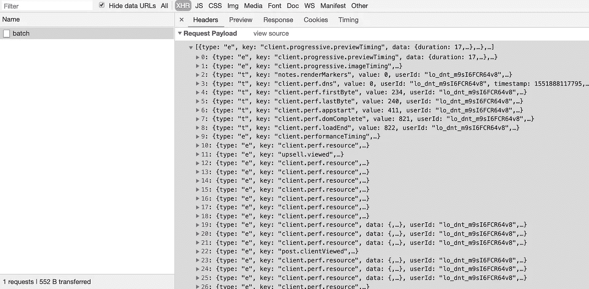
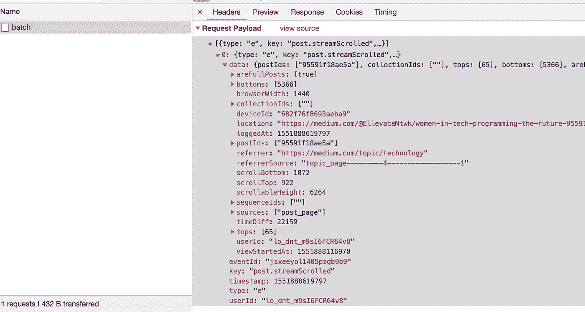
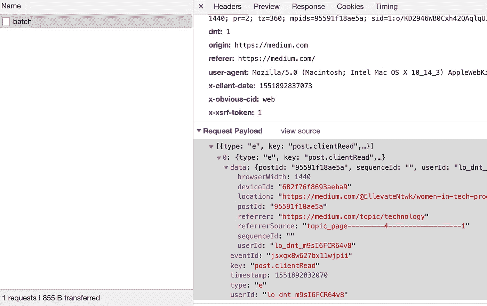

# 用 NodeJS 伪造中等统计数据

> 原文：<https://levelup.gitconnected.com/fudging-medium-stats-with-nodejs-8c3d176c1610>


这不会是我的一篇普通文章，在这篇文章中，我们讨论如何使用我们所拥有的工具和框架来完成某项任务。

相反，我们会用我们的超能力去做一些邪恶的事情，比如提升我们的中等统计数据(浏览量、阅读量和阅读率)。但在我们继续之前，我想指出，由于显而易见的原因，夸大统计数据是不好的，它不是公开给别人看的东西，它当然不是一篇文章好坏的指标。那么，我们开始吧。

# 灵感

有些人可能想知道我为什么要走这条路。答案很简单——好奇心**。有一天，在阅读一篇文章时，我打开了 CDT (Chrome 开发者工具)来看看浏览器正在进行什么样的 XHR 调用。我很好奇数据交换的格式，以及文档是如何保存在媒体服务器中的(富文本、JSON 等)。在这个探索过程中，我注意到有几个调用被用来跟踪与文章的交互。**

**例如，向服务器发出一个请求，其中包含一批记录自上次同步以来所有交互的`events`。当客户端空闲时，这个请求被触发(根据我的观察)。**

****

**带有商品装载分析数据的样本批请求**

**我不会假装知道这里发生的所有事情的细节，但是，很明显，大部分有效负载都与性能监控和文章的初始加载有关。**

**当我们开始滚动页面时，同样的请求被发出，但是一个新的交互类型`post.streamScrolled`现在出现在`events`列表中。这个新的有效载荷类型还包含客户端本身的信息(高度、宽度等)以及用户滚动页面的程度、访问开始的时间等。**

****

**流滚动交互的分解**

**当我们滚动到最后，我们可以看到另一种特殊类型的`event`，叫做`post.clientRead`，对我来说，这表明这篇文章已经被阅读。**

****

**这让我进一步思考，这些是媒体用来追踪一篇文章被阅读量的`events`吗？浏览量和阅读率也来源于这些数字吗？**

# **剧本**

**为了进一步验证我的理解，我想看看作为一个外部读者，我是否可以简单地复制这种行为。我没有简单的方法来自动化这个过程，原因很简单:我不太了解什么媒体跟踪，它们是否基于某些因素(cookies 浏览器存储/身份验证令牌)来识别单个用户。因此，答案变得越来越清晰，要实现自动化:**

1.  **我需要去`incognito`，这至少会删除任何挥之不去的信息。**
2.  **我需要对可能需要拦截的请求进行更细粒度的控制(如果可能的话，修改它们)**

**实现#1 很容易，我们可以用任何 E2E 测试框架做到这一点，但是，因为我们可能需要#2，所以最好以无头模式运行 Google Chrome，并用 NPM 提供的`chrome-remote-interface`包来控制它。**

**设置脚本也很简单:**

```
mkdir medium-stats
cd medium-stats
npm init -y
```

**接下来，安装`chrome-launcher`和`chrome-remote-interface`包**

```
npm i -S chrome-remote-interface chrome-launcher
```

**我们现在准备开始脚本的设置部分，这相当简单:**

**一旦初始设置完成，我们现在可以添加`fudgeTheStats`方法，该方法将清除浏览器存储和 cookies，打开我们的文章，滚动到底部，等待 API 调用完成，然后重复该过程预定义的次数。**

**当放在一起时，我们可以看到它按预期执行。幸运的是，我们在这里不需要拦截任何请求，所以使用自动化框架来实现类似的结果可能会更容易。**

****

# **结论**

**现在，没有明确的方法来告诉这种方法会继续成功(因为媒体可以并确实经常改变这一点)，但一个[伪造的文章](https://medium.com/@kashyap.mukkamala/fudging-stats-on-medium-proof-e7cc30baf1d4)通过了脚本，并按预期更新了其统计数据。**

**一个意想不到的，但令人惊讶的副作用是，这些文章有时会被谷歌推荐的“为你而写的文章”部分选中，并通过真实人物的真实观点进一步提高流量。这可能是因为谷歌 Chromes 地址栏/搜索栏的文章访问量很高。然而，情况并非总是如此，它会随着谷歌工具和产品的发展而不断变化。**

**所有说过和做过的事。不要邪恶，否则你会像我们亲爱的朋友一样:**

****

**示例中显示的源代码是[这里是](https://github.com/40x/medium-stats)。**

***如果你喜欢这个博客，一定要为它鼓掌，* [*阅读更多*](https://medium.com/@kashyap.mukkamala) *或者关注我的*[*LinkedIn*](https://www.linkedin.com/in/kashyap-mukkamala/)*和*[*Twitter*](https://twitter.com/JSSculptor)*。***

**[](https://levelup.gitconnected.com)****[](https://gitconnected.com/learn/node-js) [## 学习 Node.js -最佳 Node.js 教程(2019) | gitconnected

### 前 32 个 Node.js 教程-免费学习 Node.js。课程由开发人员提交和投票，使您能够…

gitconnected.com](https://gitconnected.com/learn/node-js)**