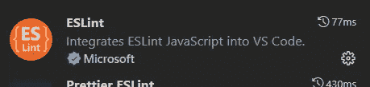

# 完整指南:将 Eslint 添加到 React TypeScript 项目

> 原文：<https://levelup.gitconnected.com/full-guide-add-eslint-to-react-typescript-project-406618192b9>


这将是帮助您从零开始使用 React 应用程序的完整指南，包括以下内容:

*   Webpack 5(捆绑您的应用)
*   巴别塔(穿越 JSX)
*   以打字打的文件
*   Eslint(像专业人员一样格式化代码)
*   Husky(提交前的 Lint)
*   测试库
*   微前端(Webpack 5 模块联盟)

以前的课程

1.  [从头开始 React App](https://medium.com/@steveleung9527/full-guide-start-react-app-from-scratch-2e1579ac6868)

[](https://medium.com/@steveleung9527/full-guide-start-react-app-from-scratch-2e1579ac6868) [## 完整指南:从头开始使用 React 应用程序

### 这将是帮助您从零开始使用 React 应用程序的完整指南，包括以下内容:

medium.com](https://medium.com/@steveleung9527/full-guide-start-react-app-from-scratch-2e1579ac6868) 

现在，我们将在 react 项目中实现 eslint。

# 为什么？

为什么要用 eslint？

Eslint 执行您的编码标准和指导方针，以帮助您和您的团队最大限度地减少次要错误，保持相同的编码风格，并更好地实践您的代码。

VS 代码

强烈建议安装 ESlint 和 beauty 插件



埃斯林特


较美丽

1.  初始化 eslint

```
npx eslint --init
```

然后它会弹出选项供你选择


这是我的偏好

```
# To check syntax, find problems, and enforce code style# JavaScript modules (import/export)# React# Yes# Browser# Use a popular style guide# Standard# JSON# Yes# npm
```

在那之后,`.eslintrc.json`在根目录下自动创建


2.更新`.eslintrc.json`

请在`parserOptions`下添加`“project”: [“./tsconfig.json”]`

```
// .eslintrc.json"parserOptions": { "ecmaVersion": "latest", "sourceType": "module", "project": ["./tsconfig.json"]},
```

这是 typescript 项目所必需的。

eslint 现在应该可以工作了，如果不能，请重启 vscode


Eslint 强制您的代码风格

3.更新`package.json`

```
"scripts": {
... "lint": "eslint --fix --ext .ts,.tsx ./src",...},
```

添加脚本`lint`并运行

告诉 eslint 根据您的配置帮助修复一些错误和警告

`— ext`告诉 eslint 到扩展名为`.ts` 和`.tsx`的 lint 文件

```
npm run lint
```

仍然看到错误？？？


运行该命令后，还有两个错误无法修复。

1.  函数缺少返回类型

对于这个 eslint 错误有两个解决方案，第一个是，根据提示添加返回类型

```
import { ReactNode } from 'react'
const App = (): ReactNode => {
  return <div>Hello World!</div>
}
```

如果您觉得这很烦人，那么您可以通过如下方式更新 eslint config 来关闭这条规则

```
// .eslintrc.json
{
  "rules": {
    "@typescript-eslint/explicit-function-return-type": "off"
  }
}
```

2.使用 JSX 时,“React”必须在范围内

为此，请随意关闭 eslint 规则，因为我们使用`babel` 来帮助我们注入`react runtime`，因此我们可以跳过这个语句`import React from ‘react’`

现在您的`.eslintrc.json`可能看起来像这样，并且没有发生 eslint 错误


```
npm run lint
```


现在没有 ESlint 错误

4.探索更多

现在你应该研究一下 [Eslint](https://eslint.org/) 和 [TypeScript Eslint](https://typescript-eslint.io/docs/) 文档来定制你喜欢的编码风格

带 React 的 Eslint 的推荐规则/插件:

[eslint-config-react-app](https://www.npmjs.com/package/eslint-config-react-app)—由 create-react-app 团队创建

[eslint-plugin-react-hooks](https://www.npmjs.com/package/eslint-plugin-react-hooks)—react hooks 依赖推荐器

用更漂亮的格式化程序实现，让你的代码更漂亮

# 额外的

对于那些想要快速设置的初学者，你可以在这里跟随我的 eslint 实践和偏好:

下次执行`husky`和`lint-stage` ~

**git 提交前格式化代码！**

请为我鼓掌，如果你发现这篇文章有用，请跟我来。