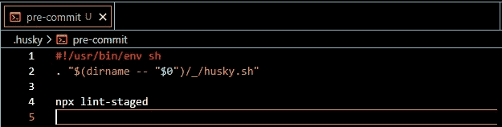
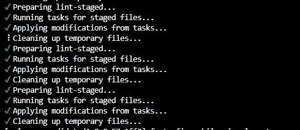

# 完整指南:将 Husky 添加到 React 项目中

> 原文：<https://levelup.gitconnected.com/full-guide-add-husky-to-your-react-project-e049935f20d5>


来自 ankurkedia.com

本教程将帮助你在 React 项目中实现一个 git 挂钩。它会在你做`git command`之前自动运行你设置的动作。

**以前的课程**

[添加 Eslint 到 React 类型脚本项目](https://medium.com/@steveleung9527/full-guide-add-eslint-to-react-typescript-project-406618192b9)

[](https://medium.com/@steveleung9527/full-guide-add-eslint-to-react-typescript-project-406618192b9) [## 完整指南:将 Eslint 添加到 React TypeScript 项目

### 这将是帮助您从零开始使用 React 应用程序的完整指南，包括以下内容:

medium.com](https://medium.com/@steveleung9527/full-guide-add-eslint-to-react-typescript-project-406618192b9) 

现在我们将在 react 项目中实现`Husky`。

1.  安装 husky

```
npm i --save-dev husky
```

`— save-dev` husky 仅供我们开发使用，因此将其安装在`devDependencies`

2.初始化 husky

```
npx husky install
```

这将帮助你初始化并创建一个名为`.husky`的文件夹

3.添加预提交挂钩

```
npx husky add .husky/pre-commit
```

这将在`.husky`文件夹下创建一个预提交钩子`pre-commimt` 。当你做`git commit`的时候这个钩子就会运行。现在将`undefined`替换为`npx lint-staged`



更新的预提交文件

4.安装 lint-暂存

```
npm i --save-dev lint-staged
```

为什么是 lint-staged？？

> 在提交代码之前运行林挺更有意义。通过这样做，您可以确保没有错误进入存储库，并加强代码风格。但是对整个项目运行 lint 过程是缓慢的，并且林挺结果可能是不相关的。最终，您只想 lint 将要提交的文件。

当林挺文件出错时，lint-staged 将停止 git 提交

5.更新`package.json`

```
// package.json
{
  "scripts": {
    "lint": "eslint --fix --ext .ts,.tsx ./src" }, "lint-staged": {
    "**/*.{js,jsx,ts,tsx}": [
      "npm run lint"
    ]
}
```

将这几行添加到您的`package.json`中。它告诉`lint-staged`应该对特定文件运行什么命令。

6.测试

```
git init
git add .
git commit -m "add lint-staged & husky"
```



lint 阶段的成功

如果您在 lint-staged 失败，**不会提交任何东西**，您应该使用`ESLint`检查您的文件

缺少 Lint 脚本？？？试着按照这个教程来设置你的 eslint！！！

[](https://medium.com/@steveleung9527/full-guide-add-eslint-to-react-typescript-project-406618192b9) [## 完整指南:将 Eslint 添加到 React TypeScript 项目

### 这将是帮助您从零开始使用 React 应用程序的完整指南，包括以下内容:

medium.com](https://medium.com/@steveleung9527/full-guide-add-eslint-to-react-typescript-project-406618192b9) 

下次将设置`Jest`，并更新我们的`webpack` 文件用于生产！！

请为我鼓掌，如果你发现这篇文章有用，请跟我来。