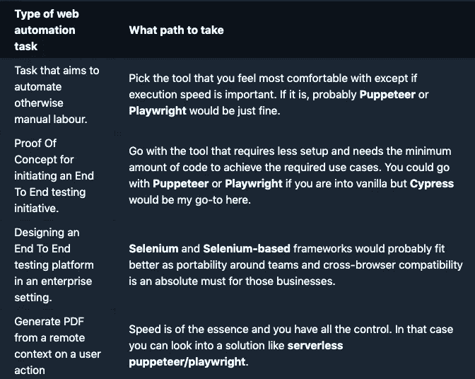
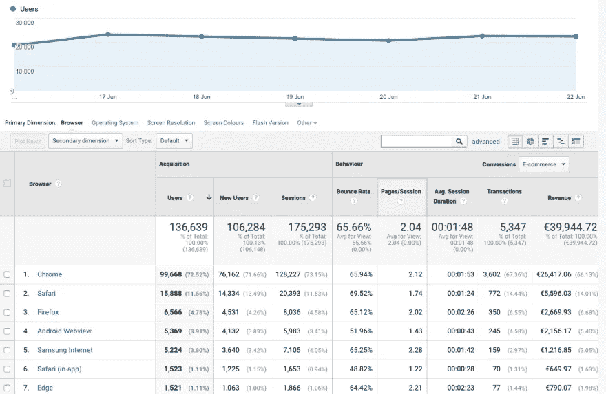
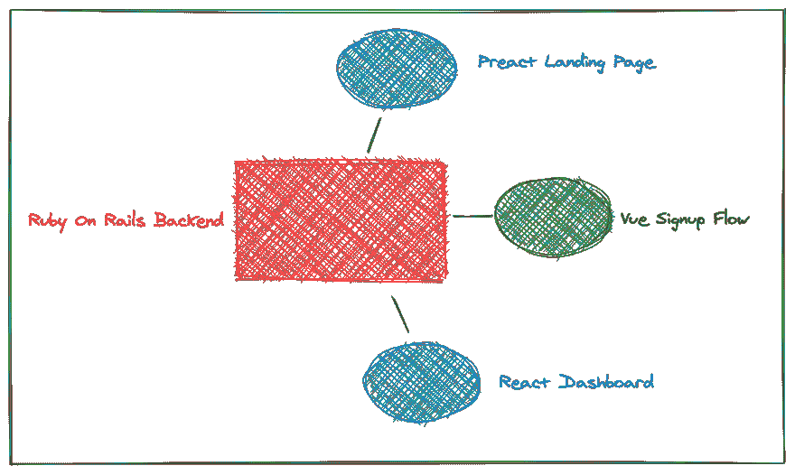
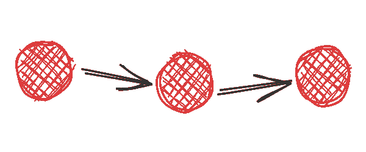

# 完整指南:向您的组织和团队介绍 Web 自动化计划

> 原文：<https://levelup.gitconnected.com/full-guide-introducing-the-web-automation-initiative-to-your-organization-and-team-caaefe65e64>

> 这不是一篇讨论和比较每个 web 自动化库或框架的底层功能的文章。在这里，我们计划列出一些基本问题，当您为工作选择合适的工具时，应该记住这些问题。

**享受**！

# 迈出 Web 自动化的“正确”一步

# 提出网络自动化倡议👔

到了你想要开始你的 web 自动化计划的时候了。这需要相当*聪明的准备工作。*

首先，你必须让你的团队相信这是值得的。

同样，您必须根据您的应用程序用例来决定应该考虑哪个 web 自动化策略以及哪个库或框架。

让我们回顾一些基本的关注点，以帮助指导决策和工作。

# 进入状态🤖

第一件好事是你开始讨论与 web 自动化相关的东西👏

在大多数关于 web 自动化的讨论中，特别是当计划引入一项新计划或重新评估您的技术堆栈时，可以快速推动讨论的主题是**跨浏览器兼容性、编程语言 API 和可用工具提供的社区支持**。

> *为了避免混淆，这里所说的*浏览器兼容性*指的是 web 自动化任务无需任何改变就能无缝运行的可用浏览器范围。*

# 以效率为目标🚀

对于现代软件产品和业务来说，效率是一个至关重要的因素。

这使得我们变得更加务实。这意味着评估解决方案

1.  最小化浪费的努力
2.  按照预期的质量水平，安全地完成手头的任务

对于我们的环境，我们需要选择合适的 web 自动化工具来满足自己的需求。

团队中有多少人有 web 自动化测试的经验？
- *我们必须在不同的浏览器中运行套件吗？*
- *我们需要支持 ie 浏览器吗？*

这些只是一些标准的和常见的问题，但是我们将回顾如何在更复杂的情况下评估需求和权衡的过程。
**走吧！**🏄

# 评估你的现实

探索最佳可能解决方案的第一步是排除你甚至不需要考虑这样一个决定的情况。

它们可能是不言自明的，但是编制一个粗略估计的表格可以让你很快摆脱这种情况:

这些情况虽然看起来粗糙，但至少可以给你指出一个明确的方向。效率指标和团队反馈将指导您根据您最初选择的路径做出剩余的决策。

# Web 自动化的混乱中间状态🌀

既然你读到了文章的这一部分，这意味着我们可以借用这个惊人的短语 [Scott Belsky](http://www.scottbelsky.com/) 来描述一个你需要应对的常见但肯定*的混乱*的情况。*凌乱的中间*。

这个短语将被用来描述你的 web 自动化工作在某个时间点必然会达到的状态。

这种状态的特点之一是[选择过载](https://en.wikipedia.org/wiki/Overchoice)🤯

随着浏览器技术的快速发展，网络自动化的生态系统和可用工具也随之增长，尤其是在*端到端*测试联盟中。一条绝对错误的道路是，在没有任何来自你实际目标、数据和期望的指导下，开始探索广阔的生态系统。您可以理解，这些主要驱动因素高度依赖于从一开始就将您带到这一阶段的场景。

这种*杂乱的中间*最常见的情况可能发生在以下场景之一:

*   试图向团队(*或整个组织*)引入端到端测试的概念。
*   重新评估承载时间的遗留 web 自动化代码库的状态。*剥落、配置&设置混乱、运行时间过长等等……*

上面我们列出了这两个特定的场景，因为它们有共同的要求:

*   *资源成本低*
*   *高冲击*
*   一个*wow 因子的扭曲*

在这两种情况下，你绝对需要说服和激励你的团队，这就是为什么我们需要在重要的事情上提前投资。

# 深入了解需求，而不是选项

作为技术专家和软件爱好者，我们喜欢深入分析我们必须解决特定问题的大量选项。感觉就像一个游乐场，有成千上万的玩具可以捡起来玩。

我们想尝试最新的东西，触摸前沿，感觉我们正在加入创新的行列，**把期望留到我们做出选择后再去解决。**

我们应该组装自己的最小框架，还是从 Gauge 或 WebdriverIO 开始？
- *我们应该用 Cucumber 集成测试还是和 TestNG 一起尝试？*
- *尝试一下电影剧本模式会不会是个好案例？*

在那个时候，这是必然会发生的，后退一步，再次把单词**“务实”**带进你的脑海。我们在一家企业的保护伞下运营，我们有如此多的优势，我们的选择会对其产生影响。

从我们的同事和前辈，但最后是客户，作为专业人士，我们应该尽可能明智地做出决策。这并不是说技术问题不重要，相反，因为它们很重要，所以不应该被轻视。

# 收集真实的用户数据👨‍👩‍👧‍👦

没有比实际使用你的产品的人更能反映你真正需求的指标了。

对于大多数用例，您首先需要考虑的主要区别是您的解决方案需要如何*跨浏览器兼容*。

你正试图迈出第一步，但是如果提议的路径没有覆盖 30%的用户技术规范，那么这就不是你迈出的“正确”的一步。寻找覆盖面更广的选项是完全合理的，但你必须聪明行事，你需要将“更广”建立在某些东西的基础上，这些东西**不是 100%的浏览器市场**。

大多数开发人员都跳过了这一步，因为他们对走出*开发工具*的舒适区变得过敏😥

数据分析工具，如 *Google Analytics* ，可以为您提供关于您的实际用户更喜欢使用哪种*浏览器/浏览器版本/设备*组合来浏览您的产品的详细信息。

现在，你可以以现实为指导开始工作了。
*特别提示:还要寻找转换/组合指标！如果 Internet Explorer 用户只占 5%,但却带来了 15%的转化率，这就很重要了！*

显而易见，如果您的用户群由来自 Internet Explorer 的大量流量组成，您应该选择支持 Selenium 的解决方案。另一方面，如果您的应用程序主要用于 Safari，您应该给剧作家一个公平的机会来对抗木偶师。

谢天谢地，有免费和开源的选择，希望尽可能地减轻我们的负担。像 [WebdriverIO](https://webdriver.io/) 和 [CodeceptJS](https://codecept.io/) 这样的框架提供了在 Selenium、Puppeteer 甚至剧作家(*只针对 CodeceptJS* )之间切换的能力，作为你的自动化核心库。

# 评估团队体验和偏好🤝

在一个已经拥有 web 自动化经验的团队中展示您的案例总是一件好事。在最好的情况下，你会有更多的目光盯着目标，同时从你的同行那里获得更多的技术知识。

另一方面，一个在过去有过类似努力的糟糕经历的团队，可以被看作是反馈错误和避免同样错误的方法的来源。

⭐ *不要忘记，这种情况可以成为改变观点的沃土(这就是你应该继续阅读的原因)*

## 带来刺激🏂

谈到观点，这可能是计划成功的最重要的因素之一，你应该努力激发团队中更多的人。

试着建立一个“追随者”群体，他们会支持你的观点，即这种改变会对整个团队产生积极的影响。同样，让你的同事感到兴奋，他们就很有可能愿意与你合作并为此做出贡献。这只会导致更好的结果。

> 请记住，更有经验的管理人员自然不会喜欢“一个人”的计划，因为他们需要考虑新系统的公共汽车因素。

另一方面，作为任何一个*坚实的倡议*，它需要尽自己的力量，这就是为什么你必须努力要求尽可能少的人，以使这成为现实。

例如，如果您觉得 CI 流程错综复杂，或者需要运营人员的大量参与，那么请尝试选择一个解决方案，使流程尽可能地轻量和最小化。

👉*尽量减少其他人的努力和系统其他部分所需的改变，肯定会增加计划被接受的机会，而不是被扔进“低优先级”的桶里。*

# 最大输出—省力

不管你的准备结果如何，因为希望你没有跳过任何弯角，现在是时候让车轮转动起来了。与您的团队一起，您已经做出了选择，牢记应用程序的所有需求，并且为了实际启动该计划，您需要向管理层展示实现您期望的最终目标的**增量**步骤。

*特别提示:在这方面不要空手而归，期待问题由别人来问，要准备好适当的工作量，以适应你的团队所遵循的工作时间表。*

**“增量的”**对不同的人来说可能意味着不同的事情，但是我们需要为我们的主动性写下来，以便我们能够在*低努力*迭代中产生最大的产出量。有什么比用一个例子来说明这种情况更好的方法呢？

系好安全带！

# 示例:具有多个前端应用的 Monolith🤹

# 目标

让我们假设你的案例是一个单一的应用程序 *(Django，Rails 等)。)*为您产品的不同部分提供多个前端应用*(数据仪表板、注册流程、登录页面)*。

该应用程序还没有任何端到端的测试，但有一个简单的测试管道，它旋转一个 monolith 的本地实例，运行后端测试和前端的不同测试，这些测试碰巧使用 [jest](https://jestjs.io/) 为所有应用程序运行。

在这个场景中，您的最终目标是使用 Puppeteer 创建一个容器化的端到端测试套件，在应用程序的每个 PR merge 中运行，并同时测试所有部分。

大家都同意的该套件的一些附加功能包括:

*   失败案例截图
*   过去和当前测试运行的统计数据
*   当套件未能建立 PR 时的松弛通知

# 首次迭代提议

对于第一次迭代，你应该以最少的设置需求和[快乐路径](https://en.wikipedia.org/wiki/Happy_path)覆盖对你的业务最有价值的几个主要流程为目标。

我们的第一个目标可能是:

*   *登录页面*加载成功，CTA 在视窗中可见。
*   *仪表盘应用*加载成功，可以点击 3 条主要路线，并呈现用户期望看到的主要图形。

# 常见错误:第一次测试❌的设置

个人在引入 web 自动化计划时犯的一个主要错误是试图在计划开始时就建立管道集成的“最终”视图。

这是很多人犯错的地方，当你依赖其他人来启动时，整个计划**被丢弃**。*一些你需要从开发团队中抽出时间的例子…*

*   团队中没有人知道如何为 Selenium 服务器设置 Jenkins 来并行运行
*   您的 Docker 设置因“原因”而失败🐳
*   您对自己修改 Jenkinsfile 感到不舒服

在此不深入探究原因和补救措施，您必须尽可能采用**最不引人注目的设置**。

# 不引人注目的设置👻

在我们的例子中，这意味着将第一个场景集成到现有的前端单元测试套件中。只是你的前端应用已经在一个构建钩子中使用的普通的`npm test`(*希望是*😅)绰绰有余。

应用程序已经在管道中运行测试，因此您可以轻松地将[jest-puppeter](https://github.com/smooth-code/jest-puppeteer)添加到您的项目中，然后将您的两个场景添加到它们各自的前端存储库中。

> *不需要进一步的容器化
> 构建管道上不需要额外的命令* ***不需要进一步的努力，只需要您的两个测试场景***

# 第一次迭代完成🎖

上面描述的场景需要:
-一个额外的 NPM 包
- 100 行左右的代码
-流水线总构建时间增加了几秒钟

**至此，我们已经完成了计划的第一次迭代。**每次我们的应用程序通过简单的测试管道时，我们都要确保产品的两个主要部分没有损坏。这对于企业来说是一个不小的保证，而您能够在很短的时间内实现它。

希望你已经让一些人感到惊讶了，他们不知道你付出一点努力就能完成端到端测试的能力。

为下一次迭代全速前进！🚄

# 下一次迭代！

实际上，对于下一次迭代，*你只能靠自己了*。

您已经有了一些进展，这足以从每个迭代周期中花费一些时间并增强它。在将代码交付到产品中时，不断展示其价值并宣传其带来的信心。

不要忘记，价值在不同的人的耳朵里有不同的表达。

*   提醒开发人员，他们可以确信在尝试新功能重构🛠时没有破坏重要的东西
*   向产品负责人展示*发布时间*将会持续减少，因为 QA 对每个功能的手动工作减少了⏲
*   向经理和利益相关者表明，当产品变得更好、功能更丰富时，主要的收入流是安全的💰

**你得到了这个！🔥**

# 关闭

感谢您花时间阅读另一篇不太短的文章，我希望您喜欢这篇文章，并找到关于如何在技术和非技术方面处理 web 自动化计划的有用想法🙇‍♂️

从个人经验来看，承诺并经历收集数据的过程，评估当前的需求并分析团队过去的经验可能是你所能做出的最重要的决定。

不是因为这将使努力更有可能成功，*这永远无法保证*，而是因为它将武装你与生俱来的自信和为你的企业解决实际问题的**喜悦**，而不仅仅是一次可能有机会符合要求的技术试驾。

*交叉发布自*[*Web 自动化之家*](https://www.thehomeofwebautomation.com/foot-in-the-door/)

*资源探索:*
- [木偶师入门](https://www.thehomeofwebautomation.com/getting-started-puppeteer/)
- [剧作家入门](https://www.thehomeofwebautomation.com/getting-started-playwright/)
- [谷歌分析技术报告](https://support.google.com/analytics/answer/1012034?hl=en#Technology)

*图像由*[*Mateusz Dach*](https://www.pexels.com/@mateusz-dach-99805)组成