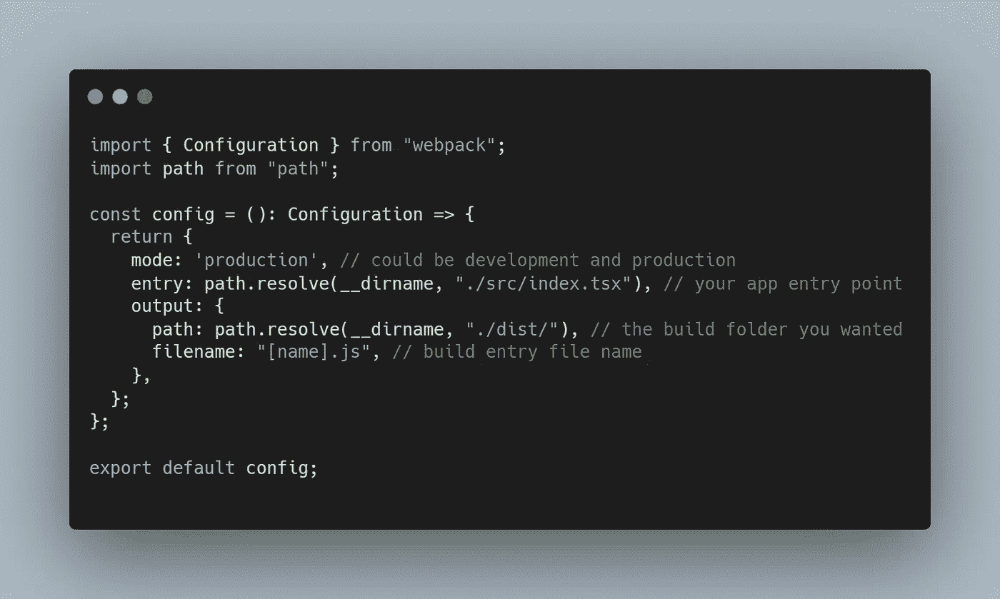
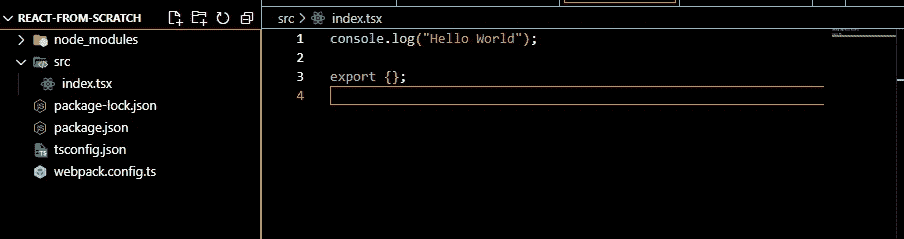
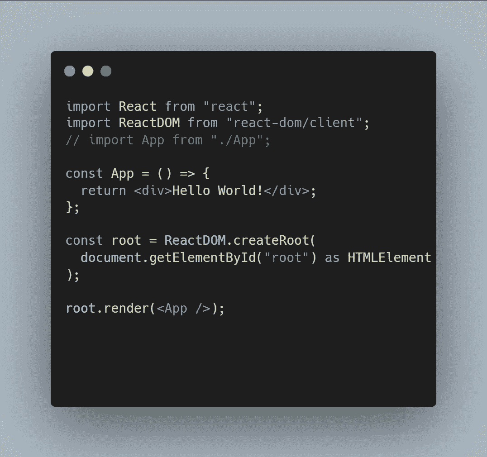
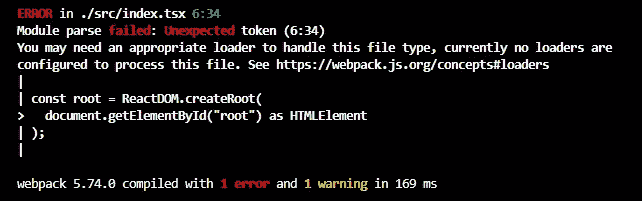
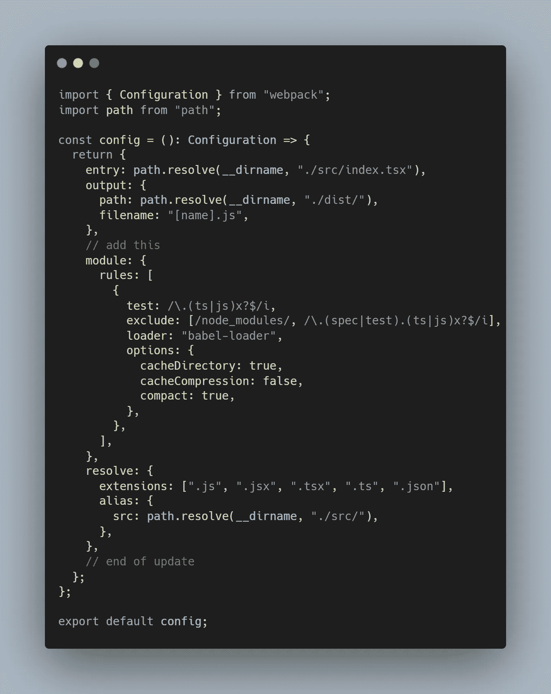
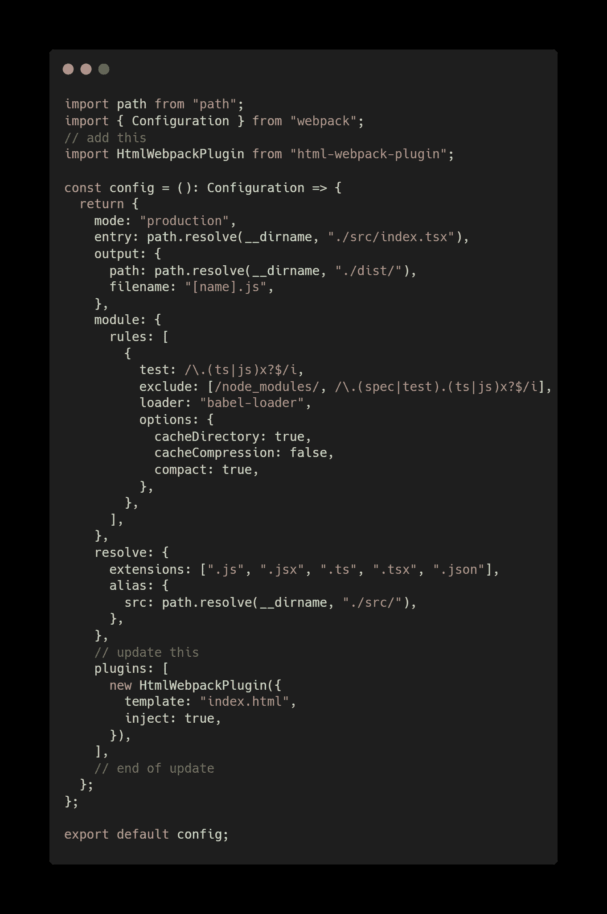
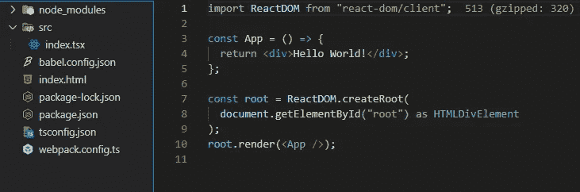

# 完整指南:从头开始使用 React 应用程序

> 原文：<https://levelup.gitconnected.com/full-guide-start-react-app-from-scratch-2e1579ac6868>


这将是帮助您从零开始使用 React 应用程序的完整指南，包括以下内容:

*   Webpack 5(捆绑您的应用)
*   巴别塔(穿越 JSX)
*   以打字打的文件
*   Eslint(像专业人员一样格式化代码)
*   Husky(提交前的 Lint)
*   测试库
*   微前端(Webpack 5 模块联盟)

# 入门指南

设置环境

*   节点版本 v14+，我的是 16.17.0
*   IDE 我的是 VsCode

1.  创建您的应用程序项目文件夹

```
mkdir my-app
cd my-app
code .npm init --y
# auto initial package.json
```

2.创建`tsconfig.json`

`“ts-node”: {}`允许你运行并将`.ts`翻译成`.js`，这对我们的项目很有帮助，这样你就可以用`webpack.config.ts`而不是`webpack.config.js`来配置 webpack

3.安装 webpack

```
npm i --save-dev webpack webpack-cli webpack-dev-server typescript ts-node
```

*   `— save-dev`告诉 NodeJS 将下面的包安装到`devDependencies`中
*   `webpack-cli`允许您运行 webpack 的 webpack 命令行软件包
*   `webpack-dev-server`支持热重装的 webpack 开发服务器
*   `typescript`类型脚本支持
*   `ts-node`运行或翻译所需的 Node.js 的类型脚本执行引擎和 REPL`.ts`
*   `devDependencies`在生产中，该包下的包将不包括在包中。为什么？减少包的大小！！但是并不是每个包都应该安装成`devDependencies`！！！！

4.创建`webpack.config.ts`



5.创建`src/index.tsx`



简单索引. tsx

5.将脚本添加到`package.json`

```
"scripts": { "start": "webpack serve --config webpack.config.ts --mode=development", "build": "webpack --config webpack.config.ts"},
```

6.测试 Webpack 正在工作

```
npm run build
# a folder dist should be creatednpm run start
# webpack 5.74.0 complied successfully
# app is running on http://localhost:8080
```

7.安装 React

```
npm i react@18 react-dom@18# thennpm i --save-dev @types/react @types/react-dom
```

`react`这次我们安装 react 和 react-dom 包作为我们的`dependencies`而不是`devDependencies`！因为在客户端浏览器运行时需要它们！

`@types/react` 和 `@types/react-dom`是帮助我们开发的脚本类型包，客户端不需要。因此应包含在`devDependencies`中。实际上，所有类型的包都应包含在`devDependencies`中

8.创建反应根



简单反应根

9.再次测试应用程序

```
npm run start
```

你有错误吗？？差不多吧？？



加载器错误

别担心，这是意料之中的。现在我用`babel`帮你解决这个问题

10.设置巴别塔

babel 用于将 jsx/tsx 转换为 js

```
npm i --save-dev @babel/core @babel/preset-react @babel/preset-env @babel/preset-typescript @babel/plugin-transform-react-jsx babel-loader
```

*   `@babel/core`主要巴别塔脚本
*   顾名思义，它是用来反应的
*   `@babel/presaet-typescript`建议在使用 typescript 时使用
*   `@babel/plugin-transform-react-jsx`自动运行时帮助你到`import React from ‘react’`，这意味着你不需要在每一个`.tsx`中写这个语句
*   `babel-loader`使用 babel 翻译 JavaScript / TypeScript 文件

11.添加`babel.config.json`

12.更新`webpack.config.ts`



现在你可以再次运行`npm run start`，错误消失了吗？？太好了！

现在访问`[http://localhost:8080](http://localhost:8080)`，它显示空，并且显示这样的东西？

```
Cannot GET /
```

这也是意料之中的，因为捆绑包中没有内置`index.html`

13.在根上创建 Index.html

```
<!DOCTYPE html>
<html>
<head>
  <meta name="viewport" content="width=device-width, initial-scale=1.0" />
<meta charset="utf-8" />
</head>
<body>
  <div id="root"></div>
</body>
```

14.安装插件并更新`webpack.config.ts`

```
npm i --save-dev html-webpack-plugin
```

`html-webpack-plugin`简化 HTML 文件的创建，为您的 webpack 捆绑包提供服务



添加 html-web pack-插件

webpack 将获取`template` html，并将您的入口点脚本注入其中，并在`port 8080`提供给它


你好世界！

现在你的简单反应是工作！！！！



你可以从[这里](https://github.com/leungtinyau27m5/react-start-from-scratch/tree/master/react-from-scratch)克隆工作项目

下次将`eslint`和`prettier`落实到项目中~

请为我鼓掌，如果你发现这篇文章有用，请跟我来。

[](https://medium.com/@steveleung9527/full-guide-add-eslint-to-react-typescript-project-406618192b9) [## 完整指南:将 Eslint 添加到 React TypeScript 项目

### 这将是帮助您从零开始使用 React 应用程序的完整指南，包括以下内容:

medium.com](https://medium.com/@steveleung9527/full-guide-add-eslint-to-react-typescript-project-406618192b9) [](https://medium.com/@steveleung9527/full-guide-webpack-loaders-and-optimization-b04ea7960f36) [## 完整指南:Webpack 加载器和优化

### 这将是帮助您从零开始使用 React 应用程序的完整指南，包括以下内容:

medium.com](https://medium.com/@steveleung9527/full-guide-webpack-loaders-and-optimization-b04ea7960f36)