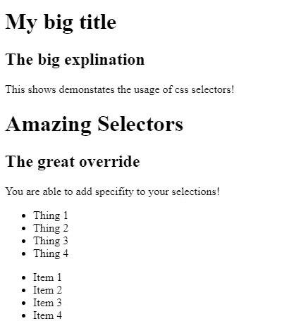
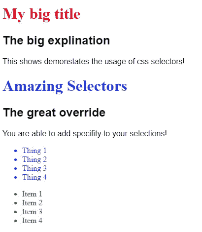

# 前端:是时候再次进入 CSS 基础知识了——选择器

> 原文：<https://levelup.gitconnected.com/full-stack-day-2-time-to-jump-into-css-fundamentals-again-selectors-3867b8850b6a>

在完成了第一单元的 HTML 基础和刷新之后，是时候进入下一步了，CSS！回顾一些 HTML 单元。从这一部分走出来，真的让我学到了更好的研究技巧，也提高了我对 HTML 更好实践的体验。

我用语义标签结束了第一单元。这些标签基本上通过特定的元素向页面引入了“字面”含义，这些元素提供了这些标签是什么的上下文。像 **<标题>** 、 **<导航>** 、 **<主页>** 和 **<页脚>** 这些标签的使用使得使用屏幕阅读器的人更容易访问网站。以及改进您的网站的搜索引擎优化！

进入另一个我已经了解的领域。给我带来了我不知道的新话题！CSS 基础，目前开始的新单元真的演示了很多。选择器是设计 HTML 样式的关键。这些选择器使您能够挑选出结构化 HTML 中的元素，您可以在其中获取想要设置样式的属性并为其赋值。

```
<p style="color: red;">Example<p>
```

如上例所示，这就是你所谓的**内联** CSS。这是通过获取开始标记中的属性，然后将其声明为可以设置为值的属性来实现的。内联样式术语很少使用，并且是不好的实践。另一个很少使用的不好的做法叫做内部样式术语，你在 HTML **< head >** 里面创建一个样式。你可以在下面看到一个例子。由于内联和内部样式规则可能是不好的实践，所以了解它们的样子以及在遇到它们时如何解释它们总是好的。

```
//Example of internal css usage<html>
  <head>
   <style>
    p{
      color: red;
    } </style>
  </head>
</html>
```

有了 CSS，你可以有无限的可能性来设计你的网页。在你的样式表中，你使用选择器，这些选择器或者是**类型**、**类、**或者是**属性**设置到你的 HTML 元素中，你可以在其中设置它们的样式。下面我将演示一些使用各种选择器的样式化方法，并做一些解释。

```
//HTML<body>

 <div class="selector-class" id="selector-id">
   <h1>My big title</h1>
   <h2>The big explination</h2>
   <p>This shows demonstates the usage of css selectors!</p>
 </div>

  <div class="selector-class" id="selector-id">
    <h1 class="h1-selector">Amazing Selectors</h1>
    <h2>The great override</h2>
    <p>You are able to add specifity to your selections!</p>

    <ul>
      <li>Thing 1</li>
      <li>Thing 2</li>
      <li>Thing 3</li>
      <li>Thing 4</li>
    </ul>
  </div>

  <ul>
      <li>Item 1</li>
      <li>Item 2</li>
      <li>Item 3</li>
      <li>Item 4</li>
    </ul>

</body>
```



没有 CSS

```
//CSSh1{
  color: red; /* This is considered just a type selection the lowest specifiy.*/
}.h1-selector{
  color: blue; /* A class selector is demonstrated here which overrides the h1 selection type above it. But only is set to the second h2 in the HTML. Notice the color difference?*/
}/* These next selections of the two divs used show you the specifity order from lowest specification to highest. The first selector div type set the background black and the font colors to white, then is overrided by the class selection that is assign to the elements; sets the background to green and font color to white but is overrided by the id which is the highest specifity above all in CSS. */div{
  background: black;
  color: white;
}.selector-class{
  background: green;
  color: white;
}#selector-id{
  background: white;
  color: black;
}p, h2{
  font-family: sans-serif; /* To reduce the repetition of selections that will use the same thing you can multi select by simply adding a comma , after each selection.*/
}/* Lastly show here you able to select items that are nested inside of other elements! */li{
  color: green;
}.selector-class li{
  color: blue;
}
```



使用 CSS

现在我已经和选择器一起工作过了，并且对它们有了更多的了解，我对在设计时使用“正确的”选择器有了更多的信心。在我看来，你可以相应地创建样式或者预定义样式，在需要的时候添加到你的 HTML 元素中。我还想说 CSS 是你网站的外观，HTML 是你的结构！

一如既往，您可以随意使用我的代码，在测试不同的选择器时获得不同的结果。这里是一个[站点](https://codepen.io/trending)，在这里你可以开始制作代码片段来测试你的代码！