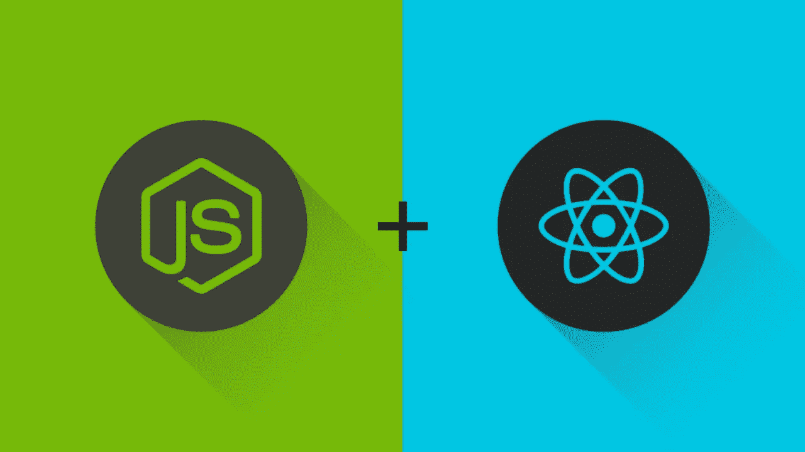

# 全栈开发入门#1 — React 和 Nodejs

> 原文：<https://levelup.gitconnected.com/full-stack-development-starter-1-react-and-nodejs-4646b88834c7>

当我从一名 UI & UX 设计师变成一名程序员时，我真的不知道自己在做什么。更糟糕的是，我没有任何关于如何前进的导师或指导。我所有的同事都是 Salesforce 开发人员，没有用行业标准技术构建过任何完整的 web 应用程序。由我来用新的技术堆栈和部署策略铺平前进的道路。

我甚至不知道什么是 Google，也几乎不知道构建一个全栈应用程序需要什么，我一头扎进技术的荒野中寻找自己的路。在对编码语言和托管平台进行了几周的研究后，我终于完成了一个全栈应用程序，并在 Node.js 和 Angular 2+上运行。

我经常在想，如果我在解决所有这些问题时有导师指导，这个项目，甚至接下来几年的开发会是什么样子。这就是我写这篇文章的目的——充当一个简单的导师，让您开始了解整个堆栈。

# React 和 Node.js



我们将从完整的 javascript 栈开始。这使得开发和部署全栈应用变得轻而易举，因为您只需要知道一种语言。

*注意:我主要是一名 javascript 开发人员，但是学习像 Python 或 Java 这样的脚本语言是有益的。但是你做了你自己。Javascript 一直在工作！*

有几种方法可以构建客户端和服务器文件夹，但对于今天的例子，我们将尽可能保持简单！这样你将来就可以自己扩展了！

**必备** Node.js 已安装— [你可以在这里下载](https://nodejs.org/en/download/)

# 开始

首先，让我们创建我们的 React 应用程序:

```
$ npx create-react-app react-node
$ cd react-node
$ yarn build
```

如果您以前从未使用过 npx 它基本上是一个执行库。您可以使用 npx，而不必全局安装 create-react-app，然后使用全局命令来创建应用程序！

此时，我们的 React 应用程序已经准备就绪！我们现在不打算对它做任何其他事情，因为我们要做的只是从服务器上提供服务。

我们需要将 Express 添加到我们的项目中，然后创建一个文件。我将我的命名为 server.js。

```
$ yarn add express
$ touch server.js
```

现在，打开文件并粘贴这些行:

因为该文件是一个 javascript 文件，我们将使用“node”命令来启动它，所以运行时被建立为 Node.js。

在第 4 行,‘app’被实例化为我们的 Express 应用程序。就像 REST 请求一样，Express 也有' get '，' post '，' put '和' delete '函数。但是，如果您想对所有 HTTP 动词使用一个中间件函数，那么“use”函数就是您的难题。

在第 12 行，Express 应用程序加载构建文件夹。如果没有这一行，代码将会失败，因为 Express 无法将 index.html 文件发送到浏览器。

“app.use(…)”函数实际上是为浏览器提供 React 应用程序的根。请注意，它只在收到 GET 请求时被提供服务，但是它在所有路由上都提供文件服务。这样，当我们的 React 应用程序开始路由时，服务器将返回 index.html 文件，并确保 React 应用程序正在运行。

要提供您的应用程序，请确保您位于项目的根目录下，并键入:

```
$ node server.js
```

威拉。全栈应用—完成。您正在使用 Express 提供预建的 React 应用程序。

但是，让我们再增加一条途径，以确保您在成为全栈开发人员的道路上一帆风顺。

首先，让我们添加主体解析器库。

```
$ yarn add body-parser
```

现在让我们导入它并设置我们的新路线:

这个新路由将在匹配“/new-route”的路由上接受 POST 请求，并返回一个带有问候语的对象。请注意，我们还添加了另一个“app.use(…)”函数，该函数将解析 req 对象中的 body 值。

现在开始反应！

我们添加了“useState”导入，并为来自服务器的响应添加了一个挂钩。我们还添加了一个“fetch()”函数，它用一个名字发布到我们的服务器中。JSX 会在设置好问候语后进行渲染。

*注意:您不必从 Express 应用程序返回对象。通常现实世界的应用程序返回一个非字符串变量，但是您可以从 Express 返回任何类型的变量。*

最后，重新构建 React 并启动服务器来查看您的应用程序的工作情况！

```
$ yarn build
$ node server.js
```

这就是我们的 Javascript 全程示例！Express.js Framework 页面上有大量很棒的文档，可以帮助您继续前进。

这篇文章交叉发布在[我的网站上](https://lukefrauhiger.com/blog/full-stack-development-starter-1-react-and-nodejs)。