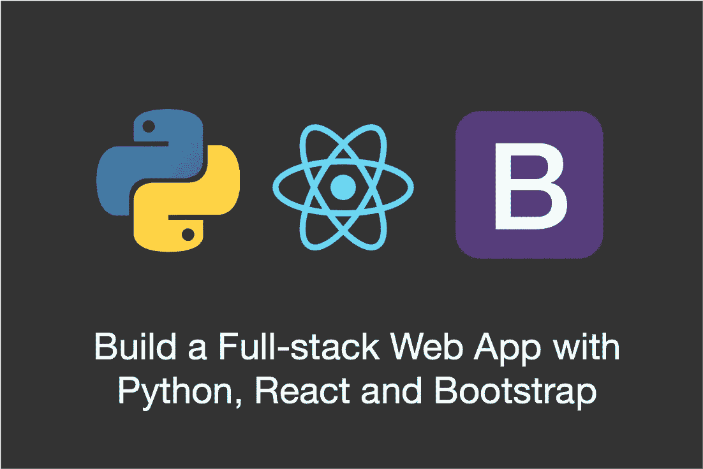
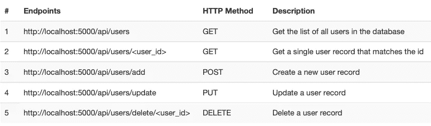
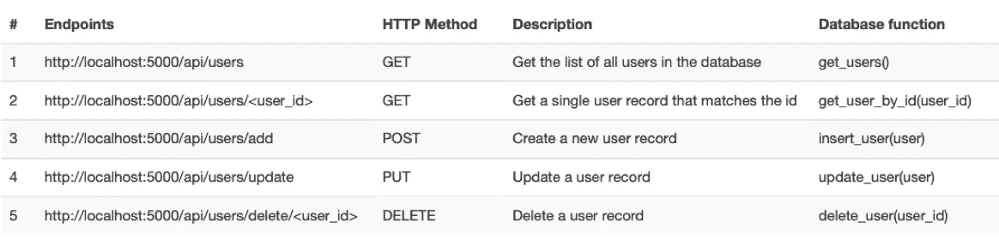
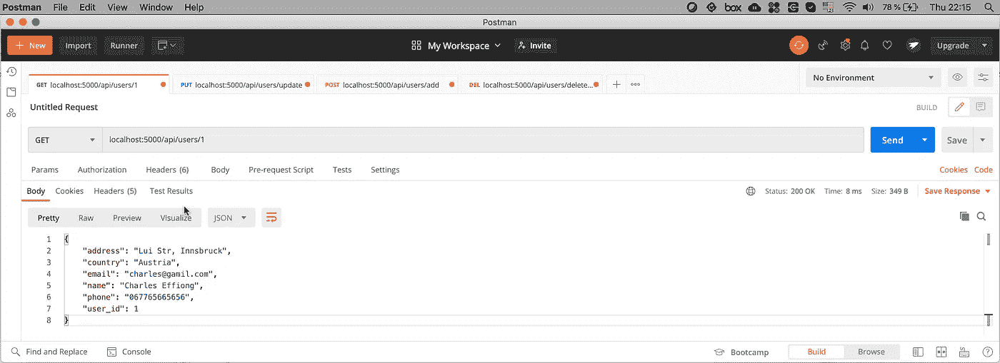

# 包含 Python、React 和 Bootstrap 的全栈 Web 应用程序—后端

> 原文：<https://levelup.gitconnected.com/full-stack-web-app-with-python-react-and-bootstrap-backend-8592baa6e4eb>

## 用 Python Flask 和 SQLite 创建一个 RESTful API 后端



嗨，伙计们，欢迎来到另一个很棒的网络教程。我将向您展示如何使用 Python flask/SQLite 作为后端，Reactjs/bootstrap 作为前端来构建一个全栈 web 应用程序。我们将在本教程中讨论后端实现，在下一个教程中讨论前端实现。这将会非常有趣，因为这将使你具备构建酷的全栈 web 应用的一般原则和实践。

# 我们将会建造什么

我们将通过实现一个简单的用户管理 API 来学习后端全栈 web 应用的架构。下面的视频展示了完成的后端应用程序。该应用程序提供了管理用户数据的功能，包括创建、读取、更新和删除数据。涵盖的概念和原则可以应用于创建其他更复杂的 web 应用程序，也可以应用于其他 web 技术。所以，让我们从 Python flask/SQLite 的后端 RESTful API 开始吧。

# RESTful API

REST API(或 RESTful API)，代表 **R** 表示 **S** 状态 **T** 传输— **应用程序 **P** 编程 **I** 接口，允许应用程序通过 HTTP 协议与资源交互。这种交互通常是实现特定业务逻辑的 CRUD 操作。因此，运行在 web、桌面或移动设备上的应用程序通过 HTTP 方法请求资源，响应通常以 JSON 格式返回，以实现互操作性。在我们的用例中，我们的业务逻辑包括向数据库添加用户——创建操作、获取用户或单个用户的列表——读取操作、更新用户——更新操作和删除用户——删除操作。所有这些都将通过 HTTP 请求来完成。**

让我们定义我们的 REST API 端点:



用户管理 API 端点

上表显示了用户管理应用程序的 API 端点。端点非常容易理解，它们执行数据库 CRUD 操作。

# 后端实现

如前所述，我们将使用 Python Flask 和 SQLite 作为后端。本教程使用 Python 3。幸运的是，SQLite 附带了一个数据库服务器，所以我们不需要担心单独的数据库服务器。本教程假设您熟悉 Python 和基本 SQL 查询。但是，如果您还不熟悉 SQL 查询，也不要担心，因为您仍然能够理解。首先，确保您已经安装了 Python，最好是 Python 3。*.您也可以使用您选择的任何 IDE 我使用的是流行的 PyCharm。完整的[项目源代码可以在我的 github 页面上找到。](https://github.com/effiongcharles/full_stack_web_python_flask_react_bootstrap)

为了使用 Python Flask，我们需要首先安装这个包。您可以在您的终端中使用下面的命令。安装 Python 时，即在标准库中，已经包含了 SQLite3。

```
# install flask package
pip install Flask# Only if you don't have sqlite installed
pip install db-sqlite3
```

# 数据库实现

现在我们已经有了基本的设置，让我们来看看源代码。首先，我们将关注数据库实现，然后我们将关注 REST API 实现。基本上，我们需要创建我们的数据库和表。然后，为我们的每个业务逻辑编写函数。

```
#!/usr/bin/python
import sqlite3

def connect_to_db():
    conn = sqlite3.connect('database.db')
    return conn

def create_db_table():
    try:
        conn = connect_to_db()
        conn.execute('''
            CREATE TABLE users (
                user_id INTEGER PRIMARY KEY NOT NULL,
                name TEXT NOT NULL,
                email TEXT NOT NULL,
                phone TEXT NOT NULL,
                address TEXT NOT NULL,
                country TEXT NOT NULL
            );
        ''')

        conn.commit()
        print("User table created successfully")
    except:
        print("User table creation failed - Maybe table")
    finally:
        conn.close()
```

上面的代码片段实现了用户数据库。实现非常简单。首先，我们定义一个连接到数据库的函数，即 *connect_to_db* 。如果数据库不存在，这个函数将创建一个数据库，并返回一个连接对象。执行其他数据库操作(CRUD)将需要该对象。 *create_db_table* 函数连接到数据库并创建表格。用户表包含几个字段，包括 user_id(唯一标识符)、名称和电子邮件。当执行*提交*功能时，保存对数据库的“更改”。接下来，让我们看看我们的业务逻辑的实现。

```
def insert_user(user):
    inserted_user = {}
    try:
        conn = connect_to_db()
        cur = conn.cursor()
        cur.execute("INSERT INTO users (name, email, phone, address,       
                    country) VALUES (?, ?, ?, ?, ?)", (user['name'],   
                    user['email'], user['phone'], user['address'],   
                    user['country']) )
        conn.commit()
        inserted_user = get_user_by_id(cur.lastrowid)
    except:
        conn().rollback()

    finally:
        conn.close()

    return inserted_user
```

上面的代码片段定义了一个向数据库表中添加新用户的函数。该函数将用户对象作为参数。用户对象只是一个 python 字典，如下面的代码片段所示。

```
user = {
    "name": "John Doe",
    "email": "jondoe@gamil.com",
    "phone": "067765434567",
    "address": "John Doe Street, Innsbruck",
    "country": "Austria"
}
```

请注意， *user_id* 没有被插入。这是因为它是自动生成的。*光标*对象通常用于执行 CRUD 操作，因为它有助于遍历/处理数据库记录。此外，我们通过调用另一个返回给定 user_id 的用户的函数来返回刚刚插入的用户。接下来我们将看到这个函数的实现。

```
def get_users():
    users = []
    try:
        conn = connect_to_db()
        conn.row_factory = sqlite3.Row
        cur = conn.cursor()
        cur.execute("SELECT * FROM users")
        rows = cur.fetchall()

        # convert row objects to dictionary
        for i in rows:
            user = {}
            user["user_id"] = i["user_id"]
            user["name"] = i["name"]
            user["email"] = i["email"]
            user["phone"] = i["phone"]
            user["address"] = i["address"]
            user["country"] = i["country"]
            users.append(user)

    except:
        users = []

    return users

def get_user_by_id(user_id):
    user = {}
    try:
        conn = connect_to_db()
        conn.row_factory = sqlite3.Row
        cur = conn.cursor()
        cur.execute("SELECT * FROM users WHERE user_id = ?", 
                       (user_id,))
        row = cur.fetchone()

        # convert row object to dictionary
        user["user_id"] = row["user_id"]
        user["name"] = row["name"]
        user["email"] = row["email"]
        user["phone"] = row["phone"]
        user["address"] = row["address"]
        user["country"] = row["country"]
    except:
        user = {}

    return user
```

上面的代码片段实现了从数据库中检索用户的功能。 *get_user* 函数从数据库中返回所有用户的列表，而 *get_user_by_id* 接受一个 *user_id* 作为参数，并返回与 *user_id* 匹配的用户记录。接下来让我们看看如何更新用户。

```
def update_user(user):
    updated_user = {}
    try:
        conn = connect_to_db()
        cur = conn.cursor()
        cur.execute("UPDATE users SET name = ?, email = ?, phone = 
                     ?, address = ?, country = ? WHERE user_id =?",  
                     (user["name"], user["email"], user["phone"], 
                     user["address"], user["country"], 
                     user["user_id"],))
        conn.commit()
        #return the user
        updated_user = get_user_by_id(user["user_id"])

    except:
        conn.rollback()
        updated_user = {}
    finally:
        conn.close()

    return updated_user
```

代码片段实现了更新数据库中用户记录的功能。它接受一个用户对象作为参数，执行一个 SQL 查询用新值更新用户，最后通过调用前面看到的 *get_user_by_id* 函数返回更新后的用户。如果我们想从数据库中移除或删除一个用户，该怎么办？让我们看看接下来该怎么做。

```
def delete_user(user_id):
    message = {}
    try:
        conn = connect_to_db()
        conn.execute("DELETE from users WHERE user_id = ?",     
                      (user_id,))
        conn.commit()
        message["status"] = "User deleted successfully"
    except:
        conn.rollback()
        message["status"] = "Cannot delete user"
    finally:
        conn.close()

    return message
```

上面的代码片段实现了删除用户功能。我们定义了一个函数，它接受一个用户 id 作为参数，从数据库中删除用户(SQL DELETE 查询)并返回一条消息。

接下来让我们看看如何通过 REST API 端点来使用这些函数。

# REST API 实现

REST api 端点公开了在上一节中创建的数据库函数。下表将数据库函数映射到 API 端点。



具有数据库功能的用户管理 API 端点

```
from flask import Flask, request, jsonify #added to top of file
from flask_cors import CORS #added to top of fileapp = Flask(__name__)
CORS(app, resources={r"/*": {"origins": "*"}})

@app.route('/api/users', methods=['GET'])
def api_get_users():
    return jsonify(**get_users()**)

@app.route('/api/users/<user_id>', methods=['GET'])
def api_get_user(user_id):
    return jsonify(**get_user_by_id(user_id)**)

@app.route('/api/users/add',  methods = ['POST'])
def api_add_user():
    user = request.get_json()
    return jsonify(**insert_user(user)**)

@app.route('/api/users/update',  methods = ['PUT'])
def api_update_user():
    user = request.get_json()
    return jsonify(**update_user(user)**)

@app.route('/api/users/delete/<user_id>',  methods = ['DELETE'])
def api_delete_user(user_id):
    return jsonify(**delete_user(user_id)**)

if __name__ == "__main__":
    #app.debug = True
    #app.run(debug=True)
    app.run() #run app
```

上面的代码片段实现了我们的 API 端点。首先，我们导入必要的软件包。API 端点接收 JSON 对象作为请求，并返回 JSON 对象。出于这个原因，我们使用 *jsonify* 包将 Python 字典转换成 JSON。接下来，我们创建 Flask 应用程序，并配置该应用程序以允许使用 *CORS* 从任何 ip 地址访问我们的端点。

为了创建端点，我们首先定义路由。让我们以第一个端点为例。我们将根定义为 *'/api/users'* ，并将方法设置为 *GET* 。默认的方法是 *GET* ，所以省略方法参数也是可以的。根(或端点)指定一个 api 函数，即 *api_get_users* ，它使用数据库函数 *get_user* 返回我们数据库中的用户列表。注意，返回了一个 JSON 对象。其他终点很简单。

# **测试 API**

实施端点后的下一步是在向公众发布之前对所有端点进行功能测试(前端应用程序)。我们可以通过使用 REST API 客户端来实现这一点。有很多选择，但我特别喜欢邮递员。它有一个免费的软件包，易于使用，并有大量的伟大功能，如保存和分组端点。



使用 Postman 启动 REST API 请求

上图显示了如何使用 Postman 启动 REST API 请求。请注意，该请求是对我们的端点的一个 *GET* 请求，以获取具有匹配的 *user_id* (即 *user_id* = 1)的用户记录。响应的格式也是 JSON。前端应用程序接收这些信息(用户记录)并决定如何呈现给用户。

# 摘要

在本教程中，您已经学习了如何使用 Python Flask 和 SQLite 创建 RESTful API。我们已经介绍了通过实现用户管理应用程序来实现 RESTful API 的非常重要的概念和原则。我们已经介绍了全栈应用的前半部分，即后端。我们将创建一个前端 web 应用程序，它“使用”我们在本教程中创建的 API 您肯定不想错过下一个教程。

你可以在我的 github 上免费获得[完整的项目源代码。我希望你已经学到了一些有趣的东西，可以应用到你的项目中。](https://github.com/effiongcharles/full_stack_web_python_flask_react_bootstrap)

对更多 Python 编程感兴趣？查看我的其他 Python 教程。

*   [用 Python 编写一个网络井字游戏](/program-a-networked-tic-tac-toe-game-in-python-30f8826e591d?sk=5366727d6280b6256c79a94b74689aa2)
*   [用 Python 语言的 MySQL 后台建立一个笔记应用](/build-a-note-taking-app-with-mysql-backend-in-python-927b4c5fad91?sk=a57e187ba5d8275d8fef32670f9f461d)
*   [用 Tkinter 构建 GUI 猜谜游戏学习 Python](/learn-python-by-building-a-gui-guessing-game-with-tkinter-9f82291db6?sk=4154727ca3623ac1a98f9aa1dbb4a565)
*   [用 Python 编写你的第一个多用户网络游戏](/program-your-first-multiple-user-network-game-in-python-9f4cc3650de2?sk=312059e7967875fdbf4c7b67520bbdc9)
*   [通过构建多用户群组聊天 GUI 应用程序学习 Python](http://Learn Python by Building a Multi-user Group Chat GUI Application)

祝您编码愉快，下一期教程再见。

问候，

查尔斯