# 全文运算符和基本搜索

> 原文：<https://levelup.gitconnected.com/full-text-operators-and-basic-search-4a07f386b0fb>

## 权威指南

## 在本教程中，我们将探索蝎狮搜索中可用的全文搜索操作符。

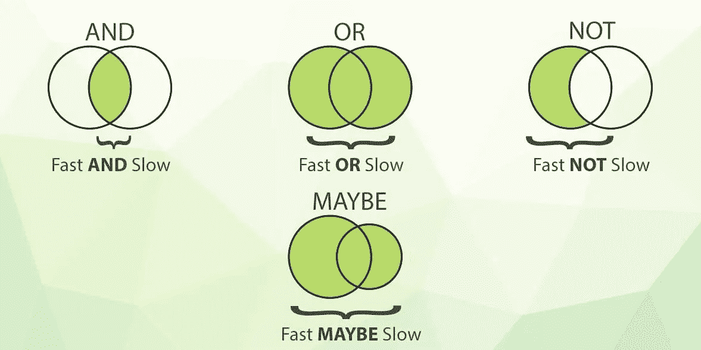

# 全文运算符和基本搜索简介

蝎狮搜索中的所有搜索操作都基于标准布尔运算符(AND、OR、NOT ),这些运算符可以组合使用，也可以按任意顺序组合或排除搜索中的关键字，以获得更相关的结果。

默认且最简单的全文运算符是 and，这是在搜索中仅枚举几个单词时假定的。


**和**是一个默认操作符，使用该操作符，**‘fast slow’**查询将返回同时包含术语‘fast’和‘slow’的文档。如果一个术语在文档中，而另一个不在，则该文档不会包含在结果列表中。默认情况下，将在所有可用的全文字段中搜索单词。

```
SELECT * FROM testrt WHERE MATCH('fast slow');
```


**或**用于匹配任何术语(或两者都匹配)。术语之间用竖线隔开，例如**‘快|慢’**。它将查找带有“快”或“慢”的文档。

```
SELECT * FROM testrt WHERE MATCH('fast | slow');
```

he OR 运算符的优先级高于 AND，因此查询**‘find me fast | slow’**可以解释为‘find me(fast | slow)’:

```
SELECT * FROM testrt WHERE MATCH('find me fast | slow');
```


**NOT** 确定标有“-”或“！”的术语不在结果里。任何包含此类术语的文档都将被排除在外。例如**‘快！“慢速”**将查找带有“快速”的文档，只要其中没有“慢速”即可。使用它时要小心，尽量减少搜索，因为它可能会变得过于具体，可能会排除好的文档。

```
SELECT * FROM testrt WHERE MATCH('find !slow');
SELECT * FROM testrt WHERE MATCH('find -slow');
```


**也许**是一个特殊的操作符，它的工作方式类似于‘OR’，但是要求左边的项总是出现在结果中，而右边的项是可选的。但是当两者都满足时，文档将获得更高的搜索等级。例如**‘fast MAYBE slow’**将查找带有‘fast’或‘slow’的文档，但是包括这两个术语的文档将具有更高的分数。

```
SELECT * FROM testrt WHERE MATCH('find MAYBE slow');
```

# 用法示例

让我们使用 mysql 客户端连接到蝎狮:

```
# mysql -P9306 -h0
```

对于布尔搜索，可以使用 OR ( '| '):

```
MySQL [(none)]> select * from testrt where match('find | me fast');
+------+------+------------------------+----------------+
| id   | gid  | title                  | content        |
+------+------+------------------------+----------------+
|    1 |    1 | find me                |  fast and quick|
|    2 |    1 | find me fast           |  quick         |
|    6 |    1 | find me fast now       |  quick         |
|    5 |    1 | find me quick and fast |  quick         |
+------+------+------------------------+----------------+
4 rows in set (0.00 sec)
```

OR 运算符具有比 AND 更高的优先级，查询“find me fast|slow”被解释为“find me (fast|slow)”。

```
MySQL [(none)]> SELECT * FROM testrt WHERE MATCH('find me fast|slow');
+------+------+------------------------+----------------+
| id   | gid  | title                  | content        |
+------+------+------------------------+----------------+
|    1 |    1 | find me                |  fast and quick|
|    2 |    1 | find me fast           |  quick         |
|    6 |    1 | find me fast now       |  quick         |
|    3 |    1 | find me slow           |  quick         |
|    5 |    1 | find me quick and fast |  quick         |
+------+------+------------------------+----------------+
5 rows in set (0.00 sec)
```

对于求反，运算符 NOT 可以指定为“-”或“！”：

```
MySQL [(none)]> select * from testrt where match('find me -fast');
+------+------+--------------+---------+
| id   | gid  | title        | content |
+------+------+--------------+---------+
|    3 |    1 | find me slow |  quick  |
+------+------+--------------+---------+
1 row in set (0.00 sec)
```

必须注意的是，默认情况下，蝎狮不支持完全否定查询，并且不可能只运行'-fast '(从 3.5.2 版开始将成为可能)。

另一个基本运算符是 MAYBE。这个由 MAYBE 定义的术语在文档中可能存在也可能不存在。如果它存在，它将影响排名，拥有它的文档将排名更高。

```
MySQL [(none)]> select * from testrt where match('find me MAYBE slow');
+------+------+------------------------+----------------+
| id   | gid  | title                  | content        |
+------+------+------------------------+----------------+
|    3 |    1 | find me slow           |  quick         |
|    1 |    1 | find me                |  fast and quick|
|    2 |    1 | find me fast           |  quick         |
|    5 |    1 | find me quick and fast |  quick         |
|    6 |    1 | find me fast now       |  quick         |
+------+------+------------------------+----------------+
5 rows in set (0.00 sec)
```

# 现场操作员

如果我们想将搜索限制在特定的字段，可以使用运算符“@”:

```
mysql> select * from testrt where match('@title find me fast');
+------+------+------------------------+---------+
| id   | gid  | title                  | content |
+------+------+------------------------+---------+
|    2 |    1 | find me fast           |  quick  |
|    6 |    1 | find me fast now       |  quick  |
|    5 |    1 | find me quick and fast |  quick  |
+------+------+------------------------+---------+
3 rows in set (0.00 sec)
```

我们还可以指定多个字段来限制搜索:

```
mysql> select * from testrt where match('@(title,content) find me fast');
+------+------+------------------------+----------------+
| id   | gid  | title                  | content        |
+------+------+------------------------+----------------+
| 1    |    1 | find me                | fast and quick |
| 2    |    1 | find me fast           | quick          |
| 6    |    1 | find me fast now       | quick          |
| 5    |    1 | find me quick and fast | quick          |
+------+------+------------------------+----------------+
4 rows in set (0.00 sec)
```

字段操作符也可以用来限制只在前 x 个单词中进行搜索。例如:

`mysql> select * from testrt where match(‘[@title](http://twitter.com/title) lazy dog’);`

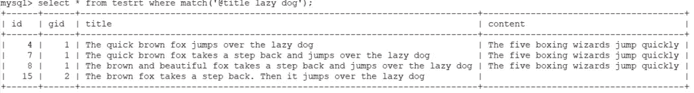

然而，如果我们只搜索前 5 个单词，我们将一无所获:

```
mysql> select * from testrt where match('@title[5] lazy dog');
Empty set (0.00 sec)
```

在某些情况下，可以对可能没有相同全文字段的多个索引执行搜索。
默认情况下，指定索引中不存在的字段将导致查询错误。为了克服这个问题，可以使用特殊运算符“@@relaxed ”:

```
mysql> select * from testrt where match(‘@(title,keywords) lazy dog’);
ERROR 1064 (42000): index testrt: query error: no field ‘keywords’ found in schemamysql> select * from testrt where match('@@relaxed @(title,keywords) lazy dog');
```

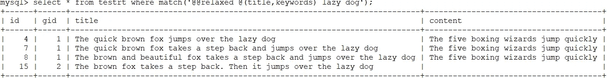

# 模糊搜索

模糊匹配允许只匹配查询字符串中的某些词，例如:

```
mysql> select * from testrt where match('"fox bird lazy dog"/3');
```

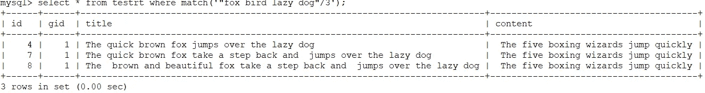

在这种情况下，我们使用 QUORUM 运算符，并指定只匹配 3 个单词即可。使用“/1”的搜索等效于 OR 布尔搜索，而使用“/N”的搜索(其中 N 是输入单词的数量)等效于 AND 搜索。

除了绝对数字，您还可以指定一个介于 0.0 和 1.0 之间的数字(代表 0%和 100%)，蝎狮将只匹配至少具有给定单词的指定百分比的文档。上面同样的例子也可以写成“fox bird lazy dog”/0.3，它将匹配 4 个单词中至少 30%的文档。

```
mysql> select * from testrt where match('"fox bird lazy dog"/0.3')
```

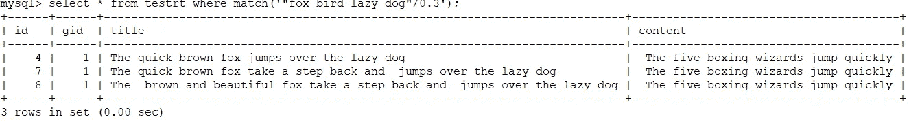

# 高级运算符

除了简单的操作符之外，还有许多高级操作符很少使用，但在某些情况下是绝对必要的。

最常用的高级运算符之一是短语运算符。
短语操作符只有在给定的单词按指定的顺序找到时才会匹配。这也将限制在同一字段中找到的单词:

```
mysql> SELECT * FROM testrt WHERE MATCH('"quick brown fox"');
```

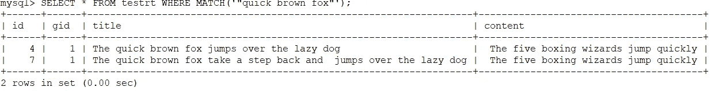

短语运算符的一个更宽松的版本是严格顺序运算符。
顺序操作符要求单词按照指定的完全相同的顺序查找，但其他单词也可以出现在:

```
mysql> SELECT * FROM testrt WHERE MATCH('find << me << fast');
+------+------+------------------------+---------+
| id   | gid  | title                  | content |
+------+------+------------------------+---------+
|    2 |    1 | find me fast           |  quick  |
|    6 |    1 | find me fast now       |  quick  |
|    5 |    1 | find me quick and fast |  quick  |
+------+------+------------------------+---------+
3 rows in set (0.00 sec)
```

另一对处理单词位置的操作符是开始/结束字段操作符。
这些将限制一个单词出现在一个字段的开头或结尾。

```
mysql> SELECT * FROM testrt WHERE MATCH('^find me fast$');
+------+------+------------------------+---------+
| id   | gid  | title                  | content |
+------+------+------------------------+---------+
|    2 |    1 | find me fast           |  quick  |
|    5 |    1 | find me quick and fast |  quick  |
+------+------+------------------------+---------+
2 rows in set (0.00 sec)
```

邻近运算符类似于 AND 运算符，但是增加了单词之间的最大距离，因此它们仍然可以被视为匹配。让我们以这个只有 AND 运算符的例子为例:

```
mysql> SELECT * FROM testrt WHERE MATCH('brown fox jumps');
```

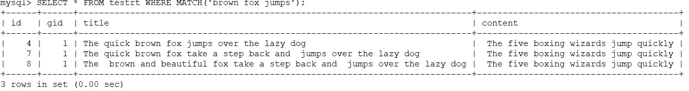

我们的查询返回两个结果:一个是所有的单词都彼此靠近，第二个是其中一个单词更远。
如果我们只想匹配一定距离内的单词，我们可以使用邻近运算符进行限制:

```
mysql> SELECT * FROM testrt WHERE MATCH('"brown fox jumps"~5');
```

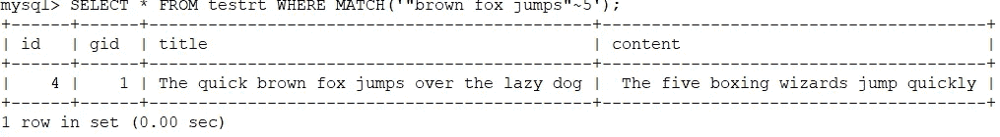

近似运算符的一个更一般化的版本是 NEAR 运算符。在邻近的情况下，在一个单词包中指定一个单一的距离，而邻近操作符使用两个操作数，可以是单个单词或表达式。

在下面的示例中，“brown”和“fox”必须在 2 的距离内，“fox”和“jumps”必须在 6 的距离内:

```
mysql> SELECT * FROM testrt WHERE MATCH('brown NEAR/2 fox NEAR/6 jumps');
```

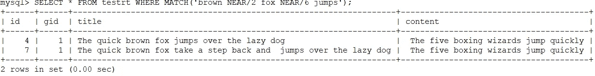

该查询遗漏了一个与第一个 NEAR 条件(这里是最后一个)不匹配的文档:

```
mysql> SELECT * FROM testrt WHERE MATCH('brown NEAR/3 fox NEAR/6 jumps');
```

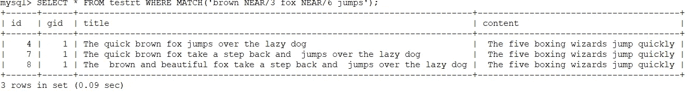

NEAR 运算符的一个变体是 NOTNEAR，它仅在操作数之间有最小距离时才匹配。

```
mysql> SELECT * FROM testrt WHERE MATCH('"brown fox" NOTNEAR/5 jumps');
```

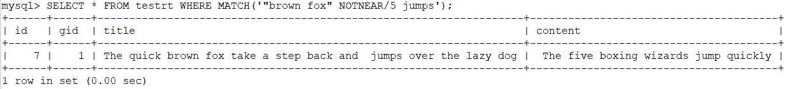

蝎狮还可以检测纯文本中的句子和 HTML 内容中的段落。
对于索引句子，需要启用 [**index_sp**](http://mnt.cr/index_sp) 选项，而段落也需要[**html _ strip**](http://mnt.cr/html_strip)**= 1**

让我们举下面的例子:

```
mysql> select * from testrt where match('"the brown fox" jumps')\G
*************************** 1\. row ***************************
id: 15
gid: 2
title: The brown fox takes a step back. Then it jumps over the lazydog
content:
1 row in set (0.00 sec)
```

该文档包含两个句子，而第一个句子中的短语“jumps”仅出现在第二个句子中。

使用句子运算符，我们可以将搜索限制为仅当操作数在同一个句子中时才进行匹配:

```
mysql> select * from testrt where match('"the brown fox" SENTENCE jumps')\G
Empty set (0.00 sec)
```

我们可以看到该文档不再匹配。如果我们更正搜索查询，使所有单词都来自同一个句子，我们将看到一个匹配:

```
mysql> select * from testrt where match('"the brown fox" SENTENCE back')\G
*************************** 1\. row ***************************
id: 15
gid: 2
title: The brown fox takes a step back. Then it jumps over the lazydog
content:
1 row in set (0.00 sec)
```

为了演示该段落，让我们使用以下搜索:

```
mysql> select * from testrt where match('Samsung  Galaxy');
```

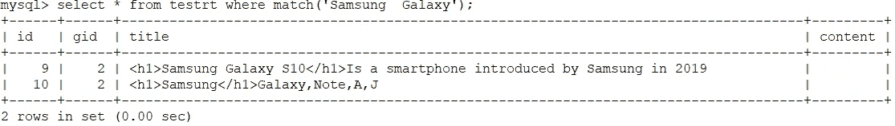

这两个文档有不同的 HTML 标签

如果我们添加段落，那么只有在单个标签中找到搜索词的文档会保留下来。

更一般的运算符是 ZONE 及其变体 ZONESPAN。“区域”是 HTML 或 XML 标签中的文本。

区域要考虑的标签需要在“index_zones”设置中声明，如“index_zones = h*，th，title”。
例如:

```
mysql> select * from testrt where match('hello world');
+------+------+-------------------------------+---------+
| id   | gid  | title                         | content |
+------+------+-------------------------------+---------+
|   12 |    2 | Hello world                   |         |
|   14 |    2 | <h1>Hello world</h1>          |         |
|   13 |    2 | <h1>Hello</h1> <h1>world</h1> |         |
+------+------+-------------------------------+---------+
3 rows in set (0.00 sec)
```

我们有 3 个文档，其中“hello”和“world”是在纯文本中找到的，在同一类型的不同区域或在单个区域中。

```
mysql> select * from testrt where match('ZONE:h1 hello world');
+------+------+-------------------------------+---------+
| id   | gid  | title                         | content |
+------+------+-------------------------------+---------+
|   14 |    2 | <h1>Hello world</h1>          |         |
|   13 |    2 | <h1>Hello</h1> <h1>world</h1> |         |
+------+------+-------------------------------+---------+
2 rows in set (0.00 sec)
```

在这种情况下，单词出现在 H1 区域中，但不要求它们在同一个区域中。如果我们想将匹配限制在单个区域，我们可以使用 ZONESPAN:

```
mysql> select * from testrt where match('ZONESPAN:h1 hello world');
+------+------+----------------------+---------+
| id   | gid  | title                | content |
+------+------+----------------------+---------+
|   14 |    2 | <h1>Hello world</h1> |         |
+------+------+----------------------+---------+
1 row in set (0.00 sec)
```

希望通过这篇文章，您已经了解了[全文搜索操作符](https://docs.manticoresearch.com/latest/html/searching/boolean_query_syntax.html)在蝎狮是如何工作的。如果您正在寻找一种实践体验来更好地学习它，您可以[现在就在您的浏览器中尝试我们的互动课程](https://play.manticoresearch.com/fulltextintro/)。