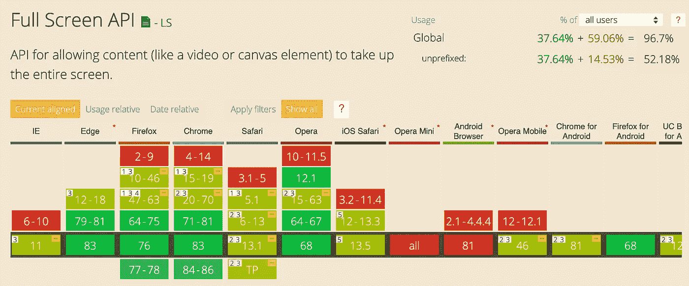
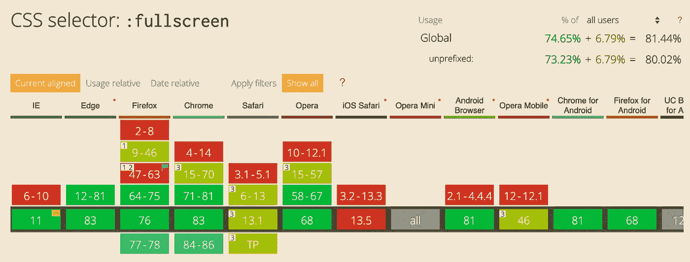
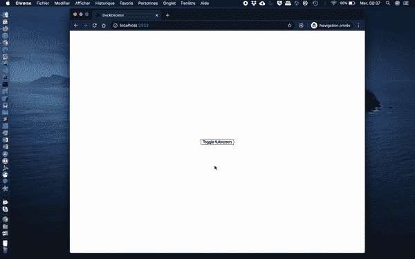

# 全屏:实用提示和技巧

> 原文：<https://levelup.gitconnected.com/fullscreen-practical-tips-and-tricks-cebcba69fb95>

## 切换全屏模式与任何浏览器，一个 Sass mixin 为 polyfill 和隐藏鼠标不活跃


Jr Korpa 在 [Unsplash](https://unsplash.com/s/photos/full-screen-wallpapers?utm_source=unsplash&utm_medium=referral&utm_content=creditCopyText) 上的照片

已经有十几个关于 [Web 全屏 API](https://developer.mozilla.org/en-US/docs/Web/API/Fullscreen_API) 的现有教程，但是当我上周六为我们的演示编辑器 [DeckDeckGo](https://deckdeckgo.com) 的演示模式重新设计工具栏时，我注意到我从来没有分享过我们已经实现的一些有用的技巧。

这些是:

*   如何实现与任何浏览器兼容的全屏模式切换
*   创建一个 Sass mixin 来填充全屏 CSS 伪类
*   不活动时隐藏鼠标光标

# 用任何浏览器切换全屏模式

API 公开了两个函数来切换模式，`requestFullscreen()`进入全屏，`exitFullscreen()`则相反。

```
function toggleFullScreen() {
  if (!document.fullscreenElement) {
    document.documentElement.requestFullscreen();
  } else {
    if (document.exitFullscreen) {
      document.exitFullscreen();
    }
  }
}
```

即使这些方法在不同的浏览器中都得到了很好的支持，你可能会在[上注意到在](https://caniuse.com/#search=requestFullscreen)版本号旁边有一个黄色的小标记。



Caniuse |全屏 API | 2020 年 6 月 9 日

目前的 Safari 和旧版本的浏览器，如果没有在函数前加上前缀，就无法与 API 兼容。这就是为什么，如果你正在寻找实现一个跨浏览器兼容的功能，这是值得添加到您的方法。

```
function toggleFullScreen() {
  const doc = window.document;
  const docEl = doc.documentElement;

  const requestFullScreen = 
               docEl.requestFullscreen || 
               docEl.mozRequestFullScreen ||
               docEl.webkitRequestFullScreen || 
               docEl.msRequestFullscreen; const cancelFullScreen = 
              doc.exitFullscreen || 
              doc.mozCancelFullScreen || 
              doc.webkitExitFullscreen || 
              doc.msExitFullscreen;

  if (!doc.fullscreenElement && !doc.mozFullScreenElement && 
      !doc.webkitFullscreenElement && !doc.msFullscreenElement) {
    requestFullScreen.call(docEl);
  } else {
    cancelFullScreen.call(doc);
  }
}
```

*注意，上面的代码我是在* [*Google Web 基础*](https://developers.google.com/web/fundamentals/native-hardware/fullscreen) *里找到的。*

# 萨斯米辛

CSS 伪类`:fullscreen`(此处记录为)对于根据全屏模式设计元素很有用。

```
#myId:fullscreen {
  background: red;
}#myId:not(:fullscreen) {
  background: blue;
}
```

正如[can use](https://caniuse.com/#search=%3Afullscreen)所显示的，它在各种浏览器中都得到了很好的支持，但你也可能会再次注意到一些限制，尤其是在 Safari 上。这就是为什么 polyfill 这个伪类可能很有趣。



Caniuse |全屏 API | 2020 年 6 月 9 日

此外，如果许多元素必须根据模式进行调整，使用 [Sass](https://sass-lang.com/) 和 mixin 可能会很有趣。这就是为什么这里是我们正在使用的一个。

```
@mixin fullscreen() {
  #{if(&, "&", "*")}:-moz-full-screen {
    @content;
  }

  #{if(&, "&", "*")}:-webkit-full-screen {
    @content;
  }

  #{if(&, "&", "*")}:-ms-fullscreen {
    @content;
  }

  #{if(&, "&", "*")}:fullscreen {
    @content;
  }
}
```

在它的帮助下，你现在可以声明一次，然后将你所有的全屏样式分组。

```
@include fullscreen() {
  #myId {
    background: blue;
  } #myMenu {
    display: none;
  } #myFooter {
    background: yellow;
  }
}
```

*我有填料，我不是自己写的这个 mixin，至少完全不是，但我再也想不出我是在哪里找到它的，因为我现在使用它有一段时间了。如果你是她/他的作者，请告诉我。我很乐意给你学分！*

# 不活动时隐藏鼠标指针

你是否也注意到，当一个演示者全屏显示她的/他的演示时，鼠标光标是否仍然显示在屏幕上的某个地方？

我确实注意到了它，而且我宁愿把它藏起来😆。我的意思是，当我在 [DeckDeckGo](https://deckdeckgo.com) 注意到这种行为时，我必须尽快制定出解决方案。即使我在印度度过冲浪假期(你可以查看我的 GitHub 提交历史，我不是在开玩笑，真实的故事🤣).



为了检测不活动，我们监听事件 [mousemove](https://developer.mozilla.org/en-US/docs/Web/API/Element/mousemove_event) 。每次事件被触发时，我们重置一个计时器并延迟修改样式[光标](https://developer.mozilla.org/fr/docs/Web/CSS/cursor)来隐藏鼠标。同样，如果我们在全屏模式和正常模式之间切换，我们会执行相同的功能。

```
<!DOCTYPE html>
<html dir="ltr" lang="en">
  <head>
    <meta charset="utf-8" />
    <meta name="viewport" 
          content="width=device-width, initial-scale=1.0, minimum-scale=1.0, maximum-scale=5.0" />
    <title>Hide mouse on inactivity</title>
  </head> <body style="margin: 0; overflow: hidden;"> <script type="text/javascript">
      let idleMouseTimer;

      document.addEventListener('mousemove', mouseTimer);

      function mouseTimer() {
        showHideMouseCursor(true);

        clearTimer();

        if (!isFullscreen()) {
          return;
        }

        idleMouseTimer = setTimeout(async () => {
          showHideMouseCursor(false);
        }, 2000);
      }

      function clearTimer() {
        if (idleMouseTimer > 0) {
          clearTimeout(idleMouseTimer);
        }
      }

      function isFullscreen() {
        return window.innerHeight == screen.height;
      }

      function showHideMouseCursor(show) {
        document.querySelector('div').style
                .setProperty('cursor', show ? 'initial' : 'none');
      }

      function toggleFullScreen() {
        const doc = window.document;
        const docEl = doc.documentElement;

        const requestFullScreen = 
                     docEl.requestFullscreen ||    
                     docEl.mozRequestFullScreen ||  
                     docEl.webkitRequestFullScreen || 
                     docEl.msRequestFullscreen;

        const cancelFullScreen = 
                    doc.exitFullscreen || 
                    doc.mozCancelFullScreen || 
                    doc.webkitExitFullscreen || 
                    doc.msExitFullscreen;

        if (!doc.fullscreenElement && !doc.mozFullScreenElement && 
            !doc.webkitFullscreenElement && 
            !doc.msFullscreenElement) {
          requestFullScreen.call(docEl);
        } else {
          cancelFullScreen.call(doc);
        }

        mouseTimer();
      }
    </script>

    <div style="display: block; width: 100vw; height: 100vh;">
      <button onclick="toggleFullScreen()" 
              style="position: absolute; 
                     top: 50%; left: 50%; 
                     transform: translate(-50%, -50%);">
        Toggle fullscreen
      </button>
    </div>
  </body>
</html>
```

# 结论

我希望我们在编辑器和开发工具包中应用的这些提示，有一天会对某个人、某个地方有用。如果你有任何问题，请给我留言。

为你的下一个演示尝试一下😇。

到无限和更远

大卫