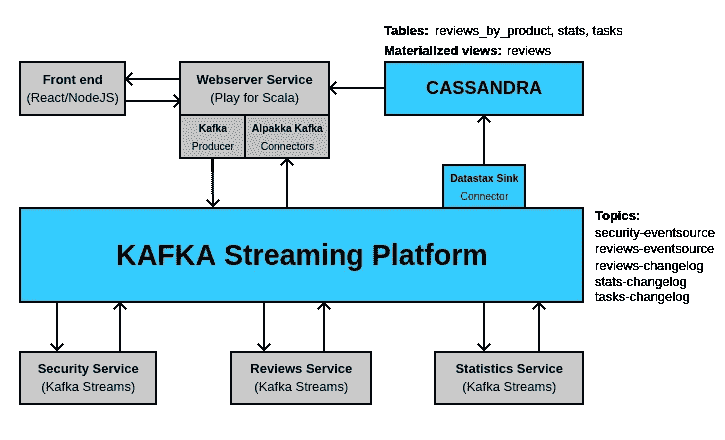
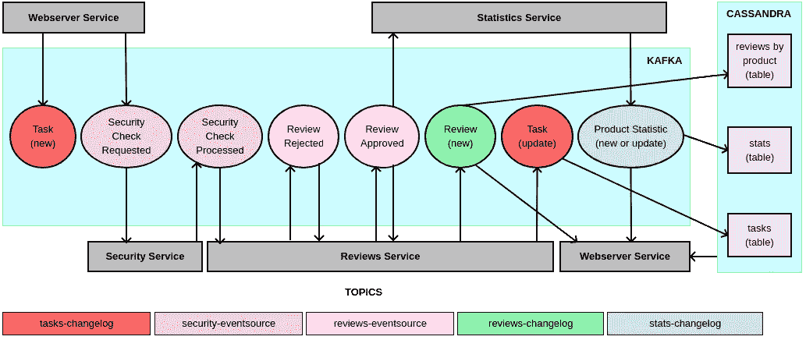

# 全栈卡夫卡

> 原文：<https://levelup.gitconnected.com/fullstack-kafka-e735054adcd6>

使用 React、Websocket、Play for Scala、Kafka Streaming Platform 和 Cassandra 构建一个完整的实时微服务应用

这篇文章是关于使用 [React](https://reactjs.org/) 、 [Websocket](https://developer.mozilla.org/en-US/docs/Web/API/WebSockets_API) 、 [Play for Scala](https://www.playframework.com/documentation/2.8.x/ScalaHome) 、 [Akka](https://akka.io/) 、 [Kafka](https://kafka.apache.org/) 、 [Alpakka Kafka](https://doc.akka.io/docs/alpakka-kafka/current/home.html) 和 [Cassandra](https://cassandra.apache.org/) 等构建一个示例应用程序。

我们将建立**产品评论**基于微服务的应用程序，这是电子商务业务的一小部分，人们可以对特定产品进行评论。我们的重点是评论，而不是产品或其他任何东西，所以我们的系统中只有一个产品，所有的评论都是针对这个产品的。

‌By 最后，在设计你的下一个基于 Kafka 的实时应用时，你至少应该有更多的想法或选择。

‌Let's 首先看看应用程序是什么样子的…

# 查看运行中的示例应用程序

下面，您可以看到一个示例应用程序的视频。

有问题的产品是科比·布莱恩特洛杉矶球衣。您可以查看当前的评论，并发布您的评论。在产品图片下有评论统计。

‌This 应用程序几乎是实时的。当您发布新的评论时，所有连接的用户都可以看到它以及更新的统计数据。

它的工作方式很简单。你只需要填写你的名字和电子邮件，你选择一个评级，你说点什么，然后你就可以发表了。

如果名称为空，将使用' *Tom Dollars* '。

如果电子邮件为空，将使用 tomdollars@example.com 的*。*

*如果内容为空，将使用*(无内容)*。*

*如果你写了一个无效的电子邮件地址，安全检查将拒绝你的审查。*

*就是这样！*

*代码由两部分托管在 Github 上:后端部分和前端部分。后端部分的`README`将向您展示部署应用程序需要做的所有工作。如果需要，不要犹豫提出问题。*

*既然您已经知道了我们要构建什么，让我们从绘制解决方案的大图开始，这样我们就可以对正在发生的事情有一个更好的共同理解。*

# *整体情况*

*下图显示了我们的工具如何组合在一起形成我们的架构:*

**

*下面的另一张图显示了消息如何驱动我们的系统:*

**

*好吧，让我们来解释这一切。‌The 系统的工作方式非常简单明了。*

*当用户发布新的`Review`，`Webserver`通过其`Kafka Producer`向卡夫卡发布两条消息:一条新的`Task`消息和一条`SecurityCheckRequested`消息。在这种情况下，安全检查是对电子邮件地址格式的简单验证。任务对象会有一个类似于`PROCESSING`的状态，并通过一个`Connector`存储在 Cassandra 中，这样前端就可以查询它，知道已经处理的评论创建是否完成。*

*‌The `Security`服务消费`SecurityCheckRequested`消息并进行检查，然后发布`SecurityCheckProcessed`消息。*

*‌Note 表示，`Security`服务不会更新`Review`对象，也不会发布关于`reviews`主题的消息，它只会发布检查结果，并让正确的服务改变`Review`对象。我们遵循[单作者原则](https://www.confluent.io/blog/build-services-backbone-events/)，该原则规定只有一个服务应该改变给定实体的状态，并且只有一个服务应该发布给定类型的消息。在我们的例子中，只有`Reviews`服务可以更新`Review`对象。*

*‌The `Reviews`服务消费`SecurityCheckProcessed`消息。每个`Review`都有一个`status`场，可以是`APPROVED`也可以是`REJECTED`。`Reviews`服务将根据安全检查结果更新`Review`对象`status`。然后`Reviews`服务将再次根据安全检查结果向`reviews-eventsource`主题发布`ReviewApproved`或`ReviewRejected`消息。*

*‌The `Reviews`服务消费来自`reviews-eventsource`主题的`ReviewApproved`和`ReviewRejected`消息，然后将引用的`Review`发布到`reviews-changelog`主题，由`Connector`消费并存储在`Cassandra`中。注意，`reviews-changelog`将存储`APPROVED`和`REJECTED`评论。没有人知道商业价值从何而来，所以最好保留一切。*

*然后，‌The `Reviews`服务会将从头创建的任务更新为`DONE`，因此前端可以继续从`Cassandra`检索结果。*

*‌The `Statistics`服务消费`ReviewApproved`消息，并将相应产品的`ProductStatistic`更新发布到`stats-changelog`主题。*

*‌whenever:`tasks-changelog`、`reviews-changelog`、`stats-changelog`主题有更新，`Datastax Sink Connector`会更新`Cassandra`中相应的表格。*

*‌When 你在浏览器中启动应用程序，前端将通过`Webserver`从 Cassandra 获取当前评论和当前统计数据。*

*‌There 还剩下一个组件，我称之为`The Killer`组件，它是`Alpakka Kafka Connector`。它是`Kafka`和`Akka Streams`之间的桥梁。基本上，它允许您创建一个`Akka Streams Source`，其中产生的价值实际上是从一个`Kafka`主题中消费的。*

*当您在浏览器上启动应用程序时，将建立到`Webserver`的两个`Websocket`连接，一个用于获取新评论，另一个用于获取统计数据更新。在`webserver`端，套接字处理程序将转发来自这些特殊源的所有消息，这正是使该应用程序实时的原因。消息一发布到`reviews-changelog`和`stats-changelog`主题，`Socket`处理程序就会通过`Alpakka Kafka`获取消息，并发送到前端显示。酷！*

*‌That 基本上就是应用程序的工作方式。如果你心中有疑问，你应该在文章的剩余部分或者在[代码库中](https://github.com/acmoune/product-reviewer)找到答案。*

*‌In:顶部的架构图，蓝色部分不是我们代码的一部分，我称之为基础设施。我们将从设置基础设施开始，即`Kafka`和`Cassandra`，这样我们就可以开始编写代码了。我们开始吧！*

# *设置基础设施*

*在本节中，我们将为我们的示例应用程序准备好 Kafka 和 Cassandra。我们将假设您已经安装了这两个程序，并直接为我们的示例应用程序安装它们。我们个人在 Kafka 流媒体平台上使用了 Ubuntu 的 [Confluent 社区版，在 Cassandra 上使用了](https://docs.confluent.io/current/installation/installing_cp/deb-ubuntu.html)[官方 Cassandra Docker 图片](https://hub.docker.com/_/cassandra)，但也有其他选项。只看你觉得更舒服的那个。*

## *卡夫卡*

*我们的应用程序将使用五个主题。您必须从`KAFKA_HOME`运行以下所有命令。*

## *卡桑德拉*

*设置很简单，只需运行下面的脚本。这将创建`proreviewer` `Keyspace`，并添加表`reviews_by_product`、`stats`和`tasks`，并创建物化视图`reviews`。*

## *数据接收连接器*

*请注意，该步骤应在设置`Cassandra`后执行，因为`Connector`将在其注册期间连接到`Cassandra`。*

*我们在分布式模式下使用 Kafka Connect，但是您可以轻松地为独立模式调整配置。*

*我们的正文是‌below`POST`请求:*

*调整这些值以匹配您的环境。*

*‌Just 把它发布到`http://localhost:8083`(你的 Kafka Connect API 接口)，你就一切就绪了。在此之后，所有发布到观察主题的消息将触发 Cassandra 中映射表的插入或更新，一切都为您处理好了。*

*‌Now:我们的基础设施都准备好了，我们可以开始写代码了，我们将从我们的`Microservices`开始。*

# *构建微服务*

*我们将从安装所有依赖项开始。*

## *安装所有依赖项*

*我们所有的`Microservices`都是在 [Scala](https://www.scala-lang.org/) 中开发的，我们使用 [sbt](https://www.scala-sbt.org/) 来管理项目。*

*`product-reviewer/build.sbt`*

*‌ `product-reviewer/project/plugins.sbt`*

*这定义了五个项目:*

*   *公共(用于公共库)*
*   *网络服务器*
*   *复习*
*   *安全*
*   *统计数字*

*除了普通项目，其他都映射到我们的`Microservices`。*

*现在我们的项目目录已经创建，所有的依赖项都已经下载，让我们开始编写实际的代码。‌*

*这里不可能详细说明每个步骤，所以我会尽量展示重要的代码片段，希望它们能说服您查看 [Github 库](https://github.com/acmoune/product-reviewer)上的完整代码。让我们从公共库开始。*

## *公共图书馆*

*公共库中有两个重要的东西:Avro 数据模型和接口的抽象实现。*

***Avro 数据模型***

*我选择在公共项目中创建 Avro 数据模型，这样所有的服务都可以使用它们。通过使它们成为一个共同的关注点，每一个模式变更都应该被所有团队批准或者至少注意到。如果你查看`product-reviewer/common/src/main/avro/`，你会看到所有的 Avro 模式文件:*

*‌ `./task.avsc`*

*`./reviews/entities.Review.avsc`*

*`./reviews/events/ReviewApproved.avsc`*

*`./reviews/events/ReviewRejected.avsc`*

*`./security/events/SecurityCheckRequested.avsc`*

*`./security/events/SecurityCheckProcessed.avsc`*

*`./statistics/entities/ProductStatistic.avsc`*

*您可以使用 [sbt-avro](https://github.com/sbt/sbt-avro) 插件来生成`Avro`特定记录的 Java 类。*

*‌ **后台程序接口***

*在公共项目中，您还会发现`org.apache.commons.daemon.Daemon`接口的抽象实现。我们所有的`Kafka Streams`应用程序都将扩展那个抽象实现，所以如果你想的话，它们可以作为守护进程运行，使用 [jsvc](http://commons.apache.org/proper/commons-daemon/jsvc.html) ，但是为了简单起见，当`Dockerizing`我们的示例应用程序时，我们将不使用`jsvc`。*

*‌Let's 移动到我们的流处理服务:`Security`、`Reviews`和`Statistics`服务。*

# *流处理服务*

*`Security`、`Reviews`和`Statistics`服务是`Kafka Streams`应用。因此，我将只向您展示他们的流拓扑代码。你可以在[代码库](https://github.com/acmoune/product-reviewer)上看到他们的完整代码。*

## *安全服务流拓扑*

*`product-reviewer/security/src/main/scala/SecurityApp.scala`*

*应用程序简单地使用来自`security-eventsource`主题的所有`SecurityCheckRequested`事件，执行检查，然后发布一个仍然在`security-eventsource`主题中的`SecurityCheckProcessed`事件。*

*‌Let's 搬到了`Reviews`服务区。*

## *‌Reviews 服务流拓扑*

*`product-reviewer/reviews/src/main/scala/ReviewsApp.scala`*

*应用程序首先使用来自`security-eventsource`主题的所有`SecurityCheckProcessed`事件，并使用`branch`处理器，创建两个`KStream`，一个用于`VALID`评论，另一个用于`INVALID`评论。*

*‌On 的`VALID`分支，将`SecurituCheckProcessed`数据模型映射到`ReviewApproved`数据模型，并发布到`reviews-eventsource`主题。*

*‌On 的`INVALID`分支，将`SecurituCheckProcessed`数据模型映射到`ReviewRejected`数据模型，并发布到 r `eviews-eventsource`主题。*

*应用程序还使用来自`reviews-eventsource` 主题的所有`ReviewRejected`和`ReviewApproved`事件，将它们映射到一个`Review`实体，并将该实体发布到`reviews-changelog`主题。*

*‌The 应用程序也消耗了`tasks-changelog`主题作为`table`，并在`SecurityCheckProcessed` `KStream`和`Task` `KTable`之间执行一个`KStream to KTable join`，然后使用我们的`taskJoiner`，它将`SecurityCheckProcessed's`对应的`Task`设置为`DONE`，并将更新后的`Task`发布到`tasks-changelog`主题。*

*‌That 基本上就是了。让我们转到`Statistics`服务。*

## *‌Statistics 服务流拓扑*

*`product-reviewer/statistics/src/main/scala/StatisticsApp.scala`*

*该应用程序简单地使用来自`reviews-eventsource`主题的`ReviewApproved`事件，然后将`key`设置为`product_id`，因此给定产品的所有评论都将是同一个分区，然后通过新的`product_id`键聚集评论。*

*‌ `aggregate`是一个全状态处理器，它使用一个`state store`，由一个`Kafka topic`支持，来保存之前的聚合值。*

*‌Our `Aggregator` simple 基于之前的统计数据和`ReviewApproved`数据模型生成一个新的`ProductStatistic`数据模型，并将其发布为对`stats-changelog`主题的更新。*

*‌Let's 移动到我们的最后一个发球点`Web Server`*

# *Web 服务器服务*

*网络服务器服务是一个`Play for Scala`应用程序。它包含`Models`、`Controllers`、`Repositories`、`Services`和`Sources`。让我们从模型开始，因为它们在任何地方都被使用。*

## *‌Models*

*我们之前描述的`Avro`数据模型被创建为`Avro`进行序列化和反序列化。本节中的模型用于以`JSON`格式向`Frontend`发送数据。我们可能很难直接使用`Avro`数据模型，但是使用本节中的模型更方便，特别是在`Scala`透视图中。*

*那些模型的‌Some 扩展了`DomainModel`特征，它简单地定义了一个`toDataModel`方法。*

*‌ **任务***

*`product-reviewer/webserver/app/models/data/Task.scala`*

***回顾***

*`product-reviewer/webserver/app/models/data/Review.scala`*

***产品统计***

*`product-reviewer/webserver/app/models/data/ProductStatistic.scala`*

*作为模型的一部分，我们还定义了消息协议，即服务接收的事件和查询。*

***‌Messages 议定书***

*`product-reviewer/webserver/app/models/protocol/Messages.scala`*

*现在让我们转到我们的单一存储库:`ReviewRepo`*

## *‌Repositories*

***评论库***

*那个存储库是我们的数据访问对象，从`Cassandra`获取我们需要的一切，它是一个`Akka Actor.`*

*‌ `product-reviewer/webserver/app/repositories/ReviewRepo.scala`*

*让我们转到我们的单一服务，即`ReviewManager`*

## *服务*

***审查经理***

*也是 Akka 演员。*

*‌ `product-reviewer/webserver/app/services/ReviewManager.scala`*

*基本上，当它接收到来自我们`Messages`协议的`SecurityCheckRequested`消息时，它向`security-eventsource`主题发布一个`Avro` `SecurityCheckResquested`数据模型，向`tasks-changelog`主题发布一个具有`PROCESSING`状态的`Avro` `Task`实体，然后它将任务返回给`Frontend`，因此它可以跟踪 Cassandra 上的任务状态。*

*‌It 还会将所有问题转发给`ReviewRepo`演员。*

*让我们转到我们的来源。*

## *来源*

*你应该想知道我所谓的来源。如果你还记得我们关于`Alpakka Kafka`讨论，这里的一个来源是从一个卡夫卡主题生成信息的特殊`Akka Streams Source`。我在我们的游戏应用程序中让他们成为一等公民，就像模型或控制器一样。我们将有两个来源，一个用于评论，一个用于产品统计。*

***评论来源***

*`product-reviewer/webserver/app/sources/ReviewsSource.scala`*

***产品统计数据来源***

*`product-reviewer/webserver/app/sources/ProductStatsSource.scala`*

*这些资源将在套接字处理程序中使用，以便向`Frontend`发送可用的评论和统计数据，从而使我们的应用程序成为实时应用程序。*

## *‌Controllers*

***查看控制器***

*`product-reviewer/webserver/app/controllers/ReviewController.scala`*

***任务控制器***

*`product-reviewer/webserver/app/controllers/TaskController.scala`*

## *路线*

*我们最后来看一下`routes`文件*

*‌ `product-reviewer/webserver/conf/routes`*

*我们已经涵盖了来自`webserver`服务的所有主要代码，这就结束了我们对`Microservices`的覆盖。让我们转移到`Frontend`。*

# *前端应用程序*

*我们的`frontend`以`React`、`TypeScript`、`NodeJS`、`NextJS`为基础，使用`React Context`进行状态管理。我们的`frontend`最重要的方面是数据或状态管理。您可以在我们的示例应用程序的[前端](https://github.com/acmoune/product-reviewer-client)存储库中看到完整的代码。我们先来看看发布新评论是如何处理的。*

## *发布新评论*

*`product-reviewer-client/components/ReviewForm.tsx`*

*在第 17 行，我们执行实际的`POST`，并从我们的`webserver` `Microservice`接收由`ReviewManager`创建的`Task`。*

*‌The `pollUntilTaskFinished`函数(如下图所示)将尝试从`Cassandra`获取每个`500ms`的任务，并检查是`DONE`还是静止的`PROCESSING`，最多尝试 60 次。*

*`60 * 500ms = 30 seconds`。因此，我们基本上给我们的`backend`基础设施 30 秒来完成这个过程，之后我们将发出一个超时错误。*

*我们的`POST`返回的‌The 任务包含一个`resourceId`，它是我们新创建的评论的 ID。我们在回调中使用该 ID 从 Cassandra 获取评论，并将其提供给`frontend`。*

*‌Now:让我们看看评论和统计数据更新是如何获取的。*

## *评论和统计数据更新的初始加载*

***数据提供器组件***

*我们定义了一个包装了一个`DataContext`的`DataProvider`组件来保存我们的评论和统计数据:*

*`product-reviewer-client/data/DataProdiver.tsx`*

***索引页***

*下面你可以看到当我们的索引页面加载时数据是如何获取的*

*`product-reviewer-client/pages/index.tsx`*

*`fetchReviews`和`fetchStats`方法获取所有数据并更新上下文。*

*‌Still:在索引页面上，你可以看到`SocketProvider`，用于获取新的评论和产品统计数据更新。我们来看看。*

## *实时评论和产品统计数据更新负载*

*我们定义了一个包装了一个`SocketContext`的`SocketProvider`，以使套接字连接对需要它的组件可用。*

***socket provider 组件***

*`product-reviewer-client/data/SocketProvider.tsx`*

*如果连接关闭，该组件将自动尝试重新连接多达 10 次，使其永久。*

***实时评论***

*就像您在`IndexPage`中看到的那样，`ReviewsList`组件使用套接字连接来实时检索评论，并将它们添加到`DataContext`:*

*`product-reviewer-client/pages/index.tsx`*

*`product-reviewer-client/components/ReviewsList.tsx`*

***实时产品统计数据更新***

*在`Product`组件中，您还可以看到为`Stats`组件提供了一个套接字连接来实时获取产品统计数据更新:*

*`product-reviewer-client/components/Product.tsx`*

*`product-reviewer-client/components/Stats.tsx`*

*‌We 在我们的`frontend`中介绍了数据管理的所有重要方面，这也结束了我们对`Frontend`应用程序的介绍。*

# *部署*

*我们的示例应用程序是使用 Docker 部署的。您将在[代码库](https://github.com/acmoune/product-reviewer)自述文件中找到所有说明。*

*‌I 希望你喜欢这个职位。*