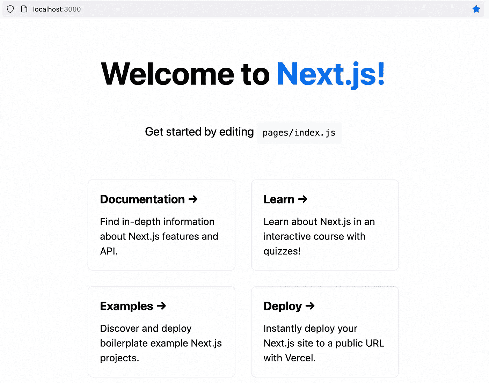
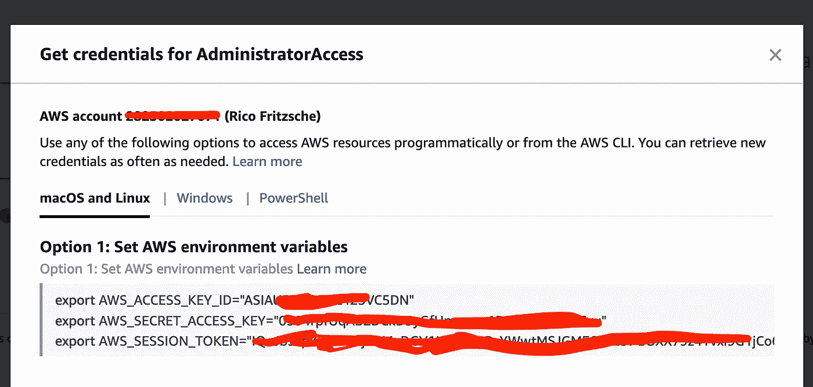
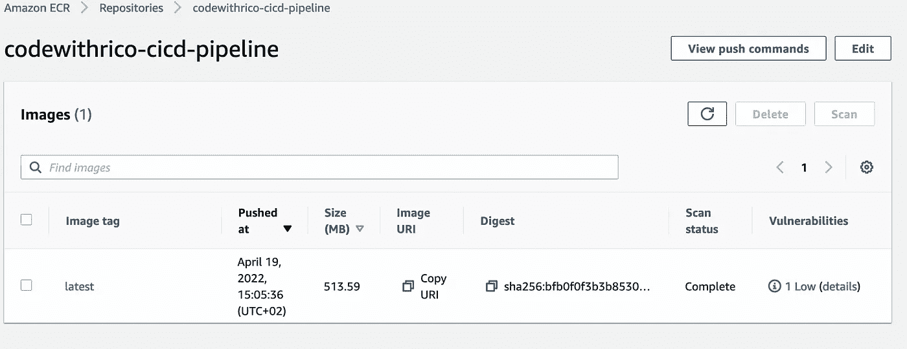

# 完全自动化的 NextJS 构建/部署(GitHub、AWS ECR、Fargate Service、ECS)——第 1/4 部分

> 原文：<https://levelup.gitconnected.com/fully-automated-nextjs-builds-deployments-github-aws-ecr-fargate-service-ecs-part-1-4-6216e58dcb89>

在本教程的第一部分，我将展示如何在 ECR(弹性容器注册中心)上将您的 NextJS 应用程序部署为 Docker 映像，并预先使用 Terraform 推出 ECR。


图片来源:stock.adobe.com

正如在上一篇文章中承诺的，这个教程是关于非常实际的东西。所以我就不赘述长篇大论的序言了，直接切入正题。本教程的目标是自动化一个 NextJS 应用程序，通过 GitHub 工作流使其成为 AWS 上的 Fargate 服务。

# 教程的内容

**第一部分— Docker 图像/ ECR 平台部署&推送图像。**

第二部分—全面的 GitHub 集成和 TF 后端 AWS/S3

第三部分—在 AWS 上部署 Fargate Terraform(基础设施即代码)

第四部分—为生产优化 Dockerfile

# 语境

假设你正在构建一个超级酷的 web 应用程序，比如用 NextJS。当然，您希望涉众能够尽快提供反馈，因此您需要定期提供反馈。Docker 容器是做到这一点的好方法。例如，AWS 或 Azure 等云技术为我们提供了从一开始就测试应用程序的可接受性和稳定性的绝佳机会。

在本教程中，我们将了解 web 应用程序的持续集成/部署(CI/CD)。从我的角度来看，我们在这里将要讨论的所有内容都是及时开发软件的基本部分和第一步。在这一点上，我还想指出，自动化解决方案的推出应该是开发人员工具箱的一部分。凭借我们现在拥有的所有工具和知识，部署绝不是项目结束时的一个孤立步骤。

因此，在这个系列教程中，我将展示我们如何毫不费力地以完全自动化的方式获得一个 NextJS 应用程序“*生产就绪*”。在今天的节目中，我们将学习如何创建一个容器注册表(ECR)和一个初始的 Docker 映像。

# 需要什么

你不需要在你的机器上安装太多东西来跟随这个教程。

*   [NodeJS](https://nodejs.org/en/) 版本 14 或更高
*   本地 [Docker](https://docs.docker.com/desktop/) 安装，例如 Docker 桌面(Mac 或 Windows)
*   [GitHub](https://github.com/) 账号；Git CLI
*   [AWS 账号](https://aws.amazon.com/de/free/?all-free-tier.sort-by=item.additionalFields.SortRank&all-free-tier.sort-order=asc&awsf.Free%20Tier%20Types=*all&awsf.Free%20Tier%20Categories=*all)(如果没有，可以免费创建一个)
*   [AWS CLI](https://docs.aws.amazon.com/cli/latest/userguide/getting-started-install.html)
*   [地形](https://learn.hashicorp.com/tutorials/terraform/install-cli)

基本上，该教程可以转移到其他技术。所以你可以用另一个 NodeJS 集成来代替 NextJS 应用，或者用 GitHub 代替 GitLab 等。

要检查 NodeJS 在您的机器上是否可用以及是哪个版本，您可以在终端中执行以下命令…

```
$ node -v
v16.14.2
```

…对于 Git CLI 和 AWS CLI，如下所示:

```
$ git --version
$ aws --version
```

什么都有吗？让我们最终开始吧…

# NextJS 应用示例

让我们首先使用“create-next-app”创建一个示例项目。为此，请转到要创建项目的源文件夹。然后调用下面的命令。

```
$ yarn create next-app
```

将项目命名为您想要的名称。在这个例子中，我将它命名如下。

```
What is your project named? › cicd-tutorial
```

按回车键。

之后，转到项目文件夹，测试应用程序是否可执行。

```
$ cd cicd-tutorial
$ yarn run dev
yarn run v1.22.17
$ next dev
ready - started server on 0.0.0.0:3000, url: http://localhost:3000
wait  - compiling...
event - compiled client and server successfully in 821 ms (124 modules)
```

如果您看到这里显示的输出，那么一切正常。

在浏览器中你可以调用网址 [http://localhost:3000](http://localhost:3000) 。如果一切正常，您将看到以下输出。



本地主机上的 NextJS 应用示例:3000

酷！那很容易。

# 准备 Docker 图像

接下来，我们需要一个 Dockerfile 文件来封装应用程序。为此，在我们项目的根文件夹中创建一个名为“Dockerfile”的文件。

```
$ touch Dockerfile
```

将以下内容添加到刚刚创建的 Dockerfile 文件中。

```
FROM node:16-alpine
WORKDIR /app

COPY package.json yarn.lock ./
RUN yarn install

COPY . .
RUN yarn build

USER node

EXPOSE 3000

CMD ["yarn", "start"]
```

在本教程的这一部分中，我们将不会着重于为生产使用准备 docker 文件。我们将在本系列的最后一部分中讨论这个问题。首先，我们将重点了解如何将我们的应用程序放入 Docker 容器，并将其作为图像放在 AWS ECR 上。

现在让我们创建一个本地映像，看看 docker 文件是否是这样工作的。

为此，我们在终端中运行以下命令。

```
$ docker build -t <image-name> .
```

*-t* 选项意味着我们给图像命名。在我的例子中，它是“ *cicd-tutorial* ”。注意:末尾的点是必需的，这意味着 Dockerfile 应该在本地目录中使用。

使用下面的命令，我们可以检查 Docker 映像是否在本地可用。

```
$ docker images                                 
REPOSITORY      TAG       IMAGE ID       CREATED         SIZE
cicd-turorial   latest    f43f5a09ac05   6 minutes ago   1.06GB
```

好的，太好了！它在那里。

现在让我们试试容器中的应用程序是否如预期的那样运行，并将端口 3000 映射到我们的本地网络，以便我们可以在浏览器中访问 web 应用程序。如果您使用了不同的名称，您必须相应地替换“ *cicd-tutorial* ”。

```
$ docker run -p 3000:3000 cicd-turorial
```

之后，您可以在浏览器中再次运行该应用程序，应该会得到如上所示的相同输出。

正如我所说的，我现在故意保持 docker 文件简单，因为我想稍后再讨论我们如何让应用程序“*生产就绪*”。

# 弹性容器注册(ECR)。

好了，我们现在已经确保我们的应用程序是容器就绪，现在将着眼于在 AWS 上创建一个容器注册表。AWS 提供了一种叫做弹性容器注册中心(简称 ECR)的服务，它允许我们将容器映像部署到私有存储库中。

当然，由于我是完全自动化的粉丝，我们不会手动创建这个注册表并点击菜单，而是使用 Terraform。 [Terraform](http://terraform.io) 是一个“基础设施即代码”(简称 IAC)工具。IAC 允许您用代码定义、部署和更新基础设施。基本上，运行应用程序所需的一切都用代码表示。即服务器、数据库、网络、配置、日志、文档、测试、部署流程。IAC 是在云环境中运行现代应用程序的基础。

为了使用 Terraform 描述所需的基础设施，我们首先需要扩展我们项目的结构。

为此，我们在项目的根目录下创建一个名为“terraform”的新文件夹，以 Terraform 代码的形式映射那里的基础设施。

由于创建 ECR 是一个初始步骤，我们稍后将需要另一个部署步骤来在弹性容器服务(ECS)之上创建 [Fargate 服务](https://aws.amazon.com/de/fargate/)，我建议为容器注册表创建一个单独的子文件夹，如下所示。

```
$ mkdir terraform && mkdir terraform/registry
```

我们现在有了下面的项目结构。

```
.
├── pages
│   └── api
├── public
├── styles
└── terraform
    └── registry
```

在下一步中，我们将在 */terraform/registry* 文件夹中创建一个名为“ *main.tf* 的文件，在这里我们将放置第一个简单的 terraform 脚本，它将用于创建我们的容器注册表。

```
terraform {
  required_version = ">= 1.0.11"

  required_providers {
    aws = {
      source  = "hashicorp/aws"
      version = ">= 3.68.0"
    }
    random = {
      source  = "hashicorp/random"
      version = ">= 3.1.0"
    }
  }
}

variable "registry_name" {
  type = string
}

variable "aws_region" {
  type = string
}

provider "aws" {
  region = var.aws_region
}

resource "aws_ecr_repository" "repository" {
  name                 = var.registry_name
  image_tag_mutability = "MUTABLE"
  tags                 = {
    Name = var.registry_name
  }

  image_scanning_configuration {
    scan_on_push = true
  }
}

output "registry_id" {
  description = "The account ID of the registry holding the repository."
  value = aws_ecr_repository.repository.registry_id
}

output "repository_name" {
  description = "The name of the repository."
  value = aws_ecr_repository.repository.name
}

output "repository_url" {
  description = "The URL of the repository."
  value = aws_ecr_repository.repository.repository_url
}
```

现在让我们转到目录' *terraform/registry* '来初始化 terraform。

```
$ cd terraform/registry/
$ terraform init
Terraform has been successfully initialized!
```

在文件 *main.tf* 中，定义了两个变量‘registry _ name’和‘AWS _ region’。当然，这些必须在我们部署之前设置好。为此，我们创建一个 *tfvars* 文件，在其中可以定义所有变量。通过为不同的环境使用不同的 *tfvars* 文件，我们可以在下一步中管理不同的阶段。我将在本教程的后续章节中解释这是如何工作的。

现在，让我们将这两个变量放在一个单独的文件中。为此，我们在“terraform/registry”文件夹中创建文件 *vars.tfvars* ，内容如下。当然，值可以自由选择。所有可用 AWS 区域的有效值可在[这里](https://docs.aws.amazon.com/AWSEC2/latest/UserGuide/using-regions-availability-zones.html#concepts-available-regions)找到。

```
registry_name = "codewithrico-cicd-pipeline"
aws_region = "eu-central-1"
```

为了使用 Terraform 将 ECR 存储库部署到 AWS 帐户，必须在本地机器上将 AWS_ACCESS_KEY_ID 和 AWS_SECRET_ACCESS_KEY 设置为环境变量。

您可以从 AWS 控制台中的配置文件*菜单项→安全凭证→访问密钥*中获取这些变量。但是，我建议在 AWS 帐户上设置 SSO，并创建一个专用用户。之后，您可以访问您的 AWS 控制台，如下所示:https://<your organization>.awsapps.com/start#/。

登录后，您可以简单地将那里的值复制并粘贴到终端中。



将 AWS 凭据复制到此处。

还应该配置 MFA。使用 SSO 的优点是 AWS 密钥和秘密仅在有限的时间内有效，例如 12 小时。

如果您不知道如何在 AWS 上配置 SSO，我将很快介绍更多细节。现在，在您的终端中设置这两个环境变量很重要。

我们终于可以在 AWS 上推出我们的容器注册了。

```
$ terraform apply -auto-approve -var-file=vars.tfvars
```

通过使用*-自动批准*选项，无需进一步输入。通过 *-var-file* ，我们显示了预定义变量的位置。如上所述，我将在下一集更详细地介绍使用 *var* 文件的目的。

成功部署后，我们应该在终端中看到以下输出。

```
Apply complete! Resources: 1 added, 0 changed, 0 destroyed.

Outputs:

registry_id = "<your account id>"
repository_name = "codewithrico-cicd-pipeline"
repository_url = "<your account id>.dkr.ecr.eu-central-1.amazonaws.com/codewithrico-cicd-pipeline"
```

# 推送图像

让我们简要总结一下目前为止我们所做的工作:

*   创建了包括 Dockerfile 的示例项目
*   本地构建 Docker 映像并测试容器
*   为部署 ECR 而创建的地形代码。
*   使用 Terraform 在 AWS 上推出容器存储库。

现在我们在容器注册表上少了一些生命，对吗？！所以是时候将我们的 NextJS 应用程序作为一个映像部署在 ECR 上了。

首先，我们需要登录 ECR，这样我们就可以将我们的 Docker 映像推送到那里。

为此，我们如下获取帐户 ID。

```
$ export ACCOUNT_ID=$(aws sts get-caller-identity | jq -r .Account)
```

有了这个，我们已经可以通过终端几乎在 ECR 上登录了。我们只需要将 AWS_REGION 设置为容器存储库所在的环境变量。对我来说，这是法兰克福。

```
$ export AWS_REGION=eu-central-1
$ aws ecr get-login-password --region ${AWS_REGION} | docker login --username AWS --password-stdin {ACCOUNT_ID}.dkr.ecr.${AWS_REGION}.amazonaws.com
```

如果成功，我们将在终端中看到输出“登录成功”。

在最后一步，我们仍然需要正确地标记并推送到容器注册中心。首先，我们用下面的命令获得正确的存储库 URL。

```
$ export REPOSITORY_NAME=<name of your registry>
$ export REPOSITORY_URL=${ACCOUNT_ID}.dkr.ecr.${AWS_REGION}.amazonaws.com/${REPOSITORY_NAME}
```

作为注册表或存储库的名称，您必须使用您在 *vars.tfvars* 中定义的名称。在下一期，我将更详细地介绍如何在 GitHub 工作流中完全自动地传递这些变量。

要立即推送映像，仍然需要执行以下步骤。

```
$ docker build --platform linux/amd64 -t ${REPOSITORY_NAME}:latest .
$ docker tag ${REPOSITORY_NAME}:latest ${REPOSITORY_URL}:latest
$ docker push ${REPOSITORY_URL}:latest
```

之后，我们可以通过 AWS 控制台检查图像是否可用。



AWS ECR 上的 Docker 图像

正如正文中已经宣布的，在教程的下一集，我们将深入 GitHub 工作流，并将 ECR 和图像的创建放入 GitHub 工作流中。因此，自动化和 CI/CD 工作流将是我们的下一个重点。

在 [GitHub](https://github.com/codewithrico/cicd-tutorial-part-1) 上查看资源库。