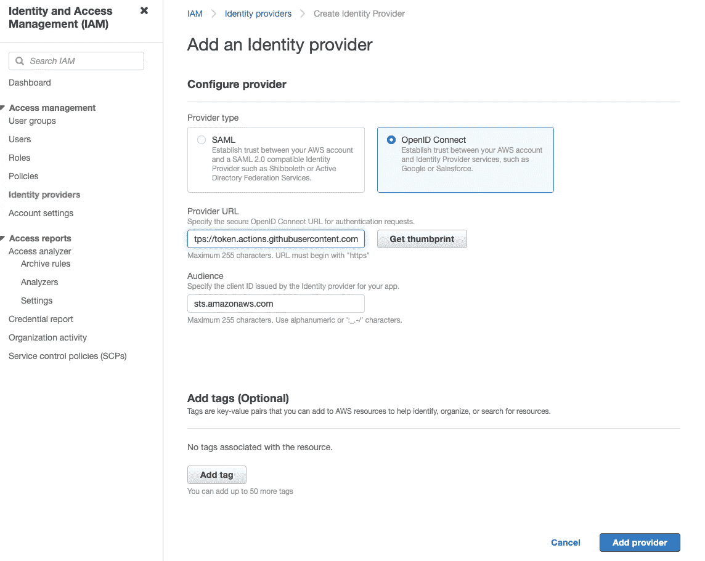
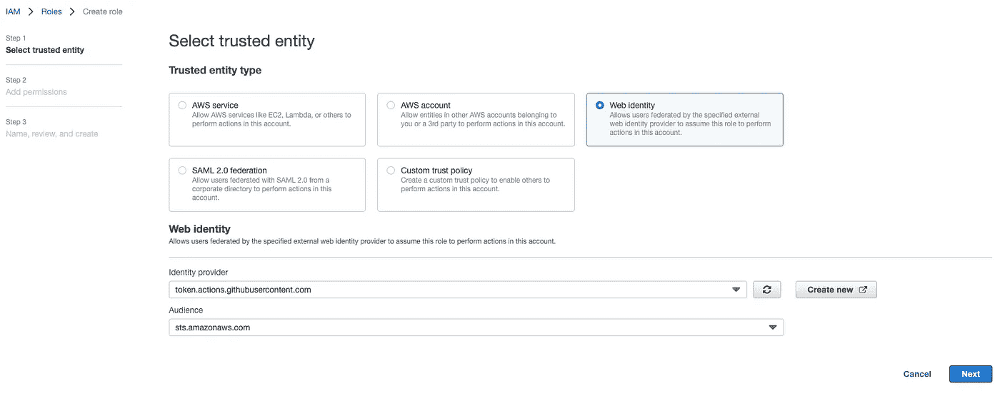
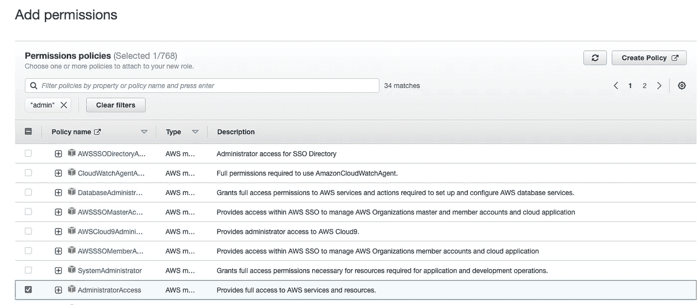
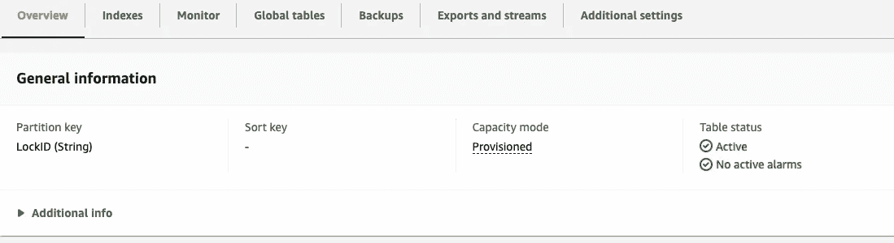
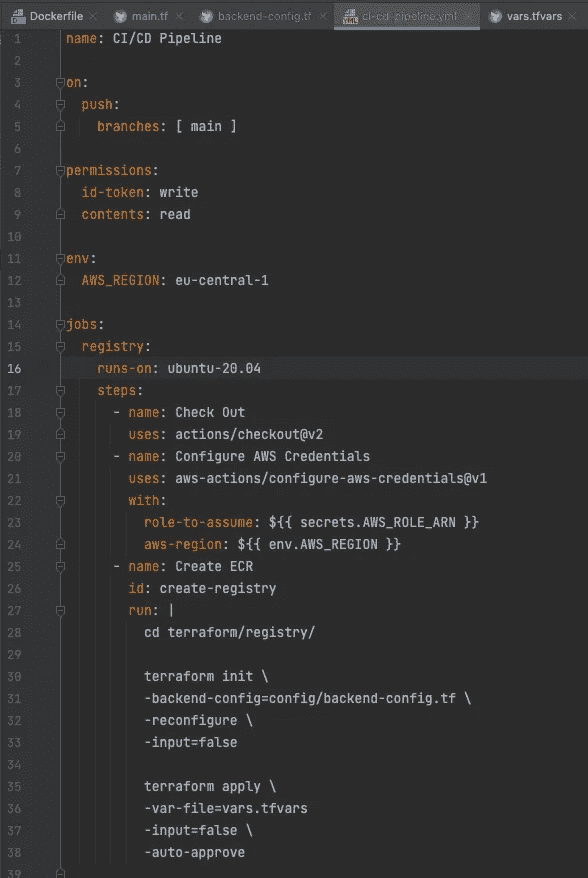

# 完全自动化的 NextJS 构建/部署(GitHub、AWS ECR、Fargate Service、ECS)——第 2/4 部分

> 原文：<https://levelup.gitconnected.com/fully-automated-nextjs-builds-deployments-github-aws-ecr-fargate-service-ecs-part-2-4-36caa082676a>

正如在我的 DevOps/ AWS 部署教程的第一部分中所宣布的，这一次将是关于 GitHub 工作流/动作和用于从 GitHub 到 AWS 的认证的 OIDC 令牌。


图片来源:stock.adobe.com

在我的上一篇文章中，我们进入了典型的 DevOps 主题，并开始考虑在 AWS 上部署一个 NextJS 应用程序。在这一点上，我想马上重申，我认为作为一名开发人员，能够将服务从第一行代码一直带到产品中是现代软件开发的一个基本部分。

# 教程的内容

[第一部分— Docker 图像/ ECR 平台部署&推送图像。](/fully-automated-nextjs-builds-deployments-github-aws-ecr-fargate-service-ecs-part-1-4-6216e58dcb89)

**第二部分—完全 GitHub 集成& TF 后端 AWS/S3**

第三部分—在 AWS 上部署 Fargate Terraform(基础设施即代码)

第四部分—为生产优化 Dockerfile

# 一些想法…

在决定选择技术和框架时，考虑操作，当然还有安全性和稳定性是很重要的。如果程序只在自己的机器上运行，那么再漂亮的程序也是无用的。从过去的过程方法来看，我记得人们经常编码，而没有想到在某个时候必须有人运行应用程序。“*让我们在最后*做吧”，这是人们常说的话。为首次展示构建管道通常是一个下游步骤。然而，根据我的经验和知识，部署必须是项目开始的第一步。毕竟，我想确切地知道我的应用程序将如何以及在哪里运行，并且能够持续地监视和呈现结果和中间状态。

在开始时设置 CI/CD 管道也没有错。我们有一切必要的工具来做到这一点。GitHub、Azure DevOps 或 Gitlab 让我们很容易做到这一点。

在本教程中，我将使用 GitHub 在 AWS *弹性容器服务*上启动 web 应用程序，作为 *Fargate* 服务。

# 打开 ID 连接

我见过数百个 CI/CD 管道，其中存储了访问云资源的凭证。显然，这不是一个好主意。即使 GitHub 机密在保存后不再可读，如果您不想每天更改它们，凭证至少必须有更长的有效期。或者创建永久有效的凭证，但我认为从安全角度来看这是有问题的。通常，为此会引入一种技术用户*,用于在云提供商的指导下从管道获得授权。总之，不是好办法。*

*然而，一段时间以来，GitHub 一直提供 OpenID Connect 来验证 AWS。设置非常简单。我们首先需要在 AWS 控制台中设置一些东西。*

*首先，在 AWS 控制台的身份和访问管理(IAM)下，如果 GitHub 没有身份提供者，我们需要创建一个身份提供者。*

**

*提供者 URL 是 https://token.actions.githubusercontent.com 的[，受众是 sts.amazonaws.com 的*。还需要使用“获取指纹”按钮来获取指纹。*](https://token.actions.githubusercontent.com)*

*一旦创建了提供者，我们就可以创建必要的 IAM 角色，这将允许我们从 GitHub 操作访问 AWS 资源。*

**

***可信实体类型**是**网络身份**。身份提供者必须选择为*token.actions.githubusercontent.com*。这是我们刚刚创建的提供者。在观众选择列表中，您应该只能看到条目*sts.amazonaws.com*，该条目也必须被选中。*

*下一步是分配权限。这可以是非常具体的或完全的访问。当然，创建精确的策略是可能的。在我们的例子中，我们让它更开放一点，并赋予角色完全的访问权限。*

**

*在最后一步中，我们必须分配角色的名称，例如 *github-role* 。*

*创建角色后，我们需要再次打开角色进行编辑，以调整**信任关系**。在这里，我们必须纠正这种情况。key*token . actions . githubusercontent . com:sub*必须获取所需的 GitHub 存储库作为值，参见下面的代码示例。*

```
*"Condition": {
                "StringLike": {
                    "token.actions.githubusercontent.com:sub": "repo:<your-github-org>/<your-repo>:*",
                    "token.actions.githubusercontent.com:aud": "sts.amazonaws.com"
                }
            }*
```

*之后，角色就准备好了，可以在 GitHub 工作流中使用。*

# *GitHub 工作流程*

*为了集成工作流，我们现在需要在项目中创建以下新文件夹。*

```
*$ mkdir .github
$ cd .github && mkdir workflows
$ cd workflows*
```

*在。github/workflows 文件夹，然后我们需要一个包含我们动作的文件。*

*`$ touch ci-cd-pipeline.yml`*

*之后，我们应该有如下的项目结构。*

*`.
|-- .github
| `-- workflows
|-- pages
| `-- api
|-- public
|-- styles
`-- terraform
`-- registry`*

*第一步，我将下面的代码添加到 *ci-cd-pipeline.yml* 中。*

```
*name: CI/CD Pipelineon:
  push:
    branches: [ main ]permissions:
  id-token: write
  contents: readenv:
  AWS_REGION: eu-central-1*
```

*管道的名称可以自由选择，并且是可选的。然而，为了在 GitHub 操作中看到它是哪个管道，使用名称是有意义的。*

*新的分区权限很重要。“id-token”写入条目允许请求 OIDC JWT ID 令牌。如果没有此设置，就无法使用上一章中描述的身份验证方法。*

*“内容:读取”权限也是使用“签出”操作所必需的。*

*在 *env* 下，我已经设置了一个 AWS_REGION，应该在这里创建资源。*

*我们记得在教程的第一部分，我们已经创建了一个 Terraform 脚本来创建一个弹性容器注册表(ECR)。我们已经在本地运行了它，以便在 AWS 上创建资源。为此，我们向终端添加了 AWS 凭证。如前所述，OIDC 提供者现在将避免使用凭证。我们已经在 GitHub 存储库和 AWS 之间建立了信任，现在希望在使用 GitHub 工作流中的一个步骤创建 ECR 时利用这一点。*

*为此，我们使用如下的**AWS-actions/configure-AWS-credentials @ v1**操作:*

*`jobs:
registry:
runs-on: ubuntu-20.04
steps:
- name: Check Out
uses: actions/checkout@v2
- name: Configure AWS Credentials
uses: aws-actions/configure-aws-credentials@v1
with:
role-to-assume: arn:aws:iam::<your-account-id>:oidc-provider/token.actions.githubusercontent.com
aws-region: ${{ env.AWS_REGION }}
- name: Create Registry
id: create-registry
run: |
...`*

*对于这个操作，我们需要输入 AWS 角色的 ARN，带有: **role-to-assume** 和 aws-region。*

*原则上，我们现在可以像这样使用管道，因为我们已经使用 OIDC 令牌进行了身份验证。*

*但是别说了。如果我们不再单独在本地使用我们的 Terraform 脚本，我们必须确保 Terraform 状态是集中可用的，并且在执行时被锁定。*

*为此，我们需要一个所谓的后端配置。*

# *地形状态*

*为了使 Terraform 状态在一个*多用户*环境中保持不变，我们首先需要在我们的*/terraform/registry/main . TF*中将下面一行添加到资源“terra form”中。*

*`backend "s3" { /* See the backend config in config/backend-config.tf */ }`*

*正如您已经看到的，我们将需要一个 S3 桶来存储状态。*

*之后，我们将在文件夹 */terraform/registry* 中创建一个名为 *backend-config.tf* 的新文件。这将得到所有必要的设置，见下面的例子。*

```
*bucket                      = "terraform-states"
key                         = "ci-cd-example.tfstate"
region                      = "eu-central-1"
encrypt                     = true
dynamodb_table              = "terraform-locks"*
```

*重要。在执行之前，S3 存储桶和 DynamoDB 必须存在。基本上，可以为 AWS 上的多个管道创建一次。每个管道的密钥必须是唯一的，这一点非常重要。*

*对于 DynamoDB 表，需要一个名为“LockID”的分区键。*

**

*现在剩下的工作是添加一个步骤来执行 Terraform 命令:*

*`- name: Create Registry
id: create-registry
run: |
cd terraform/registry/`*

*`terraform init \
-backend-config=config/backend-config.tf \
-reconfigure \
-input=false

terraform apply \
-var-file=vars.tfvars \
-input=false \
-auto-approve`*

*至此，我们基本上已经准备好使用 GitHub Pipeline 推出 ECR 了。让我们再来看看我们到目前为止创建的 GitHub 工作流。*

**

*通过存储库的 Git *提交* & *推送*，管道被自动执行，资源在 AWS 上被创建。如你所见，我将 AWS GitHub OIDC 角色的 ARN 外包给了 GitHub secret，并且只在工作流中引用它。这当然增加了安全性。*

*好的。目标实现。ECR 现在是使用管道创建的。Terraform 状态被安全地集中管理，并在执行时被锁定。*

# *Docker 构建和推送*

*现在让我们在第二个工作流作业中流水线化 Docker 构建，并自动化它。*

*在教程的第一部分，我们已经深入研究了各个必要的步骤。现在我们只需要将代码转移到工作流作业中。此外，我们仍然需要适当的标签，我想从 Git 提交散列中获得这些标签。这在以后是很重要的，这样 *Fargate* 服务/任务就能识别出一个新的镜像版本可用，容器也被更新。此外，我不喜欢固定存储库的名称，而是希望从 Terraform 输出中获取它。*

*我们已经在*/terraform/registry/main . TF .*中定义了 terra form 输出*

```
*output "repository_name" {
  description = "The name of the repository."
  value = aws_ecr_repository.repository.name
}*
```

*我们只需要将它转移到下一个工作流作业。为此，GitHub 提供了指定作业输出的可能性。为此，需要对 ECR 创建的第一步进行补充:*

```
*jobs:
  registry:
    runs-on: ubuntu-20.04
    outputs:
      repository-name: ${{ steps.create-registry.outputs.repository-name }}*
```

*在 create-registry 步骤中，必须在末尾添加以下行，以将 Terraform 输出映射到步骤/作业输出。*

```
*export REPOSITORY_NAME=$(terraform output --raw repository_name)

echo "::set-output name=repository-name::$REPOSITORY_NAME"*
```

*这允许在下一个作业中重用作业输出。*

*是时候创建工作流中的下一个作业了。仅当 ECR 创建成功时，才应执行此作业。GitHub Actions 知道它的需求属性。这表明成功执行相应的指定是执行作业所必需的。*

*在我们的例子中，作业“registry”是必需的。*

```
*docker-build:
    runs-on: ubuntu-20.04
    needs: [registry]*
```

*我们还希望使用注册表作业的输出来复制尽可能少的变量。环境变量 REPOSITORY_NAME 是从注册表作业的输出中获得的，如下所示。*

```
*docker-build:
    runs-on: ubuntu-20.04
    needs: [registry]
    env:
      REPOSITORY_NAME: ${{ needs.registry.outputs.repository-name }}
      ACCOUNT_ID: {{ secrets.ACCOUNT_ID }}*
```

*Docker 构建作业中的运行步骤如下所示。*

```
*- name: Image build and push
        id: docker-build
        run: |
          export IMAGE_TAG=$(git rev-parse --short HEAD)

          export ACCOUNT_ID=$(aws sts get-caller-identity | jq -r .Account)
          aws ecr get-login-password --region ${AWS_REGION} | docker login --username AWS --password-stdin ${ACCOUNT_ID}.dkr.ecr.${AWS_REGION}.amazonaws.com
          export REPOSITORY_URL=${ACCOUNT_ID}.dkr.ecr.${AWS_REGION}.amazonaws.com/${REPOSITORY_NAME}

          docker build --platform linux/amd64 -t ${REPOSITORY_NAME}:${IMAGE_TAG} .
          docker tag ${REPOSITORY_NAME}:${IMAGE_TAG} ${REPOSITORY_URL}:${IMAGE_TAG}
          docker push ${REPOSITORY_URL}:${IMAGE_TAG}*
```

*这包括登录 ECR 和 Docker 命令 build、tag 和 push，如前一集所述。*

*我们现在从 Git 提交散列中动态创建 image 标签，以便稍后在 *Fargate* 上启动容器更新。*

*根据当前设置，我们现在可以运行工作流，完全自动地创建 ECR 和 Docker 映像。将主分支推送到 GitHub 时会自动发生这种情况。*

*然后，在下一集，我们将看看如何使用 Terraform 和 GitHub workflow 在 AWS 上创建一个 *Fargate* 服务。*

**快乐编码！**

*和往常一样，你可以在 [GitHub](https://github.com/codewithrico/cicd-tutorial-part-2) 上找到所有代码。*