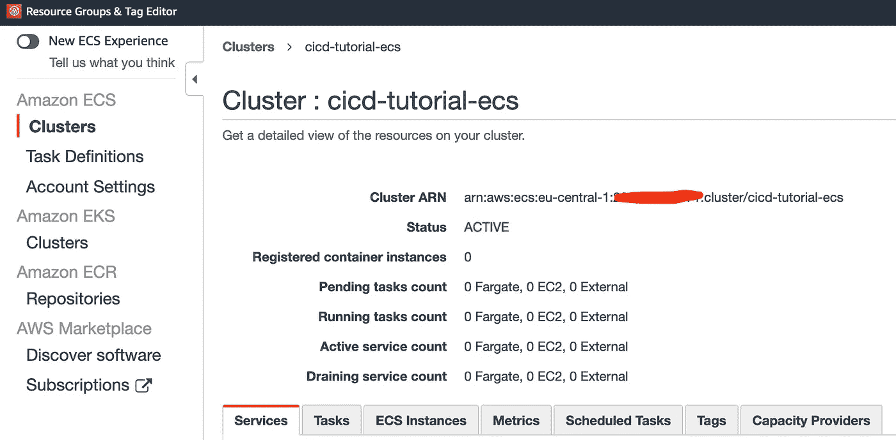
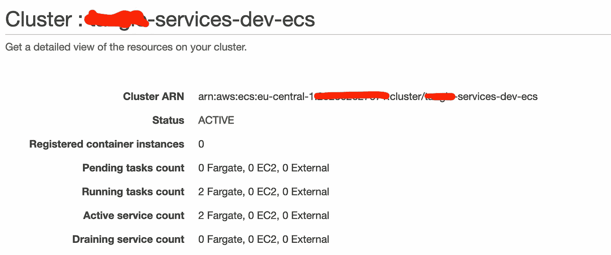
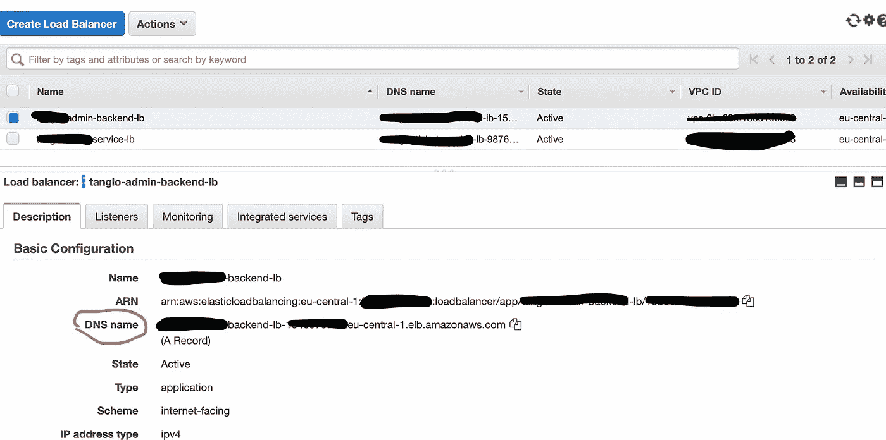

# 完全自动化的 NextJS 构建/部署(GitHub、AWS ECR、Fargate Service、ECS)——第 3/4 部分

> 原文：<https://levelup.gitconnected.com/fully-automated-nextjs-builds-deployments-github-aws-ecr-fargate-service-ecs-part-3-4-1b200b961502>

在最后一部分中，我们重点介绍了 GitHub 工作流以及 GitHub 和 AWS 之间使用 OIDC 的认证。我们现在已经准备好让我们的应用程序作为一个容器在 AWS 上运行。


图片来源:stock.adobe.com

# 教程的内容

[第一部分— Docker 图像/ ECR 平台部署&推送图像。](/fully-automated-nextjs-builds-deployments-github-aws-ecr-fargate-service-ecs-part-1-4-6216e58dcb89)

[第二部分——完全的 GitHub 集成& TF 后端 AWS/S3](/fully-automated-nextjs-builds-deployments-github-aws-ecr-fargate-service-ecs-part-2-4-36caa082676a)

**第三部分—自动气象站上的 Fargate 平台部署**

第四部分—优化和生产就绪

正如本教程的标题所揭示的，我们将使用 Terraform 进行自动化资源供应。

# 将（行星）地球化（以适合人类居住）

因此，现在是时候仔细研究一下 Terraform 和基础设施即代码(IAC)的概念了。在第一部分，我已经写了:

> Terraform 是一个“基础设施即代码”(简称 IAC)工具。IAC 允许您用代码定义、部署和更新基础设施。基本上，运行应用程序所需的一切都用代码表示。即服务器、数据库、网络、配置、日志、文档、测试、部署流程。IAC 是在云环境中运行现代应用程序的基础。

IAC 工具有几种类别。最著名的是配置管理工具，如 Chef、Puppet 和 Ansible。它们是为在现有服务器上安装和管理软件而设计的。另一种方法是服务器模板工具，如 Docker、Packer 和 vagger。这个想法是创建一个包含所有相关内容的服务器映像，包括操作系统、软件、工具等的快照。服务器模板是不可变基础设施的关键组成部分:虽然配置管理和服务器模板工具定义了在每台服务器上运行的代码，但 Terraform 等服务器配置工具负责创建服务器本身。但不仅仅是服务器，还有数据库、缓存、负载平衡器、监控、配置、防火墙设置、路由、证书以及基础设施的几乎所有其他方面。

在本教程的第一部分，我们已经使用 Terraform 在 AWS 上创建了一个弹性容器注册中心(ECR)。

此外，我们已经创建了一个 Docker 文件，将我们的应用程序放在 Docker 映像上。然后，我们将此图像推送到 ECR。

# 什么是法盖特？

简言之，Fargate 提供了在 AWS 上无服务器运行容器的能力。本质上，它将容器执行的任务从复杂基础设施的供应中分离出来。有了 Fargate，我们有效地处于容器级别，不需要设置或配置基础设施堆栈中的任何东西，比如虚拟机实例。这部分由 AWS 有效管理。尽管如此，还是需要一些基本的基础设施。

你可以在这里找到更多信息:[https://aws.amazon.com/fargate/](https://aws.amazon.com/fargate/)

# 我们开始吧

首先，我们需要在 Terraform 文件夹下新建一个文件夹“deployment”。这个文件夹将包含所有必要的 Terraform 脚本，我们将需要推出我们的应用程序作为一个 Fargate 服务。

```
$ cd terraform/
$ mkdir deployment
```

此外，我们还可以为后端配置创建另一个子文件夹。

```
$ cd deployment
$ mkdir config
```

然后是后端配置:

```
$ touch backend-config.tf
```

配置如下所示。占位符必须替换为现有的 S3 时段名称。DynamoDB 表也是如此。密钥可以自由分配，但必须是唯一的。

```
bucket                      = "<replace-with-your-s3-bucket"
key                         = "<replace-with-your-key.tfstate>"
region                      = "eu-central-1"
encrypt                     = true
dynamodb_table              = "<replace-with-your-table>"
```

这导致以下文件夹结构。

```
.
├── pages
│   └── api
├── public
├── styles
└── terraform
    └── registry
    └── deployment
```

此外，现在必须在/terraform/deployment 下创建另一个名为 provider.tf 的文件，它定义了 AWS Terraform 提供程序。这个文件的内容现在看起来像这样。

```
terraform {
  required_version = ">= 1.0.11"
  backend "s3" { /* See the backend config in config/backend-config.tf */ }

  required_providers {
		aws = {
			source  = "hashicorp/aws"
			version = "~> 3.68.0"
		}
		random = {
			source  = "hashicorp/random"
			version = "~> 3.1.0"
		}
  }
}

provider "aws" {
  region = var.aws_region

  default_tags {
    tags = {
      Application = var.service_name
      Terraform  = true
    }
  }
}
```

# ECS 集群

在第一步中，我建议创建集群。如果它已经存在，那么这一步是不必要的。在本例中，我假设 VPC 和子网已经存在。对 VPC 和子网资源的数据的访问可以使用数据资源来完成。为此，我们创建一个名为 data.tf 的文件，其内容如下:

```
data "aws_caller_identity" "current" {
}

data "aws_vpc" "main" {
  tags = {
	Name = <name of your vpc>
  }
}

data "aws_subnet_ids" "public" {
  vpc_id = data.aws_vpc.main.id
  tags = {
	Type = "public"
  }
}

data "aws_subnet_ids" "private" {
  vpc_id = data.aws_vpc.main.id
  tags = {
	Type = "private"
  }
}
```

现在可以在我们的资源中使用已经存在的 VPC。让我们通过创建 ECS 的例子来更深入地了解一下这一点。

我们创建另一个名为 ecs.tf 的文件，其内容如下。

```
resource "aws_ecs_cluster" "cluster" {
  name = "${var.service_name}-ecs"

  setting {
    name  = "containerInsights"
    value = "enabled"
  }

  configuration {
    execute_command_configuration {
      kms_key_id = aws_kms_key.current.arn
      logging    = "OVERRIDE"

      log_configuration {
        cloud_watch_encryption_enabled = true
        cloud_watch_log_group_name = aws_cloudwatch_log_group.current.name
      }
    }
  }
}

resource "aws_kms_key" "current" {
  description             = "${var.service_name}-ecs kms key"
  deletion_window_in_days = 7
}

resource "aws_cloudwatch_log_group" "current" {
  name = "${var.service_name}-ecs"
}
```

我们自动启用容器洞察，并为 ECS 集群创建一个 CloudWatch 日志组。

现在让我们创建以下两个文件来设置变量。

*variables.tf*

```
variable "service_name" {
  type        = string
  description = "the name of the service."
}
```

*vars.tfvars*

```
# General
service_name		= "cicd-tutorial"
aws_region              = "eu-central-1"
```

让我们首先手动运行这一部分，看看是否创建了集群。

```
$ terraform init -backend-config=config/backend-config.tf
$ terraform plan -var-file=vars.tfvars
```

使用命令“terraform plan ”,我们可以首先检查 terraform 想要做什么。

输出应该如下所示。

```
Terraform will perform the following actions:

  # aws_cloudwatch_log_group.current will be created
  + resource "aws_cloudwatch_log_group" "current" {
      + arn               = (known after apply)
      + id                = (known after apply)
      + name              = "cicd-tutorial-ecs"
      + retention_in_days = 0
      + tags_all          = {
          + "Application" = "cicd-tutorial"
          + "Terraform"   = "true"
        }
    }

  # aws_ecs_cluster.cluster will be created
  + resource "aws_ecs_cluster" "cluster" {
      + arn      = (known after apply)
      + id       = (known after apply)
      + name     = "cicd-tutorial-ecs"
      + tags_all = {
          + "Application" = "cicd-tutorial"
          + "Terraform"   = "true"
        }

      + configuration {
          + execute_command_configuration {
              + kms_key_id = (known after apply)
              + logging    = "OVERRIDE"

              + log_configuration {
                  + cloud_watch_encryption_enabled = true
                  + cloud_watch_log_group_name     = "cicd-tutorial-ecs"
                }
            }
        }

      + setting {
          + name  = "containerInsights"
          + value = "enabled"
        }
    }

  # aws_kms_key.current will be created
  + resource "aws_kms_key" "current" {
      + arn                                = (known after apply)
      + bypass_policy_lockout_safety_check = false
      + customer_master_key_spec           = "SYMMETRIC_DEFAULT"
      + deletion_window_in_days            = 7
      + description                        = "cicd-tutorial-ecs kms key"
      + enable_key_rotation                = false
      + id                                 = (known after apply)
      + is_enabled                         = true
      + key_id                             = (known after apply)
      + key_usage                          = "ENCRYPT_DECRYPT"
      + multi_region                       = (known after apply)
      + policy                             = (known after apply)
      + tags_all                           = {
          + "Application" = "cicd-tutorial"
          + "Terraform"   = "true"
        }
    }

Plan: 3 to add, 0 to change, 0 to destroy.
```

之后，我们可以调用命令‘terraform apply’在 AWS 上创建资源。

```
$ terraform apply -var-file=vars.tfvars
...Releasing state lock. This may take a few moments...

Apply complete! Resources: 3 added, 0 changed, 0 destroyed.
```

超级！奏效了。

新的 ECS 集群现在应该在 AWS 控制台中可见。



*基本上*，现在唯一缺少的就是我们的服务。我们记得，在前面的部分中，我们已经创建了一个容器，并将其作为 Docker 映像存储在 AWS ECR(容器注册表)中。我们已经在 GitHub 工作流程中完全自动化了这些步骤。

# Fargate 服务定义

我们的应用程序是一个需要通过互联网访问的 web 应用程序。因此，我们需要一个允许从外部访问的 SecurityGroup。我们稍后将对此进行定义。首先，我们负责创建必要的 Fargate 资源。

为此，我们需要一个名为“service.tf”的文件，其内容如下:

```
resource "aws_ecs_task_definition" "service_task_fargate" {
	network_mode = "awsvpc"
	family = var.service_name
	requires_compatibilities = ["FARGATE"]
	cpu = 256
	memory = 512
	execution_role_arn =aws_iam_role.ecs_task_execution_role.arn
  	task_role_arn = aws_iam_role.ecs_task_role.arn
	container_definitions = jsonencode([{
		name = var.service_name
		image = "${var.account_id}.dkr.ecr.eu-central-1.amazonaws.com/${var.service_name}-ecr:${var.image_tag}"
	  	logConfiguration = {
		  logDriver = "awslogs",
		  options   = {
			awslogs-group = "/aws/ecs/${var.service_name}"
			awslogs-region = "eu-central-1"
			awslogs-create-group  = "true"
			awslogs-stream-prefix = var.service_name
		  }
		}
		portMappings = [{
			protocol="tcp"
			containerPort=3000
			hostPort=3000
		}]}
	])
}

resource "aws_ecs_service" "ecs_service" {
  name = "${var.service_name}-service"
  cluster = aws_ecs_cluster.cluster.id
  task_definition = aws_ecs_task_definition.service_task_fargate.arn
  desired_count = 1
  launch_type = "FARGATE"

  network_configuration {
	subnets = data.aws_subnet_ids.private.ids
	assign_public_ip = false
	security_groups = [aws_security_group.ecs_tasks.id]
  }
}

resource "aws_security_group" "ecs_tasks" {
  name = "${var.service_name}-sg-ecs-tasks"
  vpc_id = data.aws_vpc.main.id
  ingress {
	  protocol="tcp"
	  from_port=3000
	  to_port=3000
	  cidr_blocks=["0.0.0.0/0"]
  }
  egress {
	  protocol="-1"
	  from_port=0
	  to_port=0
	  cidr_blocks=["0.0.0.0/0"]
  }
}
```

从 Terraform 脚本中可以看出，我们需要两个资源。一个是服务定义本身。这又引用了在同一个文件中定义的任务定义。其中，任务定义描述了使用哪个容器映像。

我还向任务添加了一个日志定义，它将日志写入 CloudWatch。如果不想这样，可以省略这一节。

对于 CloudWatch 日志记录，我们还需要资源和权限。这些看起来像下面这样。

```
resource "aws_cloudwatch_log_group" "containers" {
  name              = "/aws/ecs/${var.service_name}"
  retention_in_days = 7
  tags = {
	Terraform = "true"
	Name = "cloudwatch-group-${var.service_name}"
  }
}

data "aws_iam_policy_document" "cloudwatch_logs_policy" {
  statement {
	actions = [
	  "logs:CreateLogStream",
	  "logs:CreateLogGroup",
	  "logs:DescribeLogStreams",
	  "logs:PutLogEvents"
	]

	resources = [
	  "${aws_cloudwatch_log_group.containers.arn}:*"
	]
  }
}

resource "aws_iam_policy" "cloudwatch_logs_policy" {
  path   = "/ecs/task-role/"
  policy = data.aws_iam_policy_document.cloudwatch_logs_policy.json
}

resource "aws_iam_role_policy_attachment" "cloudwatch_logs_policy" {
  role       = aws_iam_role.ecs_task_role.name
  policy_arn = aws_iam_policy.cloudwatch_logs_policy.arn
}
```

在资源“aws_ecs_service”中也有网络配置。这里定义了 Fargate 容器放置在哪个子网中。

在任务定义中，我们还可以看到两个属性 execution_role_arn 和 task_role_arn，这意味着需要一个具有 Fargate 服务任务执行权限的 IAM 角色。

我们创建一个名为“iam.tf”的文件，并定义这个角色。

```
resource "aws_iam_role" "ecs_task_execution_role" {
  name = "${var.service_name}-ecs-task-execution-role"
  assume_role_policy = jsonencode({
	Version = "2012-10-17"
	Statement = [
	  {
		Action = "sts:AssumeRole",
		Effect = "Allow",
		Sid = "",
		Principal = {
		  Service = "ecs-tasks.amazonaws.com"
		}
	  }]
  })
}

resource "aws_iam_role" "ecs_task_role" {
  name = "${var.service_name}-ecsTaskRole"

  assume_role_policy = <<EOF
{
 "Version": "2012-10-17",
 "Statement": [
   {
     "Action": "sts:AssumeRole",
     "Principal": {
       "Service": "ecs-tasks.amazonaws.com"
     },
     "Effect": "Allow",
     "Sid": ""
   }
 ]
}
EOF
}

resource "aws_iam_role_policy_attachment" "ecs-task-execution-role-policy-attachment" {
  role       = aws_iam_role.ecs_task_execution_role.name
  policy_arn = "arn:aws:iam::aws:policy/service-role/AmazonECSTaskExecutionRolePolicy"
}
```

让我们再看一下 variables.tf 文件。现在看起来应该如下所示:

```
# Common Variables
variable "aws_region" {
  type        = string
}

variable "image_tag" {
  type 			= string
  description 	= "Given image tag for the current deployment."
}

variable "vpc_name" {
  type 	= string
  description = "Name of the containing VPC. Required."
}

variable "public_subnets" {
  type    = list(string)
  default = []
}

variable "account_id" {
  type = string
  description = "ID of the AWS account"
}

variable "service_name" {
  type        = string
  description = "the name of the service."
}

variable "image_tag" {
  type        = string
}
```

变量的值在 vars.tfvars 文件中定义如下:

```
# General
service_name		= "name-of-your-service"
aws_region              = "eu-central-1"
account_id 		= "id-of-your-account"
image_tag               = var.image_tag
# VPC
vpc_name                = "your-vpc-name"
```

在这个例子中，图像标签被设置为初始固定。在本教程的最后一集，我们生成了 IMAGE_TAG，如下所示:

```
export IMAGE_TAG=$(git rev-parse --short HEAD)
```

稍后，我们将确保从 GitHub 工作流中动态地提取这一点，以确保容器在每次部署时都被替换。目前，我们手动设置标签应该足够了。

是时候部署容器了。

```
$ terraform apply -var-file=vars.tfvars
Apply complete! Resources: 7 added, 0 changed, 0 destroyed.
```

太好了！成功了。我们的 Fargate 服务在 ECS 上运行。



根据我们的配置，我们将服务放在私有子网中。因此，它只能在这个网络上访问。例如，如果它是一个内部服务，只是为其他服务提供端点或者像 SQS 一样与内部资源通信，我们就完成了。但是这个教程是关于把一个带 UI 的 NextJS 应用放到互联网上。因此，我们仍然缺少一个指向互联网并提供公共访问的组件。为此，我们需要一个应用程序负载平衡器。我们现在将在 TargetGroup 的帮助下将它连接到 Fargate，以便从外部访问。

为此，我们仍然需要以下地形资源。

让我们首先将以下部分添加到 securitygroups.tf 中。

```
resource "aws_security_group" "alb" {
  name = "${var.service_name}-sg-alb"
  vpc_id = data.aws_vpc.main.id
  ingress {
	  protocol="tcp"
	  from_port=80
	  to_port=80
	  cidr_blocks=["0.0.0.0/0"]
  }
  egress {
	  protocol="-1"
	  from_port=0
	  to_port=0
	  cidr_blocks=["0.0.0.0/0"]
  }
}
```

因此，我们允许通过 HTTP 访问负载平衡器。在教程的下一部分，我们将配置 HTTPS。

接下来，我们需要一个名为 lb.tf 的文件，它包含所有需要的应用程序负载平衡器资源。

```
module "lb_security_group_public" {
  source  = "terraform-aws-modules/security-group/aws"
  version = "~> 4.8.0"

  // the fargate ENI will use this security group
  // it also needs access to the ALB to allow traffic
  name            = "fargate-allow-alb-traffic"
  use_name_prefix = false
  description     = "Security group for example usage with ALB"
  vpc_id          = data.aws_vpc.main.id

  ingress_cidr_blocks      = ["0.0.0.0/0"]
  ingress_ipv6_cidr_blocks = ["::/0"]
  ingress_rules            = ["http-80-tcp"]
  egress_rules             = ["all-all"]

  tags                 = {
    Terraform 	=  true
  }
}

resource "aws_lb" "current" {
  name               = "${var.service_name}-lb"
  load_balancer_type = "application"
  security_groups    = [ aws_security_group.alb.id ]
  subnets            = data.aws_subnet_ids.public.ids
  enable_deletion_protection = false
}

resource "aws_alb_listener" "http" {
  load_balancer_arn = aws_lb.current.id
  port              = 80
  protocol          = "HTTP"

  default_action {
    target_group_arn = aws_alb_target_group.target_group.id
    type             = "forward"
  }
}

resource "aws_alb_target_group" "target_group" {
  name = "${var.service_name}-tg"
  port = 80
  protocol = "HTTP"
  vpc_id = data.aws_vpc.main.id
  target_type = "ip"
  health_check {
    healthy_threshold   = "3"
    interval            = "30"
    protocol            = "HTTP"
    matcher             = "200"
    timeout             = "3"
    path                = "/"
    unhealthy_threshold = "2"
  }
}
```

好了，我们现在可以再次运行 Terraform。因此，我们的应用运行在 Fargate 上，可以通过互联网上的负载平衡器访问。

为此，我们可以在 AWS 控制台中将 DNS 名称复制并粘贴到浏览器中。



当然，这离生产就绪还差得很远。在下一个也是最后一个部分，我们将处理这个问题，并添加一个 SSL 证书。

完整的代码一如既往地可以在 [GitHub](https://github.com/codewithrico/cicd-tutorial-part-3) 上找到。

*编码快乐！*