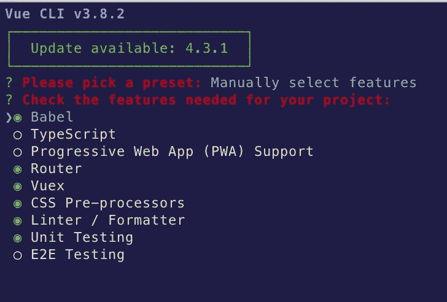
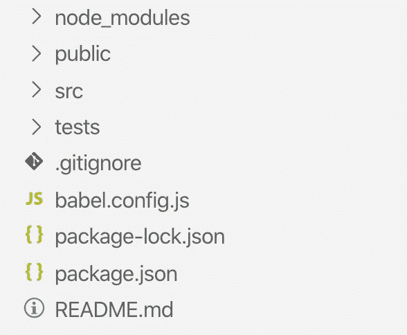
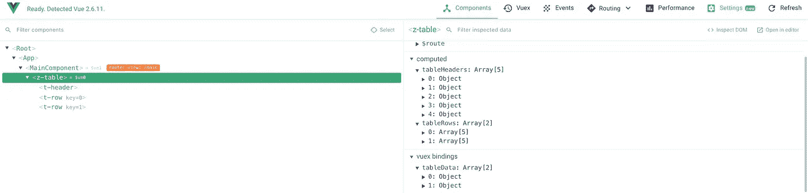
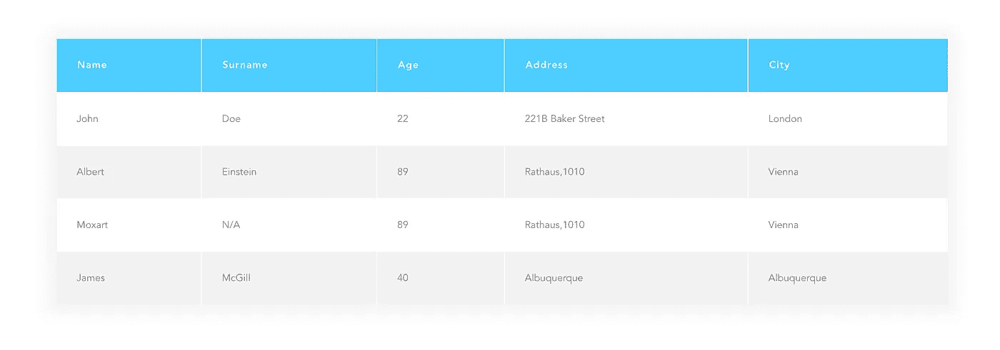

# Vue 的全动态数据表组件。射流研究…

> 原文：<https://levelup.gitconnected.com/fully-dynamic-data-table-component-for-vue-js-c72cdb6cff92>

# 介绍

下面这篇文章是为入门级前端开发人员准备的，他们已经对反应式/渐进式 javascript 框架和 SPA 开发有所了解。您将能够看到一个完全动态的数据表是如何创建的，并且在这个过程中熟悉 VueJS 的语法、数据流和组件。

如果你不太熟悉水疗发展的概念，不用担心！您可以通过查看令人惊叹的 Vue 框架[文档](https://vuejs.org/v2/guide/)快速了解这些概念。

# 入门指南

我们需要做的第一件事是使用 Vue CLI 建立一个 VueJS 项目。在整个项目中，我们将依赖 NPM 包，所以请确保在您的机器中全局设置 NodeJS。为了通过 CLI 创建您的应用程序，您首先需要通过您的终端进行全局安装:

```
**npm install -g @vue/cli**
```

现在我们已经有了 Vue CLI，您可以使用下面的命令在我们想要的任何目录下创建项目:

```
**vue create your-project-name**
```

执行上述命令后，Vue CLI 将为您提供项目的预定义配置选项，然后手动选择它们，这样您就可以亲眼看到它所提供的功能:



图 1.1 — Vue CLI 功能依赖关系

还将有后续选项配置(即 CSS 处理器，如 node-sass)以及这些配置文件在应用程序中的结构，我选择了 node-sass 进行 CSS 预处理，Jest 进行测试，package.json 文件作为主配置文件。

创建项目后，我们只需移动到新创建的文件夹，使用***NPM run serve****，您会发现您新出炉的 Vue 应用程序正在被提供@ **localhost:8080** 。*

# ***了解项目文件结构***

**

*图 1.2 —项目结构*

*所以你的项目结构应该是这样的，突出强调 ***src*** 目录，我们的源代码将在这个目录中开发和维护。Node_modules 拥有关于我们的开发甚至产品依赖(第三方库)的黑盒魔法，或者稍后将被捆绑到 javascript 文件的大块中。*

*Vue 路由器配置*

*正如您在左侧代码片段中看到的，您将从 Vue CLI 项目设置中找到预定义的路由，因此基本上您在这里有几个选项，要么创建一个具有不同路径和组件的新路由，要么修改第一个路由的组件，要么继续处理现有的 Home 组件。我将继续创建一个新视图( **Main.vue** )，它将保存主数据表组件，并将替换指向我的新视图的 home 路径。*

# *从主要组件开始*

*接下来，我们要做的是保持一种健康和建设性的基于组件的思维模式。目前我们知道的是，我们将构建一个动态表。因此，从命名本身，我们知道必须有一个包装组件，即 ***Table.vue*** 。任何表格的组成部分都是它的表头和行，所以这些部分/组件应该单独定义和实现: ***TableRow.vue* ，TableHeader.vue** 。*

*尽管这不是一个大项目，但最好的做法是知道将应用程序的组成部分放在哪里，这样组件将放在 *src 下——组件*目录和视图将成为它自己的文件夹的一部分。*

*为了您的方便，分享要点/片段*

*在上面的代码片段中，您会发现我们组件的主干以及我们在这里所做的事情，父表组件及其各自的标题和行子组件。从要点的第 25 行可以看出，我已经在组件的 data 属性中创建了一个数组，它显然是伪数据，所以我们可以继续在我们的 *Main.vue* 视图中显示一个表。*

> *更简单地说，你可以把**数据**看作是变量/对象/数组的来源，它们是组件的一部分，可以在整个组件中使用。*

*当然，这个组件不可或缺的一部分是某种数据，理想情况下，您会从后端服务中获取这些数据，然后从您自己的由 Vuex 提供支持的应用状态中检索这些数据……这就是为什么我将 table headers()和 table rows()作为计算属性写下来，这些属性将直接从我们集中的 Vuex 存储中的一个状态属性中派生出来。这些计算属性的值作为 ***属性*** 传递给子表组件，并在这些组件中被期望和处理如下:*

```
*<template>
 <div>
   {{propName}}
 </div>
</template>...
props['propName']
...*
```

*该组件的所有动态部分背后的主要思想是想出一种方法来获得每个对象的正确数量的键和相应的值，这就是为什么上面提到的计算属性中的两个操作都很方便。通过回调机制， **map** 迭代每个对象并返回一个新数组，这取决于我们如何根据自己的需要来管理自己的对象。在这里，我主要依赖于获取键及其索引，以及获取与每个特定行的键成对的值。*

# *一瞥真空状态操作*

*在当今的 SPA 中，您很少会发现不通过 HTTP 与第三方服务进行通信的 SPA，但通常它们都有某种状态管理，因此，无论何时开发此类应用程序，最好将通信和状态更改活动/事件分开。VueJS 提供了*动作*和*突变*，在一个高层次的概念上，你可以认为它们都是涉及状态变化的操作。*

> *根据它的官方文档，Vuex 告诉我们，改变我们的应用程序状态的唯一方法是**向状态的特定部分提交**突变，动作与突变的不同之处在于，前者只是启动/提交突变，并不直接改变状态，由于它们提供异步操作的兼容性，最佳实践是第三方 API/后端服务调用由动作启动，无论结果如何，都将通过提交的突变反映到应用程序状态。*

*商店管理骨干*

*在上面的要点中，你会看到我已经通过添加突变、动作和一个新的状态属性 *tableData* 修改了我们的 created-by-vuecli 存储，正如你正确回忆的那样，它是我们的 Table 组件中的*数据属性*。您可以在主 *index.js* 文件中“内联”定义您自己的动作和突变，但通常这不是首选，因为一旦代码库扩展并且新功能即将出现，在它们单独的文件中拥有单独的动作、突变甚至公共实用函数对于进一步的代码可维护性将是一个很大的优势。*

**

*图 1.3 组件—商店反射*

*我还添加了一个已知的 VueJS 组件生命周期挂钩(在众多挂钩中)，如其名称所示，在组件被挂载和呈现之前，它会启动一个操作，为我们的表组件检索所需的表数据，正如您在上面的图片中所看到的(与 VueJS 开发工具一起)，计算的属性通过反映中央状态属性*表数据*的主 vuex 绑定来填充。*

# *一些最后的润色*

*在继续之前，如果您没有可以从中检索数据的第三方 API 或后端服务，您可以继续检查 [FakerJS](https://github.com/marak/Faker.js/) ，并在 Vuex Store 上的*操作*中使用其方法，您可以使用您喜欢的任何键生成任意数量的对象。接下来，您可以查看我用来得出最终结果的 CSS 属性和实践，您可以查看本文中的图 1.4。*

*项目的最终 CSS*

# *开始*

*在这篇文章结束时，如果你已经遵循了要点，你应该会有一个如下的表格。显然，这是一个简单的组成部分，而不是火箭科学，但这是一个有趣的任务。本文是这个项目的第一部分，下一部分将集中在部署和使这个表组件作为一个 NPM 包可访问，这样任何人都可以通过将其作为一个依赖项安装并作为一个组件集成到他们的应用程序中来使用它。与此同时，我打算实现一个全功能表所具有的所有特性，即过滤、排序、修改等等，所以可以放心地继续使用 Github repo @ [ZippyTable](https://github.com/ardianche/zippytable) 。*

*感谢您花时间阅读本文，期待您在评论中的反馈！*

**

*图 1.4 —最终产品*