# 用于机器学习预测的完全解释的 PolyFit 方法

> 原文：<https://levelup.gitconnected.com/fully-explained-polyfit-method-for-machine-learning-predictions-348aaa5f5158>

## 线性回归拟合方法，多项式回归建模

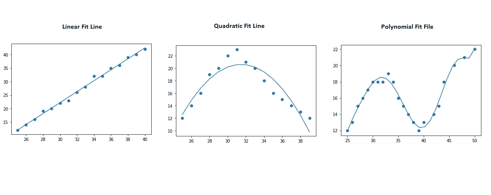

作者图片

曲线拟合方法用于在输入数据上拟合一条线，以找到输入和输出数据之间的关系。

拟合直线法用于数据之间的线性关系。但是除了直线之外，原始曲线可以是任何形状的二次曲线或多项式曲线。

我们将使用两种方法来实现最佳拟合线的目标。这两种方法是 poly1D 和 polyfit。这两种方法都可以在 numpy python 库的帮助下使用。

```
import numpy as np
import scipy.stats as stats
import matplotlib.pyplot as plt
```

## 线性回归— 1 度

我们可以为线性回归创建输入和输出。

```
#input and outputTemperature = [25,26, 27, 28,29,30,31,32,33,34,35,36,37,38, 39, 40]
Sales = [12,14,16,19,20, 22, 23, 26, 28, 32, 32, 35, 36, 39, 40,42]
```

Matplotlib 用于可视化数据

```
#create scatterplot
plt.scatter(Temperature, Sales)
```

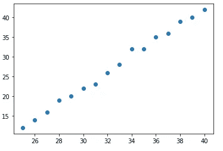

作者图片

这里是我们制作最佳拟合线的方法。在这个方法中，我们传递了三个参数，即输入、输出和度数。对于线性回归，我们使用一个拟合度。我们还可以借助 linspace 方法来管理 x 轴范围的限制。

```
#polynomial fit with degree = 1model = np.poly1d(np.polyfit(Temperature, Sales, 1))#add fitted polynomial line to scatterplotpolyline = np.linspace(25, 40, 16)
plt.scatter(Temperature, Sales)
plt.plot(polyline, model(polyline))
plt.show()
```

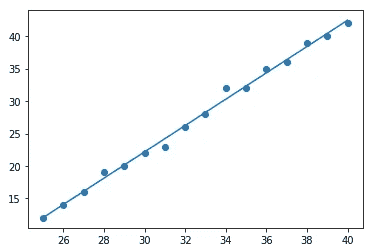

作者图片

下面的等式代表最佳拟合线，而“x”是预测输出的输入变量。

```
print(model)#output
2.026 x - 38.61
```

为了得到方程的系数，我们可以迭代模型索引，如下所示。

```
print("The coefficient is: ", model[0])
print("The X1 coefficient is: ", model[1])#Output:
The coefficient is:  -38.61029411764703
The X1 coefficient is:  2.0264705882352936yhat = model(Temperature)
yhat#output:
array([12.05147059, 14.07794118, 16.10441176, 18.13088235,
       20.15735294, 22.18382353, 24.21029412, 26.23676471,
       28.26323529, 30.28970588, 32.31617647, 34.34264706,
       36.36911765, 38.39558824, 40.42205882, 42.44852941])
```

为了找到 R 的平方值

```
ybar = np.sum(Sales)/len(Sales)
ssreg = np.sum((yhat-ybar)**2)
sstot = np.sum((Sales - ybar)**2)
r_squared_result = ssreg / sstot
print(r_squared_result)#output:
0.9951804955767048
```

## 二次曲线拟合-2 度

以下数据为二次数据。该数据绘制了一条曲线，表明白天的温度缓慢上升，然后达到峰值，并随着夜晚温度的接近而下降。

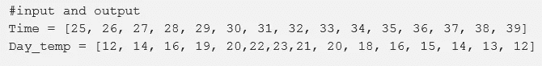

下面，我们正在检查 1 度的拟合线，但它给出了高误差和低精度。

```
#polynomial fit with degree = 1model = np.poly1d(np.polyfit(Time, Day_temp, 1))#add fitted polynomial line to scatterplotpolyline = np.linspace(25, 40, 16)
plt.scatter(Time, Day_temp)
plt.plot(polyline, model(polyline))
plt.show()
```

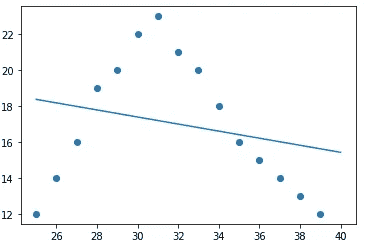

作者图片

现在，检查一个次数为 2 的多项式，它试图遵循与输出相同的路径。

```
#polynomial fit with degree = 2model = np.poly1d(np.polyfit(Time, Day_temp, 2))#add fitted polynomial line to a scatterplotpolyline = np.linspace(25, 39, 15)
plt.scatter(Time, Day_temp)
plt.plot(polyline, model(polyline))
plt.show()
```

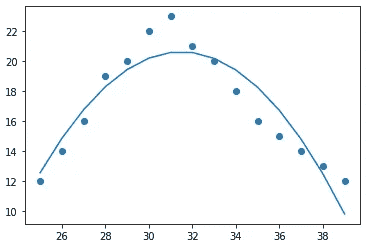

作者图片

```
print(model)#output:
-0.1917 x^2 + 12.08 x - 169.5yhat = model(Time)
ybar = np.sum(Day_temp)/len(Day_temp)
ssreg = np.sum((yhat-ybar)**2)
sstot = np.sum((Day_temp - ybar)**2)
r_squared_result = ssreg / sstotprint(r_squared_result)#output:
0.8551134623890106
```

[](https://amitprius.medium.com/numpy-vectorization-for-faster-operations-with-python-98b9f4469374) [## 使用 Python 实现更快操作的 Numpy 矢量化

### 正则码和 Numpy 码的一个小比较

amitprius.medium.com](https://amitprius.medium.com/numpy-vectorization-for-faster-operations-with-python-98b9f4469374) 

## 多项式回归-多阶

以下数据是多项式曲线数据。该数据形成一条类似正弦曲线周期的曲线。

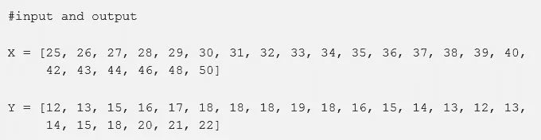

```
#create scatterplot
plt.scatter(X, Y)
```

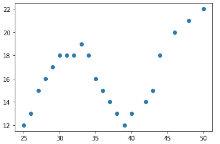

作者图片

在这种方法中，我们将尝试获得三种不同阶数(即 3、5 和 8)的最佳多边形拟合曲线。

```
#polynomial fit with degree = 3model = np.poly1d(np.polyfit(X, Y, 3))#add fitted polynomial line to a scatterplotpolyline = np.linspace(25, 50, 24)
plt.scatter(X, Y)
plt.plot(polyline, model(polyline))
plt.show()
```

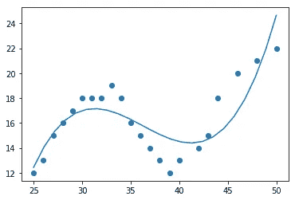

作者图片

```
print(model)#output:
0.005623 x^3 - 0.6116 x^2 + 21.76 x - 237.1yhat = model(X)
ybar = np.sum(Y)/len(Y)
ssreg = np.sum((yhat-ybar)**2)
sstot = np.sum((Y - ybar)**2)
r_squared_result = ssreg / sstotprint(r_squared_result)#output:
0.6989183067653258
```

对于 5 度

```
#polynomial fit with degree = 5model = np.poly1d(np.polyfit(X, Y, 5))#add fitted polynomial line to a scatterplotpolyline = np.linspace(25, 50, 24)
plt.scatter(X, Y)
plt.plot(polyline, model(polyline))
plt.show()
```

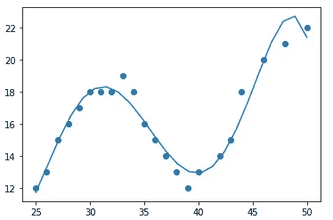

作者图片

```
print(model)#output:
-6.205e-05 x^5 + 0.01106 x^4 - 0.7701 x^3 + 26.11 x^2 - 430.4 x + 2770yhat = model(X)
ybar = np.sum(Y)/len(Y)
ssreg = np.sum((yhat-ybar)**2)
sstot = np.sum((Y - ybar)**2)
r_squared_result = ssreg / sstotprint(r_squared_result)#output:
0.9450295642254262
```

对于 8 度

```
#polynomial fit with degree = 8model = np.poly1d(np.polyfit(X, Y, 8))#add fitted polynomial line to a scatterplotpolyline = np.linspace(25, 50, 24)
plt.scatter(X, Y)
plt.plot(polyline, model(polyline))
plt.show()
```

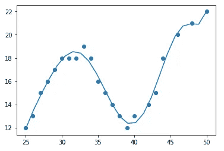

作者图片

```
print(model)#output:
1.163e-08 x^8 - 2.733e-06 x^7 + 0.0002612 x^6 - 0.01265 x^5 + 0.2965 x^4 - 1.113 x^3 - 101.3 x^2 + 2130 x - 1.368e+04yhat = model(X)
ybar = np.sum(Y)/len(Y)
ssreg = np.sum((yhat-ybar)**2)
sstot = np.sum((Y - ybar)**2)
r_squared_result = ssreg / sstotprint(r_squared_result)#output:
0.9815279779013093
```

在上述三个曲线拟合图的比较中，最高次曲线比其他曲线更拟合。

我希望你喜欢这篇文章。通过我的 [LinkedIn](https://www.linkedin.com/in/data-scientist-95040a1ab/) 和 [twitter](https://twitter.com/amitprius) 联系我。

# 推荐文章

1.  [Python 最有用的 15 种 NumPy 方法](https://pub.towardsai.net/15-most-usable-numpy-methods-with-python-4d20eb93e149?sk=911d2bebf042b148be8f366b907af158)
    2。 [NumPy:图像上的线性代数](https://pub.towardsai.net/numpy-linear-algebra-on-images-ed3180978cdb?source=friends_link&sk=d9afa4a1206971f9b1f64862f6291ac0)3。[Python 中的异常处理概念](https://pub.towardsai.net/exception-handling-concepts-in-python-4d5116decac3?source=friends_link&sk=a0ed49d9fdeaa67925eac34ecb55ea30)
    4。[熊猫:处理分类数据](https://pub.towardsai.net/pandas-dealing-with-categorical-data-7547305582ff?source=friends_link&sk=11c6809f6623dd4f6dd74d43727297cf)
    5。[超参数:机器学习中的 RandomSeachCV 和 GridSearchCV](https://pub.towardsai.net/hyper-parameters-randomseachcv-and-gridsearchcv-in-machine-learning-b7d091cf56f4?source=friends_link&sk=cab337083fb09601114a6e466ec59689)
    6。[用 Python](https://medium.com/towards-artificial-intelligence/fully-explained-linear-regression-with-python-fe2b313f32f3?source=friends_link&sk=53c91a2a51347ec2d93f8222c0e06402)
    7 全面讲解了线性回归。[用 Python](https://medium.com/towards-artificial-intelligence/fully-explained-logistic-regression-with-python-f4a16413ddcd?source=friends_link&sk=528181f15a44e48ea38fdd9579241a78)
    充分解释了 Logistic 回归 8。[数据分发使用 Numpy 与 Python](https://pub.towardsai.net/data-distribution-using-numpy-with-python-3b64aae6f9d6?source=friends_link&sk=809e75802cbd25ddceb5f0f6496c9803)
    9。 [40 种 Python 中最疯狂可用的方法](https://medium.com/pythoneers/40-most-insanely-usable-methods-in-python-a983c78f5bfd?sk=07df9058ea3e8c2fce4318a73cd8fce9)
    10。[Python 中最常用的 20 种熊猫快捷方式](https://medium.com/pythoneers/20-most-usable-pandas-shortcut-methods-in-python-c9bc065ce11e?sk=1faf673d0cdfb46234975cbdeed12beb)

# 分级编码

感谢您成为我们社区的一员！在你离开之前:

*   👏为故事鼓掌，跟着作者走👉
*   📰查看[升级编码出版物](https://levelup.gitconnected.com/?utm_source=pub&utm_medium=post)中的更多内容
*   🔔关注我们:[Twitter](https://twitter.com/gitconnected)|[LinkedIn](https://www.linkedin.com/company/gitconnected)|[时事通讯](https://newsletter.levelup.dev)

🚀👉 [**将像你这样的开发人员安置在顶级创业公司和科技公司**](https://jobs.levelup.dev/talent/welcome?referral=true)