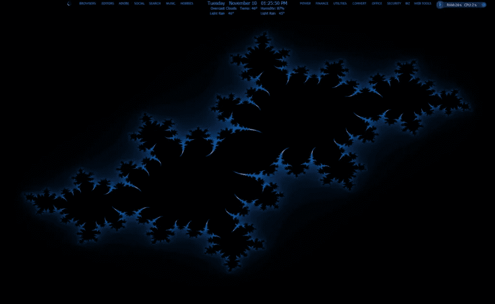
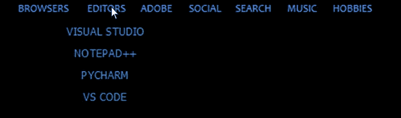

# 有趣的应用程序菜单

> 原文：<https://levelup.gitconnected.com/fun-with-application-menus-f49bf81ace84>



图片由 ZennDogg 提供

我对 Python 的使用主要是根据我的喜好修改我的电脑。以上是我电脑上的主屏幕截图。顶部有两个菜单栏和一个[时钟/天气](https://wordpress.com/post/braveinternetmarketing.com::python/153)显示屏。

菜单项是带有下拉菜单的常规类别，用于选择特定的应用程序。例如，当单击编辑器时，会显示以下下拉列表。



图片由 ZennDogg 提供

本文主要关注下拉菜单应用程序的代码。完整的代码可以在最后找到。像往常一样，我将使用 PyQt5 作为我选择的 GUI 包。Python 版本是 3.8。我们将从导入语句开始。

```
import sys, os, time, webbrowser
from PyQt5.QtCore import pyqtSignal, QObject, QThread, QTimer
from PyQt5.QtGui import QFont
from PyQt5.QtWidgets import QApplication, QPushButton, QMainWindow
from qtpy_cfg import qblack, qbutton_dim, qtbutton
```

*qtpy_cfg* 是我为经常使用的过程编写的 PyQt5 函数的 mixin 文件。后面会解释这三个函数。

接下来，我们编写可能是有史以来最短的 python 类。

```
class Communicate*(*QObject*)*:
    closeApp = pyqtSignal*()*
```

如您所见，这个类使用 *pyqtSignal()* 向 PyQt5 发送一个关闭应用程序的信号。一旦做出选择，我们就调用它来关闭下拉菜单。

下一个类是线程类。每个菜单选项都在自己的线程中运行。

```
class CloneThread*(*QThread*)*:

    def __init__*(*self*)*:
        QThread.__init__*(*self*)* self.filename = ''

    def run*(*self*)*:
        if 'http' not in self.filename:
            os.system*(*self.filename*)* else:
            webbrowser.open*(*self.filename*)*
```

我在我所有的 GUI 应用程序中使用这个通用类。每个菜单项要么是一个网络应用程序，要么是一个独立的软件程序，所以这个会被大量使用。

最后一个类是 GUI 类。每个下拉菜单都有不同的自定义大小(注意:尽管 QtDesigner 更简单，但它也更通用。我对项目的每个方面都进行了硬编码。必须是我)。

```
class Editors*(*QMainWindow*)*:

    def __init__*(*self*)*:
        super*()*.__init__*()* self.left   = 415
        self.top    = 23
        self.width  = 95
        self.height = 105
        self.comm   = Communicate*()* self.comm.closeApp.connect*(* self.close *)* self.my_thread = CloneThread*()* qblack*(*self*)* qdim   = qbutton_dim*(*self*)* canda_9= QFont*(*'Candalara', 9*)*
```

确定应用的大小和位置后， *self.comm* 初始化 *Communicate* 类，下面一行代码将信号分配给 *close* ()。在我们进行这个项目时，您可能会注意到我们没有一个名为 *close()* 的函数。那是因为 *close* ()是 PyQt5 的内部函数。

接下来， *CloneThread()* 被初始化。

下面两个图像解释了从我的助手文件导入的文件。 *qblack()* 是一个格式化 GUI 窗口的函数，它是全黑的，没有标题栏或正常显示窗口的任何其他部分。它的代码如下。

```
def qblack*(*self*)*:
    self.setWindowFlags*(*Qt.FramelessWindowHint*)* self.setGeometry*(*self.left,self.top,self.width,self.height*)* self.setAutoFillBackground*(*True*)* p = self.palette*()* p.setColor*(*self.backgroundRole*()*, Qt.black*)* self.setPalette*(*p*)*
```

我们的下一行代码初始化 *qbutton_dim()* 。该函数形成菜单项显示(按钮)的背景色和前景色。

```
def qbutton_dim*(*self*)*:
    return "QPushButton {color: rgba(54, 136, 200, 250); background-color: black; }"
```

回到主代码，我们接下来分配我们想要使用的字体，字体大小为 9 的 Candalara。

代码的下一部分定义了下拉菜单中的四个菜单项。

```
qtbutton*(*self, 'v_studio_code',  0, 80, 95, 20, qdim, canda_9, 'VS CODE', self.vscode*)* qtbutton*(*self, 'v_studio', 0, 5, 95, 20, qdim, canda_9, 'VISUAL STUDIO', self.vsstudio*)* qtbutton*(*self, 'notepad++', 0, 30, 95, 20, qdim, canda_9, 'NOTEPAD++', self.notep*)* qtbutton*(*self, 'pycharm', 0, 55, 95, 20, qdim, canda_9, 'PYCHARM', self.pycharm*)*
```

qtbutton() 在一行代码中定义了每个菜单项的名称、大小、样式、字体、显示名称以及与执行所需操作的函数的连接。

下图是 PyQt5 中按钮的代码(减去第一行)。有六行那么长！我做了很多按钮，这让我把这个过程编成了代码。

```
def qtbutton*(*self, name, x, y, w, h, style, font, title, connection*)*:
    self.name = QPushButton*(*self*)* self.name.setStyleSheet*(*style*)* self.name.setFont*(*font*)* self.name.setText*(*title*)* self.name.setGeometry*(*x, y, w, h*)* self.name.clicked.connect*(*connection*)*
```

接下来，我们需要一个计时器来自动关闭菜单应用程序，如果没有选择。

```
self.timer1 = QTimer*(*self*)* self.timer1.timeout.connect*(*self.close_menu*)* self.close_menu*()*
```

现在是时候定义一些函数了。这四个功能可以在我的每一个菜单应用程序中找到，主要用于清理和一致操作所有下拉菜单。

```
def mousePressEvent*(*self*)*:
    self.comm.closeApp.emit*()* def close_menu*(*self*)*:
    self.timer1.start*(*6500*)* self.mousePressEvent*()* def wrap_up*(*self, num*)*:
    time.sleep*(* num *)* self.mousePressEvent*()* self.close_menu*()* def threads*(*self, filename*)*:
    self.my_thread.filename = filename
    self.my_thread.start*()*
```

*mousePressEvent()* 是 PyQt5 的内部函数。在菜单显示的任意位置点击鼠标左键，发出 *closeApp()* 信号。

*close_menu()* 启动运行 6.5 秒的定时器，之后 *mousePressEvent()* 被调用，菜单关闭。

*wrap_up()* 包装菜单的操作。使用 *num* 变量的原因是为了让程序有足够的时间在下两行代码之前执行菜单项调用。我发现我必须加入 0.6 秒的时间延迟才能让网络呼叫工作。0.1 或 0.2 秒适用于软件调用。*如果进行了选择，则调用 mousePressEvent()* 关闭菜单。如果没有进行选择， *close_menu()* 在 6.5 秒后关闭。最后，我们定义了 *threads()* 函数。

接下来是下拉菜单中四个菜单项的功能。

```
def vsstudio*(*self*)*:
    self.threads*(*r'start /min C:\"Program Files (x86)"\"Microsoft Visual Studio"\2019\Community\Common7\IDE\devenv.exe'*)* self.wrap_up*(*.2*)* def vscode*(*self*)*:
    self.threads*(*r'start /min C:\Users\mount\AppData\Local\Programs\"Microsoft VS Code"\bin\code.cmd'*)* self.wrap_up*(*.2*)* def pycharm*(*self*)*:
    self.threads*(*r'start /min C:\"Program Files"\JetBrains\"PyCharm Community Edition 2020.1.1"\bin\pycharm64.exe'*)* self.wrap_up*(*.2*)* def notep*(*self*)*:
    self.threads*(* r'start /min start C:\ProgramData\Microsoft\Windows\"Start Menu"\Programs\Notepad++.lnk'*)* self.wrap_up*(*.2*)*
```

只需要两行代码。我们调用选定的程序，然后结束它。

现在是我们代码的最后一部分。

```
if __name__ == '__main__':
    app = QApplication*([])* ex  = Editors*()* ex.show*()* sys.exit*(*app.exec_*())*
```

就是这样。每个下拉菜单都使用相同的 basic 程序。

如果你喜欢阅读这样的故事，并想支持我成为一名作家，可以考虑每月 5 美元订阅 Medium。作为会员，你可以无限制地访问媒体上的故事。如果你用我的[链接](https://zenndogg-52643-medium.com/membership)注册，我会赚一小笔佣金。

完整代码如下:

```
import sys, os, time, webbrowser
from PyQt5.QtCore import pyqtSignal, QObject, QThread, QTimer
from PyQt5.QtGui import QFont
from PyQt5.QtWidgets import QApplication, QPushButton, QMainWindow
from qtpy_cfg import qblack, qbutton_dim, qtbutton

class Communicate*(*QObject*)*:
    closeApp = pyqtSignal*()* class CloneThread*(*QThread*)*:

    def __init__*(*self*)*:
        QThread.__init__*(*self*)* self.filename = ''

    def run*(*self*)*:
        if 'http' not in self.filename:
            os.system*(*self.filename*)* else:
            webbrowser.open*(*self.filename*)* class Editors*(*QMainWindow*)*:

    def __init__*(*self*)*:
        super*()*.__init__*()* self.left   = 415
        self.top    = 23
        self.width  = 95
        self.height = 105
        self.comm   = Communicate*()* self.comm.closeApp.connect*(* self.close *)* self.my_thread = CloneThread*()* qblack*(*self*)* qdim   = qbutton_dim*(*self*)* canda_9= QFont*(*'Candalara', 9*)* qtbutton*(*self, 'v_studio_code',  0, 80, 95, 20, qdim, canda_9, 'VS CODE', self.vscode*)* qtbutton*(*self, 'v_studio', 0, 5, 95, 20, qdim, canda_9, 'VISUAL STUDIO', self.vsstudio*)* qtbutton*(*self, 'notepad++', 0, 30, 95, 20, qdim, canda_9, 'NOTEPAD++', self.notep*)* qtbutton*(*self, 'pycharm', 0, 55, 95, 20, qdim, canda_9, 'PYCHARM', self.pycharm*)* self.timer1 = QTimer*(*self*)* self.timer1.timeout.connect*(*self.close_menu*)* self.close_menu*()* def mousePressEvent*(*self*)*:
        self.comm.closeApp.emit*()* def close_menu*(*self*)*:
        self.timer1.start*(*6500*)* self.mousePressEvent*()* def wrap_up*(*self, num*)*:
        time.sleep*(* num *)* self.mousePressEvent*()* self.close_menu*()* def threads*(*self, filename*)*:
        self.my_thread.filename = filename
        self.my_thread.start*()* def vsstudio*(*self*)*:
        self.threads*(*r'start /min C:\"Program Files (x86)"\"Microsoft Visual Studio"\2019\Community\Common7\IDE\devenv.exe'*)* self.wrap_up*(*.2*)* def vscode*(*self*)*:
        self.threads*(*r'start /min C:\Users\mount\AppData\Local\Programs\"Microsoft VS Code"\bin\code.cmd'*)* self.wrap_up*(*.2*)* def pycharm*(*self*)*:
        self.threads*(*r'start /min C:\"Program Files"\JetBrains\"PyCharm Community Edition 2020.1.1"\bin\pycharm64.exe'*)* self.wrap_up*(*.2*)* def notep*(*self*)*:
        self.threads*(* r'start /min start C:\ProgramData\Microsoft\Windows\"Start Menu"\Programs\Notepad++.lnk'*)* self.wrap_up*(*.2*)* if __name__ == '__main__':
    app = QApplication*([])* ex  = Editors*()* ex.show*()* sys.exit*(*app.exec_*())*
```

以下是助手功能:

```
def qblack*(*self*)*:
    self.setWindowFlags*(*Qt.FramelessWindowHint*)* self.setGeometry*(*self.left,self.top,self.width,self.height*)* self.setAutoFillBackground*(*True*)* p = self.palette*()* p.setColor*(*self.backgroundRole*()*, Qt.black*)* self.setPalette*(*p*)* def qbutton_dim*(*self*)*:
    return "QPushButton {color: rgba(54, 136, 200, 250); background-color: black; }" def qtbutton*(*self, name, x, y, w, h, style, font, title, connection*)*:
    self.name = QPushButton*(*self*)* self.name.setStyleSheet*(*style*)* self.name.setFont*(*font*)* self.name.setText*(*title*)* self.name.setGeometry*(*x, y, w, h*)* self.name.clicked.connect*(*connection*)*
```