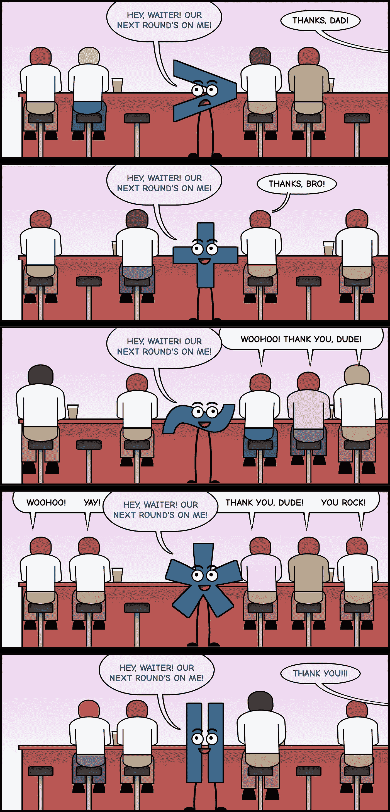

# CSS 组合子的乐趣

> 原文：<https://levelup.gitconnected.com/fun-with-css-combinators-d34cd4e0b4f5>

## 通过漫画学习 web 开发:四个 CSS 组合子(和通用选择器)走进一家酒吧…

作为 [comiCSS 网络漫画](https://comicss.art/)的一部分，我画了一个简短的漫画来解释[组合子](https://developer.mozilla.org/en-US/docs/Learn/CSS/Building_blocks/Selectors/Combinators)(和[通用选择器](https://developer.mozilla.org/en-US/docs/Web/CSS/Universal_selectors))是如何工作的。希望它有助于说明 CSS 组合子是如何工作的，以及哪些元素会受到它们的影响:

它不包括后代组合符，因为它只是一个空白，以漫画的形式出现会很奇怪。只是面板中间的空白😅

# 一些理论

CSS 组合器是一个组合选择器的工具，提供额外的含义并表达它们之间的关系。

有五种 CSS 组合子:

*   **后代组合子(** **)** :表示第二个元素是第一个元素的后代(在任何级别)。
    示例:`a b`将选择一个`<a>`内的所有`<b>`。
*   **子组合子(** `**>**` **)** :指定第二个元素是第一个元素的直接后代(仅限第一级)。
    示例:`a > b`将选择所有`<a>`的直接子节点`<b>`。
*   **相邻兄弟组合符(** `**+**` **)** :表示代码中第二个元素直接跟在第一个元素后面(第一个兄弟)。
    示例:`a + b`将选择所有直接跟在`<a>`后面的`<b>`。
*   **通用同级组合符(** `**~**` **)** :声明代码中第二个元素跟在第一个元素后面(任何同级，只要它在第一个元素后面)。
    示例:`a ~ b`将选择所有跟在`<a>`后面的`<b>`(兄弟)。
*   **列组合符(** `**||**` **)** :表示第二个元素与第一个元素在同一列。

[列组合器](https://developer.mozilla.org/en-US/docs/Web/CSS/Column_combinator)被认为是实验性的。[现在没有浏览器支持](https://caniuse.com/?search=column%20combinator)，有被移出标准的风险。所以在生产中使用它可能不是一个好主意。

> 如果你注意到了，对列组合子的回答是蓝色的，而不是黄色的:回答的是其他组合子，因为它们在同一列中！😉

## 组合子和特异性

这听起来可能有点违反直觉，但是 CSS 组合子并没有增加选择器的特异性。这意味着像`a b`和`a > b`这样的东西具有相同的特异性(即使一个在逻辑上比另一个更具体。)

事情就是这样，而且很可能永远不会改变，就像他们在 W3C 工作组邮件列表的这个[帖子上解释的那样。给组合子一个特异性值将会:](https://lists.w3.org/Archives/Public/www-style/2004Jul/0041.html)

*   增加了特异性计算的复杂性；
*   影响现有网站的风格。

第一点是有争议的。第二个问题提出了一个更大的挑战:如果特殊性没有改变，因为它会在近 20 年前影响许多现有的网站，想象一下它现在会影响多少网站。

如果你喜欢这种类型的漫画，请访问 [comiCSS](https://comicss.art/) :一个关于 CSS 的网络漫画，用 CSS 编码。或者[查一下 GitHub 上的代码](https://github.com/alvaromontoro/comicss)(是公建项目。)