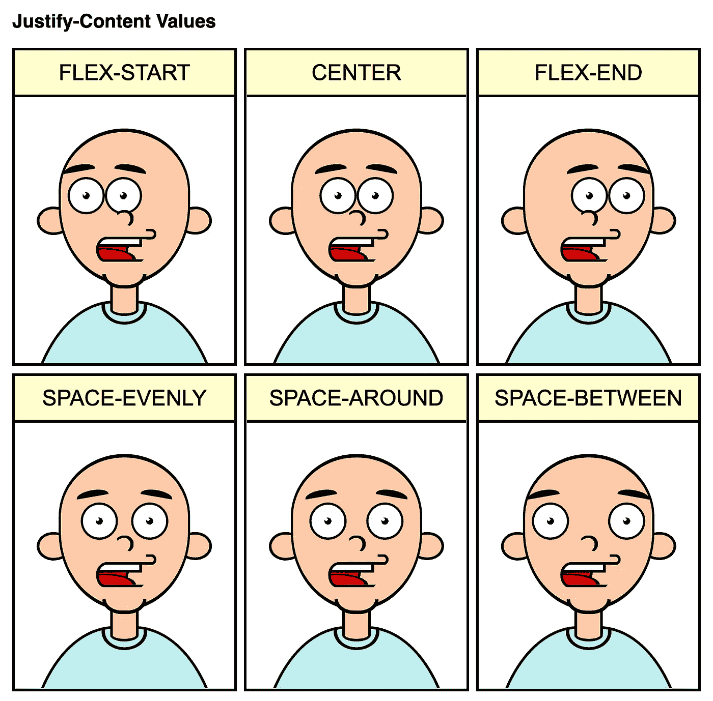

# 通过调整内容获得乐趣

> 原文：<https://levelup.gitconnected.com/fun-with-justify-content-ef1399f9c68f>

## 一幅关于 FlexBox 和 justify-content 价值观的漫画

作为 [comiCSS](https://comicss.art/) webcomic 的一部分，今天我编写了一幅关于 FlexBox 和 justify-content 值的漫画([参见此处的代码](https://comicss.art/comics/32/justify-content.html)):

我试图做一些不同的事情，用一种有趣的方式解释这个概念，举例说明`justify-content`的*主*选项:

*   `flext-start`:打包物品开头(默认为左侧)。
*   `flex-end`:将物品打包在最后(右侧)。
*   `center`:打包中心的物品。
*   `space-evenly`:所有的项目周围都有相同的空间(即使是容器的开始和结束)。)
*   `space-around`:对象之间的间距是一样的，容器的开头和结尾的面积会是那个间距的一半。
*   `space-between`:所有物品之间的距离相等，第一个和最后一个物品接触容器边缘。

`[justify-content](https://developer.mozilla.org/en-US/docs/Web/CSS/justify-content)` ( `stretch`、`left`、`right`、`start`、`end`的[选项更多，与`safe`、`unsafe`的组合也不同。)但我必须让这部漫画简洁明了，而且它们与其他一些漫画不会有太大区别。](https://developer.mozilla.org/en-US/docs/Web/CSS/justify-content)

此外，漫画采用默认的`row`伸缩方向。如果我们将该值更改为`column`，卡通人物看起来会更像毕加索😅

下一个格子…也许？