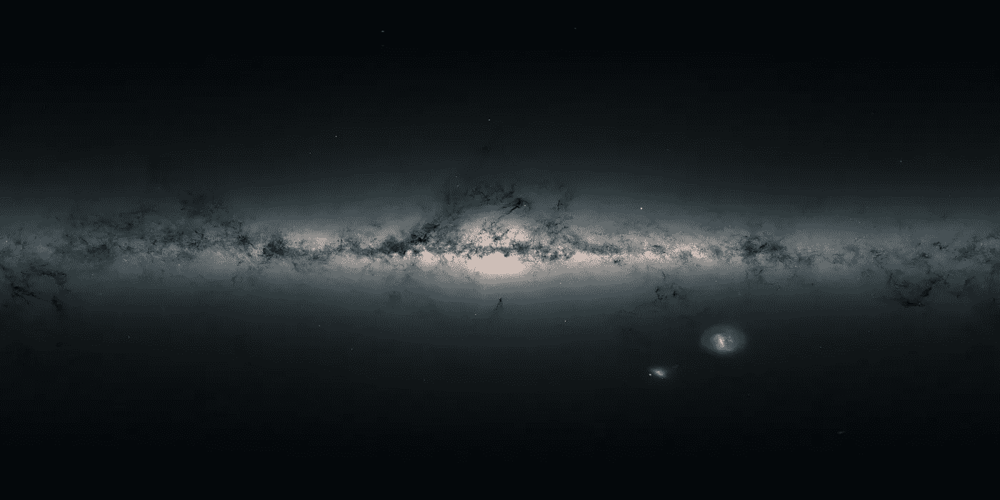
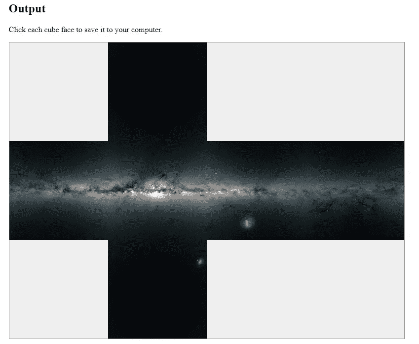
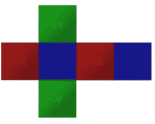
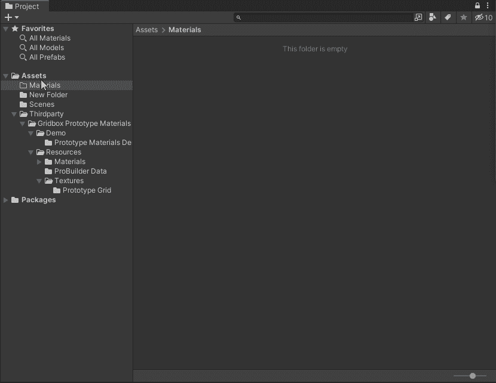
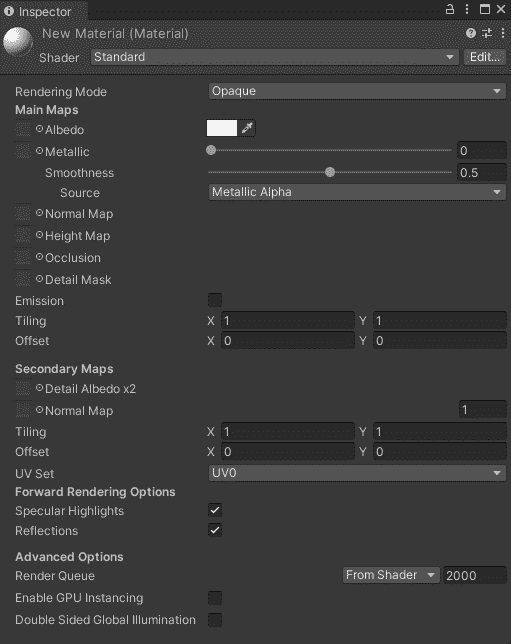
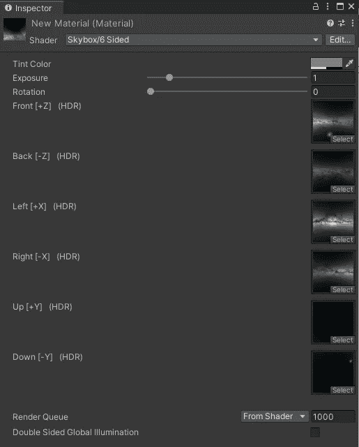
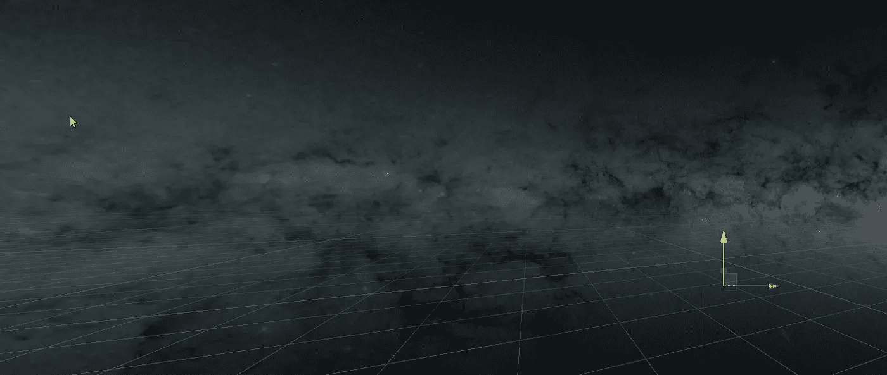
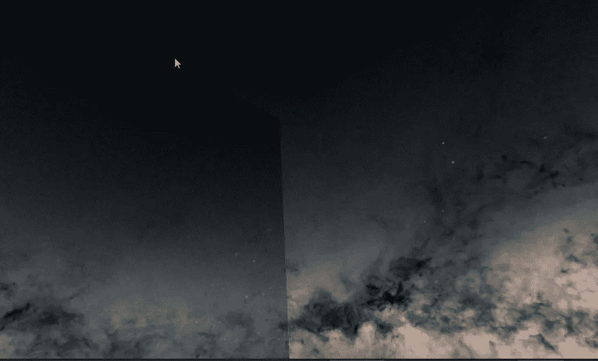
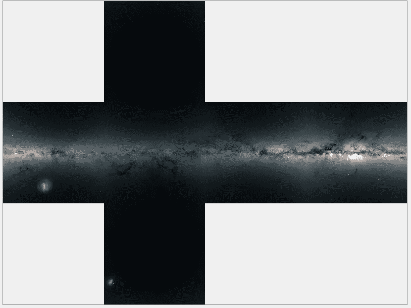
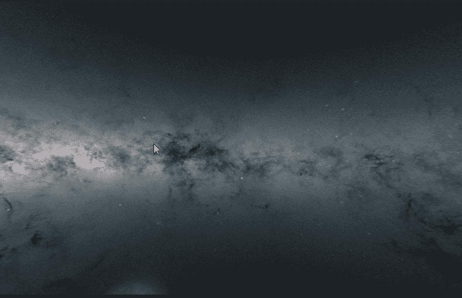

# 天空盒子的乐趣

> 原文：<https://levelup.gitconnected.com/fun-with-skyboxes-dd28ebaef48c>

使用立方体贴图创建天空盒，并将其添加到场景中。

我们将把这张图片变成一个团结的天空盒子

今天我们将探索使用 Unity 引擎中的**天空盒**为我们的 3D 游戏添加一些很酷的背景。与许多演练不同，本文将演练从创建到完成的整个过程。请注意，我们一开始会做一些错误的事情，这是为了向您展示不正确设置的结果，最后我会解释如何修复这些问题。

# **图片来源**

找到您要用于 skybox 的高质量图像。我用的是 4000 x 2000 的，图像质量越高，效果越好。

制造一个好的天空盒的两个关键规则是:

*   图像应采用等矩形投影进行格式化。 ***注意:我故意没有使用这些图片中的任何一张，以便稍后我可以向你展示它的重要性。***
*   图像的纵横比应为 2:1(因此为 4000 x 2000)。

一旦你保存了你的图片，我们需要把它转换成有用的东西。如果你有 Photoshop 技巧来做这一部分，那就去做吧！我将使用 Github 上 Lucas Crane 的 [**全景到立方体贴图**](https://jaxry.github.io/panorama-to-cubemap/) 。该工具允许我们快速地将我们的图像转换成我们需要的立方体贴图。

 [## 全景到立方体贴图

### 将 360°全景图转换为立方体贴图。

jaxry.github.io](https://jaxry.github.io/panorama-to-cubemap/) 

全景到立方体贴图有几个设置，我们将立方体旋转设置为 360 度，插值设置为最佳，输出格式为 PNG。一旦我们上传图像，我们会看到以下结果。

我们正在为瑞典设计新的旗帜

接下来的部分是最简单的。点击每个方块，将其保存到您的下载文件夹中，以便稍后移动到您的游戏中。这些文件已经以我们的名字命名，但是我们需要理解它们如何转化为 Unity。你可以通过阅读文档来查看 Unity 中支持的立方体贴图的细节。

 [## 立方体贴图

### 切换到脚本立方体贴图是代表环境反射的六个正方形纹理的集合…

docs.unity3d.com](https://docs.unity3d.com/Manual/class-Cubemap.html) 

水平交叉布局

我们最感兴趣的是与我们上面的图像相匹配的布局。我们有所谓的横向交叉。所以我们保存的文件映射到十字上的一个方块:

*   nx.png =-X(左红色)
*   nz.png =+Z(左侧蓝色)
*   pz.png =+X(右红)
*   nz.png =-Z(右蓝)
*   py.png =+Y(顶部绿色)
*   ny.png =-Y(底部绿色)

现在我们已经有了文件和贴图，我们可以在 Unity 中创建天空盒了。

# 创建天空盒

天空盒只是 Unity 中一种特殊的材质。像任何材料一样，它需要设置纹理和在我们的游戏中使用的材料。所以我们接下来会这么做。

创建材料

打开 Unity，在你想要创建材料的文件夹中点击右键，选择**创建>材料。**然后我们需要将我们的图像导入游戏引擎。我把我的放在一个名为纹理的新文件夹中。

将材料更改为 6 面

现在在检查员中，我们需要将我们的材料从**标准**材料改为**六面**材料。

请注意，当我们更改材质时，我们的检查器选项会变成一堆空纹理，其名称与我们正在使用的水平十字布局相匹配。

我们现在可以将全景图到立方体贴图的图像纹理分配到它们的透视位置来完成材质。我们可以暂时忽略其他选项。

一旦我们有我们的图像添加我们的材料应该看起来像这样。

完全构建的天空盒

好了，我们已经为自己构建了一个整洁的天空盒来添加到我们的游戏中，但是我们实际上如何使用它呢？好吧，让我们打开**灯光窗口(窗口>渲染>灯光)**并转到环境标签。现在我们可以设置新的天空盒纹理用于我们的游戏背景。

我们场景中的天空盒。

我们开始了，全新的天空盒出现在我们的场景中！现在我使用上面的图像，因为我想展示不使用等矩形投影会导致什么。

可见接缝

当我们没有使用正确的图像时，就会发生这种情况。我们的天空盒有明显的接缝。这可能是我们可以用创造性的游戏设计来隐藏的东西，但最好从一开始就处理它，这样我们就不需要用创造性来隐藏我们的缺陷。我们之前将旋转角度设置为 360 °,因为这是大多数人对于 360 度背景的直觉选择，但是如果我们选择 180 °,我们会得到一组接缝更干净的图像。

更好的立方体贴图

使用 180°旋转代替 360°旋转将会消除我们上面看到的几乎所有接缝问题。

## 其他修复

如果您是 Photoshop 用户，也可以使用 3D 工具来解决这个问题。其中之一是制作球面全景图。利用这一点和偏移滤波器，我能够实现这个无缝的最终产品。

用 Photoshop 修复

下次见。