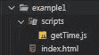

# JavaScript 函数构造(第 2 部分)

> 原文：<https://levelup.gitconnected.com/function-construction-part-2-f6a711075b11>

## IIFEs 和立即调用函数构造函数

[第 1 部分](/function-construction-whats-your-function-5a282b81fc62) | **第 2 部分** | [第 3 部分](/javascript-function-construction-part-3-d673ff247541) | [第 4 部分](/javascript-function-construction-part-4-d532f0a5e4af) | [第 5 部分](/javascript-function-construction-part-5-90733a0e6369) | [第 6 部分](/javascript-function-construction-part-6-72cfd6b18a7c) | [第 7 部分](/javascript-function-construction-part-7-17c5661e6ea7)

在我的上一篇博客中，我介绍了 JavaScript 中函数构造函数的一些基本方面，这是一个重要的概念，在许多流行的普通 JS 库中都有使用。

我决定在这篇博客中省略和保存的一件事是如何正确地导出和导入我们的`getTime`函数构造函数。最终目标是创建一个函数构造器，我们可以将它导入到其他普通的 JS 文件中，并在我们可能正在处理的任何应用程序或项目中使用它。

正如目前所写的，我们的`getTime`库是完全独立的。我们只能从它被写入的文件中访问它。这就是我们要在这个博客中改变的。

让我们开始吧。

## **继续我们离开的地方**

自从上次我们使用`getTime`函数构造器以来，我做了一些小的改动。

首先是删除冗余变量以减少我们使用的内存量(老实说，这对这个项目来说并不重要)。第二个是将“格式化日期”函数重命名为“完整日期”

这些变化不会影响函数构造函数的操作，也不是必需的。只是一些开始让我烦恼的小事。

这是我们的 getTime 库目前的样子:

```
 function getTime() { date = new Date() this.now = function() {
    let hours = date.getHours() % 12
    let ampm = date.getHours() <= 12 ? ‘AM’ : ‘PM’
    let minutes = date.getMinutes() hours = hours ? hours : 12
    minutes = minutes < 10 ? ‘0’ + minutes : minutes return hours + ‘:’ + minutes + ‘ ‘ + ampm
  } this.day = function() {
    return date.getDate()
  } this.month = function() {
    return (date.getMonth() + 1)
  } this.year = function() {
    return date.getFullYear()
  } this.fullDate = function() {
    return ‘(‘ + this.now() + ‘)’ + ‘ ‘ + this.month() + ‘/’ + this.day() + ‘/’ + this.year()
  }
}var getTime = new getTime()
```

这样，我们就可以调用我们正在构造的 getTime 对象中的函数，我们将…获得时间:

```
console.log(getTime.now())
>> 10:58 AM(or whatever the time is when you run the script)console.log(getTime.day())
>> 25console.log(getTime.month())
>> 3console.log(getTime.year())
>> 2020console.log(getTime.fullDate())
>> (10:59 AM) 3/25/2020
```

很简单。

但是如果我们想在 HTML 页面中使用 getTime.js 呢？

好吧，让我们测试一下，看看它是否有效。

我们可以建立一个基本的 HTML 页面，并在页眉中导入脚本。如果我们在浏览器中打开 HTML 页面，查看控制台是否记录了 VSC 记录的内容，我们应该会看到相同的内容。

这就是我要做的。

下面是我正在设置的文件结构:



这是 index.html。最基本的:

```
<html>
  <head>
    <title>Example #1</title>
    <script src='scripts/getTime.js'></script>
  </head>
  <body>
    <div class=’time’></div>
  </body>
</html>
```

如果我们将“console.log(getTime.fullDate())”添加到 getTime.js 文件的底部，并在 Chrome 或 Firefox 中打开 index.html，我们应该会看到一个空白页。

如果我们检查页面并查看控制台，我们应该会看到我们在 VSC 的控制台上看到的内容:

```
>> (10:59 AM) 3/25/2020
(or whatever the time is when you run the script)
```

太棒了。

所以看起来我们已经可以将 getTime 库导入和导出到 HTML 页面了，一切都正常。

但是如果我们想在另一个普通的 js 文件中使用 getTime.js 呢？

如果我们想在其他普通的 JS 文件中使用它，然后让我们的 HTML 页面通过一个不同的文件运行 getTime.js 会怎么样？

这就是事情变得更加复杂的地方。

## **告诉我你的问题**

我要做的第一件事是创建一个名为 main.js 的新文件，并将其导入 index.html。

我想要的是能够在 main.js 中使用 getTime.js。我希望 main.js 将 getTime.js 返回的内容添加到带有“Time”类的 div 的内部文本中。

我要做的第一件事是创建一个名为 main.js 的新文件，并将其导入 index.html:


index.html 中:

```
<html>
  <head>
    <title>Example #1</title>
    <script src=’scripts/getTime.js’></script>
    <script src=’scripts/main.js’></script>
  </head>
  <body>
    <div class=’time’></div>
  </body>
</html>
```

确保 getTime.js 文件在 main.js 之前加载。

我还将把 getTime 变量和控制台日志从 getTime.js 移动到 main.js，因此 getTime.js 应该如下所示:


main.js 应该是这样的:


如果我们重新加载 index . html…我们仍然得到相同的输出:


但是如果我们在 VSC 运行 main.js，我们不会得到相同的结果:


这是一个问题。

似乎我们不能让不同的普通 JS 文件相互工作，除非我们使用互联网浏览器。这一点都不酷。

我们可以解决这个问题。我们需要做的第一件事是在 main.js 中' require' getTime.js:

```
var getTime = require(‘./getTime’)
```

但是如果我们尝试控制台日志我们的 fullDate 函数，我们得到一个错误:


好吧，那么…让我们试着控制台记录 getTime 变量，而不调用它:

```
console.log(getTime)
```


很好。我完全理解这一点，我很高兴这一切正在发生。/s

让我们检查一下我们的浏览器，以确保那里的东西仍然工作:


******** 。

似乎浏览器不支持“require”关键字。

所以，唯一不会出错的地方是，如果我们在不调用 getTime 变量的情况下在控制台记录该变量，我们得到的只是一个空对象。其他一切都出错了。

好吧。接受挑战。

让我们从没有出错的地方开始，首先修复 getTime.js。然后我们可以让它在 main.js 中工作。

我们可以稍后处理另外两个错误。

我们需要做的第一件事是把我们的 getTime 函数构造函数变成一个直接调用的函数表达式，或者一个生命。

## 立即调用函数**表达式(life)**

立即调用的函数表达式(IIFE)是在函数创建后立即调用的函数。

我们可以通过将函数构造函数括在括号中并在代码的最后一行添加()来创建一个生命。就像 JavaScript 中普通的函数调用一样。我们还可以在调用中将参数传递给生命中的函数。

我们需要把我们的函数构造器变成一个生命，这样我们就可以从我们想要使用它的其他 JS 文件中调用我们的函数构造器。否则我们将总是得到一个空对象，或者一个类型错误。

如果我们回到我第一个博客中的人物例子，这是一个生活的例子:

```
 (function Person(firstname, lastname) {
  this.firstname = firstname
  this.lastname = lastname console.log(this.firstname, this.lastname)})(‘John‘, ‘Smith‘)>> John Smith
```

有了生命，我们不需要单独调用我们正在创建的函数。我们可以在创建函数时调用它。

我们还可以通过将“window”作为参数来访问全局执行上下文。

这里有一个更简单的例子:

```
(function (window) {
 console.log(window)
})(window)
```

如果我们在 VSC 这样做:


我们得到一个错误。

但是如果我们在浏览器中查看:


我们获得了浏览器的全局执行上下文。

所以它只起了一半作用…

事实证明，VSC 的全球执行环境被定义为“全球”让我们试着将“全球化”融入我们的生活:

```
(function Person(global) {
 console.log(global)
})(global)
```

现在我们得到了 VSC 的全球执行环境:


但是在浏览器中会出错:


因为我们希望 getTime.js 不管在什么环境下执行都能工作，这又一次…不酷。

我们可以尝试做的是写一个检查，看看'窗口'是否可用，因为看起来'窗口'是一个只由浏览器提供的对象。

我们写的检查将试图找到窗口对象，如果找不到就返回 true。如果检查找不到窗口对象，就意味着脚本是在终端而不是浏览器中运行的，因为窗口对象是只有浏览器才提供的对象。

否则，检查将找到窗口对象并返回 false。这意味着如果找到了窗口对象，脚本必须在浏览器中运行。然后，根据脚本运行的环境，我们可以将窗口或全局对象传递到我们的生活中。

这听起来可能很复杂。这似乎没有必要。但在实践中，这相当简单，我们可以用一个三元语句完成上面解释的所有逻辑:

```
(function Person(environment) {
 console.log(environment)
})(typeof window === “undefined” ? global : window)
```

通过这个简单的检查，我们现在应该可以在浏览器和 VSC 的终端中看到我们的全局执行上下文。

让我们将这个逻辑应用到我们的 getTime 库中:

```
(function getTime(env) { date = new Date() this.now = function() {
    let hours = date.getHours() % 12
    let ampm = date.getHours() <= 12 ? ‘AM’ : ‘PM’
    let minutes = date.getMinutes() hours = hours ? hours : 12
    minutes = minutes < 10 ? ‘0’ + minutes : minutes return hours + ‘:’ + minutes + ‘ ‘ + ampm
  } this.day = function() {
    return date.getDate()
  } this.month = function() {
    return (date.getMonth() + 1)
  } this.year = function() {
    return date.getFullYear()
  } this.fullDate = function() {
    return ‘(‘ + this.now() + ‘)’ + ‘ ‘ + this.month() + ‘/’ + this.day() + ‘/’ + this.year()
  } console.log(env)
})(typeof window === “undefined” ? global : window)
```

现在，我们应该可以在 VSC 和浏览器中看到全局执行上下文，来自函数构造器的方法被添加到其中:

VSC:


浏览器:


这很好。

这意味着我们可以从传递给函数构造函数的“env”变量中调用各个方法。“env”变量是我们根据它运行的环境传递到我们生活中的全局执行上下文。

太好了…但是我们还有一个问题。我们所有的方法在全局执行上下文中都是松散的。它们没有封装在一个我们可以安全调用的对象中，这正是我们想要完成的。

再说一次…我们可以解决这个问题。

我们可以用我想出的一个术语来解决这个问题。这个概念并不新鲜，肯定叫别的。我想我只是有心情拍拍自己的背，或者别的什么。

我不知道，我们继续吧。

## **立即调用函数构造函数(IIFC)**

我们需要做的是在我们的函数构造函数中创建一个空对象，并把我们正在构建的所有方法放入该对象中。这将把我们编写的所有方法放入我们可以调用的单个对象中。

然后，我们希望将该对象附加到全局执行上下文中，这样我们就可以从其他 JS 文件中调用我们的函数构造函数，并且可以访问包含我们所有方法的对象。

这个过程，它如何执行以及最终返回什么，就是我定义的立即调用函数构造器，或 IIFC。我没有发明这个过程，再说一次，它可能被称为不同的东西，我只是不知道它叫什么。至少在这个博客的上下文中，我会提到我在上面概述的内容，以及我作为一个 IIFC 人在下面解释的内容。

那么，我们如何建造一个 IIFC？

我们需要做的第一件事是将我们的函数变成一个匿名函数，并在函数构造函数中创建一个将返回空对象的新变量。我们还需要获取我们正在创建的对象，并将其附加到我们正在传递给函数的全局执行上下文中。

这应该使我们能够从函数构造函数的范围之外访问它。

如果我们删除添加到我们正在构造的对象中的所有与时间相关的函数，getTime.js 应该如下所示:

```
(function(env) {
  var getTime = function(){
    return new getTime()
 } env.getTime = getTime console.log(env)})(typeof window === "undefined" ? global : window)
```

如果我们运行这个脚本，我们现在可以看到我们的 getTime 对象附加到全局执行上下文:


太好了。但是现在我们有了另一个问题。

如果我们试图访问 getTime 对象，我们只是得到函数定义:

```
>> [Function: getTime]
```

如果我们试图调用创建该对象的函数，我们会得到一个“超出最大调用堆栈大小”的错误:

```
RangeError: Maximum call stack size exceeded
 at new getTime (t:\code\blogs\blog8\example1\scripts\getTime.js:3:25)
 at new getTime (t:\code\blogs\blog8\example1\scripts\getTime.js:4:12)
 …
```

这是因为我们正在从函数内部调用创建对象的函数，这将创建一个无限循环。

这并不理想。

但是我们可以再次解决这个问题。

我们需要创建另一个函数，将我们所有的方法添加到 getTime 对象中，然后返回该函数的调用。

这不仅会修复我们的最大调用堆栈大小超出错误，还会创建一个新的执行上下文，并更改 This 关键字所指向的引用。它将指向我们正在创建的新的空对象，而不是指向全局执行上下文。

这允许我们使用 THIS 关键字添加一个键/值对，这将返回一个新的对象，其中包含键/值对。

我们可以做一个快速测试，看看它是否有效:

```
(function(env) { var getTime = function(){
    return new getTime.init()
  } getTime.init = function(){
    this.test = ‘test string’
  } env.getTime = getTime})(typeof window === “undefined” ? global : window)console.log(getTime())
```

现在，如果我们运行该脚本，我们应该会看到一个带有 test/'test string '键/值对的对象:


我们也可以称之为。“test”属性，我们应该得到与之关联的字符串:

```
console.log(getTime().test)
```


太好了。

您可以将“init”函数重命名为您喜欢的任何名称。我选择了“init ”,因为这个函数正在“初始化”对象，而且“init”听起来像一个有意义的名字。

既然这样可行，我们可以尝试重新添加我们最初编写的所有特定于时间的函数，并将它们附加到 getTime.init()函数。

如果成功的话，我们应该可以毫无问题地调用它们。

注意下面这个关键字的用法是很重要的，每次我引用' this.date '变量时都要加上这个关键字:

```
(function(env) { var getTime = function(){
    return new getTime.init()
  } getTime.init = function(){ this.date = new Date() this.now = function() {
      let hours = this.date.getHours() % 12
      let ampm = this.date.getHours() <= 12 ? ‘AM’ : ‘PM’
      let minutes = this.date.getMinutes() hours = hours ? hours : 12
      minutes = minutes < 10 ? ‘0’ + minutes : minutes return hours + ‘:’ + minutes + ‘ ‘ + ampm
    } this.day = function() {
      return this.date.getDate()
    } this.month = function() {
      return (this.date.getMonth() + 1)
    } this.year = function() {
      return this.date.getFullYear()
    } this.fullDate = function() {
      return ‘(‘ + this.now() + ‘)’ + ‘ ‘ + this.month() + ‘/’ + this.day() + ‘/’ + this.year()
    }
  } env.getTime = getTime})(typeof window === “undefined” ? global : window)
```

我们现在应该能够调用 init()函数中的各个方法了，就像我们开始走这条生命/IIFC 之路之前一样:


太棒了。

## 收拾残局

那我们为什么要做这一切呢？如果我们又回到了起点，所有这些工作又有什么意义呢？好吧，能人。

还记得我们试图从一个单独的 JS 文件中访问 getTime 函数构造函数吗？

还记得我们尝试用‘require’关键字将 getTime.js 导入 main.js 吗？

还记得当我们尝试控制台记录 getTime 变量时，我们得到的是一个空对象吗？

你再试一次怎么样？

因为现在当我们运行 main.js 时，我们得到:


******** 。

好的，等等…让我们再次登录全局对象，看看我们的 getTime 对象是否在那里:


好的，就在那里。我们从 main.js 访问它。我们所要做的就是调用 global.getTime():


咿呀。

我们还可以将 getTime 对象存储到一个变量中，以避免每次我们想要获取时间时都必须调用 global:


我们现在要开始了，孩子们。

让我们在浏览器中尝试一下:


哦，是的 Chrome 或 Firefox 不支持“require”关键字，我们无法在不出现运行时错误的情况下使用它。

这是一个问题。

嗯…如果我们注释掉 require 和变量:


它工作了。

但是我们希望它在终端和浏览器中都可以工作。这是从一开始的目标。

我们可以解决这个问题。

由于我们只需要添加“require”关键字和变量重新赋值，脚本就可以在终端中运行，因此我们可以修改为 IIFC 编写的环境检查。

根据浏览器提供的窗口对象的存在，我们可以检查文件运行的环境。如果检查无法找到只有浏览器提供的窗口对象，这意味着脚本正在终端中运行，我们可以在 main.js 中要求 getTime.js。

在 main.js 中:

```
 if (typeof window === “undefined”) {
  var getTime = require(‘./getTime’)
  getTime = global.getTime
}console.log(getTime())
```

在 VSC:


在浏览器中:


太棒了。

让我们通过用 getTime()替换“Time”类 div 的内部文本来测试新创建的 getTime 函数构造函数。now()函数，并结束这篇博客。

在 main.js 中

```
if (typeof window === “undefined”) { var getTime = require(‘./getTime’) getTime = global.getTime} else { document.addEventListener(“DOMContentLoaded”, addTime) function addTime() {
    const timeDiv = document.querySelector(“.time”)
    timeDiv.innerText = `${getTime().now()}`
  }}console.log(getTime().now())
```

在 VSC:


在浏览器中:


惊人的。

下面是对我们的 2 个脚本和 index.html 的最后一次检查:

getTime.js:

```
(function(env) { var getTime = function(){
    return new getTime.init()
  } getTime.init = function(){ this.date = new Date() this.now = function() {
      let hours = this.date.getHours() % 12
      let ampm = this.date.getHours() <= 12 ? 'AM' : 'PM'
      let minutes = this.date.getMinutes() hours = hours ? hours : 12
      minutes = minutes < 10 ? '0' + minutes : minutes return hours + ':' + minutes + ' ' + ampm
    } this.day = function() {
      return this.date.getDate()
    } this.month = function() {
      return (this.date.getMonth() + 1)
    } this.year = function() {
      return this.date.getFullYear()
    } this.fullDate = function() {
      return '(' + this.now() + ')' + ' ' + this.month() + '/' + this.day() + '/' + this.year()
    }
  }env.getTime = getTime})(typeof window === "undefined" ? global : window)
```

main.js

```
if (typeof window === "undefined") { var getTime = require('./getTime') getTime = global.getTime} else { document.addEventListener("DOMContentLoaded", addTime) function addTime() {
    const timeDiv = document.querySelector(".time")
    timeDiv.innerText = `${getTime().now()}`
  }}console.log(getTime().now())
```

index.html:

```
<html>
  <head>
    <title>Example #1</title>
    <script src='scripts/getTime.js'></script>
    <script src='scripts/main.js'></script>
  </head>
  <body>
    <div class='time'></div>
  </body>
</html>
```

## 任务完成

我希望我没有让 vanilla JS 中导入和导出函数构造函数的过程过于复杂。我又一次高估了我想在这个博客中涵盖的内容，结果它比我预期的要长得多。

所以，我将推迟讨论原型和原型继承，以及我为这个博客收集的其他 3 个例子，并把它们添加到下一个。

我仍然计划写一个关于用 React 导入/导出 IIFC 的博客，以及如何用 IIFEs 和 iifc 发送和接收来自后端的请求，所以我想这个话题将会变成一个 4 部分。

我希望这篇和我计划的下两篇博客能帮助你理解 Javascript 中函数构造器和面向对象编程的重要性。这个话题还有很大一部分我没有涉及到，也可能永远没有时间去涉及。

但是，唉，这只是我们称之为 Javascript 的漫长旅程的一部分。

# JavaScript 函数构造

[第 1 部分](/function-construction-whats-your-function-5a282b81fc62) | **第 2 部分** | [第 3 部分](/javascript-function-construction-part-3-d673ff247541) | [第 4 部分](/javascript-function-construction-part-4-d532f0a5e4af) | [第 5 部分](/javascript-function-construction-part-5-90733a0e6369) | [第 6 部分](/javascript-function-construction-part-6-72cfd6b18a7c) | [第 7 部分](/javascript-function-construction-part-7-17c5661e6ea7)