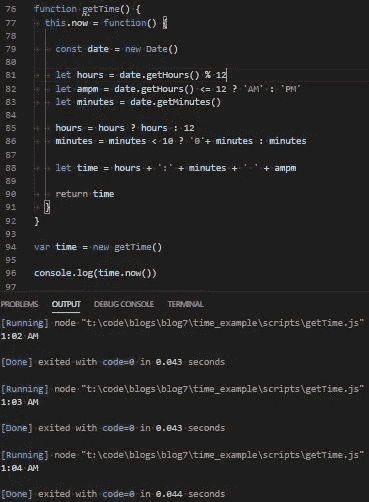
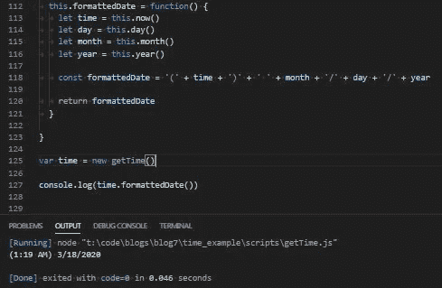

# JavaScript 函数构造

> 原文：<https://levelup.gitconnected.com/function-construction-whats-your-function-5a282b81fc62>

## 构建基本函数构造函数

**第 1 部分** | [第 2 部分](/function-construction-part-2-f6a711075b11) | [第 3 部分](/javascript-function-construction-part-3-d673ff247541) | [第 4 部分](/javascript-function-construction-part-4-d532f0a5e4af) | [第 5 部分](/javascript-function-construction-part-5-90733a0e6369) | [第 6 部分](/javascript-function-construction-part-6-72cfd6b18a7c) | [第 7 部分](/javascript-function-construction-part-7-17c5661e6ea7)

在这个旅程中，我们称之为 JavaScript，它是我越来越多地使用的最有用的工具之一(如果你可以称之为工具的话),是函数构造器。

为什么我发现函数构造函数如此有用？因为它们允许我编写更少的代码，并且更有效地使用我正在编写的代码。函数构造器还允许我封装特定于我要执行的调用或操作的变量、属性或函数，并确保无论他们要做什么都不会开始搞乱我项目的其他部分。

许多库(比如 jQuery)大量使用函数构造函数，如果你想看看专业人士是如何做的，我强烈建议你看看 jQuery 的源代码。它是开源的和免费的，在他们的主页上有没有评论都可以得到。

函数构造函数对于划分变量、函数和上下文环境非常有用，我想在项目的不同部分使用它们。

假设我在代码中的 3 或 4 个不同地方向服务器发出了相同的 POST 请求。对于每个请求，我要写 3 到 4 遍同样的 15 到 20 行。

我可以在一个函数构造函数中编写一次请求，将该对象导入到我发出请求的地方，调用绑定到我导入的对象的函数，然后用一两行代码调用该函数，而不是每次我想从服务器中检索数据时都写出请求。

我可能还是编程新手，我在这个我们称之为 JavaScript 的旅程中的道路才刚刚开始，但是我要做一个大胆的声明。一个声明可能会冒犯那些拥有知识的人，我可能有一天希望获得:

函数构造函数是闭包的精髓，是 JavaScript 中函数式编程的巅峰。

让我们开始吧。

## 于是它开始了

撇开戏剧不谈，让我们言归正传，定义什么是函数构造函数。函数构造器是一个普通的老式函数，用于构造对象。这听起来并不特别，从表面上看，也不是。

只有当我们添加一个非常特殊、难以捉摸的关键词时，魔法才会开始

“THIS”关键字在函数构造函数中使用时，是对创建它的对象的引用。它允许我们从我们正在编写的函数中为正在创建的对象分配属性。这也允许我们从对象本身内部变异或改变对象的属性。

为什么这很重要？

让我们看一个基本的例子:

```
function Person(firstname, lastname) {
 this.firstname = firstname
 this.lastname = lastname
}
```

这里我们有一个函数叫做 Person。它接受两个参数，然后将这两个参数设置为函数中定义的属性值。但它也使用了“THIS”关键字。

“THIS”所做的是将属性绑定到创建它的对象。如果我们 console.log() 'THIS '并调用该函数，我们可以看看' THIS '在做什么:

```
function Person(firstname, lastname) {
 this.firstname = firstname
 this.lastname = lastname
}console.log(this)Person()
```

控制台将会显示所有这些内容:

```
<ref *1> Object [global] {
 global: [Circular *1],
 clearInterval: [Function: clearInterval],
 clearTimeout: [Function: clearTimeout],
 setInterval: [Function: setInterval],
 setTimeout: [Function: setTimeout] {
 [Symbol(util.promisify.custom)]: [Function (anonymous)]
 },
 queueMicrotask: [Function: queueMicrotask],
 clearImmediate: [Function: clearImmediate],
 setImmediate: [Function: setImmediate] {
 [Symbol(util.promisify.custom)]: [Function (anonymous)]
 },
 firstname: undefined,
 lastname: undefined
}
```

那么发生了什么？

我们看到一个名为“global”的对象，其中充满了一大堆你可能以前见过的相当常见的函数。

如果你在网络浏览器中执行这个功能，你会看到更多的功能。

我们看到的是全局执行上下文。什么是全局执行上下文？

这是我几周前写的一篇博客的摘录:

> 全球环境正是你所认为的那样。它是每次运行 Javascript 文件时创建的默认执行上下文。全局执行上下文执行重要的功能:它创建一个全局对象，其中包含一大堆方法和变量，并且它将执行上下文中的“this”关键字设置为该全局对象。在函数之外编写的任何东西都是在全局执行上下文中编写的，或者说是在全局上下文中。如果您曾经尝试在全局上下文中访问“this ”,然后尝试在一个对象中访问“this ”,您会注意到您会得到两个非常不同的结果。

为什么在函数中写“THIS”时，我们会看到全局执行上下文？

嗯，我们在全球范围内调用 Person 函数。如果在全局对象(窗口)调用一个函数，“THIS”指向全局执行上下文。

我们还可以在底部看到我们的两个属性名和姓。

那很好。非常好。但这不是我们想要的。

我们希望创建一个新对象，其中“名字”和“姓氏”作为键/值对出现。

所以让我们解决这个问题。

我们可以尝试使用关键字“new”创建一个具有该函数的新对象，并将其存储到变量中。然后我们可以 console.log()变量' john '来看看它是否工作:

```
function Person(firstname, lastname) {
 this.firstname = firstname
 this.lastname = lastname console.log(‘inside the function:’, this)
}var john = new Person()console.log(‘outside the function:’, john)-------------------->> inside the function: Person { firstname: undefined, lastname: undefined }
>> outside the function: Person { firstname: undefined, lastname: undefined }
```

我们现在看到，当我们从函数内部调用“THIS ”,并使用存储在变量中的“new”关键字创建一个对象时，执行上下文发生了变化，因为 Person 函数是在“NEW”关键字的上下文中调用的。

“THIS”现在指向我们正在创建的对象，由于 JavaScript 在每次调用函数时都会创建一个新的执行上下文，所以执行上下文会将“THIS”变量指向正在创建的新的空对象，并自动返回该对象。

它是一个构造对象的函数。

一个函数构造器…你可能会说。

让我们对此进行一些扩展。

我们还可以向对象传递一些参数，这样我们就可以去掉那些“未定义”的值:

```
function Person(firstname, lastname) {
 this.firstname = firstname
 this.lastname = lastname
}var john = new Person(‘john’, ‘smith’)console.log(‘Object:’, john)-------------------->> Object: Person { firstname: ‘john’, lastname: ‘smith’ }
```

因为所有函数都是 JavaScript 中的对象，所以我们也可以访问我们用成员访问操作符(或点符号)创建的“名字”和“姓氏”属性:

```
console.log(john.firstname)-------------------->> john
```

或者:

```
console.log(john.lastname)-------------------->> smith
```

我们还可以…这就是事情开始变得有趣的地方…
向我们的函数构造函数添加一个函数:

```
function Person(firstname, lastname) {
 this.firstname = firstname
 this.lastname = lastname
 this.hello = function() {
 return ‘Hello, ‘ + this.firstname + ‘ ‘ + this.lastname + ‘.’
 }
}
```

然后访问并调用该函数:

```
console.log(john.hello())-------------------->> Hello, john smith.
```

所以我们有一个函数，它创建一个对象，这个对象创建一个函数，这个函数也是一个对象…

是的，没错。

## 自定义时间函数构造

所以我一直不喜欢 JavaScript 的新 Date()特性的工作方式。

我总是发现自己不得不一次又一次地格式化和重新格式化，如果有一种简单的方法来获得当前时间的格式化字符串，那就太好了。

所以，让我们开始吧。

让我们修改上面的例子，并尝试让构造函数只输出新的 Date()函数:

```
function getTime() {
  const date = new Date() this.now = function() {
  return date
 }
}var time = new getTime()console.log(time.now())-------------------->> 2020–03–19T00:33:46.820Z
```

好极了。但是我们想把这个格式化。

没问题。我们正在编写的 now()函数是一个普通的 JavaScript 函数，因此我们可以赋值变量、执行布尔比较、连接字符串等等……就像我们通常会做的那样

目前，它只是作为 JavaScript 内置的新 Date()函数的别名，所以让我们让它做得更多一点:

```
function getTime() {
 const date = new Date()this.now = function() { *// We can convert the built in getHours() method to conform to a 12 hour clock by taking the current time and finding it’s remainder when divided by 12 with the modulo operator
  // Example: If it is 13:00 on a 24 hour clock, and 13 % 12 leaves a remainder of 1, then that means it is 1 o’clock* let hours = date.getHours() % 12 *// If the current hour is less than or equal to 12, return AM, otherwise return PM* let ampm = date.getHours() <= 12 ? ‘AM’ : ‘PM’ *// Simple alias for the built in getMinutes() method* let minutes = date.getMinutes() *// On a 24 hour clock, if it is midnight, it is 24:00\. 24 % 12 is 0, which we don’t want.*
 * // So we can use a ternary operator to check if it is midnight, and if it is, return 12* hours = hours ? hours : 12 *// Simple formatting that adds a zero before any minute of an hour that is less than 10.* minutes = minutes < 10 ? ‘0’+ minutes : minutes // Everything we just wrote rolled into one nice simple string let time = hours + ‘:’ + minutes + ‘ ‘ + ampm return time
 }
}var time = new getTime()console.log(time.now())
```

无论何时运行该脚本，它都将返回当前时间:



很好。

JavaScript 使用你电脑的内部时钟来实现日期功能，所以你可以摆弄电脑上的时钟来测试它是否正常工作。

我们也可以继续。我们可以对这个构造函数使用任意多的函数，而不用担心它会如何影响这个函数之外的代码。没有副作用:

让我们添加当月的当前日期:

```
this.day = function() {
 let day = date.getDate() return day
}
```

月份:

```
this.month = function() {
 let month = date.getMonth() *// We need to add 1 to the month number because in JavaScript, month numbers start at zero, not 1; just like the indices of an array*
 return (month + 1)
}
```

和年份:

```
this.year = function() {
  let currentYear = date.getFullYear() return currentYear
 }
```

这些都很简单，但对接下来的事情很重要。

我们可以再添加一个函数，引用我们在函数构造函数中编写的所有方法，并将所有这些方法组合成一个方法，为我们提供一个格式正确的日期字符串:

```
this.formattedDate = function() {
 let time = this.now()
 let day = this.day()
 let month = this.month()
 let year = this.year() const formattedDate = ‘(‘ + time + ‘)’ + ‘ ‘ + month + ‘/’ + day + ‘/’ + year return formattedDate
}
```

这将为我们提供一个很好的字符串，我们可以在任何想要显示当前时间的地方使用它:



我们可以通过调用两行代码在任何地方重用这个构造函数:

```
var time = new getTime()console.log(time.formattedDate())
```

我们还可以通过调用我们构建的所有其他函数来获取日期的各个部分，这使得这个函数构造器非常方便，我们再也不用担心摸索新的 date()了。

## 任务完成

今天在这个博客上工作了大半天后，我意识到将我们新的 getTime 函数构造器的构造，以及如何在其他脚本或其他框架(如 React)中导出/导入它分成两篇博文可能是个好主意。这个结果比我预期的要大得多，其他几个例子都不太好。我安装的用于 React 的 Postgres 模块引起了很多问题。

在我写的下一篇博客中，我将详细介绍如何在普通 JS 中重用这个函数构造函数，以及 React，并可能为构造函数本身添加更多的功能。我可能还有一两个其他的例子，我真的不知道。

所以我希望这篇博客是对函数构造器的一个很好的介绍，我期待着在我写的下一篇博客中扩展我在这里详述的一切。感谢您的阅读。

# JavaScript 函数构造

**第 1 部分** | [第 2 部分](/function-construction-part-2-f6a711075b11) | [第 3 部分](/javascript-function-construction-part-3-d673ff247541) | [第 4 部分](/javascript-function-construction-part-4-d532f0a5e4af) | [第 5 部分](/javascript-function-construction-part-5-90733a0e6369) | [第 6 部分](/javascript-function-construction-part-6-72cfd6b18a7c) | [第 7 部分](/javascript-function-construction-part-7-17c5661e6ea7)