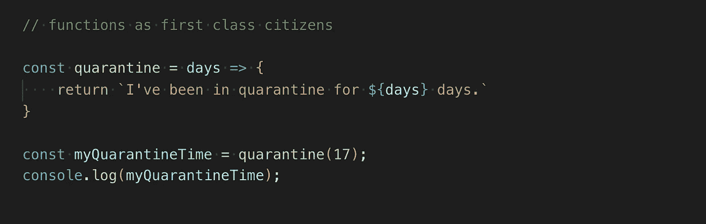
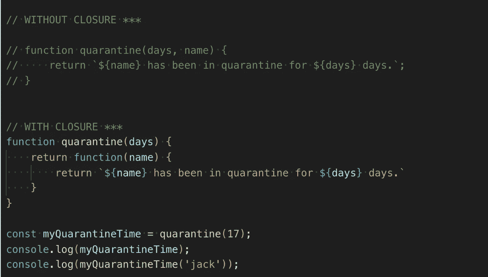
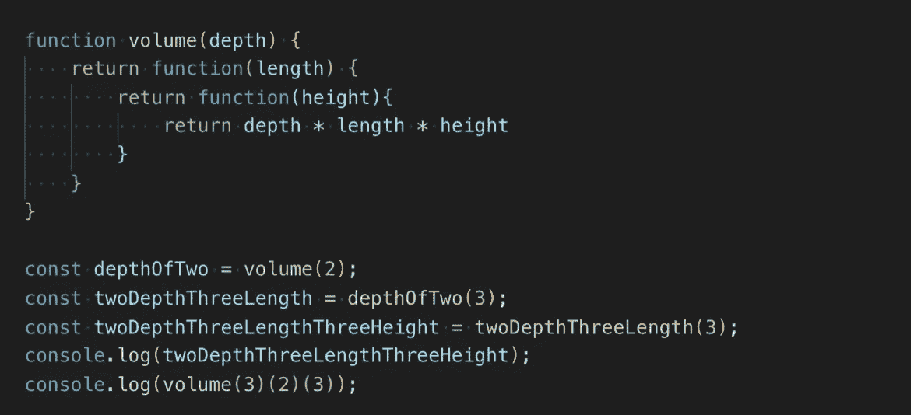
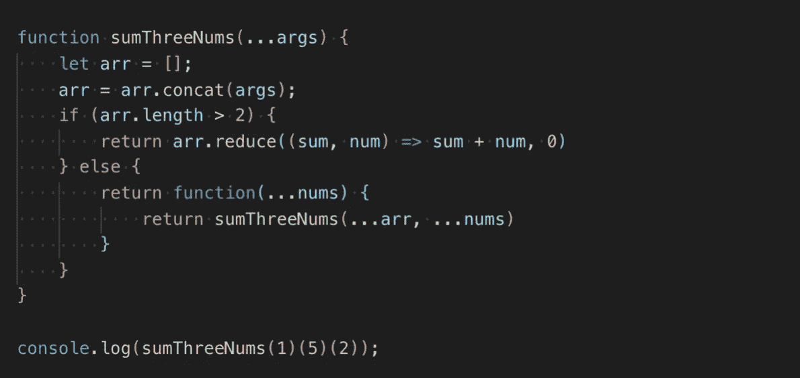
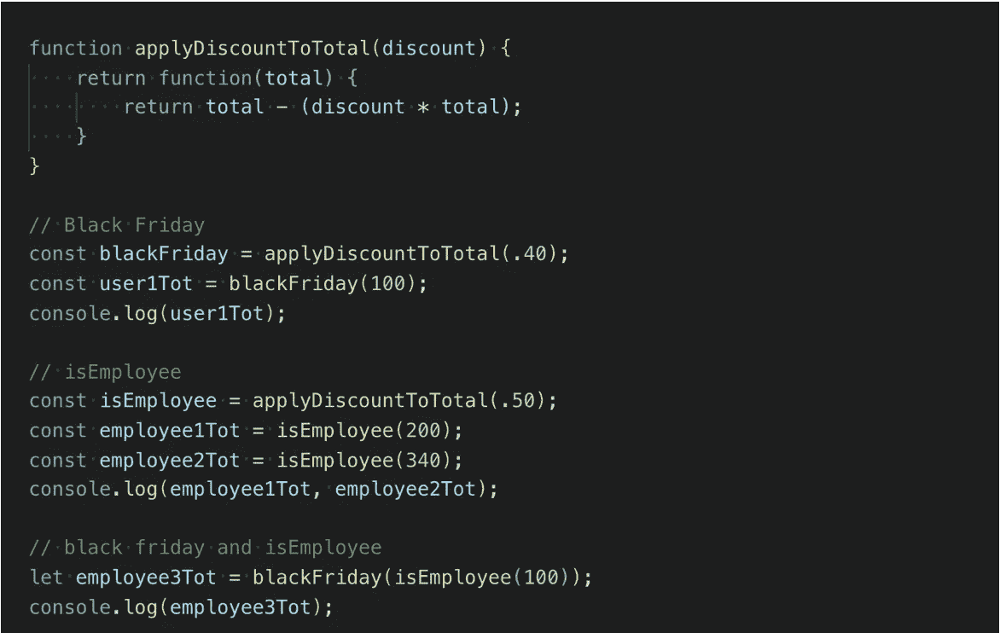

# JavaScript 中的函数 Currying

> 原文：<https://levelup.gitconnected.com/function-currying-in-javascript-46d7ccee1a0e>

函数 currying 是函数式编程中的一种有用的技术，它允许我们对一个函数求值，这个函数将多个参数放入一个具有一系列顺序内部函数的函数中，每个函数都只有一个参数。

尽管这并不是 JavaScript 所独有的，但是这种技术是通过使用闭包在 JavaScript 中实现的。闭包涉及到在外部函数中函数的分层(或封装),允许内部函数访问外部函数的范围。在 JavaScript 中，函数属于第一类类型，如字符串或数字，这意味着它们是对象，像任何对象一样可以存储在变量中。

在上面的例子中，我编写了一个名为 quarantine 的 arrow 函数，它有一个名为 days 的参数，并在函数运行时返回一个带参数的插值字符串。然后，将一个名为 myQuarantineTime 的变量赋给隔离运行时调用的值，参数为 17，在本例中是一个字符串(“我被隔离了 17 天。”).这个例子展示了 JavaScript 的基本特性，即给函数一等公民。

对于闭包，函数调用的返回值是另一个函数。让我们重新配置我们的隔离示例，不仅要指定隔离天数，还要添加一个名称参数。让我们使用闭包，而不是向隔离方法添加第二个参数(如下面注释掉的示例所示)。

在上面的例子中，我们将 myQuarantineTime 分配给函数 quarantine，并给它一个参数 17。然而，这一次，当我们将 myQuarantineTime 的值打印到终端时，myQuarantineTime 的值是一个函数。在第二个日志中，我们将 myQuarantineTime 视为一个适当的函数，并给它一个参数“jack”，将预期值打印到终端(“Jack 已经被隔离了 17 天。”)!同样的返回值也可以通过在我们的函数调用 quarantine 中调用一个名字来获取，如下所示:

**检疫(17)(‘杰克’)；**

将一个具有多个参数的函数分解成多个连续的函数，以形成一种套娃式的形式，这个过程实际上是利用了函数 curry！

*再比如*

这是另一个简单的奉承的例子。得到三维形状体积的公式是形状的长度乘以形状的深度乘以高度的乘积。此时，您可能会想象我们创建一个名为 volume 的函数，并传递三个参数(深度、长度和高度)来返回三个参数的乘积；相反，让我们使用 currying，将一个参数传递给函数中的每个函数。

在上面的 volume 程序中，我们声明变量，并将它们设置为等于函数中的每个调用，直到我们不再返回函数。在第二个日志中，我们调用了函数的内部函数。两者返回相同的值。

一个更复杂的例子

假设我们想要创建一个对三个数字求和的函数，但是如果我们没有输入适当数量的参数来计算总和，我们希望该函数有条件地返回一个函数。让我们称这个函数为 sumThreeNums。

sumthrenoms(3，3，4)；

sumthrenoms(3，3)(4)；

sumThreeNums(3)(3)(4)；

我们希望调用函数的每个可能的方法都返回相同的值(10)。如果传递给我们函数的参数少于三个，我们希望 sumThree 返回一个函数来传递数字参数，直到我们有三个数字相加！我们可以使用闭包和递归来做到这一点。

在这个例子中，我们给 sumThreeNums 一个 spread 操作符的初始参数，因为从一开始传入的参数数量可以是零个或三个。然后，我们将这些参数放入一个数组，并检查数组中的数字是否超过 2 个。如果是，那么我们使用 reduce 方法并返回总和。如果没有，那么我们调用一个函数，它接受一个数字参数，我们用我们的原始参数和新参数递归调用 sumThreeNums！

函数曲线的实际应用

函数 currying 是划分代码的一种优雅的方式，帮助我们保持代码干燥，并防止错误/不准确。最重要的是，我相信 currying 可以有很多实际用途。例如，假设我们正在构建一个假设的公司的电子商务应用程序，该公司希望根据特定的假期应用不同的折扣，或者为公司员工提供折扣。这个场景非常适合拍马屁。

在上面的例子中，currying 用于动态调用不同用户累积的总数的*实例*的特定折扣。这种技术当然允许更多的动态性，更少的重复代码，以及函数式编程中更低的不准确性和错误的可能性。