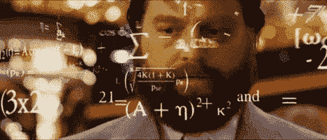

# Go 中的函数、方法和接口

> 原文：<https://levelup.gitconnected.com/function-methods-interfaces-in-go-d094243501b>

使用示例和代码立即投入运行！


来自 Pixabay

Go 通过对函数、方法和接口的隐式和显式定义，保持其独特的灵活性。主包中的`main(){}`函数是我们的代码必须开始的地方。

虽然 Go 通常会强制使用每个包和变量，但实际上您可以包含未被调用的空函数，并且您的代码仍会编译。调用函数也很简单。

```
package mainimport "fmt"func main() {
    fmt.Println("Hello World!")
    helloFromFunc()
}func emptyFunc() {}func helloFromFunc() {
    fmt.Println("Hello from a function!")
}/* Program Output:
Hello World!
Hello from a function!
*/
```

**自变量和参数**在 Go 中很容易传递。实参在函数调用中，参数在函数定义中。编码行话！

```
func main() {
    // define arguments
    firstNameArg := "Izzy"
    lastNameArg := "Miles" printFullName(firstNameArg, lastNameArg)
}func printFullName(firstNameParam string, lastNameParam string) {
    fmt.Println(firstNameParam, lastNameParam)
}
```

**函数的返回类型**可以定义为返回单个值或不同类型的元组。返回类型在参数定义之后定义。我希望你知道哈利波特，否则这个函数对你来说就像拉丁语一样。

```
package mainimport "fmt"func main() {
    ronWeasley := "Ron Weasley" canCastSpell := wingardiumLeviosa(ronWeasley) if canCastSpell {
        fmt.Println("Levitating object...")
    } else {
        fmt.Println("Can't levitate, it was probably Ron...")
    }
}func wingardiumLeviosa(wizard string) (bool) { // bool return type
    if wizard == "Ron Weasley" {
        fmt.Println("It's levi-OSA, not levio-SA!")
        return false
    } else {
        return true
    }
}
```

对于可能出错的操作，通常会返回一个**错误**值。例如，假设我们试图打开一个文件。如果我们可以毫无问题地打开文件，我们将返回一个`nil`来代替一个错误，这意味着一切正常。如果出现问题，我们希望发出信号并处理错误。

**注意:**下面的代码需要你导入`"os"`包。

```
func openFile (filename string) (error) {
    f, err := os.Open("filename.txt")
    if err != nil {
        log.Fatal(err)
        return err
    }
    // do something with the open *File f
    return nil
}
```

这有点重复，因为`os.Open()`函数实际上也返回一个文件和一个错误。这也不是很好，因为如果它失败了，我们就让程序崩溃。主要的一点是，我们希望可能出错的函数准确地指出它们出错的原因，而错误有助于实现这一点。

**方法**在基本意义上不同于 Go 中的函数，方法与对象有关。Go 与其他语言略有不同，因为你实际上只是将一个对象传递给一个函数，使它成为一个方法，而 Python 则是将一个函数定义为类的一部分，使它成为一个方法。提醒一下，Go 里没有类，只有结构和接口！

```
package mainimport "fmt"func main() {
    hp := NewWizard("Harry Potter", 12) hp.learnSpell("Wingardium Leviosa") fmt.Println(hp.Name, "knows how to cast", hp.KnownSpells)
}type Wizard struct {
    Name string
    Age int
    KnownSpells []string
}// This function returns a new instance of a Wizard
func NewWizard(name string, age int) *Wizard {
    return &Wizard{ // notice no explicit constructor
        Name: name,
        Age: age,
    }
}// we pass a wizard to learnSpell create a method
func (w *Wizard) learnSpell (spell string) {
    w.KnownSpells = append(w.KnownSpells, spell)
}
```

返回对新 struct 实例的引用是一种常见的做法，这就是为什么`NewWizard()`的返回类型是指针`*Wizard`。

与其他语言相比，Go 中的接口有些不同，但在应用中仍然非常强大。本质上，接口给了我们一个实现特性的契约。让我们以形状为例，我们只需要实现面积和周长方法。

```
type shape interface {
    area() float64
    perim() float64
}
```

很简单。在大多数其他通用语言中，你会实例化一些包含关键字的类来*实现*这个接口。相反，只要你为一个对象定义了在类型上等价的方法，Go 就会假设你实现了一个接口。

```
type pentagon struct {
    side float64
}func (p pentagon) area() float64 {
    radicand := 5*(5+(2*math.Sqrt(5)))
    return (0.25)*math.Sqrt(radicand)*math.Pow(p.side,2)
}
func (p pentagon) perim() float64 {
    return 5*p.side
}
```

好了，既然我们实现了`area()`和`perim()`方法，我们也就实现了`shape`接口本身！此外，您还学习了如何计算五边形的面积。现在是大脑思考的时候了。



我希望你喜欢这篇关于 Go 中的函数、方法和接口的教程。如果有你喜欢的东西或者你想知道更多的话题，请在下面留下评论！感谢阅读。