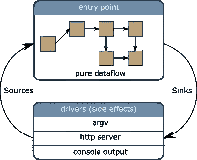
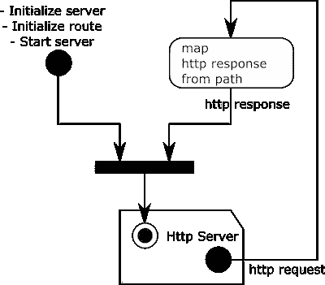

# 使用回旋加速器在 Python 中进行函数式和反应式编程

> 原文：<https://levelup.gitconnected.com/functional-and-reactive-programming-in-python-with-cyclotron-1b57fff4c643>


[郭锦恩](https://unsplash.com/@spacexuan?utm_source=unsplash&utm_medium=referral&utm_content=creditCopyText)在 [Unsplash](https://unsplash.com/@spacexuan?utm_source=unsplash&utm_medium=referral&utm_content=creditCopyText) 上拍照

反应式编程对于编写事件驱动的应用程序、数据驱动的应用程序和异步应用程序非常有用。然而，很难找到一种好的方法来组织代码。对 JavaScript 开发者来说幸运的是，有 [CycleJs](https://cycle.js.org) 。于是我为 Python 和 [RxPY](https://github.com/reactivex/rxpy) : [回旋](https://github.com/mainro/cyclotron-py)开发了一个类似的框架。

*编辑 2020/10:更新了 RxPY v3 和回旋加速器驱动器列表的示例。*

回旋加速器是一个功能和反应框架。它允许以函数的方式构建反应式代码。更具体地说，功能意味着以下内容:

*   纯代码和副作用是明确分开的
*   所有代码都是通过函数实现的(没有类)

此外，它专门用于编写反应式代码:

*   所有组件都通过观察器进行通信
*   可观察到的循环是自然处理的

下图显示了回旋加速器应用的结构:



回旋加速器的应用有两部分:纯数据流和副作用。纯数据流由纯函数组成。纯函数是行为具有确定性的函数。这意味着它们的输出只取决于它们的输入参数。纯数据流部分是实现应用程序逻辑的地方。

副作用是任何不是纯函数的函数。例如，一个不接受参数作为输入并返回当前日期的函数就是一个副作用。此外，任何作用于 IO 的函数都是副作用，因为它的结果依赖于底层 IO。

纯数据流和副作用通过可观察的方式相互交流。按照惯例，纯数据流的输出(也是副作用的输入)被称为汇。纯数据流订阅的输入可观测值(也是副作用的输出)被称为源。

注意纯数据流和副作用是如何形成有向循环图的:它们相互依赖。管理这种可观察到的周期并不总是容易的。回旋加速器自然地处理纯数据流和副作用之间的这种循环:一个自举函数循环连接纯入口点和副作用。

让我们看一个示例应用程序。一个 hello world，由一个异步 http 服务器组成，它发送回在“/echo”URL 上接收到的内容。这个 echo 服务器使用 AsyncIO 来异步管理 IO 操作。该应用的设计如以下反应性图所示:



反应图使用 UML 活动图的表示，但是有不同的含义。活动图代表一个代码流，每个链接代表一个对函数或方法的调用。反应图代表一个数据流，每个链接代表一个可观察量。所以被描述的每一个动作都被可观察物所发出的每一个项目所调用。

在这个例子中，http 服务器是一个副作用，用右上角弯曲的矩形表示。运算符或操作表示为圆角矩形。在这个例子中，从 http 服务器接收的每个请求都被映射到一个响应。粗水平线表示合并操作符。注意，这个非常简单的例子已经包含了一个可观察到的循环。不，让我们看看实现。

我们首先需要一些进口品:

```
from collections import namedtuple                                               from cyclotron import Component                       
from cyclotron.asyncio.runner import run                       import cyclotron_aiohttp.httpd as httpd
import rx
import rx.operators as ops
```

回旋加速器大量使用命名的双联管。使用命名元组有几个好处:

*   它们的字段可以从它们的名称直接访问。所以这个语法没有使用字典那么冗长:一个 *foo* 字段被访问为 *a.foo* 而不是 *a['foo']* 。
*   命名元组和元组一样，是不可变的。不变性是函数式编程的基础之一。这里的想法是通过 namedtuple 尽可能地拥抱不变性。

然后使用几个回旋加速器进口，以及来自 RxPY 的可观测定义。

下一步是定义应用程序使用的源、接收器和驱动程序:

```
EchoSource = namedtuple('EchoSource', ['httpd'])
EchoSink = namedtuple('EchoSink', ['httpd'])
EchoDrivers = namedtuple('EchoDrivers', ['httpd'])
```

因为这个应用程序非常简单，所以只使用了一个源、一个接收器和一个驱动程序。HTTP 驱动程序需要一个源和一个接收器。有些驱动程序可能只是源(它们只发出项目)，有些驱动程序可能只是接收器(它们只消耗项目)。

然后是入口点和驱动程序的主函数和引导:

```
def main():
    run(Component(call=echo_server, input=EchoSource),
        EchoDrivers(httpd=httpd.make_driver()))

if __name__ == '__main__':
    main()
```

run 函数将应用程序的入口点( *echo_server* 函数)与 *httpd* 驱动程序连接起来。最后，这是应用程序的纯数据流:

```
def echo_server(source):
    init = rx.from_([
        httpd.Initialize(),
        httpd.AddRoute(methods=['GET'], 
                       path='/echo/{what}',
                       id='echo'),
        httpd.StartServer(host='localhost', port=8080),
    ])

    echo = source.httpd.route.pipe(
        ops.flat_map(lambda i: i.request)
        ops.map(lambda i: httpd.Response(
                context=i.context,
                data=i.match_info['what'].encode('utf-8'))))
    )
    control = rx.merge(init, echo)
    return EchoSink(httpd=httpd.Sink(control=control))
```

*echo_server* 函数将源作为输入并返回接收器。这些都是可以观察到的物体。 *init* Observable 包含三项，用于初始化 http 服务器。这里定义了一个 */echo* 路由，服务器监听*本地主机*，端口 *8080*

被观察的*回声*是*回声*路线的处理者。它监听 http 服务器的来源，并订阅可观察的 *echo* 路由。然后，对于这个可观察对象上接收到的每个项目，基于请求的路径创建一个响应。

之后， *init* 和 *echo* 可观察对象被合并，这样它们就可以作为一个接收器提供给 http 驱动程序。全部代码可在[回旋加速器 aiohttp](https://github.com/MainRo/cyclotron-aiohttp/blob/master/example/http_echo_server.py) 的 GitHub 库中获得。

您可以在控制台中启动服务器:

```
python3 http_echo_server.py
```

然后从另一个控制台测试它:

```
$ curl [http://localhost:8080/echo/hello](http://localhost:8080/echo/hello)
    hello
$ curl [http://localhost:8080/echo/foo](http://localhost:8080/echo/foo)
    foo
```

回旋加速器是一个小项目，已经稳定并用于生产，所以可以在自己的项目中随意尝试。目前，回旋加速器由几个组件组成:

*   回旋加速器，项目的核心部分
*   回旋加速器标准，包含 python 标准库的驱动程序和适配器
*   回旋加速器-aiohttp、回旋加速器-aiokafka 和回旋加速器-consul 包含不同协议和技术的驱动程序。

它们可以从 pypi 获得。文档的来源和链接可在 [GitHub](https://github.com/MainRo/cyclotron-py) 上找到。

*原载于 2019 年 1 月 14 日*[*https://blog.oakbits.com*](https://blog.oakbits.com/farp-on-python-with-cyclotron.html)*。*