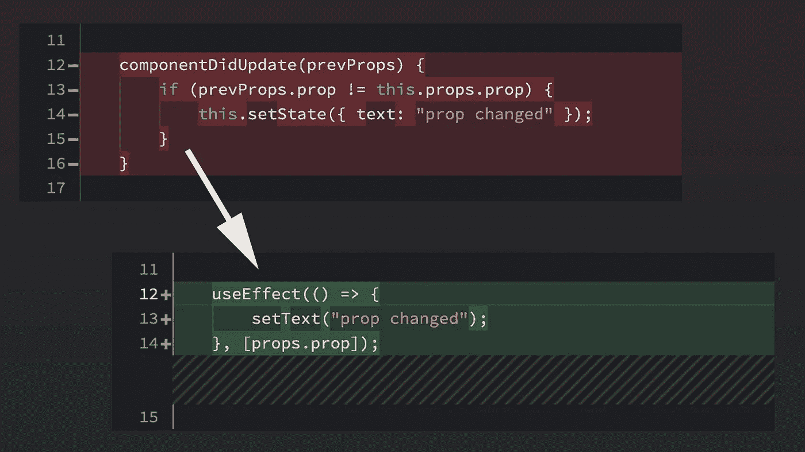

# 面向经验丰富的 React 开发人员的功能组件

> 原文：<https://levelup.gitconnected.com/functional-components-for-experienced-react-developers-219eb4747617>



在软件开发领域，我们正处于一场巨大的范式转变之中。就像面向对象编程在几十年前变得流行一样，函数式编程可能会成为一种具有类似意义的思想。术语*功能性的*正成为像*纯粹的*和*无状态的*这样的词的同义词。如果你对这是为什么感兴趣，我建议你查一下函数式编程。在这篇文章中，我将介绍 React 在实践中从*有状态类*到*无状态函数*的转变。

# React 类组件的剖析

让我们先来看看一个典型的 React 类组件。

## 构造器

构造函数设置组件的初始状态，并且它必须确保调用父组件的构造函数:

```
constructor(props) {
  super(props);
  this.state = {text: "Initial state"};
}
```

## 生命周期

以下是使用组件类时常用的三种生命周期方法:

```
componentDidMount() {
  // do something on mount
  this.setState({text: "Component did mount"});
}componentDidUpdate(prevProps) {
  // do something on update
  if (prevProps.prop != this.props.prop) {
    this.setState({text: "prop changed"});
  }
}componentWillUnmount() {
  // do something on unmount
}
```

## 提供；给予

render 方法完成所有渲染工作:

```
render() {
  return <div>{this.state.text}</div>;
}
```

# 解释的功能组件

现在，让我们做和上面一样的事情，但是使用一个功能组件:

```
(props) => {
  const [text, setText] = useState("Initial state"); useEffect(() => {
    setText("Component did mount"); return () => { /* do something on unmount */ };
  }, []); useEffect(() => {
    setText("prop changed");
  }, [props.prop]); return <div>{text}</div>;
};
```

这里有很多东西要打开！让我们一行一行地过一遍:

1.  正如你所看到的，*道具*是作为函数的参数给出的。
2.  为了初始化一个组件的状态，你调用`useState`，它将返回初始状态(由函数的可选参数给出)以及另一个函数来更新状态。您可以任意多次调用`useState`并初始化多个状态！
3.  接下来的两个调用都是对`useEffect`的调用，但是在第二个参数上有一个重要的区别。当所提供的依赖关系之一发生变化时，就会调用作为参数传递给`useEffect`的函数。这些依赖关系由第二个参数指定，在第一次调用的情况下，该参数是一个空数组。这意味着没有依赖关系，因此*效果*在挂载时只被调用一次。
4.  传递给第一个`useEffect`的函数也返回一个函数。这是一个*清理函数*，在本例中，它在卸载时被调用。
5.  传递给第二个`useEffect`的函数依赖于`props.prop`，因此每当这种依赖的值改变时都会被调用。注意:这不仅仅是一个 *componentDidUpdate* ，因为只有当属性改变时才会调用它。它不在乎有没有其他道具！就像使用`useState`一样，你可以随意调用`useEffect`多次。
6.  在传递给`useEffect`的函数中，我们使用`setText`来更新文本状态。
7.  最后，我们只是像在 *render* 方法中一样返回渲染节点。

现在应该很清楚，它实际上是所有的函数。以函数为参数甚至可能返回函数的函数。其中一个好处是这些函数可以在你喜欢的任何地方、任何时候被调用，最重要的是，你可以随时调用。

如果你想知道的话，我们在这里使用的所有内置函数都被称为[钩子](https://reactjs.org/docs/hooks-intro.html)。

# 但是等等，还有呢！

## 高阶组件(HOC)

有经验的 React 开发人员可能非常熟悉高阶组件的概念。这些是包装其他组件并向其中注入某些道具的组件。假设您有一个将`hocProp`注入到组件中的特设。在这种情况下，您可能会看到这样的内容:

```
export withHocProp(MyComponent);
```

在`withHocProp`函数内部，很可能会发生这样的事情:

```
…
<WrappedComponent
  {...this.props}
  hocProp=…
/>
…
```

对于功能组件，您不再创建`withHocProp`函数——而是创建一个`useHocProp`函数，它可以作为一个钩子被调用，并且只返回 *hocProp* 的值:

```
const useHocProp = () => {
  …
  return hocProp;
};
```

一个重要的注意事项是 *useHocProp* 可能会调用其他钩子如`useEffect`和`useState`以便成为一个全功能组件本身！

官方的 [React 文档](https://reactjs.org/docs/hooks-overview.html)对此有一个很好的例子。

## 上下文

如果您使用过 React 上下文，那么您也有可能创建了`withContext`更高阶的组件来将所需的上下文注入组件。

不再需要这些上下文专用函数，取而代之的是 React 自己的`useContext`钩子。这只是组件内部的另一个函数调用:

```
const context = useContext(MyContext);
```

## 其他挂钩

例如，为了优化应用程序的性能，你还可以使用其他重要的钩子。

***useMemo*** 根据依赖关系优化函数调用，就像我们看到的`useEffect`一样。假设您有一个基于属性计算值的函数。你可以将它移入一个状态，并在属性改变时用`useEffect`更新状态——或者你可以在属性改变时用`useMemo`调用这个函数:

```
const value = useMemo(
  () => expensiveFunction(props.prop),
  [props.prop]
);
```

现在`value`的值在每次`props.prop`改变时更新，但不是每次组件改变时更新。因此，函数`expensiveFunction`仅在需要时调用。

***useCallback*** 与 *useMemo* 相似，都是返回记忆化的回调。假设您有一个仅依赖于`props.prop`的点击处理程序。然后，您可以创建一个回调函数，只有当它的依赖关系发生变化时，才会重新计算这个函数(当然，每次单击都会调用这个函数):

```
const clickHandler = useCallback(
  () => {
    // do stuff depending on props.prop
  },
  [props.prop]
);return <button onClick={clickHandler}>Press me</button>;
```

如果你想知道还有哪些钩子存在，我建议你看看 React 的[钩子 API 参考](https://reactjs.org/docs/hooks-reference.html)。

# 结论

虽然可能需要一些时间来适应，但对我个人来说，functional React 感觉更强大，甚至更优雅。

如果您或您的公司还没有转向函数式组件，那么现在可能是您重新考虑的时候了，因为函数式编程的概念已经根深蒂固——随着许多语言和框架在本质上变得越来越函数化，这是显而易见的。

感谢你的阅读，希望你喜欢。如果你有任何问题，或者想了解更多关于 React 和函数式编程的知识，欢迎发表评论！

*你也可以在我公司的* [*网站*](https://www.productionbuild.de) *或* [*推特*](https://twitter.com/nenharma82) *上联系我。*