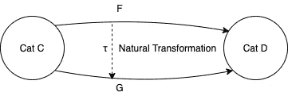
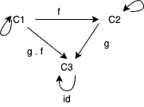
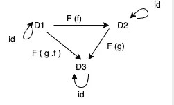
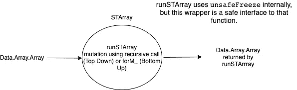

# 函数式动态编程——Scala 猫和自由单子

> 原文：<https://levelup.gitconnected.com/functional-dynamic-programming-scala-cats-and-free-monad-b71c34c209>



使用自上而下的动态编程算法探索 Scala Cats 中的自由单子，看看 FP 中的概念是如何从数学中派生出来的。

这篇文章:

*   ***不涵盖*** *:* 关于动态编程(DP)或者函数式编程(FP)或者 Scala 猫或者单子的基础知识。
*   ***正在探索*** *:* 使用记忆化和有状态计算解决 DP 问题的 FP 机制(自由单子包装的可变数组)
*   ***也是*** :是之前文章《[带 Haskell 的 Functional DP](https://medium.com/@SA_19/functional-dynamic-programming-with-haskell-92e68efe808)》和《[带 Haskell 自顶向下的 Functional DP](https://medium.com/@SA_19/functional-dynamic-programming-with-haskell-top-down-and-bottom-up-7ccade222337)》的后续，这两篇文章探讨了 STArray 和 ST Monad 的机制。我们尝试使用 Cats 库提供的免费单子做同样的事情。


照片由[考尔·克里斯詹](https://unsplash.com/@badgerblack?utm_source=medium&utm_medium=referral)在 [Unsplash](https://unsplash.com?utm_source=medium&utm_medium=referral) 上拍摄

**从范畴论到自由单子。**

范畴理论是一个庞大的课题，需要在毕业研究期间投入大量的时间和兴趣来发展对它的直觉。

哲学/数学指针可以在这里找到[](https://plato.stanford.edu/entries/category-theory/)**和*[***这里***](https://www.math3ma.com/blog/what-is-category-theory-anyway) 。例如，数学集合是所有集合的范畴。***

**用几行文字来总结是不可能的，甚至很难在一个博客中涵盖，但是我们将尝试不涉及太多技术，只保留 FP 和代数元素。**

*   **一个类别可以被看作是一个对象的集合，这些对象之间有箭头(同方向指针一样)。**

****

****类别 C** 具有对象 C1、C2、C3 之间的态射 f 和 g**

```
**f : C1 -> C2 
g : C2 -> C3 
f . g : C1 -> C3 
id : C1 -> C1**
```

****

****范畴 D** 具有对象 D1、D2、D3 之间的态射 F(f)和 G(g)**

```
**F (f): D1 -> D2 
F (g) : D2 -> D3 
F (g . f) : D1 -> D3 
id: D1 -> D1  ... etc**
```

*   **函子是从一个类别 **C** 的对象到另一个类别 **D** 的映射，它保留了一些结构。**

```
**F: C -> D or 
F(C1) -> D1
F(C2) -> D2 
F(C3) -> D3**
```

*   **也可以读作“ ***一个协变函子 F : C - > D 把 C 中的对象和态射都发送给 D 中的对象和态射*** ”。**
*   **将类别 C 中的对象映射到同一类别 C 的函子是内函子。**

**可以观察到各种数学定律和性质，如**

*   **合成的结合律=> f . (g . h) = (f . g)。具有三个态射 f，g 和 h。**
*   **态射的同一律=> id: C1 -> C1**
*   **可能还有其他的，比如交换性等等。**

**类似地，像幺半群、单子、自然变换这样的概念可以通过围绕这些对象、它们的关系、性质和规律的变形进行更深入的研究而导出。**

****自然转变****

**我们观察了类别 C 和 D 之间的函子 F，以及它如何将 C 中的每个对象映射到 D 中的一个对象。**

```
****F**: C -> D**
```

**现在想象另一个函子 G，它类似地在 C 和 D 之间映射，就像**

```
****G**: C -> D** 
```

**自然变换是从函子 F 到 G 的函数τ，也可以描述为**

```
**τ: F -> G** 
```

****

**用 Scala 例子描述上面的行话**

*   **选项、列表、任一项等是从 C 到 D 的函子**
*   **τ，自然变换是两个函子之间的函数。**
*   **所以，一个自然的转化可以看做是这两个关系之间的关系(或者是两个箭头之间的一个箭头)。**

****(注:**以上对自然转化的定义仅仅是一种理解概念的尝试，但它并不是一个纯粹的定义，因为，在纯粹的意义上，我们将不得不根据 C 和 D 两个不同的范畴来思考，而且它还要稍微详细一些。)**

**类似地，自由单子是范畴理论中的一个派生概念(或结构)，需要中级到高级的学科知识。**

**上面用图表讨论的目的是为了从范畴理论中追溯一个自由单子的粗略旅程。**

**回到我们的 DP 问题，这里探讨的是解决 [***计数错位***](https://en.wikipedia.org/wiki/Derangement) 问题的自上而下的方法[](https://medium.com/@SA_19/functional-dynamic-programming-with-haskell-92e68efe808)*。***

***首先，来自博客“[功能性 DP，Haskell 自上而下](https://medium.com/@SA_19/functional-dynamic-programming-with-haskell-top-down-and-bottom-up-7ccade222337)”的 Haskell 版本转载如下。Scala Cats 版本紧随其后。***

***总结一下，***

*   ***它是在一元块 **runSTArray** 中使用递归的自顶向下版本。***
*   ***使用-1 初始化 STArray 来调用 runSTArray，并为 arr(1)和 arr(2)设置基本用例。***
*   ***调用 cdRecursive 函数，该函数接受 MArray 的实例，如果 arr(n) = -1，则在内部计算并变异 STArray***
*   ***对于数组索引 I，如果 arr(i) == -1，则 cdRecursive 使用以下公式递归计算并更新 arr(i ),如下所示***

```
***arr(i) = (i-1) * ( arr(i-1) + arr(i-2) )***
```

***下图解释了我们的突变在 runSTArray 中是如何安全的，并最终在 Haskell 中返回一个“纯”不可变数组。(虽然，在这里，我们对最终返回数组不感兴趣，我们只对 arr(n)计算值部分感兴趣。)***

******

***runSTArray 中的安全突变***

*****Scala 猫免费单子版*****

***就像 Haskell 有一个 runSTArray 一元计算，以一种包装安全的方式处理可变数组，我们可以为 Scala 数组创建基于 Scala 的一元包装器。***

***什么是“自由单子”？***

***关于“自由”更详细的解释，typelevel.org 关于自由单子的详细文档是 [***此处***](https://typelevel.org/cats/datatypes/freemonad.html) 。***

**总而言之，一个自由的单子**

*   **是一种将有状态计算视为数据的方式。**
*   **用于创建 DSL**
*   **是以堆栈安全的方式执行这些计算的一种方式**

**“自由单子”的美丽和强大之处在于它能够定义我们自己的 ADT，也就是导致 DSL 的代数和解释器**

**“自由单子”可能不仅限于 IO，还可以用于处理可变集合和数组。**

**下面是完整的 Scala 代码和解释。**

**一步一步解释。**

****第一步:**定义代数**

*   **通过为抽象指令(put 和 get)创建 ADT(代数数据类型),也称为 AST(抽象语法树),表示计算，我们将使用它来创建程序。**
*   **由于是 ADT，我们将计算视为数据。**
*   **我们将为数组实现基于索引的 get 和 set。**

```
**sealed trait ArrayA[A]
case class Put[T](idx: Int, value: T) extends ArrayA[Unit]
case class Get[T](idx: Int) extends ArrayA[Option[T]]**
```

****步骤 2:** 创建 DSL(领域特定语言)**

*   **我们的 DSL 包含了基于“域”的小数组存储的函数。**
*   **我们可以通过把(Free.lift) ArrayA[A]提升到 Free[ArrayA，A]来创造包裹我们行为的自由单子**

```
**type ArrayStore[A] = Free[ArrayA, A]// Put returns nothing (i.e. Unit).
  def put[T](idx: Int, value: T): ArrayStore[Unit] =
    Free.liftF[ArrayA, Unit](Put[T](idx, value))// Get returns a T value.
  def get[T](idx: Int): ArrayStore[Option[T]] =
    Free.liftF[ArrayA, Option[T]](Get[T](idx))**
```

****步骤 3:** 我们实际的程序 monadic cdRecursive 将使用上面创建的 DSL，它有点类似于上面的 Haskell 版本**

****第四步:**解释器用于执行我们的程序描述来执行它。
解释器是一个**自然变换**，可以把 F 变换成 G 写成 F[_] ~ > G[_]的函数。**

**参考上面关于范畴理论和自然转化的小讨论。**

**Cats 库提供函数 k**

```
**cats.arrow.FunctionK**
```

**它接受 F[A]并返回 G[A]**

**在这种情况下，我们的解释器是一个自然转换 ArrayA ~> Id，其中 Id 是最简单的 monad，即 identity monad，它在 cats 中被定义为一个简单的类型容器。**

**这是一个使用可变数组的不纯版本。你可以写一个不可变的版本，但是数组数据结构并不合适，因为空间使用会降级得更快(因为对于每次迭代，不可变数组中没有共享的**结构)。对于不可变版本，可以使用 HashMap 或其他基于树的数据结构，这些数据结构本身就是空间优化的。****

**鉴于这种方法为突变提供了足够的隔离，我们继续使用可变数组。**

**这段代码有缺陷，但它足以代表将突变视为数据的整体概念。**

****第五步:**最后，要执行我们的程序，只需使用解释器对程序进行 foldMap，并提供“n”，其中 n 是我们要传递的整数，用于计算 n 项的排列，解释器也将使用 n 来创建 n 的数组用于记忆。**

**Free.foldMap 使用蹦床技术以堆栈安全的方式执行。**

```
**val result: Option[BigInt] = cdRecursive(n).foldMap(interpreter(n))
println(result)**
```

**所以，总结一下**

*   **我们已经看到了如何使用免费的单子来创建我们自己的 DSL。**
*   **我们可以看到函数式编程是如何从数学概念中获得基础的。**
*   **为了从这种能力中获益，我们需要用纯粹可靠的函数和代数数据类型来表达我们的抽象。**
*   **虽然一开始理解这个概念有点困难，但如果我们遵循数学中的直觉链，它有助于产生可读和可测试的代码，甚至更重要的是，**一个可以被推理的代码或应用。****