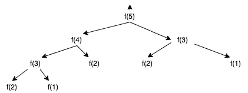
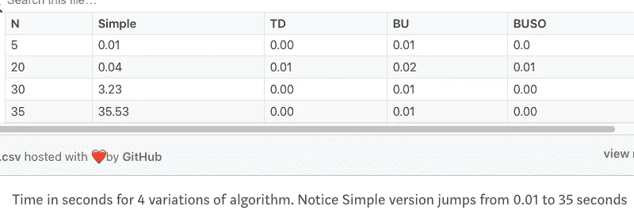
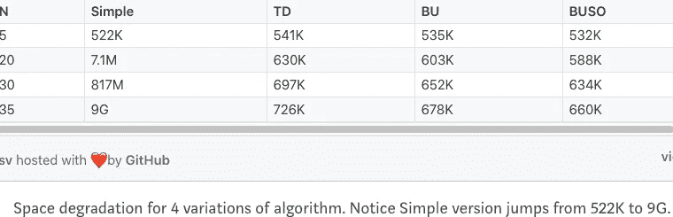

# 用 Haskell 实现函数式动态编程

> 原文：<https://levelup.gitconnected.com/functional-dynamic-programming-with-haskell-92e68efe808>

Haskell 在纯 FP 中实现动态编程算法的特性。

本文分为三个部分:

*   ***不涵盖*** *:* 关于动态编程(DP)或者函数式编程(FP)或者 Haskell 或者 Monads 的基础知识。
*   ***涵盖了****:*Haskell 中使用内存化(STArray)和有状态计算(ST Monad)解决 DP 问题的 FP 机制。

本文假设读者对数组或向量等基本数据结构以及时间和空间复杂性有基本的了解。

快速回顾一下。动态编程是解决满足两个特征的问题的范例:

*   ***最优子结构*** *:允许将问题分成小部分，并使用递归方法求解更小的部分。*
*   ***重叠子问题*** *:允许存储可重复使用的较小子问题的结果，以避免重复计算。*

我们将使用一个这样的问题(计算错位排列)来探索如何用纯函数的方式解决它。此处给出了该问题的非常详细的解释[。](https://en.wikipedia.org/wiki/Derangement)

举个简单的例子，如果我们有三个字母 ABC。可能的错位只有 BCA 和 CAB。

但是 ACB (A 在原始位置)、CBA (B 在原始位置)和 BAC (C 在原始位置)不是有效的错位排列，因为根据问题定义，任何字母都不应该在原始位置。

f(x)的计数，其中 x = 1，2，3，…，n

```
f(1) = 0
f(2) = 1
f(3) = 2
f(n) = (n-1) * ( f(n-1) + f(n-2) )
```

f(n)暗示了该解决方案的动态编程性质，并将成为我们递归和自底向上方法公式的基础。

从程序上讲，这可以通过 4 种不同的方式来解决。

1.  **简单递归或者幼稚。**

这个版本很简单，但是它产生了一个计算树，其中它对相同的“n”重复求值多次。



n = 5 的递归树

从图中可以明显看出，仅仅对于 f(5)，我们就对 f(3)重复计算 2 次，f(2)重复计算 3 次，f(1)重复计算 2 次。

即使增量很小，空间和时间也会变得更糟。

**N 的运行时间和空间使用下降**



上表显示，随着 n 的增加，简单递归版本的空间消耗非常糟糕。

与任何有效的 DP 候选一样，可以使用自顶向下或自底向上的方法使用记忆来改进它。

**2。自顶向下递归** —使用数组或向量或任何此类数据结构来存储中间结果并重用它。(我们将使用 Haskell 提供的 STArray)

**3。自下而上** —使用一个数组并存储从 1 到 n 的计算结果，结果预定义为一个或两个基本情况(本例中 arr(1) = 0，arr(2) = 1)(同样，我们将使用 STArray)

方法 2 和 3 在 [*这里*](https://medium.com/@SA_19/functional-dynamic-programming-with-haskell-top-down-and-bottom-up-7ccade222337?source=your_stories_page) *有详细介绍。*

**4。自下而上的空间优化** —仅使用 3 个“变量”而不是数组进行自下而上的计算。(我们将使用 StateT Monad 和 runST)

这里的 涵盖了方法 4 的 [*。*](https://medium.com/@SA_19/functional-dynamic-programming-with-haskell-bottom-up-space-optimized-ef7b5f73a849)

**安全可变性和单子**

在纯 FP 中，我们使用单子，单子可以

*   是“上下文”中的一个值，可以用一致的方式操作
*   确保安全，在纯函数式编程中提供引用透明性
*   用于封装不安全的程序行为，如 IO/Async/Randomness 等。

接下来:[Haskell 函数式动态编程:自顶向下和自底向上](https://medium.com/@SA_19/functional-dynamic-programming-with-haskell-top-down-and-bottom-up-7ccade222337)