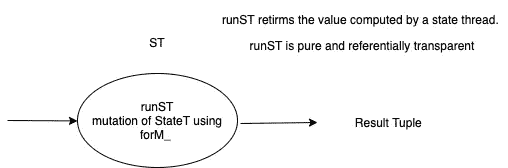
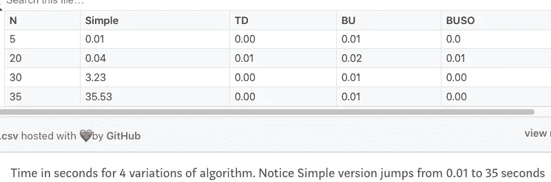
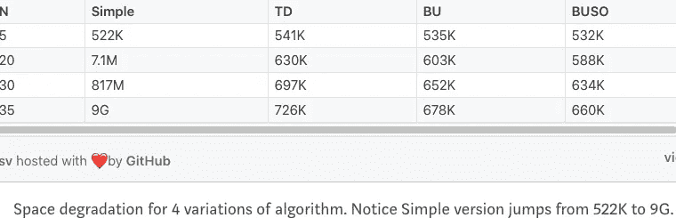

# Haskell 函数式动态编程:自底向上空间优化

> 原文：<https://levelup.gitconnected.com/functional-dynamic-programming-with-haskell-bottom-up-space-optimized-ef7b5f73a849>

使用 runST 和 StateT 的纯功能单态突变

本文是对[第一部分](https://medium.com/@SA_19/functional-dynamic-programming-with-haskell-92e68efe808)和[第二部分](https://medium.com/@SA_19/functional-dynamic-programming-with-haskell-top-down-and-bottom-up-7ccade222337)的跟进

让我们再次访问圣莫纳德哈斯克尔维基。

**引自**[**https://wiki.haskell.org/Monad/ST**](https://wiki.haskell.org/Monad/ST)

ST monad 允许您使用就地更新，但它是可转义的(不像 IO)。ST 动作具有以下形式:

```
ST s α
```

这意味着它们返回α类型的值，并在“线程”中执行。

`runST`函数是纯函数。

**状态单子**

*   可用于跟踪内部状态，作为参数传递是很麻烦的。
*   是具有从当前状态到包含值和更新状态的元组的函数的构造函数。

对于突变，我们将在 runST 中使用 ST 单子

*   ST 是严格状态单子的可变变体
*   它解冻数据，使其变异，然后重新冻结，这样它就不能再变异了。因此，它设法变异，并仍然保持引用透明。-



```
:info ST
newtype ST s a = GHC.ST.ST (GHC.ST.STRep s a) 
... 
instance Monad (ST s):info runST
runST :: (forall s. ST s a) -> a
```

**ST s a** 中的 **s** 是从正在变异的事物中派生出来的类型。“s”不是我们变异的状态。

那么，什么是“s”型呢？

为了将一个可变的引用冻结成一个持久不变的数据结构作为最终结果，ST 在编译时强制执行它，使得**“s”永远不会与 ST 单子**之外的任何东西统一。

为什么我们要讨论上面的问题？

因为我们很好奇，希望确保我们的突变是安全的，并且在 runST 上下文中是透明的。

这是一个空间优化版本，使用了状态单子(或来自单子变形金刚的 StateT)

**在 runST 内使用状态单子的自下而上空间优化版本**

*   countDerangementsBUSO 使用 execStateT 给我们一个新的状态(StateT ),其中`StateT s`是一个基于`State s`的单子转换器，你可以注意到“m”中的值。

```
:info StateT
newtype StateT s (m :: * -> *) a = StateT {runStateT :: s -> m (a, s)}
```

execState 产生新状态的示例。

```
:t execState (put 5) 1
execState (put 5) 1 :: Num s => sexecState (put 5) 1
5
```

*   cdWState 接受一个 Int 并给出 tuple (Int，(Int，Int))的 StateT，其中 tuple 表示从 1 到 n 步进时计算的(currentValue，(currMinus1Value，currMinus2Value))

```
:t cdWState
cdWState :: Monad m => Int -> StateT (Integer, (Integer, Integer)) m ()
```

*   shiftTuple 实现了一个步骤，该步骤计算所有三个值(当前值、当前值减 1、当前值减 2 ),接受一个 Int 和一个 Tuple，并返回一个 tuple

```
:t shiftTuple
shiftTuple :: Int -> (Integer, (Integer, Integer)) -> (Integer, (Integer, Integer))
```

整个代码

使用 Scala Cats 状态的类似代码如下所示

再看一下上述 Simple 和 TD/BU 版本之间的时间/空间比较



BUSO(自下而上空间优化)版本显示了 n = 5 到 35 时近乎恒定的空间利用率和运行时间。