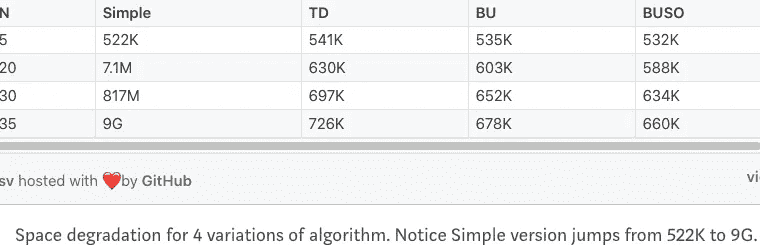

# Haskell 函数式动态编程:自顶向下和自底向上

> 原文：<https://levelup.gitconnected.com/functional-dynamic-programming-with-haskell-top-down-and-bottom-up-7ccade222337>

在 runSTArray 中使用 STArray 的纯函数记忆

本文第一部分[此处](https://medium.com/@SA_19/functional-dynamic-programming-with-haskell-92e68efe808)。

对于有状态计算，Haskell 提供了[圣单子](https://wiki.haskell.org/Monad/ST)。

根据 https://wiki.haskell.org/Monad/ST 的

 [## 控制。单子街

### 这个库提供了对严格状态线程的支持，正如约翰·朗什伯里和西蒙在 PLDI 94 年的论文中所描述的…

hackage.haskell.org](https://hackage.haskell.org/package/base-4.14.0.0/docs/Control-Monad-ST.html#t%3AST) 

在 ST 的许多实例中，有一些是 for 数组，如 MArray STArray 等。在这里，我们将使用 STArray 和函数 runSTArray 将我们的变异封装在一元上下文中。

```
:info ST 
...
instance MArray (STArray s) e (ST s)
```

从 Haskell wiki 上总结一下，**圣单子**:

*   对有状态计算的“线程”进行建模，这些线程可以操作可变引用，但被限制为只能返回纯值。
*   STArray 是严格数组的可变变体
*   它解冻数组，使其变异，然后重新冻结，使其不能再变异。因此，它设法变异，并仍然保持引用透明。


上面的图片可能不太准确，但很容易总结。

将 STArray 与 runSTArray 一起使用时，所有的变异都被包装在一个上下文中。此外，它还有一个额外的机制，即运行一个非常孤立的线程来应对突变。**变异线程的环境与外界没有交换**。

```
runSTArray :: (forall s. ST s (STArray s i e)) -> Array i e
```

我们将在这里重温圣莫纳多[。](https://medium.com/@SA_19/functional-dynamic-programming-with-haskell-bottom-up-space-optimized-ef7b5f73a849)

**一元块 runSTArray 中带有递归的自顶向下版本**

*   使用-1 初始化 STArray 来调用 runSTArray，并为 arr(1)和 arr(2)设置基本用例。
*   调用 cdRecursive，它接受 MArray 的一个实例，如果 arr(n) = -1，则在内部计算并变异 STArray

**对一元突变上下文使用 STArray 的自下而上版本**

这里我们使用 ***forM_*** (这是 ***mapM_*** ，**的翻转版本，不要与命令式 for 循环**混淆)更像是一种语法糖，看起来像命令式“for”。

```
:t forM_
forM_ :: (Foldable t, Monad m) => t a -> (a -> m b) -> m ()
:t mapM_
mapM_ :: (Foldable t, Monad m) => (a -> m b) -> t a -> m ()
```

此外，与 ***mapM*** 不同的是，使用 ***mapM_*** 是因为我们只对它的副作用感兴趣。

```
:t mapM
mapM :: (Traversable t, Monad m) => (a -> m b) -> t a -> m (t b)
```

注意两者的区别。

```
m() 
m (t b)
```

我们对积累成果不感兴趣。所以 ***mapM_*** (或者“翻转”版 ***forM_*** )跳过收集结果。这也是为什么我们没有使用***【mapM】***(或其“翻转”版 ***表单*** )。

为什么我们要费这么大的劲来实现它呢？

维护引用透明性，这是通过表示纯函数实现安全不变性的基础。

**又来了，为什么？**

FP 背后的全部意义是，贴近数学表达式和函数。

如果以这种方式编写，就像数学中的代数一样，人们总是可以从整体上对代码和应用程序进行推理。隔离突变和影响在其中扮演着重要角色。

FP 的一大好处是，我们可以根据“证据”来调整我们的思维。当我们进行代码审查或进行技术讨论或头脑风暴时，这些小“证据”是很大的帮助。

如果我们的基础是坚实的，并且有可靠的数学原理支持，我们就可以避免做出模棱两可的断言。

再看一下上述 Simple 和 TD/BU 版本之间的时间/空间比较



接下来:[Haskell 函数式动态编程:自下而上空间优化](https://medium.com/@SA_19/functional-dynamic-programming-with-haskell-bottom-up-space-optimized-ef7b5f73a849)