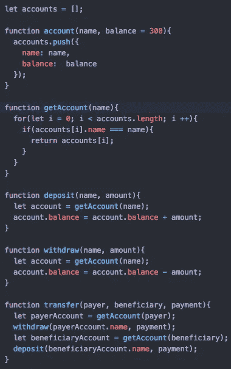
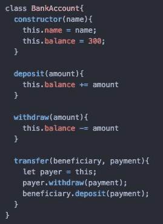
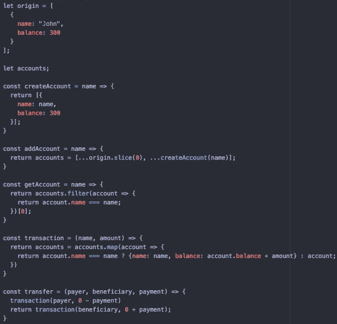

# 函数式、面向对象和过程式编程

> 原文：<https://levelup.gitconnected.com/functional-object-oriented-procedural-programming-644feda5bcfc>

[图像来源](https://www.finerminds.com/personal-growth/personal-growthlife-changing-motivation-dominos/)

**程序化编程**是在一个循序渐进的过程中使用代码来开发应用程序。

例如，从程序上开发一个简单的银行账户应用程序:

*   为个人创建账户(`account`)
*   获得存款或取款的账户(`getAccount`、`deposit`、`withdraw`)
*   在两个不同账户之间转移资金(`transfer`
*   记录所有账户发生的所有变化(`accounts`)

**面向对象编程(** OOP **)** 是利用自包含代码(**对象**)来开发应用。在 JavaScript 中，这可以通过为制造对象创建一个蓝图(**类**)来实现。

一个**类** ( `BankAccount`)封装了一组属性(**构造函数**)和行为(**类函数** `deposit` **、** `withdraw` **、** `transfer`)，可以用来实例化一个特定值的**对象**(即:`let john = new BankAccount(“John”)`)。这通常用于模拟真实世界的对象。

**函数式编程**是利用 ***纯*** 高阶函数来开发应用程序。这涉及到创建避免改变状态和改变数据的代码。像`map`、`filter`、`find`和`reduce`这样的 JavaScript 方法被构建成使得程序接收到的任何数据(功能编码的)都不会改变原始数据。此外，使用**闭包**&**curring**使得函数程序更容易实现和阅读。

这里，数据(`origin`)在创建新账户期间不会发生变化。相反，它的一个副本被创建(`slice`)并与一个新帐户(**)合并成一个新数组(`accounts`)。访问一个账号也是没有突变的(`filter`)。事务的执行是通过创建一个更新的副本来完成的(`accounts`的`map`)。**

与 OOP 不同，在函数式编程中，没有对象的状态是不断更新的(即:没有 John 或 Joe 对象)。相反，帐户或帐户列表的副本被复制、更新和返回。

**参考文献:**