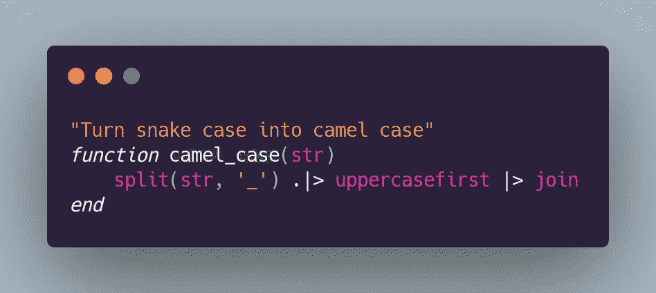

# Julia 中的函数式一行程序

> 原文：<https://levelup.gitconnected.com/functional-one-liners-in-julia-e0ed35d4ff7b>

## 在 Julia 中提高函数式编程技能的实用日常技巧



作为一门如此富于表现力的语言，在为 Julia 编程时，很容易开始思考:

> 难道没有一种更良心、更优雅的方式来解决这个问题吗？

许多问题可以用你熟悉的其他语言的方法直接解决。然而，在朱莉娅的作品中，往往有一种更简短、更清晰的做事方式。

# 部分应用

Haskell 推广了函数的部分应用或 currying。这意味着不需要提供所有的参数，你就可以返回一个新的函数，并接受其余的参数。

这听起来可能有些混乱，所以让我举一些例子。通常你会做这样的比较:

```
**julia>** 3 < 4
true
```

这和这个是一样的，因为 Julia 中的几乎所有东西都是一个函数:

```
**julia>** <(3, 4)
true
```

如果你不提供所有的论据会怎么样？

```
**julia>** <(4)
(::Base.Fix2{typeof(<),Int64}) (generic function with 1 method)
```

取而代之的是一个可调用的对象。我们可以把它储存起来，以后再用:

```
**julia>** f = <(4);

**julia>** f(3)
true
```

这有什么用？使用`map`、`filter`和`reduce`这样的函数真的很优雅。

## 查找所有小于值的元素

查找列表或区域中小于给定值的元素。 `julia> filter(<(5), 1:10) 4-element Array{Int64,1}: 1 2 3 4`

您也可以使用它来查找更大的值:

```
**julia>** filter(>(5), 1:10)
5-element Array{Int64,1}:
  6
  7
  8
  9
 10
```

## 查找元素的索引

我们可以找到数字 4 每次出现的索引

```
**julia>** findall(==(4), [4, 8, 4, 2, 1, 5])
2-element Array{Int64,1}:
 1
 3
```

或者我们可以只寻找第一次出现的:

```
**julia>** findfirst(==(4), [4, 8, 4, 2, 1, 5])
1
```

这当然同样适用于字符串:

```
**julia>** findlast(==("foo"), ["bar", "foo", "qux", "foo"])
4
```

## 过滤掉特定的文件类型

假设您想要获得当前目录中所有`.png`文件的列表。你是怎么做到的？

我们可以使用`endswith`功能。

```
**julia>** endswith("somefile.png", ".png")
true
```

像许多其他函数一样，它可以用于局部应用，这使得它在过滤器中使用非常方便:

```
pngs = filter(endswith(".png"), readdir())
```

# 谓词功能否定

很遗憾，我很晚才发现这是一个诡计。但是事实证明，您可以将`!`放在一个函数的前面，产生一个反转其输出的新函数。这实际上不是 Julia 语言内置的，而是一个函数本身，定义为:

```
!(f::Function) = (x...)->!f(x...)
```

我想说的可能还不完全清楚，所以让我们看一些例子。

## 删除空行

假设您读取了由`filename`给定的文件中的所有行，并且您想要去掉空行，您可以这样做:

```
filter(line -> !isempty(line), readlines(filename))
```

但是这是一个更优雅的方法，使用`!`的部分应用:

```
filter(!isempty, readlines(filename))
```

下面是一个在 REPL 上使用虚拟数据的示例:

```
julia> filter(!isempty, ["foo", "", "bar", ""])
2-element Array{String,1}:
 "foo"
 "bar"
```

# 广播和地图

Julia 有`broadcast`功能，你可以把它想象成一个奇特的地图版本。您甚至可以以类似的方式使用它:

```
**julia>** map(sqrt, [9, 16, 25])
3-element Array{Float64,1}:
 3.0
 4.0
 5.0

**julia>** broadcast(sqrt, [9, 16, 25])
3-element Array{Float64,1}:
 3.0
 4.0
 5.0
```

当处理带有多个参数的函数时，真正的力量就来了，您希望重用其中一个参数，而更改其他参数。

## 将字符串列表转换为数字

要将一个字符串转换成一个数字，可以像这样使用`parse`函数:

```
**julia>** parse(Int, "42")
42
```

将此应用于多个文本字符串的简单方法是编写:

```
**julia>** map(s -> parse(Int, s), ["7", "42", "1331"])
3-element Array{Int64,1}:
    7
   42
 1331
```

我们可以用`broadcast`函数来简化这一点:

```
**julia>** broadcast(parse, Int, ["7", "42", "1331"])
3-element Array{Int64,1}:
    7
   42
 1331
```

事实上，这在 Julia 中是如此有用和常见，以至于有一个使用点`.`后缀的更短的版本:

```
**julia>** parse.(Int, ["7", "42", "1331"])
3-element Array{Int64,1}:
    7
   42
 1331
```

你甚至可以链接这个:

```
**julia>** sqrt.(parse.(Int, ["9", "16", "25"]))
3-element Array{Float64,1}:
 3.0
 4.0
 5.0
```

## 将蛇包转换为骆驼包

在编程中，我们经常有像`hello_how_are_you`这样写的标识符，我们可能想把它转换成像`HelloHowAreYou`这样写的 camel case。事实证明，在 Julia 中只需一行代码就可以轻松做到这一点。

```
**julia>** greeting = "hello_how_are_you"
"hello_how_are_you"

**julia>** join(uppercasefirst.(split(greeting, '_')))
"HelloHowAreYou"
```

## 避免管道运算符的深度嵌套

OOP 爱好者对更面向函数的语言(如 Julia)的一个常见抱怨是，很难读懂深度嵌套的函数调用。然而，我们可以通过使用管道操作符`|>.`来避免深度嵌套，这只是为了简单说明它的作用。下面是等效表达式的一个示例:

```
**julia>** string(sqrt(16))
"4.0"**julia>** 16 |> sqrt |> string
"4.0"
```

这也适用于广播，因此您可以使用它在一种管道中的阶段之间传输多个值。

```
**julia>** [16, 4, 9] .|> sqrt .|> string
3-element Vector{String}:
 "4.0"
 "2.0"
 "3.0"
```

这样，我们就可以把蛇的例子简化为骆驼的例子。

```
**julia>** split(greeting, '_') .|> uppercasefirst |> join
"HelloHowAreYou"
```