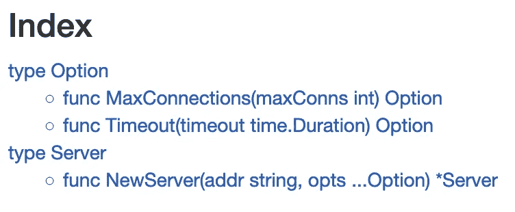

# 类固醇的功能选项

> 原文：<https://levelup.gitconnected.com/functional-options-on-steroids-a9ab31092b97>

## 使使用功能选项变得轻而易举的最佳实践


*原载于*[*https://sagikazarmark . Hu*](https://sagikazarmark.hu/blog/functional-options-on-steroids/)*。*

Functional options 是 Go for clean and extensible APIs 中的一个范例，由[戴夫·切尼](https://dave.cheney.net/2014/10/17/functional-options-for-friendly-apis)和[罗布·派克](https://commandcenter.blogspot.com/2014/01/self-referential-functions-and-design.html)推广。这篇文章是关于自从这个模式被首次引入以来围绕着它出现的实践。

功能选项作为一种创建漂亮干净的 API 配置的方式出现，特别是涉及到可选设置。有许多显而易见的方法可以做到这一点(构造函数变体、配置结构、设置器方法等)，但是当一个包有十几个选项时，这些方法就不够了，而且产生的 API 不如函数选项好。

# 重述—什么是功能选项？

通常，当您构造一个“对象”时，您可以通过调用一个构造函数并向其传递必要的参数来实现:

```
obj := New(arg1, arg2)
```

*(暂且忽略 Go 中没有传统构造函数的事实。)*

函数选项允许用可选参数扩展 API，将上面的代码行变成这样:

```
// I can still do this...
obj := New(arg1, arg2)

// ...but this works too
obj := New(arg1, arg2, myOption1, myOption2)
```

函数选项基本上是变量函数类型实参，接受构造(或中间配置)类型作为参数。由于变量的性质，调用一个没有任何选项的构造函数是完全有效的，即使当你想回到缺省值时，也能保持它的整洁。

为了更好地演示该模式，让我们看一个实际的例子(首先没有功能选项):

```
type Server struct {
    addr string
}

// NewServer initializes a new Server listening on addr.
func NewServer(addr string) *Server {
    return &Server {
        addr: addr,
    }
}
```

添加超时选项后，代码如下所示:

```
type Server struct {
    addr string

    // default: no timeout
    timeout time.Duration
}

// Timeout configures a maximum length of idle connection in Server.
func Timeout(timeout time.Duration) func(*Server) {
    return func(s *Server) {
        s.timeout = timeout
    }
}

// NewServer initializes a new Server listening on addr with optional configuration.
func NewServer(addr string, opts ...func(*Server)) *Server {
    server := &Server {
        addr: addr,
    }

    // apply the list of options to Server
    for _, opt := range opts {
        opt(server)
    }

    return server
}
```

由此产生的 API 易于使用和阅读:

```
// no optional paramters, use defaults
server := NewServer(":8080")

// configure a timeout in addition to the address
server := NewServer(":8080", Timeout(10 * time.Second))

// configure a timeout and TLS in addition to the address
server := NewServer(":8080", Timeout(10 * time.Second), TLS(&TLSConfig{}))
```

相比之下，下面是构造函数变量和配置结构版本的样子:

```
// constructor variants
server := NewServer(":8080")
server := NewServerWithTimeout(":8080", 10 * time.Second)
server := NewServerWithTimeoutAndTLS(":8080", 10 * time.Second, &TLSConfig{})

// config struct
server := NewServer(":8080", Config{})
server := NewServer(":8080", Config{ Timeout: 10 * time.Second })
server := NewServer(":8080", Config{ Timeout: 10 * time.Second, TLS: &TLSConfig{} })
```

与构造函数变体相比，使用函数选项的优势可能是显而易见的:它们更易于维护和读/写。当没有选项传递给构造函数(空结构)时，函数选项也胜过配置结构，但是在下面的部分中，我将展示更多配置结构可能不足的例子。

*点击帖子介绍中的链接，阅读功能选项的完整内容。*

# 功能选项实践

函数选项本身只不过是传递给构造函数的函数。仅仅使用普通函数的简单性提供了灵活性和很大的潜力。正因为如此，这些年来围绕该模式出现了相当多的实践也就不足为奇了。以下是我认为最受欢迎和最有用的实践。

如果你觉得少了什么，请写信给我。

# 选项类型

在应用函数选项模式时，您可能要做的第一件事是为选项函数定义一个类型:

```
// Option configures a Server.
type Option func(s *Server)
```

虽然这看起来不是一个很大的改进，但是通过使用类型名而不是函数定义，它实际上使代码更具可读性:

```
func Timeout(timeout time.Duration) func(*Server) { /*...*/ }

// reads: a new server accepts an address
// and a set of functions that accepts the server itself
func NewServer(addr string, opts ...func(s *Server)) *Server

// VS

func Timeout(timeout time.Duration) Option { /*...*/ }

// reads: a new server accepts an address and a set of options
func NewServer(addr string, opts ...Option) *Server
```

拥有选项类型的另一个优点是 [Godoc](https://godoc.org/) 在类型下组织选项功能:



# 选项列表类型

通常，功能选项用于创建某个事物的单个实例，但情况并非总是如此。创建多个实例时重用默认选项列表也并不少见:

```
defaultOptions := []Option{Timeout(5 * time.Second)}

server1 := NewServer(":8080", append(defaultOptions, MaxConnections(10))...)

server2 := NewServer(":8080", append(defaultOptions, RateLimit(10, time.Minute))...)

server3 := NewServer(":8080", append(defaultOptions, Timeout(10 * time.Second))...)
```

虽然这不是非常可读的代码，但是使用函数选项的目的是拥有友好的 API。幸运的是，有一种方法可以简化它。我们只需要让`[]Option`切片成为`Option`本身:

```
// Options turns a list of Option instances into an Option.
func Options(opts ...Option) Option {
    return func(s *Server) {
        for _, opt := range opts {
            opt(s)
        }
    }
}
```

用`Options`函数替换切片后，上面的代码变成:

```
defaultOptions := Options(Timeout(5 * time.Second))

server1 := NewServer(":8080", defaultOptions, MaxConnections(10))

server2 := NewServer(":8080", defaultOptions, RateLimit(10, time.Minute))

server3 := NewServer(":8080", defaultOptions, Timeout(10 * time.Second))
```

# `With` / `Set`选项名称前缀

选项通常是复杂类型，不像超时或最大连接数。例如，服务器包可能会定义一个`Logger`接口作为选项(默认情况下会返回到 noop logger):

```
type Logger interface {
    Info(msg string)
    Error(msg string)
}
```

`Logger`作为名称显然不能用于选项，因为它已经被接口使用。可能有用，但这不是一个友好的名字。当你把构造函数看作一个句子时，你会想到单词**和**，在我们的例子中是:`WithLogger`。

```
func WithLogger(logger Logger) Option {
    return func(s *Server) {
        s.logger = logger
    }
}

// reads: create a new server that listens on :8080 with a logger
NewServer(":8080", WithLogger(logger))
```

复杂类型选项的另一个常见示例是值的列表(切片):

```
type Server struct {
    // ...

    whitelistIPs []string
}

func WithWhitelistedIP(ip string) Option {
    return func(s *Server) {
        s.whitelistIPs = append(s.whitelistIPs, ip)
    }
}

NewServer(":8080", WithWhitelistedIP("10.0.0.0/8"), WithWhitelistedIP("172.16.0.0/12"))
```

在这种情况下，默认行为通常是 append 而不是 set，这符合这样一个事实，即 **with** 建议添加到一个列表中，而不是覆盖它。如果需要覆盖现有的一组值，可以在选项名中使用 **set** word:

```
func SetWhitelistedIP(ip string) Option {
    return func(s *Server) {
        s.whitelistIPs = []string{ip}
    }
}

NewServer(
    ":8080",
    WithWhitelistedIP("10.0.0.0/8"),
    WithWhitelistedIP("172.16.0.0/12"),
    SetWhitelistedIP("192.168.0.0/16"), // overwrites any previous values
)
```

类似地，如果需要的话，可以很容易地创建一个前置选项。

# 预设模式

特定的用例通常足够通用，可以在库中支持它们。在配置的情况下，这可能意味着一组选项被组合在一起，并用作用例的预设。在我们的示例中，`Server`可能有一个公共和一个内部用例，它们以不同的方式配置超时、速率限制、连接数等:

```
// PublicPreset configures a Server for public usage.
func PublicPreset() Option {
    return Options(
        WithTimeout(10 * time.Second),
        MaxConnections(10),
    )
}

// InternalPreset configures a Server for internal usage.
func InternalPreset() Option {
    return Options(
        WithTimeout(20 * time.Second),
        WithWhitelistedIP("10.0.0.0/8"),
    )
}
```

虽然预设在某些情况下很有用，但它们可能在内部库中更有价值，而在公共的通用库中价值较低。

# 默认值与默认预设

在 Go 中，空值总是有一个默认值。对于数字，它通常是零，对于布尔值，它是`false`，以此类推。在可选配置中依赖默认值被认为是一个好的做法。例如，零值应该意味着无限制的超时，而不是“无超时”(这通常是无意义的)。

但是在某些情况下，零值并不是一个好的默认值。例如，`Logger`的默认值是`nil`，这将导致混乱(除非您使用条件检查来保护日志调用)。

在这些情况下，在构造函数中设置值(在应用选项之前)是定义回退的好方法:

```
func NewServer(addr string, opts ...func(*Server)) *Server {
    server := &Server {
        addr:   addr,
        logger: noopLogger{},
    }

    // apply the list of options to Server
    for _, opt := range opts {
        opt(server)
    }

    return server
}
```

我见过一些默认预设的例子(使用上一节解释的模式)。然而，我不认为这是一个好的做法。这比简单地在构造函数中设置默认值更缺乏表现力:

```
func NewServer(addr string, opts ...func(*Server)) *Server {
    server := &Server {
        addr:   addr,
    }

    // what are the defaults?
    opts = append([]Option{DefaultPreset()}, opts...)

    // apply the list of options to Server
    for _, opt := range opts {
        opt(server)
    }

    return server
}
```

# 配置结构选项

将`Config` struct 作为函数选项可能不太常见，但也不是没有先例。其思想是函数选项引用一个配置结构，而不是引用正在创建的实际对象:

```
type Config struct {
    Timeout time.Duration
}type Option func(c *Config)type Server struct {
    // ... config Config
}
```

当您有大量选项，并且创建一个配置结构似乎比在一个函数调用中列出所有选项更干净时，这种模式很有用:

```
config := Config{
    Timeout: 10 * time.Second
    // ...
    // lots of other options
}

NewServer(":8080", WithConfig(config))
```

此模式的另一个用例是设置默认值:

```
config := Config{
    Timeout: 10 * time.Second
    // ...
    // lots of other options
}

NewServer(":8080", WithConfig(config), WithTimeout(20 * time.Second))
```

# 高级模式

在编写了几十个功能选项之后，您可能会开始怀疑是否有更好的方法。不是从消费者的角度，而是从维护者的角度。

例如，如果我们可以定义类型并将它们用作选项会怎么样:

```
type Timeout time.Duration

NewServer(":8080", Timeout(time.Minute))
```

(注意从消费者的角度来看 API 是如何保持不变的)

事实证明，通过改变`Option`类型，我们可以很容易地做到这一点:

将选项功能重新定义为接口，为实现功能选项的许多新方法打开了大门:

```
// Option configures a Server.
type Option interface {
    // apply is unexported,
    // so only the current package can implement this interface.
    apply(s *Server)
}
```

各种内置类型可以用作没有函数包装的选项:

```
// Timeout configures a maximum length of idle connection in Server.
type Timeout time.Duration

func (t Timeout) apply(s *Server) {
    s.timeout = time.Duration(t)
}
```

选项列表和配置结构(见前面章节)也可以像这样重新定义:

```
// Options turns a list of Option instances into an Option.
type Options []Option

func (o Options) apply(s *Server) {
    for _, opt := range o {
        o.apply(s)
    }
}

type Config struct {
    Timeout time.Duration
}

func (c Config) apply(s *Server) {
    s.config = c
}
```

不过，我个人最喜欢的是在多个构造函数中重用一个选项的可能性:

```
// ServerOption configures a Server.
type ServerOption interface {
    applyServer(s *Server)
}

// ClientOption configures a Client.
type ClientOption interface {
    applyClient(c *Client)
}

// Option configures a Server or a Client.
type Option interface {
    ServerOption
    ClientOption
}

func WithLogger(logger Logger) Option {
    return withLogger{logger}
}

type withLogger struct {
    logger Logger
}

func (o withLogger) applyServer(s *Server) {
    s.logger = o.logger
}

func (o withLogger) applyClient(c *Client) {
    c.logger = o.logger
}

NewServer(":8080", WithLogger(logger))
NewClient("http://localhost:8080", WithLogger(logger))
```

# 摘要

Functional options 是一种功能强大的模式，可以用几十个选项来创建干净的(可扩展的)API。虽然这比维护一个简单的配置结构要多一点工作，但是它提供了更多的灵活性，并且比其他选择产生了更干净的 API。

# 进一步阅读

[](https://dave.cheney.net/2014/10/17/functional-options-for-friendly-apis) [## 友好 API 的功能选项

### 下面是我今年在 dotGo 上发表的演讲文本，友好 API 的功能选项。它…

dave.cheney.net](https://dave.cheney.net/2014/10/17/functional-options-for-friendly-apis) [](https://commandcenter.blogspot.com/2014/01/self-referential-functions-and-design.html) [## 自指函数与选项设计

### 我一直在尝试找到一种好的方法来处理我正在编写的 Go 包中的设置选项。上的选项…

commandcenter.blogspot.com](https://commandcenter.blogspot.com/2014/01/self-referential-functions-and-design.html)  [## Go 中的函数选项:在 Golang 中实现选项模式

### 这篇文章讨论了 Go 中有哪些功能选项，以及我们如何使用选项模式来实现它们…

www.sohamkamani.com](https://www.sohamkamani.com/blog/golang/options-pattern/) [](https://www.calhoun.io/using-functional-options-instead-of-method-chaining-in-go/) [## 在 Go - Calhoun.io 中使用函数选项代替方法链

### 在 Java 中，使用方法链(也称为构建器模式)来构造库是很常见的。

www.calhoun.io](https://www.calhoun.io/using-functional-options-instead-of-method-chaining-in-go/) 

*原载于*[*https://sagikazarmark . Hu*](https://sagikazarmark.hu/blog/functional-options-on-steroids/)*。*