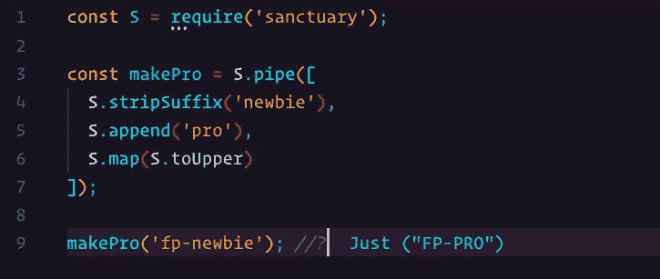

# 面向 JavaScript 开发人员的函数式编程——不变性和纯函数

> 原文：<https://levelup.gitconnected.com/functional-programming-for-javascript-developers-669c3db705f0>

学习函数式编程以极具挑战性而闻名。然而，这是你试图掌握的任何技能的情况。所以我会说学习函数式编程并不比学习一般的编程差，只是不同而已。

在这个系列中，我将一步一步地指导您学习函数式编程的过程，而不会用诸如“单子”、“函子”和“应用程序”之类的复杂词汇来淹没您。

加入我的旅程吧，我保证在旅程结束时，通过你的努力，你会成为一名更好的程序员。

我将开始介绍一些你需要熟悉的基本概念。随着我们的进展，我们将开始深入更复杂的话题。

# 不变

在函数式编程(FP)中，我们非常努力地尽可能少地改变我们的数据。如果你不确定这意味着什么，另一种说法是，我们试图尽可能少地改变变量的值。例如，以下面的声明为例:`const a = 1;`

变量`a`不应该改变。它不应该是 1 以外的任何值。在这种情况下，我们使用的是`const`，所以我们不能更改它而不出错。然而，数组允许你使用`push`或`pop`项，即使它们是用`const`声明的。你不应该在函数式编程中这样做。

我说我们应该尽可能少地改变我们的数据*的原因是因为我们的程序仍然需要做一些事情。如果数据从来没有变异，什么都不会发生，这是相当无用的。然而，FP 和“正常编程”的区别在于，变异是以一种非常可控的方式发生的。*

例如，所有的突变通常发生在程序的最后。我完全理解为什么现在这样做没有意义。然而，随着你了解的越来越多，你头脑中的灯泡就会熄灭。就目前而言，除非绝对需要，否则尽量不要改变数据。此外，随着你在这方面做得越来越好，你会发现经常有一些地方你会认为你必须做，而实际上你并不需要。

那么，我们为什么要争取不变性呢？原因有很多，但我至少会提到我认为最重要的一个原因:稳定。如果你知道你的变量永远不会改变，你知道你可以相信数据在那里，你可以保证它有你期望的值。因此，您的代码将有更少的机会隐藏意外的错误。巨大的收益，对吧？

我理解你现在为什么会怀疑。像“我如何在我的程序中让事情发生？”以及“我如何向我的数组中添加一个项目？”可能会突然出现在你的脑海里。随着我们的进展，我会更多地谈论这一点，但现在，我要说的是——在 FP 中，我们不是一直改变我们的数据，而是基于现有数据创建新数据并使用它。随着我们继续下去，这一点会变得更加清楚。相信我！

# 纯函数

本着永恒性的伟大精神，让我们继续纯函数的概念。顾名思义，函数在函数式编程中非常重要。幸运的是，在 Javascript 中，函数是一等公民。这使得它成为学习 FP 的一种非常好的语言。

在 FP 中，所有的函数都应该是纯函数——至少在有意义的时候。但是纯粹是什么意思呢？这意味着该功能没有副作用。咄…

好，我们试试另一个提示。纯函数无论何时得到相同的输入都会返回相同的值。

还不确定那是什么意思吗？这完全可以理解。让我给你们举几个例子。

让我们来看一个纯函数:

函数`add`是纯函数，因为它只处理它的参数。还要注意，它不会改变任何参数，它只是基于这两个参数返回一个新值。

记得我也提到过一个纯函数应该没有副作用。以下是其他一些可能不明显的副作用:

*   `console.log`(改变外界，特指输出)
*   写入文件(改变外部世界，文件系统)
*   随机性，即`Math.random`(不会基于相同的输入返回相同的值)

希望这能让我们明白什么是纯函数。

这就结束了这个系列的开始。了解和理解纯函数和不变性，以及这两者的重要性是很重要的。

总之，这一切都是为了让你的程序稳定可靠。不管你用哪种风格写作，这些信息都是有用的。随着我们的深入，你会发现完全有可能混合一些概念——这最终会让你成为一个更好的程序员。

在本系列的下一篇文章中，我们将开始研究[curry](https://medium.com/@janvidar/functional-programming-for-javascript-developers-currying-2d16766909e9)——一个让您的函数更加可重用和可组合的绝妙技巧(另一个概念即将出现)。