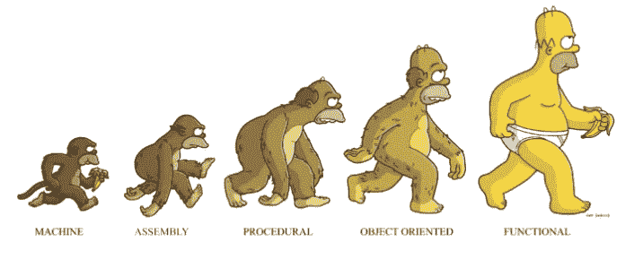
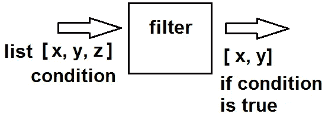
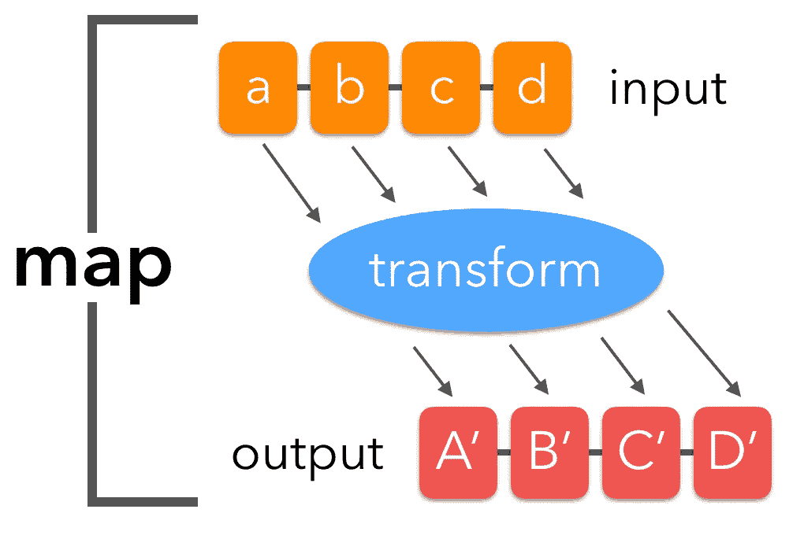
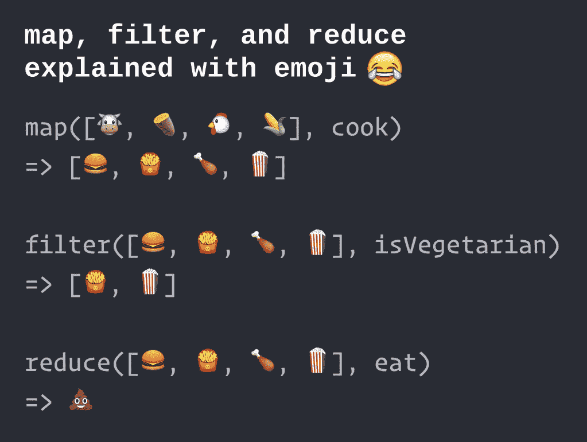

# 函数式编程:高阶函数

> 原文：<https://levelup.gitconnected.com/functional-programming-higher-order-functions-80aa61e5799c>

更好地理解 JavaScript 的高阶函数。



[函数式编程](https://medium.com/@FunctionalWorks/what-functional-programming-is-why-it-makes-you-better-29ee34284a6e)牛逼！它让编程变得有趣。

学习“函数式”编程会让你成为一名出色的程序员，你会对自己的工作质量感到安全。


**你将能够用更少的错误和更少的时间编写你的程序，因为你将能够重用你的代码。**

在这个范例中，我们将关注函数式编程中最重要的概念之一，那就是 [**高阶函数**](https://eloquentjavascript.net/05_higher_order.html) 。

所以让我们开始吧！

在 JavaScript 和许多函数式编程语言中，**函数是值。**

让我们以一个简单的函数为例:

```
function double(x) {
  return x * 2
}
```

JavaScript 的超酷之处在于，我们可以把这个函数做成匿名函数，通过声明一个变量来传递和重用它。

```
let double = function(x) {
    return x * 2
 }let pancake = double pancake(40) // 80
```

我们声明了一个变量 *double* ，并将它赋给了匿名函数。然后我们声明了另一个变量， *pancake* ，并将其赋给同一个函数。就像字符串和数字一样，函数也可以赋给变量。

所以，在函数式编程中，**函数是值，它们可以赋给变量，也可以传递给其他函数。**

> **对其他函数进行操作的函数，无论是将它们作为自变量还是通过返回它们，都被称为*高阶函数。—参见雄辩的 JavaScript***

换句话说，就像我们的例子一样，高阶函数可以被理解为传递给其他函数来做令人惊叹的事情的函数！！！

当然，有道理，对吧？但是这些有什么用呢？

> 作文。

我们可以将一个函数放入另一个函数，这一事实允许我们将许多小函数组合成更大的函数。

让我们看看如何使用这些高阶函数之一。可能最基本和最有用的功能是

# 过滤器( )



Filter()是数组上的一个函数，它接受另一个函数作为它的参数，它将使用这个参数返回数组的一个新的过滤版本。

让我们做一些有趣的东西。

```
const pets = [ { name: 'Flip flop', species: 'rabbit' }, { name: 'Dino', species: 'dog' }, { name: 'Ralph', species: 'fish' }, { name: 'Chuchi', species: 'cat' }, { name: 'Ari', species: 'dog' }, { name: 'Spock', species: 'dog' }, { name: 'ying yang', species: 'cat' },]
```

我们在这里想要做的只是“过滤”掉所有的狗。

我们的输出必须包括迪诺，阿里和斯波克。😆

问题:我如何用一个普通的循环来做这件事？

```
let dogs = []for (let i = 0; i < pets.length; i++) {
   if (pets[i].species === 'dog')
     dogs.push(pets[i])
}
```

这创建了一个数组来保存所有的狗，然后它遍历*宠物*数组来检查物种是否等于“狗”——然后它将把它推入*狗*数组。如果你控制台. log(狗)你会看到一系列的对象。

精彩！

现在让我们使用**过滤器()**的方法来做这件事🤔

```
let dogs = pets.filter(function(*pet*){
   return pet.species === 'dog'
})console.log(dogs) // output
[
  { name: 'Dino', species: 'dog' },
  { name: 'Ari', species: 'dog' },
  { name: 'Spock', species: 'dog' }
]
```

Filter()接受一个参数:另一个函数。像这样的函数叫做[回调函数](https://developer.mozilla.org/en-US/docs/Glossary/Callback_function)。

那么，filter()在这里是如何工作的呢？

filter()将遍历 *pets* 数组中的每一项，对于每一项，它将把它传递给一个回调函数，该函数将告诉 filter()无论什么是真或假，并告诉每一项是否应该在新数组中。这种情况会一直发生，直到针对这种情况对每个项目进行了测试。

我们再读一遍，好吗？

过滤器()…

1.  将遍历 *pets 数组*中的每一项
2.  会将每一项传递给一个回调函数
3.  那个回调函数会告诉 filter()某个东西是真还是假(因为给了它一个条件)
4.  这将决定哪个项应该在新数组中，或者不在。
5.  所有满足条件的项目将显示在新的数组中。

我们正在编写更少的逻辑，当我们编写这样的软件时，它允许我们重用这个软件。并且，filter()为我们创建了一个新的数组:我们不需要像以前那样编写它(for 循环)。回调函数和过滤器( )挂在一起。友情！

让我们实际上花一点时间，通过将回调函数与过滤器分开来打破这种友谊( )

```
let isDog = function(*pet*) {
   return pet.species === 'dog'
}let dogs = pets.filter(isDog)// i miss you... 
```

我们看到 filter()接受了 *isDog* 回调函数，然后执行任务。我们有两组完全不同的问题。询问宠物是不是狗，以及 **2。**把它们放在一个单独的数组里的想法。

使用高阶函数可以让我们同时完成这两项任务。友情！

# 概念回顾: **JavaScript 函数是值，您可以通过将代码分成小的简单函数并用高阶函数组合在一起来利用这一点。**

好吧！现在是时候看看另一个神奇的高阶函数了。

# 地图( )



因此，很像 filter()，map()函数遍历数组，但不像 filter()，它不会丢弃不符合条件的对象。相反，它改变了他们！！！！

这到底是什么意思？改造他们？巫术！

我会给你看的！再来看看我们的超萌宠物阵列。

```
const pets = [ { name: 'Flip flop', species: 'rabbit' }, { name: 'Dino', species: 'dog' }, { name: 'Ralph', species: 'fish' }, { name: 'Chuchi', species: 'cat' }, { name: 'Ari', species: 'dog' }, { name: 'Spock', species: 'dog' }, { name: 'ying yang', species: 'cat' },]
```

在这个例子中，**我们想要得到一个包含所有宠物名字的数组。**

我们的输出看起来会像这样

```
['Flip flop', 'Dino', 'Ralph', 'Chuchi', 'Ari', 'Spock', 'ying yang']
```

在我们使用 map()函数解决这个问题之前，让我们先在一个 for 循环中完成它！！！—你知道这很重要。

```
let names = []for (let i =0; i < pets.length; i++) {
   names.push(pets[i].name)
}console.log(names) 
```

因此，for 循环遍历*宠物*数组，并为每只宠物挑选名字属性并将其推入*名字*数组。

现在，让我们在 map()中这样做

记住，filter()处理真或假条件，map()期望回调函数返回一个*转换的对象。*

```
let names = pets.map(function(*pet*) {
   return pet.name
})console.log(names)// output
['Flip flop', 'Dino', 'Ralph', 'Chuchi', 'Ari', 'Spock', 'ying yang']
```

精彩！多整洁啊！太牛逼了！

> 更少的代码几乎总是意味着更少的错误

***使用 map()返回一个对象的子集是常见的使用模式。***

因为 map()期望回调函数返回任何对象，所以我们可以用它来返回全新的对象。


全新的我

让我们重构代码，返回一个新的“更酷”的对象

```
let names = pets.map(function(*pet*) {
   return pet.name + ' is a ' + pet.species
})console.log(names)// output [ 'Flip flop is a rabbit',
  'Dino is a dog',
  'Ralph is a fish',
  'Chuchi is a cat',
  'Ari is a dog',
  'Spock is a dog',
  'ying yang is a cat' ]
```

刚刚发生了什么！？这太美了！与前面的 for 循环相比，这样的代码很少。

我实际上想通过使用一个[箭头函数](https://developer.mozilla.org/en-US/docs/Web/JavaScript/Reference/Functions/Arrow_functions)让它更漂亮。是的。

```
let names = pets.map((pet) => pet.name + ' is a ' + pet.species)
```

我的天啊。太棒了。一行。

在 ES6 箭头函数中，我们可以删除回车，因为箭头后面的内容将被隐式返回。哇，谢谢 [ECMAScript](https://www.ecma-international.org/publications/standards/Ecma-262.htm) 😃

现在是我们讨论所有高阶函数中最强大的函数的时候了。

> 一个功能来统治他们所有人


# 减少( )

但是在我们进入 reduce()的能力之前，所有这些的共同点是它们将一个数组转换成其他东西。

*map()将获取一个数组，并将该数组转换成一个长度相同的数组，但是每个单独的项都进行了转换。*

*filter()将一个数组转换成一个更小的数组。*

还有其他几个高阶函数，但我们只关注这三个。

Enter: **reduce( ) —使用 reduce，您可以做所有高阶函数可以做的事情。它是数组变换的多工具。**


还可以将 reduce()与其他高阶函数一起使用。(在另一篇文章中，我将更详细地介绍 reduce()，但是现在，让我们找点乐子吧)

让我们做一个新的简单数组。得让那些宠物休息一下。

```
const orders = [ { amount: 250 }, { amount: 400 }, { amount: 100 }, { amount: 325 },
]
```

我们在这里试图解决的问题是**我们想要汇总订单数组中的所有金额。**

本着传统的精神，让我们先在 for 循环中这样做！

```
let totalAmount = 0for(let i = 0; i < orders.length; i++) {
  totalAmount += orders[i].amount
}console.log(totalAmount)//output 1075
```

啊哈！**因此，对于每个订单，我们获取金额值，并将其添加到总金额中。**

现在，让我们使用 reduce()来实现它

```
let totalAmount = orders.reduce(function(sum, order) { console.log('hello', sum, order) return sum + order.amount
}, 0)
```

所以就像 map()或者 filter()一样，reduce()取的是回调函数，但是和它们不一样，它要的是对象。你可以把这个物体看作我们求和的起点。

这个 sum 将作为第一个参数传递给 reduce()回调函数，就像 map()和 filter()一样，reduce()也将接收迭代项，但它将作为第二个参数。

然后，我们将得到我们收到的总额(初始值),并将订单金额添加到其中。

*注意 0:该函数将获取第一阶，并向其添加 0，然后返回值。*

在下一种情况下，该值将依次作为总和传递，这又会将它的数量添加到该值中，并返回该值，依此类推，直到所有值相加。

reduce 函数中的 console.log 以一种时髦的方式说明了这一点。它是对*总数*和*订单*的呼应。让我们来看看上面函数的输出。

```
// output hello 0 { amount: 250} hello 250 { amount: 400} hello 650 { amount: 100} hello 750 { amount: 325} 1075
```

在第一种情况下，我们接收数组中的第一个对象，我们还获得了作为 reduce 中的第二个参数传递的起始值。(那是零点)

我们在这里返回一个值，该值将是零加 250，该值将被传递到 reduce 的第二次迭代中，我们在“hello 250 { amount: 400 }”中看到该值，我们将 400 + 250 = 650 相加。然后我们返回 650，它将被传递到第三次迭代，并被加到 100。

这种情况会一直持续下去，直到所有的值都被计算出来，并返回最终的和，在我们的例子中是 1075。

哇！！！

好吧，好吧，我快好了。

作为对自己的一个练习，为什么不试着用箭头函数编写我们的 reduce 函数，并欣赏它的优雅呢？是的，很好。

我就把这个放在这里，作为我们理解的总结—



*结论性概念回顾:*

**JavaScript 函数是值，您可以利用这一点，将代码分成简单的小函数，并用高阶函数组合在一起。**

**高阶函数是数组变换。而 reduce()是一个数组转换的多工具。**