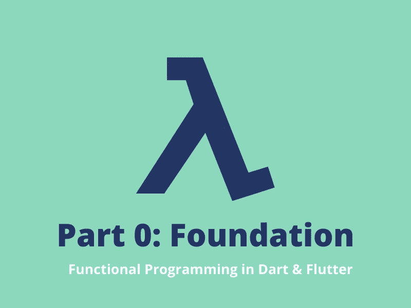
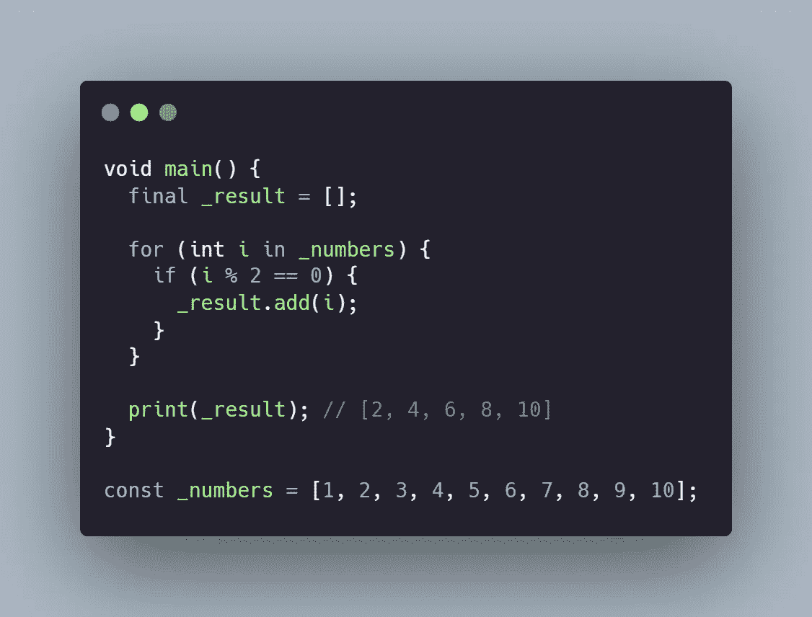
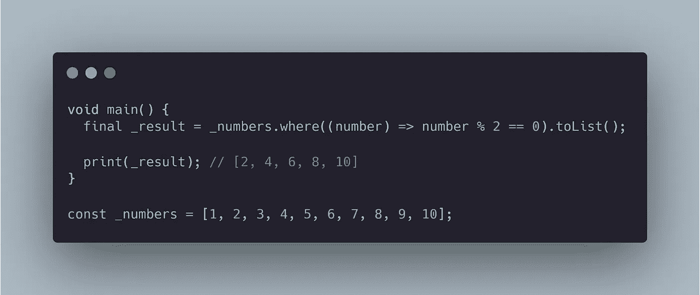
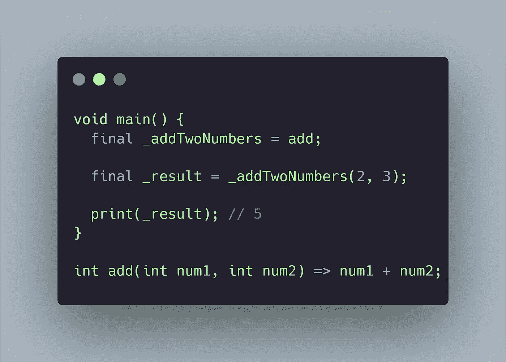

# Dart & Flutter 中的函数式程序设计:基础—第 0 部分

> 原文：<https://levelup.gitconnected.com/functional-programming-in-dart-foundation-part-0-7e932517b824>

## [功能编程](https://medium.com/@yogi-6/list/functional-programming-in-dart-flutter-2f3ac9d7fa39) /基础

## 在本系列文章中，我们将开始理解函数式编程并使用 Dart & Flutter 实现它。

在出发之前，我想花点时间自我介绍一下。我是 Yogesh，一名软件工程师，已经研究移动技术很长时间了。我从 Android 开始，用 React-native 跳入跨平台的世界，然后最终切换到 Flutter。我绝不是函数式编程方面的专家，但我希望分享我的学习，并为其他想走同样道路的人提供一个路线图。

开始吧！

# 目录

*   什么是范式？
*   命令式 vs 陈述式
*   什么是函数式编程？
*   为什么要学函数式编程呢？
*   我们要报道什么？

# 什么是范式？

范式是一种思维模式。这是一种编程方式。这是我们思考和编写代码的方式。虽然范式有几种类型，但我们感兴趣的是命令式和声明式。

## 必要的

命令式范例是你给计算机的一组指令。你给出如何执行程序的详细步骤。我们来看一个例子。

**问题陈述:**你有一个数字列表，你想找出所有的偶数。

在上面的代码片段中，您以循环和条件的形式给出了指令。

1.  首先，创建一个结果数组。
2.  迭代数字数组中的所有元素。
3.  检查当前元素是偶数还是奇数。
4.  如果把它添加到结果数组中。

## 宣言的

声明性范例告诉程序它想要什么。它关注的是“什么”而不是“如何”。这有助于使代码更加合理。

Flutter 是一个声明性框架。

让我们举一个同样的例子，用声明式的方式来解决它。

现在，你告诉程序你想要什么。此外，你不再变异任何状态。

如果我们比较这两个片段，你会观察到，对于命令式，我们必须快速浏览循环，根据它在做什么在心里执行它，然后我们理解代码。而声明性看起来像写得很好的散文(可以通过将`number % 2 == 0`转换成一个单独的`isEven`函数来进一步增强)。

你会经常听到这个短语，**祈使句侧重于“如何”**，**陈述句侧重于“什么”**。

# 什么是函数式编程？

函数式编程(又名。FP)是一种编写程序的声明式方法，其中程序由函数组成。一旦我们涵盖了 FP 中的一些术语，这个定义就更有意义了。

在 Dart 中，函数被视为一等公民，这意味着函数被视为任何其他值，如字符串，整数，布尔等。可以将函数作为参数传递，将它们赋给一个变量，然后返回函数作为结果。

我们将函数`add`赋给了一个名为`_addTwoNumbers`的变量。这意味着`_addTwoNumbers` 现在与`add`方法具有相同的签名。它接受两个参数，将它们相加并返回结果。

Dart 不是公认的函数式语言，但是它支持一些概念，可以用来理解 FP。

许多命令式语言正在采用 FP 概念，比如 lambdas 和高阶函数。

# 何必学 FP 呢？

在进入技术方面之前，我想指出的是，学习 FP 让你以不同的方式思考。对我来说，这就像是锻炼我的大脑。我觉得它帮助我提高了开发技能和处理问题的方式。

1.  这使得代码更容易推理。代码变得更加简洁和有表现力。合理的代码更容易维护。
2.  它有助于模块化，并且高度可组合。
3.  它把问题分解成更小的部分。
4.  通过并行执行、内存化和其他技术(我们将讨论这些)来帮助提高性能。
5.  更容易编写测试并有助于调试。

# 我们要报道什么？

像纯函数，副作用，高阶函数，Currying，组成，部分应用，函子，参考透明度，方程式推理，单子，态射等概念。我们还将探索帮助我们在 Dart & Flutter 中实现 FP 的包。

*“哎呀小子！这是怎么回事？”*这是我第一次听到这些名词时的反应。

通过这次旅行，我们的目标是理解这些术语。虽然这可能有助于你在同事面前表现得很酷，但主要动机是理解潜在的概念，而不是为了表现得很酷而随意抛出。

**牛逼！拍拍自己的背，因为你坚持到了最后。我希望我为你投入的时间增加了一些价值。在 [**GitHub**](https://github.com/Yogi-6/functional_programming_dart) 知识库上找到更多示例，并在 [**Twitter**](https://twitter.com/_yogi_6) 或 [**LinkedIn**](https://www.linkedin.com/in/yogi6/) 上寻求建议/问题或任何您希望我涵盖的主题。你可以鼓掌支持👏，感谢您的阅读:)更多信息请关注😄**

下次见，伙计们！

# 本系列的其他文章

*   基础
*   [纯功能&副作用](https://yogi-6.medium.com/pure-functions-side-effects-in-dart-functional-programming-part-1-fb931d6c0351)
*   [Arity、Closure、Currying、Partial Application & more](/arity-closure-currying-partial-application-more-in-dart-functional-programming-part-2-4534a8b7f374)
*   [作文](/composition-in-flutter-dart-functional-programming-part-3-ffba917aee3d)
*   [不变性&相等性](/immutability-equality-in-flutter-dart-functional-programming-part-4-339a4e9312bb)
*   [高阶函数&递归](https://medium.com/flutter-community/higher-order-functions-recursion-in-dart-functional-programming-part-5-4237bc114005)