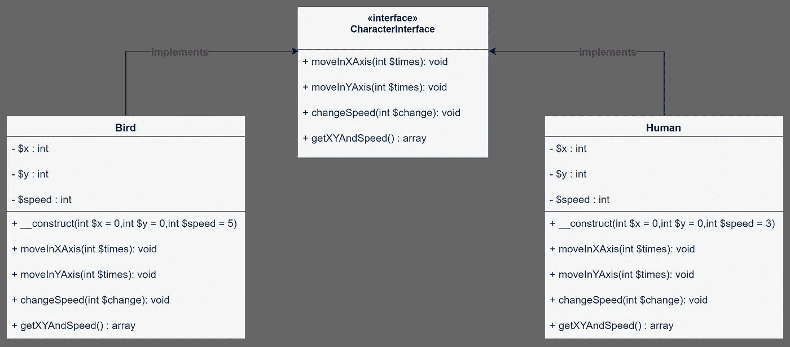
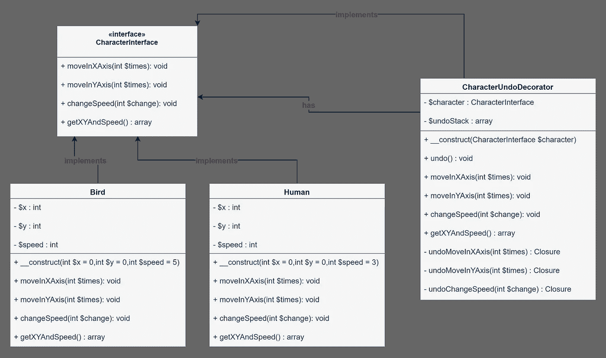

# OOP 概念中的函数式编程:矫枉过正

> 原文：<https://levelup.gitconnected.com/functional-programming-in-oop-concept-the-overkill-fb940f63c6d5>

格伦·卡丽在 [Unsplash](https://unsplash.com?utm_source=medium&utm_medium=referral) 拍摄的照片

有许多遵循不同编程范例的语言。其中一些严格地强迫你遵循它的范式，而另一些给你更多的灵活性。但是灵活性是有代价的。如果开发人员缺乏一些技能和经验，那么一切都会变得混乱。这种工作产生了糟糕的可读性、复杂的业务领域、难以维护和测试的代码库。另一方面，如果它被明智地使用，那么我们可以看到语言提供的力量。

在此之前，我先解释几个术语。然后，我将像我在上一篇文章中所做的那样展示真实世界的例子。在这些例子中，我将使用 PHP 作为编码语言。

## 一流的功能

> 在计算机科学中，如果一种编程语言将函数视为一等公民，则称该语言具有一等函数。这意味着该语言支持将函数作为参数传递给其他函数，将它们作为其他函数的值返回，并将它们赋给变量或存储在数据结构中。

首先，作为一等公民意味着他们可以是函数的参数，他们可以从函数返回，你可以在语句中给它们赋值。想象一下最原始的类型，比如 integer 和 float。

正如你所看到的，我们使用整数值作为参数，函数也返回一个整数值。第四行有一个赋值语句。它声明 integer 是 PHP 中的一等公民。函数呢？

如图所示，我们可以像使用其他类型的函数一样使用函数。现在很明显他们在 PHP 里是一流的。

## 更好的功能

从 5.4 版本开始，PHP 引入了一种新类型，称为**闭包类** 。值得一提的是，匿名函数也是闭包。

关于变得更好，这个类为我们提供了一个" **use** "语句。我们使用这个语句从内部作用域访问外部作用域。通过这种方法，我们可以捕获全局变量、父作用域变量，甚至父函数参数。

## 概念证明

在一开始，我提到了一个现实世界的例子。我相信提供它们对于像这篇文章一样的文章是必不可少的。因为对这些术语一无所知的读者可能想知道他/她为什么要用它。此外，它给了一个实验的机会。所以，我创造了一个场景。假设我们正在进行游戏开发，我们的游戏包含不同类型的角色，比如鸟和人。并假设这些角色需要撤销他们的动作。我们可以遵循面向对象的原则，同时从函数式编程原则中获益。

***要求***

*   所有的角色应该能够在 X 和 Y 轴上移动。
*   所有类型的角色都应该有一个速度属性。
*   角色需要撤销他们的动作，比如后退或者变回速度等等。

***设计***

设计是软件开发的一个重要部分，然而一些开发人员倾向于忽略或低估它。在我们的例子中，起初有两个实体，鸟类和人类类。它们的行为几乎相同，这意味着它们需要实现相同的接口。

另一方面，他们需要处理撤销他们的行为。但是如果我们把这个责任推到他们身上，显然我们违反了单一责任原则。相反，我们打算用一个装饰图案来解决这个问题。这种模式修饰一个类，赋予它额外的能力，并保持实体的纯净。

还有另一件事要解决。我们不能立即执行撤销功能。因为这取决于用户，而用户何时需要它们是不可预测的。一种方法是存储它的状态，每当用户想要撤销上一个动作时，就返回前一个状态。但有时这还不够，问题可能需要更灵活的解决方案。在这种情况下，我们可以利用一流的功能。我们针对实体的每个常规函数创建一个反向函数，然后将它们存储在堆栈中。无论何时需要它们，都可以从堆栈中弹出。这种方法提供了在任何需要的时候执行它们的自由。

***实现***

到目前为止，它是一个普通的实现。为了简单起见，我尽量保持它们的纯净和直白。

有几件事我不得不提一下。这个修饰类就像其他实现“字符接口”的类一样。它可以做他们做的事情，但也有额外的能力。在我们的例子中，它们是私有撤销函数和公共“撤销”方法。在私有方法中，我们提供对常规方法的反作用。我们将这些计数器函数存储在堆栈中。每当客户端调用公共撤销方法时，我们从堆栈中弹出最后一个函数。

***用法***

和预期的结果一样:

## 过度杀戮

尤其是来自前端开发的人更倾向于这样做。滥用这种灵活性会导致不必要的工作量，从而影响生产率。描述这种情况的最佳方式是举例说明:

想象一下那些本地函数(strtoupper，strtolower)就是我们的定义。如果我们决定重构它们会发生什么。即使你使用相当先进的编辑器，它也无法检测到它。此外，这项工作不属于那种方法。相反，当您需要在控制器或其他地方使用该姓氏时；

> return strtoupper((新人())-> getSurname())；

这种说法更有道理。我可以举出很多例子，但希望我已经触及了主要思想。