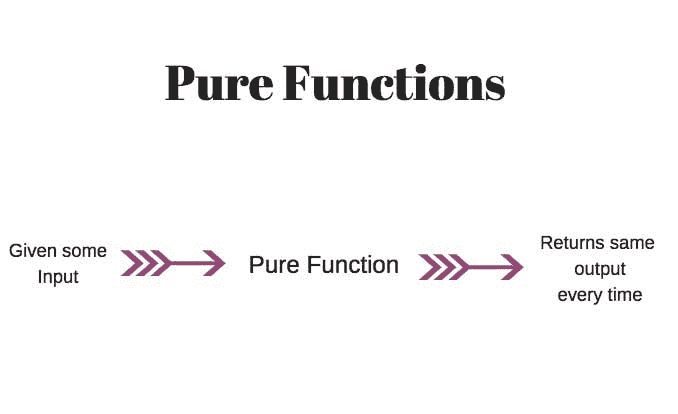
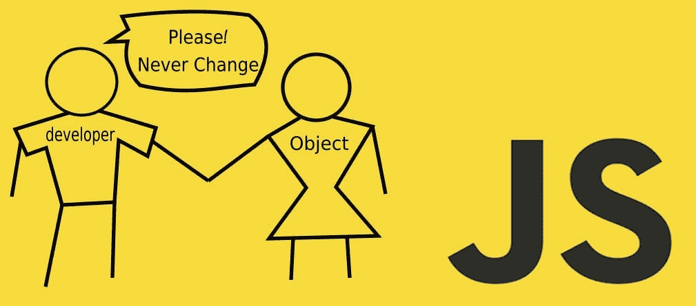
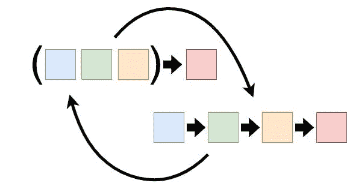

# Python 中的函数式编程|简单易学

> 原文：<https://levelup.gitconnected.com/functional-programming-in-python-easy-learning-b20207b2dd4e>


照片由[西格蒙德](https://unsplash.com/@sigmund?utm_source=medium&utm_medium=referral)在 [Unsplash](https://unsplash.com?utm_source=medium&utm_medium=referral) 拍摄

**函数式编程(FP)** 是编程界最容易误导人的话题之一。你会发现很少有关于 Python 中 FP 的文章。在 Python 中学习和探索 FP 真的变得很难。在这篇文章中，我将尝试用例子来解释一些与 FP 相关的话题。

根据[维基百科](https://en.wikipedia.org/wiki/Functional_programming)，**函数式编程**是一种[编程范式](https://en.wikipedia.org/wiki/Programming_paradigm)，其中程序是通过[应用](https://en.wikipedia.org/wiki/Function_application)和[组成](https://en.wikipedia.org/wiki/Function_composition_(computer_science)) [函数](https://en.wikipedia.org/wiki/Function_(computer_science))来构建的。简单来说，函数式编程允许开发人员将函数用作一等公民。您可以将函数存储为变量，并可以将它们传递给另一个函数来执行特定的操作。

注意:这篇文章并不是要解释函数式编程的所有期望。为此，有一篇很好的文章叫做[Python 中的函数式编程:何时以及如何使用](https://realpython.com/python-functional-programming/)。你可以去看看。本文将关注函数式编程的一个真实用例。

**先决条件:**你要有 Python 编程的基础知识(尤其是 **list** 、 **set** 、 **iterator** )。所有的例子都需要类型支持。因此示例将在 [Python3.5](https://docs.python.org/3/library/typing.html) +上工作。

## 基本原则

在进一步学习之前，您应该了解下面描述的一些基本原则。

1.  纯函数
2.  确定性函数
3.  λ函数
4.  高阶函数
5.  不变
6.  Currying 或部分功能
7.  功能组成

## 1.纯函数

纯函数是确定性函数，没有副作用[](https://en.wikipedia.org/wiki/Side_effect_(computer_science))**，也就是说，对于相同的输入，输出总是相同的。同时，它不会消耗任何其他全局变量。**

****

****纯函数示例:****

**在这里，无论投入多少，产出都是一样的。**

**拥有一个纯函数的好处是，很容易理解和测试。然而，仅仅使用纯函数来构建一个完整的应用程序是非常困难的。我们也需要一些确定性函数。**

## **2.确定性函数**

**确定性函数是指函数的输出总是确定的。这可能有副作用，但输出不应随时间而改变。同样的输入应该产生同样的输出**

****简单的例子:****

****另一个例子:**确定性函数可能有副作用。也就是说，它可以访问全局变量。**

****非确定性函数的例子:****

**在上面的例子中，方法`rand`使用`random.random`生成一个随机数。这个 API 的输出将是不确定的。**

**确定性函数的好处是它在任何语言中都很常见。它很容易创建和理解。然而，有副作用。有的时候很难考。**

## ****3。λ函数****

**[Lambda 函数](https://realpython.com/python-lambda/)是匿名函数，可以接受任意数量的参数，但只能有一个表达式。**

**与上面 lambda 函数中的示例相同:**

**Lambda 函数是短期使用的匿名函数。它用于编写关键字较少的简洁代码。**

## **4.霍夫高阶函数**

**HOF 可以接受函数|s 作为输入，并可以返回一个函数作为输出。**

**示例:**

****注意:**在上面的例子中， **splitBy** 是一个函数。它接受 lambda 函数作为参数。你可能也注意到了，我没有使用关键字`def`来创建函数。我使用 lambda 作为一个函数，并将它赋给一个变量。这里可以阅读更多[。](https://realpython.com/python-lambda/)**

****reduce** 是一个将输入`divider`作为函数，将`arr`作为数组的函数。在计算完数组中的所有项后，它返回一个元组。**

## **5.不变**

**不变性是指一旦数据/变量被创建，就不能在一段时间内改变。这个想法是为了避免交叉共享环境中的数据竞争，比如异步编程，副作用。**

****

**Python 有很少的不变性 APIs 类。让我们来看一些例子。**

**由于 Python 是一种[](https://en.wikipedia.org/wiki/Dynamic_programming_language)**动态语言，即数据可以在运行时改变，这使得在 Python 中实现不变性很困难。同时，并不是所有的成员/对象都支持不变性。可以使用[不可变-js](https://github.com/immutable-js/immutable-js) 。然而，我建议将不可变性作为一种实践，并且不要包含另一个库。****

****实现不变性的简单方法——复制和扩展:****

****如果你注意到了，你可以扩展任何迭代器。**例如，**一个列表可以用一个**集合**、**字典**和**列表**本身来扩展。****

******注意:**在 Python 中使用**字典(dict)** 非常繁琐。Python 几乎没有用于字典的 API。但是，您可以编写一些通用的 util 来提高代码质量。****

## ****6.Currying 或部分功能****

****Currying 是 FP 中的一种方法或技术，其中一个函数可以被组合成部分接受输入。也就是说，如果一个函数`sum`接受输入`a`和`b`作为参数，那么 currying 这个函数可以让这个函数`sum`接受一个参数`a`并返回另一个函数。稍后，我们可以使用新创建的函数进行求和。****

********

******让我们从例子来看:******

```
**def split(token=" ", txt=""):
    return txt.split(token)
def splitByHash(txt):
    return split("#", txt)
print(splitByHash("This#is#awesome"))
### ['This', 'is', 'awesome']**
```

****在上面的例子中，`split`函数接受令牌和字符串数据进行拆分。我们已经创建了一个函数`splitByHash`，其中已经定义了令牌。只需要一根绳子就能把它劈开。这里，`splitByHash`是部分函数。****

******注:**上面的例子很好的演示了分部函数。然而，创建这样的部分函数对于超过 2/3 的参数是不可伸缩的。我们可以使用一些基本的工具来创建一个部分函数或定制函数。****

****你可以在这里阅读更多关于 curry 的内容，[高级 python/currying-in-python](https://python-course.eu/advanced-python/currying-in-python.php)****

## ****7.功能组成****

****函数合成是一个数学概念，其中一个运算取两个函数 f 和 g，并产生一个函数 h，使得 h(x) = g(f(x))。为简单起见，(g f)(x) = g(f(x))****

******举个例子来看:******

****在上面的例子中，**获得贷款批准**获得利息并生效。如果利息金额超过 100，请求将被拒绝。如你所见，添加 **compose** 使得合并功能和创建另一个功能变得容易。可以在以后重复使用。****

## ****一些现实生活中的问题****

****现在既然知道了 FP 的基础，那就来举例探究一下吧。****

****在上面的例子中，首先，我们使用 rest API 获取一些 todos。之后，我们将根据 todo 的完成状态对其进行过滤。一旦我们都完成了 todos，我们就收集 id 并获取所有用户。****

****一切都好。然而，如果我们必须改变一个简单的行为，那就去找那些没有完成待办事项的用户。即使它只是不变，但会改变所有的编码声明。我们必须改变所有的变量名。这是一项乏味的工作。我们可以使用 FP 让这个程序更具声明性。为此，我们确实需要一些辅助方法:****

******辅助方法:******

```
**def neg(fn):
    def _neg(*arg):
        return not fn(*arg)
    return _neg
prop = curry(lambda key, data: data[key])def isCompleted(todo): return todo["completed"]
isNotCompleted = neg(isCompleted)
getId = prop("id")**
```

****现在让我们重写同样的程序****

******注意:**函数式编程还有其他一些方面。我还没有涵盖所有的内容。原因是:要么对于本文的范围来说太复杂，要么与 JavaScript 本身无关。****

******一些值得一提的概念:******

1.  ****功能数据结构****
2.  ****无例外地处理错误****
3.  ****严与懒(懒评)****
4.  ****功能并行性(异步浮点)****
5.  ****幺半群和函子****
6.  ****副作用****

## ****从这里去哪里****

****正如我已经提到的，Python 不是一种全功能语言。所以我们不能完全忽略杂质。我们必须混合搭配。以这种方式编写函数使您的代码更具声明性和可读性。然而，就核心概念而言，它确实增加了一点代码的复杂性。也就是说，如果你知道上面描述的基本概念，你就可以开始编写函数式程序了。网上有多篇文章。如果你真的想学函数，我在下面列出了一些。我还会推荐用像 [Scala](https://www.scala-lang.org/) 、 [Clojure](https://clojure.org/) 、 [Haskell](https://www.haskell.org/) 这样的语言写一些代码。它将帮助你理解 FP 背后的核心概念和思想。****

## ****参考文章****

1.  ****[Python 中的函数式编程:何时以及如何使用](drive.google.com/drive/u/0/my-drive)****
2.  ****[高级 Python 简介](https://python-course.eu/advanced-python/)****
3.  ****[Python 高级话题](https://www.programiz.com/python-programming/iterator)****