# Typescript 中的函数编程

> 原文：<https://levelup.gitconnected.com/functional-programming-in-typescript-18ac096bb551>

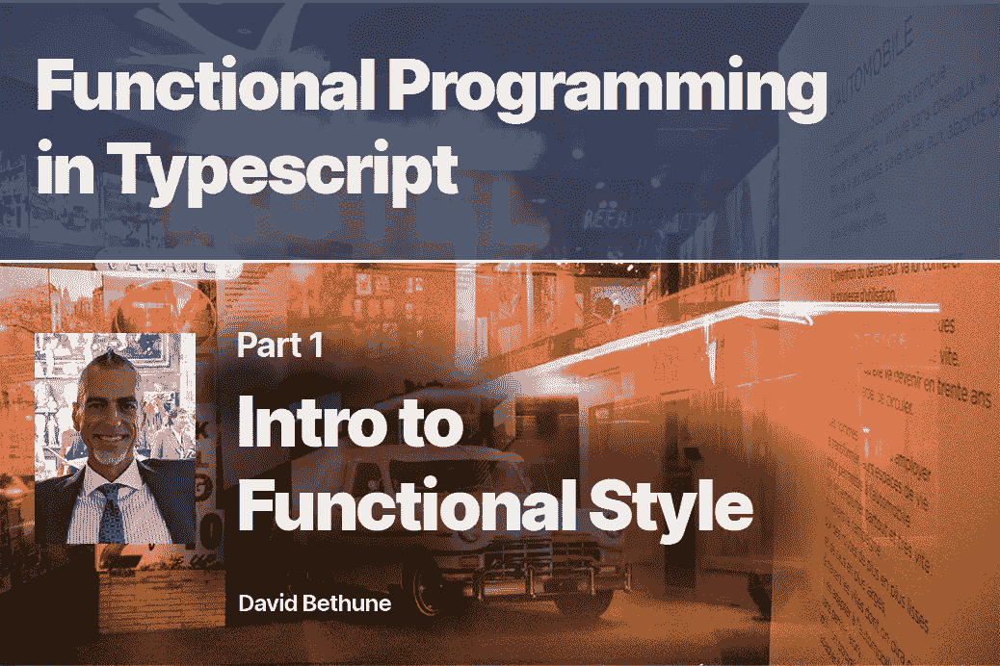

> 函数式编程是由 IBM 的约翰·巴科斯在 1978 年提出的，但是仍然被广泛误解。今天，我们可以轻松地使用尽可能多或尽可能少的函数式编程——通过 Typescript。在这个系列中，我们将了解什么是功能性以及它是如何产生的。我们将研究其好处，看看如何使用函数式风格编写新程序，并在 JavaScript 和 ts 中改进旧程序。

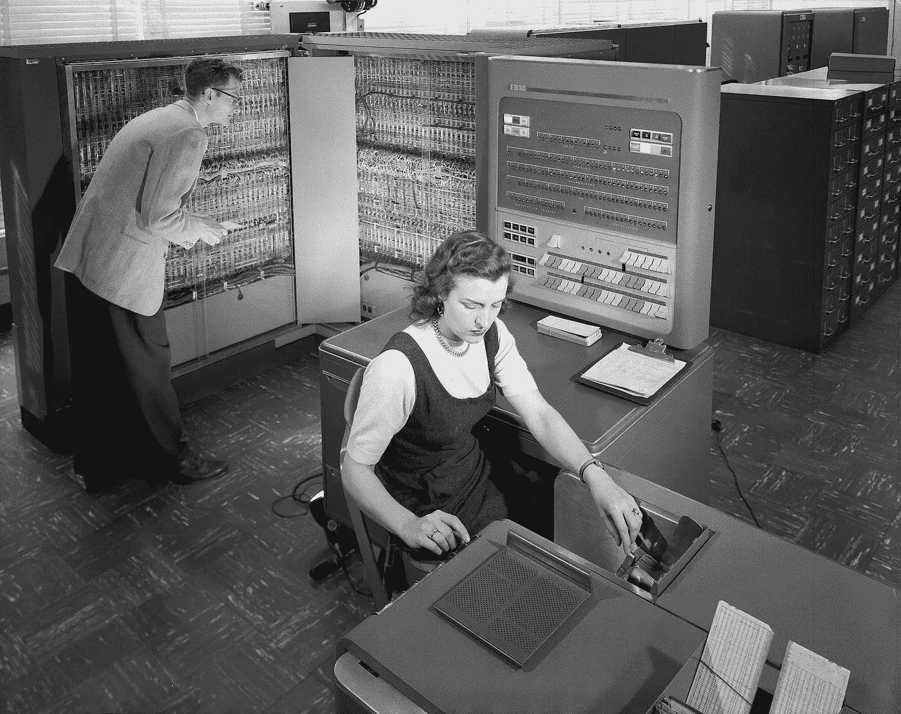

一台 IBM 704 T1 电脑，拍摄于 1954 年。这一年，约翰·巴科斯发明了第一种编程语言 FORTRAN。

# 掉进兔子洞

当我在 IBM 任职期间遇到[约翰·巴科斯](https://en.wikipedia.org/wiki/John_Backus)(FORTRAN 的发明者)时，我谈话的目的是向他请教如何让公司关注我写的关于管理和定制用户界面的一些新想法。约翰是 IBM 的研究员，他有自己的实验室，有无限的自由和大量的资金，IBM 鼓励员工互相打电话或拜访寻求建议。想象一下当他说“我已经发明了下一种计算机编程，但我也不能让任何人关注我”时我有多惊讶。

巴克斯所指的是 [**函数式编程**](https://en.wikipedia.org/wiki/Functional_programming) ，他在 1978 年的开创性论文 [*中首次提出:编程可以从冯诺依曼风格中解放出来吗？当我从“马嘴”那里得知这个发明时，我很兴奋，我立即读了这篇论文(在它发表近 20 年后)，我必须承认，我也没有得到它。*](https://dl.acm.org/doi/10.1145/359576.359579)

为了理解为什么 functional 在第一次尝试时没有“点击”，我们需要回顾一下我们是如何得到*其他*种编程的:**命令式**。

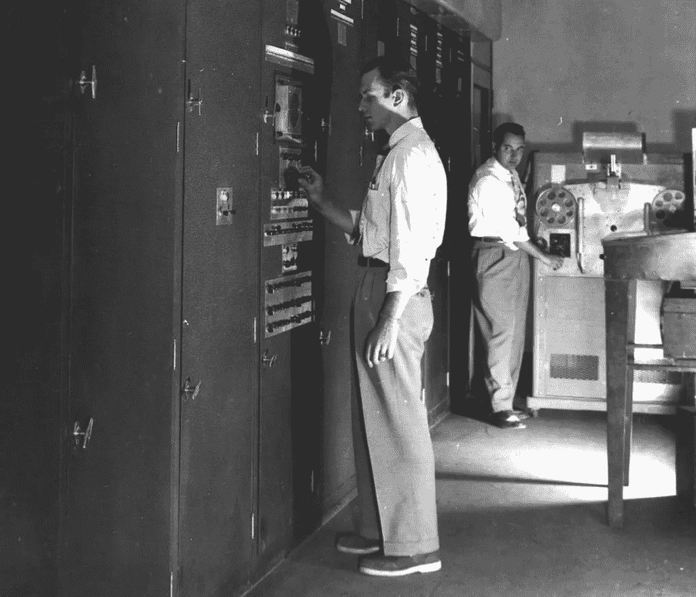

这里展示的是 1949 年的 [EDVAC](https://en.wikipedia.org/wiki/EDVAC) ，它代表了第一台[存储程序计算机](https://en.wikipedia.org/wiki/Stored-program_computer)，一台可以将代码和数据保存在同一个内存空间的计算机。它是为美国陆军开发的。

# 电脑是一种机械装置

虽然我们认为计算机是数字设备，但归根结底，它们是由物理控制的机器。第一台计算机是纯机械的，使用旋转计数器——就像汽车里程表——来累积数字。通过向前或向后旋转计数器，可以执行基本的数学运算:加法、减法、乘法(重复加法)和除法(重复减法)。

一个计数器没有多大用处，除非我们可以先给它输入一些数字，然后再累加一些数字。存储设备的发明就这样开始了。第一批存储设备也是纯机械的，依靠机械开关和有孔的纸带来表示输入机器的数值。

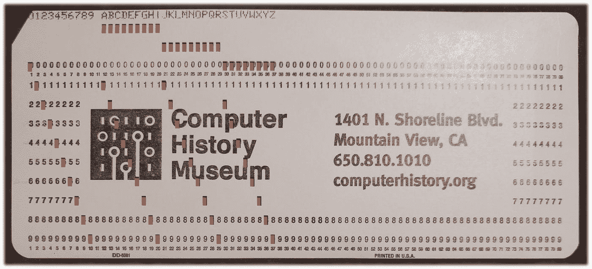

在[计算机历史博物馆](https://computerhistory.org/)的现代例子中看到的 [IBM 穿孔卡](https://en.wikipedia.org/wiki/Punched_card)，是一种物理存储设备。每一列中的穿孔组合代表打印在卡片顶行的该列中的值。穿孔卡片是赫尔曼·何乐礼在 1890 年发明的，他的专利被 IBM 收购。自 1725 年以来，有孔的纸带就被用来为织布机编程。

第一台计算机的实际编程也是物理的，需要给机柜插电和重新布线。这种限制使得机器只能运行一种程序，而不能完全关机进行“重新编程”即使程序本身存储在纸带上，内存和物理存储的管理也是艰巨的，并限制了软件开发的范围——这个术语当时还不存在。

1945 年，[约翰·冯·诺依曼](https://en.wikipedia.org/wiki/John_von_Neumann)(巴克斯论文标题中提到的物理学家和计算机科学家)，发明了今天所谓的**存储程序计算机**。在他对 EDVAC 计算机的评估中，冯·诺依曼描述了一种架构，其中数据和程序本身都存储在计算机的内存中。这个想法将使任何机器成为真正的“通用”计算机，因为机器的功能可以像读取数据一样容易地重新编程。一夜之间，它将成为所有现代计算机体系结构的基础。

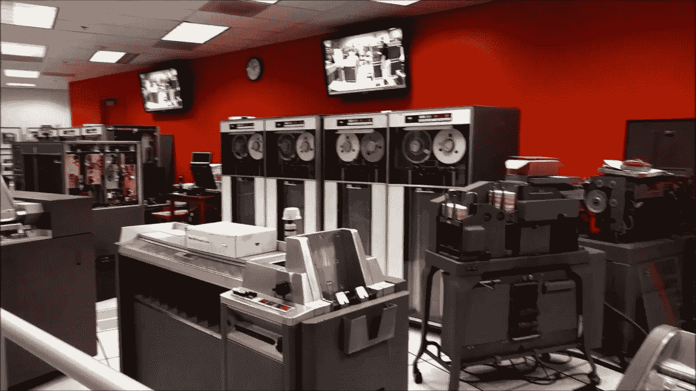

计算机历史博物馆演示实验室里的这台 IBM 1401(1959 年首次出售)仍然运行 FORTRAN。

# 用电子模拟计数器

数字计算机完美地模拟了过去的机械计算机，包括程序必须*存储在某个地方*(内存中)并且必须传递一些值才能工作。在最底层，计算机执行机器语言，这仅限于基于硬件的操作，如将数据移入和移出计算机的物理内存和物理存储设备。在这一级别的编程中([汇编](https://en.wikipedia.org/wiki/Assembly_language))，一次只能执行一个操作，而且是按照严格的、预先定义的顺序。

今天，我们称这种风格为 [**命令式**](https://en.wikipedia.org/wiki/Imperative_programming) ，因为它由一个特定顺序的“待办事项列表”组成。汇编对人类来说很丑很难写，导致了第一个编程语言的发明: [FORTRAN](https://en.wikipedia.org/wiki/Fortran) (又来了 Backus)。它旨在允许科学和工程用户以一种可以翻译成机器语言的方式来编写他们的公式，从而以编程语言语法而不是数学符号来描述算法。

FORTRAN 就像它之后的每一种语言一样，非常有用，因为它提供了一种对真实情况的抽象。编程语言使得对发生的事情进行编码变得更加容易，但是它们不会改变实际发生的事情。那总是机器语言，原始的，甚至是裸露的金属。这是必须的。

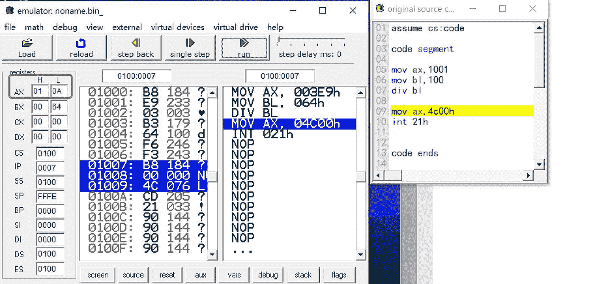

几乎每一台现代计算机(除了几个明显的例外)都使用的汇编语言，由直接在硬件上操作的非常低级的指令组成。左侧所示的**寄存器**用于保存计算过程中的工作值。它们存在于芯片设计中的物理位置，就像模拟计算机的机械计数器一样。

# 也许打电话给我

很快，编程中出现了其他种类的抽象，包括用 COBOL 编写的类似英语的语法(为商业用户而非数学家设计)和 [**过程**](https://en.wikipedia.org/wiki/Procedural_programming) 的引入。一个过程就像它听起来的那样——我们期望计算机重复做的事情。然而，为了有用，大多数过程需要某种变量输入。并由此诞生了**参数**和**程序调用**。

如果你在经营一家银行，你希望以同样的方式处理每一张支票，但不是用同样的数据。存款金额是支票上*的金额。用编程术语来说，我们可以编写一个`DEPOSIT`过程并传递一个`AMOUNT`值，这样就可以用这个值作为参数来调用这个过程。*

虽然过程可能看起来是另一种编程风格，但它们不是。当程序被编译或解释时，实际执行的机器语言将是过程中每条指令的**重复集合，每条指令在执行时在存储器**中具有**不同的值，从而产生不同的结果。在执行时，程序是命令式的。**

如果到此为止，我们几乎已经实现了功能风格，你马上就会看到！但是，程序总是这样，程序变得更大更复杂，人们需要进一步的抽象。

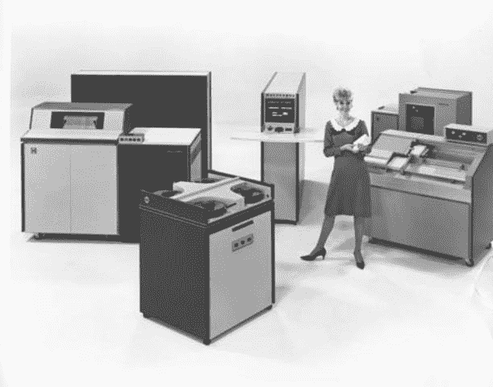

1959 年，巴勒斯公司的一名工程师发起了一个行业联盟，为商业用户设计一种新的编程语言。在拒绝了 BUSY 和 INFOSYL 这两个名字后，它在 1960 年被称为 COBOL。该语言包含 300 多个保留字，是中型计算机 Burroughs [B2000 系列](https://en.wikipedia.org/wiki/Burroughs_Medium_Systems)的主要编程工具，如图所示。

# 进入状态

让我们回到那家银行，假设你在免下车自动取款机前，它问你是否愿意进行第二次交易。尽管出于安全考虑，您可能会再次输入您的 PIN，但您不会从 ATM“注销”或被要求重新插入您的卡。自动取款机已经“保留”了你的卡信息。在 comp-sci 中，我们把这种 [**状态叫做**](https://en.wikipedia.org/wiki/State_(computer_science)) 。

状态包含的值在我们计算机的“其他地方”,而不直接在我们编写的过程中。在自动取款机的例子中，程序必须保留你的卡号，以便再次重复存款过程，而不会再次要求你提供卡号。

在特定过程之外的计算机中发生的一切都被认为是该过程运行时状态的一部分。如果另一个顾客开车跟在你后面，同样的`DEPOSIT`程序会很遗憾地把钱存入她的账户，而不是你的账户——尊重机器的新状态。

计算机编程中状态的例子在我们身边比比皆是。我们正在流式传输的电视节目必须跟踪节目，而不是在每一帧之间进行查找。在线购物车必须知道你以前是否已经使用过折扣代码。为了保持飞机在空中飞行，一架现代客机必须记录成千上万的状态。

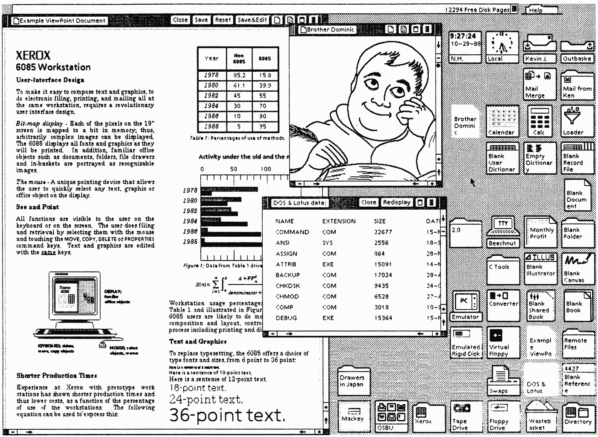

施乐 Star 和 [Alto](https://en.wikipedia.org/wiki/Xerox_Alto) 工作站是第一个使用面向对象编程的工作站，允许创建第一个图形界面。桌面上的每一项，从图标到按钮、窗口和菜单，都作为一个具有方法和属性的类[实例](https://en.wikipedia.org/wiki/Instance_(computer_science))存在。用 small talk 语言构建的对象相互传递消息，以实现更改。

# 他们称之为“哎呀”是有原因的

在软件开发日益复杂的另一个例子中，第三种编程风格于 20 世纪 60 年代在麻省理工学院引入。今天称为 [**面向对象编程风格**](https://en.wikipedia.org/wiki/Object-oriented_programming) ，OOPS 提出程序的过程(称为**方法**)及其数据(称为**属性**)应该一起存储在一个称为**类**的对象中。

面向对象编程的最初动机之一是软件团队规模的增长。有人认为，通过将代码和数据模块化到一个具有定义的交互集的单个对象中，代码可以更容易地在团队成员之间共享，从而允许更大的团队在一个项目中工作。这反映了工业界从早期依赖计算机制造商来提供语言编译器和定制软件开发，转向将这些任务交给内部和专业软件公司。

为了与一个类的方法“对话”或者传递它的属性，需要设计一个**接口**。该类本身只接受由其接口定义的格式的指令或数据。我们的 ATM 软件的 OOPS 实现可能需要一个`loggedInUser`对象来进行存款。如果传递了错误类型的对象，则不会发生存放。

这种编程是另一个抽象之上的一个抽象，如果你愿意的话，是一个帽子上的帽子。显而易见，在机器代码级别，处理器会很乐意向任何账户存款(或提取任何金额！)而不考虑任何类似“状态”或“对象”的东西。

在处理器上运行的实际代码中，状态和对象都不存在——只有硬编码的内存位置和[文字](https://en.wikipedia.org/wiki/Literal_(computer_programming))值。换句话说，机械(硅)计数器已经增加或减少到某个值，无论是你的账号还是你的银行余额。

程序的过程性质和它对状态的依赖代表了对真实情况的第一级抽象。类添加了第二个抽象，通过*将*状态隐藏在它们自己内部。类接口的不可穿透性使得无法判断对象在**执行时间**处于什么状态，以及这将如何影响您调用的方法和传递的属性。

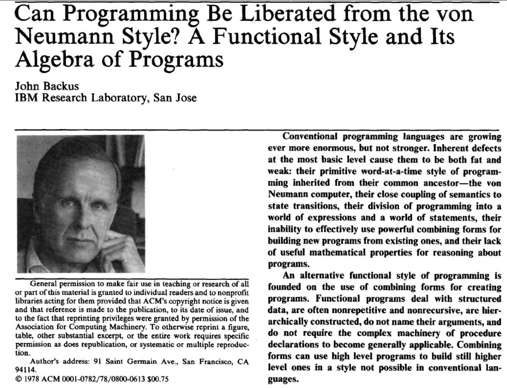

约翰·巴科斯原始论文的封面介绍了函数式编程风格，他将其与“冯·诺依曼风格”的编程风格进行了对比，称之为原始的、缺乏组合能力的编程风格。

# 废除国家

如果状态对于大多数真正做任何事情的程序(实际上是所有程序)都是必要的，那么当得知在函数式编程中，目标是废除状态时，可能会感到惊讶。就像同样不可行的政治理念一样，没有国家就不可能有一个有用的计算机程序。但在巴克斯提出的风格中，我们应该尽可能少。

巴克斯认为，所有先前存在的编程风格都有同样的局限性，因此将它们归为一类，他称之为“冯·诺依曼风格”。这个限制是过多的抽象层导致的不精确。在数学公式中，结果是明确的。每个人在世界各地“运行”相同的数学公式，都会得到相同的结果。使用电脑的人都知道，电脑不是这样。

巴克斯认为，如果采用更数学化的风格和更清晰的符号，编程将会大大改进。首先，他的目标是用一套原则消除过程编程和隐藏状态的模糊性，当设计新的应用程序或重构旧的应用程序时，人们可以在任何严格程度上采用这些原则。

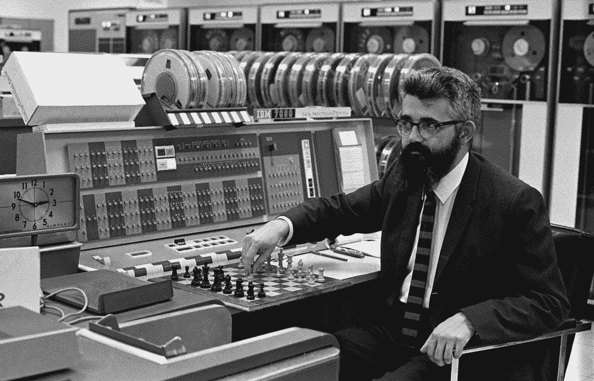

1967 年，Lisp 的发明者约翰·麦卡锡正在和一台 IBM 7090 下棋。他后来继续帮助定义 ALGOL 语言，这种语言与 Lisp 有天壤之别。虽然 Lisp 从未被主流采用，但 ALGOL 在 Burroughs 大型系统上被广泛使用。甚至连操作系统都是用它写的。ALGOL 风格的语法将主宰几乎所有未来的语言，包括 Typescript。

第一种大规模引入函数式风格的语言是 [LISP](https://en.wikipedia.org/wiki/Lisp_(programming_language)) 。事实上，这种语言从它的第一次迭代开始——仅仅在 FORTRAN 引入一年后——就支持我们到目前为止讨论过的所有编程风格(以及其他几种)**。Lisp 程序员可以自由地混合风格来满足他们的需求。并非巧合的是，Lisp 被认为是形成了 Backus 函数式风格基础的同一个 [lambda 演算](https://en.wikipedia.org/wiki/Lambda_calculus)的实现。**

今天，我们不需要 Lisp 或任何其他“函数式语言”来使用这种编程风格。我们的目标是在 Typescript 中使用 100%的函数式风格，但是我们喜欢用多少就用多少。虽然我们永远也不会走到那一步，但是有可能看着代码说，“这个*是不是*起作用了？我能这样做吗？”

函数式风格的引入过去和现在都是为了消除设计中的缺陷。没有其他好处。通常，函数式程序比依赖于状态的命令式或过程式程序更难编写和推理。好处是，当正确编写时，函数式程序内部出错的可能性要小得多——并且在程序的其他部分引入错误的可能性也小得多。函数式函数(是的，对不起)也是非常模块化的，可以在程序中交换，而不会影响程序的结果。

一旦函数式风格的信仰占据了你的头脑，你将开始把所有其他风格视为*代码味道——程序中可以通过重构来改进的*区域。有了自己的函数库，您就有了在应用程序中扩展和重用这些函数库的良好起点，也有了应用函数式风格的良好起点。

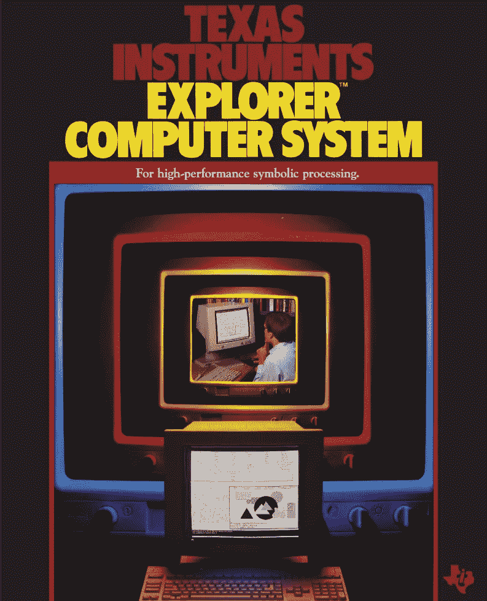

TI Explorer 计算机是一台纯粹的 Lisp 机器。甚至它的汇编语言也是 Lisp，这使它成为一个不寻常的硬件。Lisp 也是第一种采用函数式编程风格的通用语言，尽管这种风格从未被宣传过。

# 功能文体的七个原则

因为真正的函数式编程是不可能的，所以最好把程序想成功能更强的**或功能更弱的**而不是严格的非此即彼的定义。当扫描我自己现有的代码时，我喜欢添加注释来显示我什么时候**而不是**使用函数式风格，以及我在一个特定的函数中如何违反了惯例。这些对于调试和重构过程中的待办事项都很有用。****

1.  **函数有单个接口和单个返回值。**
2.  **除了传递给函数的参数之外，函数不能读取任何数据。**
3.  **函数可能不写任何数据，包括传递的参数。**
4.  **给定相同的输入时，函数总是返回相同的结果。**
5.  **函数调用可以用它们的返回值代替。**
6.  **函数可以将函数作为参数，并作为结果返回。**
7.  **函数可以存储在变量、数组和对象中，并像任何其他对象一样进行操作。**

这些听起来不像是一个非常有用的计划。一个参数？不读取或写入数据？每次都是一样的结果？然而，这些是“功能规则”让我们看看如何使用它们来编写一个比过程函数更健壮的函数。

像这样的机械计算器马尔尚 8ADX 使用轮子，上面印着数字，通过一个镂空的窗口显示出来。通过按下计算器按钮，轮子前进，通过杆和齿轮连接到“总”显示器。同样，现代处理器在它们的[寄存器](https://en.wikipedia.org/wiki/Processor_register)中累加值，用于其他计算。

# 来吧，打破规则！

让我们以过程的方式创建一个简单的计数器。我们将保存一个计数器值并递增它，然后返回结果。

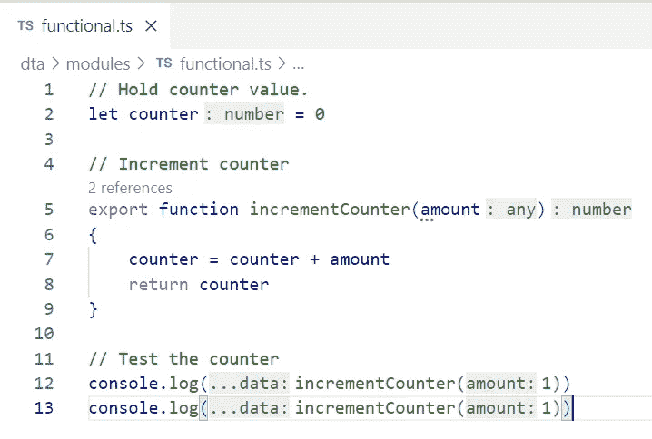

这里的 incrementCounter 函数依赖于一个**闭包**。这不是函数风格，因为函数**计数器**中使用的值没有通过参数传递。

这种常见的模式被称为 [**闭包**](https://en.wikipedia.org/wiki/Closure_(computer_programming)) ，如今被构建到许多语言中，并且在 JavaScript 和 Typescript 中随处可见。不幸的是，它通常是错误的来源，原因有三。首先，它依赖于未被传递的数据。其次，它在“自身”之外修改数据(用编程术语来说，在它的**范围**之外)。第三，每次用相同的值调用它时，它不会返回相同的结果，这就是所谓的**幂等性**。

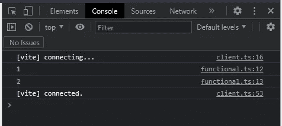

依赖闭包的函数不能保证是**幂等的**，因为这个函数不是。具有相同参数的两个调用返回不同的值。

本质上这个功能**不靠谱**。还有，它有不可预知的 [**副作用**](https://en.wikipedia.org/wiki/Side_effect_(computer_science)) 。我们不知道`counter`从何而来(不可靠)，然而我们改变了它的价值(副作用)。因为我们依赖于闭包形式的隐藏状态，所以我们的结果是不可预测的。如果另一个程序员在我们程序的另一个地方改变了`counter`的值，我们**得到的**或**设置的**的值可能是错误的。让我们通过以函数式的方式重写来解决所有这些问题。

1971 年推出的 Friden EC 1117(按今天的美元计算)价格为 3800 美元，它利用了当时市场上新的“低成本”集成电路。这个例子，我自己的机器，是一个稍晚的型号，早期使用绿色的 VFD 显示技术。

# 功能计数器

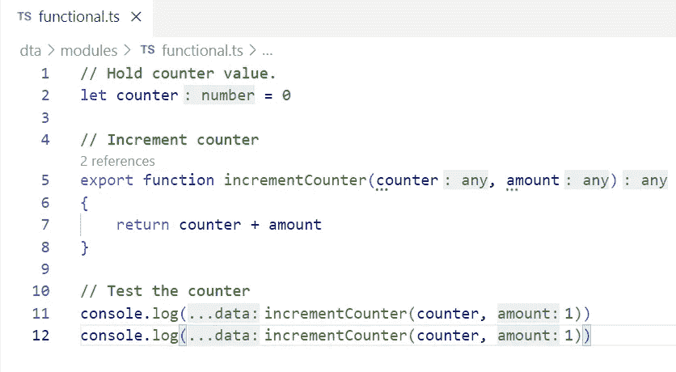

函数式计数器将**计数器**和增量**数量**作为参数传入。

在函数版本中，我们需要计数器本身和要增加的数量作为参数。请注意`return`函数的简单性。我们没有“做”任何事情。未设置任何值。我们只返回从两个参数中导出的值。一旦函数结束，甚至参数都将不复存在。整个函数调用将在内存中被替换为返回值。

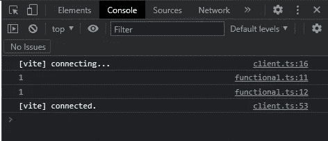

函数版本用相同的值调用两次，返回相同的内容。

值得注意的是`counter`函数参数(在第 5 行)是**而不是**与第 2 行定义的`counter`变量相同。在第 11 行和第 12 行，我们传入了变量`counter`的值，该值成为函数范围内参数`counter`的值。

像这样重用名称在 Typescript 中很常见，可以更容易理解接口的各个部分是如何关联的。请记住，在函数式编程中，我们只想接触函数范围内的东西，而不是函数范围外的任何东西。

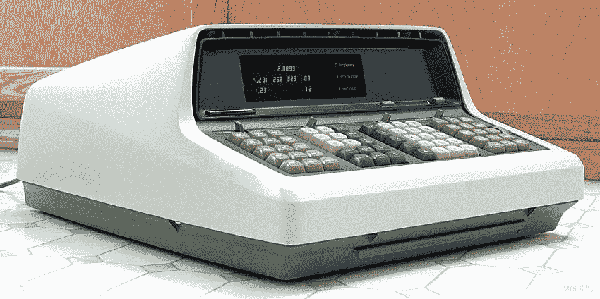

第一台台式电脑 HP9100A 被作为计算器销售，以吸引那些买不起电脑的小部门。该机器的不同之处在于，它是一个硬件[状态机](https://en.wikipedia.org/wiki/Finite-state_machine)，每个按钮都以硬件(而非软件)执行功能。这台机器的发明者汤姆·奥斯本为史密斯-科罗纳·马尔尚公司工作，正是这家公司生产了前面显示的机械计算器。他们拒绝了他的设计方案，所以他辞职了，并把这个想法带到了惠普公司。

# 但是功能性不起作用

现在，我们面临着函数的基本限制。我们的新柜台坏了！它每次都返回`1`。如果不以某种方式(状态)保留计数器值，我们就不能真正增加它。让我们解决这个问题。

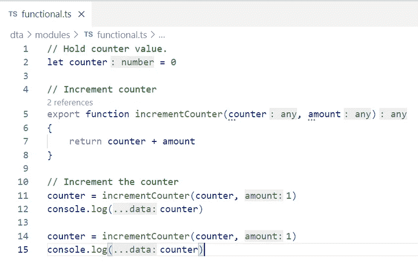

incrementCounter **函数**是功能性的…程序，没有那么多！

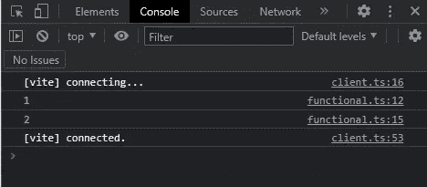

这个版本的程序是幂等的，并且产生正确的输出。

在这次重写中，我们显式地将`counter`变量赋给了`incrementCounter`函数的返回值(在第 11 行和第 14 行)。函数本身没有改变，只是我们使用它的结果的方式变了。通过分离增量和日志记录功能，我们还使整个程序幂等。在第 11 行和第 14 行，函数被传递了**不同的值**(当前值`counter`)，从而得到不同的结果。同样，在第 12 行和第 15 行，`console.log`函数在每次调用中都被传递了不同的值。

虽然这看起来没有任何改进，但它有几个好处:

1.  我们有**防弹**我们的`incrementCounter`功能。对于它在任何特定调用中的作用，不会有任何意外。
2.  它没有副作用，因此非常可靠。
3.  它的**结果**可以在我们代码中的任何其他地方代替函数本身，允许我们使用它在任何时候增加我们需要的“实际”计数器。它甚至可以用一个计数器的值来增加另一个计数器的值。

像空客 A220 这样的软件驱动客机必须管理几乎不可想象的状态。每秒钟数千次，从数百个仪表传感器和控制面板输入获得的读数必须读入存储器并进行评估，以便正确调用操作飞机操纵面的功能。在安全性至关重要的嵌入式系统中，函数式编程非常受重视。

# 擦亮阿斯顿马丁，Q！

到目前为止，我们的计数器遵循泛函的四个规则。但是它没有单一的参数，而是有两个。Backus 打算用单参数的思想使编程更像数学，并尽可能减少每个函数的操作(希望减少错误)。

无论您定义了多少个参数，Typescript 都能一次看到所有的参数。但是我们可以用一个**接口**更进一步。这是定义函数参数的更数学的方法。如果给定的参数不符合我们的规范，Typescript 编译器会抱怨并在运行时给我们一个潜在问题的早期警告。让我们为我们的计数器添加一个接口。

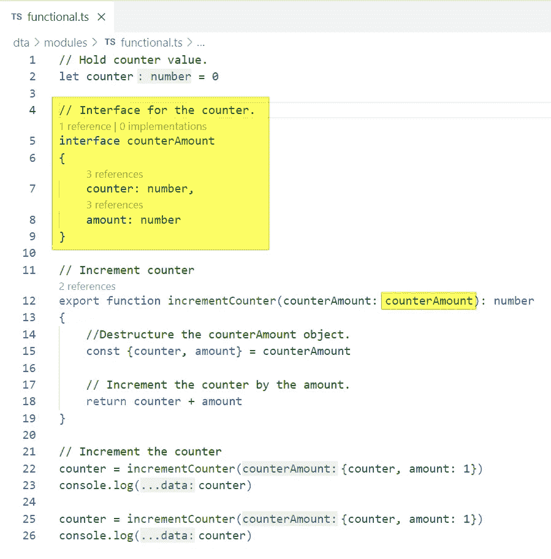

为 counter 和 amount 添加一个接口允许强制调用 **incrementCounter** 来采取这种形式。

通过在定义函数之前添加一个接口，我们设置了参数的名称和类型。然后，在函数定义中(第 12 行)，我们将该接口指定为要传递给函数的单个参数的**类型**。这告诉 Typescript 编译器，如果我们用不同的结构编写对`incrementCounter`的调用，就要抱怨。

请注意名称的重用，其中`counterAmount`是接口和参数的名称。另一个名称重用技巧导致了一个 Typescript 快捷方式，如第 22 行所示。当内联传递新构造的`counterAmount`对象时，我们只需要编写`counter`作为`counter:counter`的快捷方式，因为键与值同名。

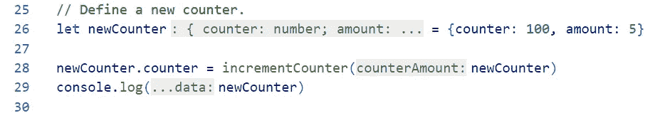

使用接口允许您在将参数集合传递给函数调用之前构造参数。

您也可以单独构造参数对象，如第 26 行所示，我们创建了一个计数器，从 100 开始，递增 5。在第 28 行，我们用函数调用的返回来更新该对象的`.counter`值，将该对象作为参数传递。

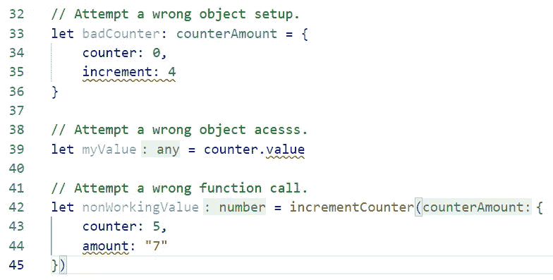

定义接口后，不正确地使用它将产生来自 VSCode 的警告，如下例所示。虽然第 44 行的键是正确的，但是值是一个字符串，而不是接口要求的**号**。

接口允许你编写更短、更易读的程序，并且通过在函数调用中捕捉它们来防止运行时错误的发生。

1987 年，凯迪拉克分两个阶段制造了其 [Allanté](https://en.wikipedia.org/wiki/Cadillac_Allant%C3%A9) 轿车，从意大利的宾尼法利纳开始，然后由 747 运往美国完成。整辆车被放置在飞机内部。同样，整个函数可以通过名称传递给另一个函数。在“到达”时，传入的函数可以用它所传递到的一阶函数提供的参数来调用。

# 一阶函数

函数花名册上的最后一个技巧是，函数可以作为参数或值互相传递。接受其他函数的函数称为**一阶函数**。注意，我们在这里谈论的是函数*本身*被传递，而不是对它的调用——当我们编写一个函数时，这一区别将变得清晰。

让我们创建一个函数，它可以给列表中的每个数字加上或减去一个值。实际的加法或减法来自一个单独的函数，它只对列表中的一个数字进行加法或减法运算。请注意，虽然这是一个非常简单的例子，但是当您处理更复杂的“子”函数，并且希望将这些函数汇总到父函数中时，这种想法会很方便。

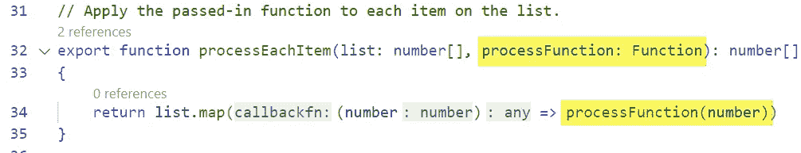

新的一阶函数将一个**函数**作为参数，然后用**号**的值作为参数调用**那个函数**。

我们将定义一阶函数来接收一组数字(`number[]`)并返回相同的结果。作为第二个参数，它接受一个应用于这些数字的函数。

在处理第 34 行上带有`.map()`的数组时，我们调用传入的`processFunction`，并把数组中的当前`number`作为参数给它。这样，我们的一阶函数可以使用传递给它的任何函数。让我们定义两个过程函数并尝试一下。

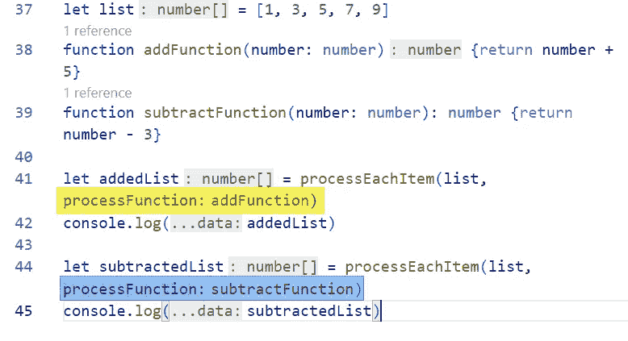

当我们将函数作为参数传递时，如第 41 和 44 行，我们**没有**为函数调用添加括号。

首先，我将在第 37 行创建列表数组。然后定义两个函数，每个函数都有一个数字。第一个加 5，第二个减 3。请注意，这些函数只对单个数字起作用；他们对名单一无所知。

接下来，我将在第 41 行定义一个新的`addedList`，它是调用我的`processEachItem`函数并将`addFunction`作为参数传递的结果。请注意，我传递的是不带参数的函数名，而不是对它的调用。我对第 44 行的`subtractFunction`做了同样的操作。

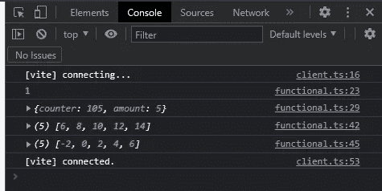

控制台日志显示了两个数组，第一个是每个数字加 5，第二个是减 3。

结果是，在良好的函数式编程风格中，添加、减去和处理列表的任务是相互分离的。这使得它们中的任何一个都易于修改或扩展。如果我们发现需要对列表上的所有内容做一些其他的事情，我们可以简单地用新函数作为参数再次调用`processEachItem()`——而不用冒破坏任何已经工作的东西的风险。

一般来说，当你发现一个循环或迭代中的某些东西足够复杂，可以与循环本身分开考虑时，这是重构一个功能函数的好时机——在这个函数中，你可以将每次迭代所需的所有值传递给**。让循环建立这些值，然后用简单的输入和输出调用函数，而不是依赖循环本身的闭包。**

你写的这些小的、可重用的函数越多，你的软件就越变得)****——这是巴克斯喜欢的数学特征，也意味着简单部件可以像乐高积木一样互换。一个函数做得越少，被破坏的可能性就越小，可以使用它的地方就越多。****

********

****价值 9090 美元的乐高泰坦尼克号 T2 套装包含许多定制零件，但也有许多标准零件。我想知道他们还能造出什么。通过用函数式风格编写的小函数来组合你的软件，你可以避免以后出现泰坦尼克式的灾难。****

# ****今天我学到了****

****我们看了函数式编程和一般编程的起源，我们已经看到了一些将函数式思想融入我们的类型脚本代码的方法。我们还研究了函数式风格**如何通过避免状态和要求代码与数据分离来违背面向对象和过程化编程的**。****

****功能型风格适合你的下一个功能吗？通过移除闭包，不接触不在作用域内的数据，而是选择`return`它，你已经拥有的代码可以被防弹吗？****

****通常，程序可以通过简单地将所有与状态相关的行为转移到一些功能集合中来改进，这些功能本身在设计上就是功能性的。然后，在程序的其余部分，您可以在需要时调用那些状态改变函数(带有特定参数),并且知道只有它们负责设置其他函数要读取的全局值[。](https://en.wikipedia.org/wiki/Global_variable)****

****在[第 2 部分](/functional-programming-in-typescript-part-2-c99643379c4f)中，我们将会看到递归，一种减少重复调用过程中代码量的函数式编程技术。****

****一如既往的感谢您的阅读。下次见！****

*****— D*****

# ****分级编码****

****感谢您成为我们社区的一员！在你离开之前:****

*   ****👏为故事鼓掌，跟着作者走👉****
*   ****📰查看[升级编码出版物](https://levelup.gitconnected.com/?utm_source=pub&utm_medium=post)中的更多内容****
*   ****🔔关注我们:[Twitter](https://twitter.com/gitconnected)|[LinkedIn](https://www.linkedin.com/company/gitconnected)|[时事通讯](https://newsletter.levelup.dev)****

****🚀👉 [**加入升级人才集体，找到一份神奇的工作**](https://jobs.levelup.dev/talent/welcome?referral=true)****