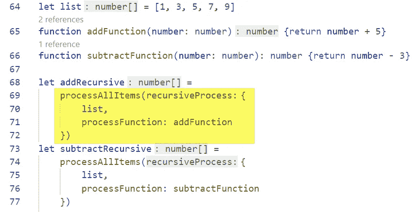

# Typescript 中的函数式编程:第 2 部分

> 原文：<https://levelup.gitconnected.com/functional-programming-in-typescript-part-2-c99643379c4f>

第 2 部分:递归

> 在本系列的第 1 部分中，我们探讨了函数式编程风格的起源，并研究了它与数学公式(和计算机硬件)的相似性如何帮助您的类型脚本代码抵御错误。在这一节中，我们将探索一种使用过程的函数方法，称为递归。

这张来自 1962 年 IBM 教科书的图片展示了当时的几种存储设备，包括安装在休斯顿美国宇航局[载人航天中心](https://en.wikipedia.org/wiki/Johnson_Space_Center)的 [IBM 2361](https://www.ibm.com/ibm/history/exhibits/space/space_2361.html) 核心存储单元。这种早期的设备提供了 2MB 多一点的存储空间——是以前任何 IBM 内存的 16 倍。“双子座”和“阿波罗”任务需要“大量”存储来维持地面飞行控制计算机的状态。

# 回到裸机时代

函数式编程中一个没有被很多主流语言采用的早期概念是 [**递归**](https://en.wikipedia.org/wiki/Recursion_(computer_science)) 的思想。也就是一个调用自身的函数。因为这是一个很酷的聚会技巧，你可以在第一次做的时候用它来给自己留下深刻印象，所以递归已经赢得了难做的名声。然而，在硬件层面上，这并不困难。

为了调用任何“过程”，处理器必须将其 [**程序计数器**](https://en.wikipedia.org/wiki/Program_counter) 推进到加载该过程第一条指令的内存地址。我在这里引用*过程*的原因是处理器不知道任何过程——只知道它应该执行的下一条指令的地址。

在这里,“谁的”程序或“在哪里”程序没有任何区别。反正我们是要 [**分支**](https://en.wikipedia.org/wiki/Branch_(computer_science)) 来的。由此诞生了递归的概念。如果程序中的某一行分支到同一个程序，我们也许能够减少代码，因为没有其他东西*需要存储或跟踪。*

如果我们能够避免在这个过程中产生新的变量，那么指令就会更少。这允许编译器执行更好的[优化](https://en.wikipedia.org/wiki/Optimizing_compiler)——这意味着更少的内存使用和更快的运行时间，因为需要执行的指令更少。

1964 年推出的弗里登 [EC-130](https://www.oldcalculatormuseum.com/friden130.html) 不仅因其拥有专利矢量图形的阴极射线管显示器而闻名，更因其使用了[反向波兰符号](https://en.wikipedia.org/wiki/Reverse_Polish_notation)，这是一种编写函数的方法，其中参数写在函数名之前**。RPN 计算器和许多经典的惠普型号一样，很容易识别，因为它们有回车键，但没有“=”(等于)键。像“+”和“x”这样的按钮调用的函数将结果返回到显示存储器，从中提取字符。**

# 又是那些讨厌的参数

我们前面看到，如果我们用内存中不同的值重复相同的一组机器指令，我们会得到不同的结果。这就导致了参数的抽象。为了从我们的语言中得到有用的递归，我们只需要确保那些内存值(参数)有我们想要的值**每次**我们分支回到相同过程的开始。

# 无限循环

根据定义，递归过程是一个[无限循环](https://en.wikipedia.org/wiki/Infinite_loop),因为它返回一个对自身的调用——有效地在每次结束时重新开始。许多函数式编程概念似乎与良好的实践背道而驰，实际上，这可能是一个非常酷且有用的想法。许多函数在递归编写时变得更短(因此更可靠)。

荷兰计算机科学家、奥斯汀德克萨斯大学百年计算机科学主席 Edsger Dijkstra 在 1965 年给 ACM 写了一封著名的信，他在信中称 GOTO 的声明是有害的。当时，原始语言允许程序员“转到”任何其他行并执行代码，导致任何不可靠的结果。即使这个短语会继续进入编程术语，递归优化实际上是为了在我们的函数代码中实现一种非常特殊的 GOTO。

# 停止循环

在命令式编程模型中，我们通常在处理代码的底部停止使用列表。换句话说，我们的伪代码看起来像这样:

1.  接受一份清单。
2.  **处理一个项目并将其添加到结果中。**
3.  **在列表的最后，返回结果。**

这个模式结束了，因为第 3 行说“在列表的末尾”但是我们已经说过递归函数**在最后从**开始。让我们用伪代码重写一下:

1.  **接受列表。**
2.  **如果为空，返回结果。**
3.  **处理一个项目，添加到结果中，重新开始。**

在《南方公园》名为[我未来的自己](https://southpark.cc.com/wiki/My_Future_Self_n'_Me)的一集里，斯坦醒来后发现他正被未来版本的自己拜访——有着截然不同的价值观。同样，每次函数递归时，它都将控制权传递给具有不同值的同一个主体。

# 我未来的自己

如果你以前没有遇到过递归，那么说一个函数*返回自身似乎也很奇怪。这到底有什么用？递归函数通过传递两个值来工作，即进行中的**列表**和构建的**结果**。构建结果的想法非常重要，因为这是递归不同于过程循环的主要方式。*

传统的循环持有一个结果值，然后在结束时返回它，而递归函数必须在传入列表和结果生成时传递它们。

每次调用时，递归函数:

1.  **从**入库清单中减去一项。
2.  **在结果列表中增加一项**。

华丽的[悉尼歌剧院](https://en.wikipedia.org/wiki/Sydney_Opera_House)是一个递归的建筑设计。壳构造函数每次用不同的尺寸参数重复运行。

# 它还没有结束，直到…

如果这就是函数所做的一切，它将永远不会停止。如果我们每次都从接收列表中删除一个项目，很快它就会是空的，我们就没有什么可处理的了。实际上，我们用这个确切的条件作为**信号**来停止函数并返回累加结果！

在递归模式中，**我们做的第一件事**是检查一个空列表，如果有，返回我们的结果。最后，我们处理一个项目，然后重新开始。

# 创建界面

前面，我们看了如何为一个函数创建一个接口，该接口接受一个列表和一个应用于该列表的函数。但是，为了使函数递归，我们需要添加另一个参数来保存累积的结果。下面是我们新函数的单参数接口:

当函数第一次被调用时，我们没有任何`results`要传递，因此我们必须通过用一个`?`问号结尾来声明`results`键在 Typescript 中是可选的。

# 编写递归函数

我将在这里向您展示整个函数的上下文，但我们将分别查看每个部分。您可以看到注释遵循我们建立的递归伪代码模式。

# 析构参数

在第 11 行，我们定义了接受一个参数的函数，`recursiveProcess`。在第 1 部分中，我们将[对象析构](https://developer.mozilla.org/en-US/docs/Web/JavaScript/Reference/Operators/Destructuring_assignment)视为一种分解我们将要传递的单个参数的方式。在第 14 行，我们将对象解析成三个变量。注意，析构赋值允许我们为`results` 变量(橙色)设置一个**默认值**。如果没有结果被传递，我们将用一个空数组(`[]`)来开始结果，就像我们第一次调用这个函数时的情况一样。

# 离开这里！

第 17 行包含了空列表最重要的陷阱。每次我们的函数调用自己，列表中就会少一项。当`list`为空时，该函数返回最终的`results`。

你的递归函数必须总是以这种 exit 语句开始。否则，你会陷入底部的死循环。为了防止这种情况，请将**退出条件**视为递归设计的第一个方面。另外，如果列表上什么都没有，函数就没有工作可做了！告诉编译器没有工作要做允许[垃圾收集](https://en.wikipedia.org/wiki/Garbage_collection_(computer_science))——从内存中移除不再需要的函数和变量。

当递归函数正确结束时，它不会留下任何东西。第 17 行执行后，编译器可以用单个返回值替换函数调用。因为每个单独的调用都是如此，所以整个系列的调用只在内存中留下返回值。滑头！

# 第一个和其余的

递归函数经常需要将传入的列表分成第**项**和其余的**项**。这种模式在函数式编程中非常常见，因此 Lisp 有两个指令`car`和`cdr`专门用于这个目的。

令人惊讶的是，Typescript 没有专门的分解列表的指令。相反，我们需要使用[。slice()](https://developer.mozilla.org/en-US/docs/Web/JavaScript/Reference/Global_Objects/Array/slice) 对数组执行函数，得到一个只包含第二个和后续项的新数组。值得注意的是，我们正在非破坏性地分割列表**，这意味着原始列表没有改变。函数不应该改变任何数据，包括它们的传入参数，修改`list`会违反这个约定。**

****

**第 23 行显示了我们如何用另一个析构赋值来构建结果。`…results`语法**将现有结果复制**到新数组的初始位置。数组中的最后一项是用来自`list`的第一项调用我们传递的`processFunction`的结果。**

**用`list[0]`只访问数组的**第一项**是编译器获得该值的最快方法，因为数组开始的内存地址是已知的。只要我们确保列表中的第一项是我们想要处理的，我们实际上就不必“遍历”列表。**

# **然后…我们结束了！**

****

**可能看起来不像，但程序实际上已经完成了。我们所做的就是**从传入的** `list`(第 20 行)的开头去掉一项，然后**将相应的处理结果**添加到`result`(第 23 行)的结尾。**

**递归发生在第 27 行，我们在这里创建了一个新的`recursiveProcess`参数。我们下一个调用的新`list`就是我们之前砍掉的`rest`。`processFunction`与传递给我们的相同，所以我们可以使用给出其名称的快捷方式(绿色)。我们的参数中的最终值`results`，就是我们到目前为止累积的`newResults`！**

**从这个角度看，递归的优雅是显而易见的。就像任何复杂而难以理解的东西一样，这有助于解释它对程序员的吸引力。但是函数式编程的发明者约翰·巴科斯会说，它之所以吸引人，不是因为它很优雅，而是因为它更像数学——这是绝对递归的 T2，就像自然一样。**

****

**自然也包含[许多递归模式](https://www.wired.com/2010/09/fractal-patterns-in-nature/)。这个外壳显然是由不同大小和位置参数调用的模块(函数)组成的。 [LOGO](https://en.wikipedia.org/wiki/Logo_(programming_language)) ，这种在我还是个孩子的时候就让我大吃一惊的语言(因为它是一种 Lisp 语言)，用[海龟图形](https://en.wikipedia.org/wiki/Turtle_graphics)提供了[自然界递归的例子](https://www.tutorialspoint.com/logo/logo_recursive_procedures.htm)。该语言的发明者西蒙·派珀特认为，孩子们应该在编程的早期学习递归等概念，它们并不“困难”，但实际上更像许多现实生活中的过程。**

# **但是你说它会更短**

**为了可读性，我们违背了 Backus 的另一个原则，那就是创建不必要的变量。我们采取了第 20 行和第 23 行的步骤来定义新的变量来保存半成品。但是这些都没有真正发生在机器码级别。相反，这些变量的[内存地址](https://en.wikipedia.org/wiki/Memory_address)被简单地设置为与赋值语句右侧较长文本相同的地址。**

**这一条额外的机器码指令对程序的运行时或存储几乎没有任何影响——即使你在代码中添加了数百条这样的指令，也不要担心。但是，在[函数纯度](https://en.wikipedia.org/wiki/Purely_functional_programming)的本质中，让我们看看是否可以从函数中消除**所有变量**。**

****

**这个版本只包含一个 return 语句。(巴克斯会很高兴的。)它从强制列表结束测试开始，用 TS [三元运算符](https://developer.mozilla.org/en-US/docs/Web/JavaScript/Reference/Operators/Conditional_Operator)实现。如果列表为空(黄色)，测试将返回累积的结果(橙色)。否则，它会重复出现(绿色)。**

**在这个版本中，我们避免了声明或使用任何中间变量，而是直接从单个传递的参数中访问键。例如，为了得到结果，我们必须写出`recursiveProcess.results`，如橙色所示。当传递新列表(紫色)时，我们必须寻址`recursiveProcess.list`来执行`slice()`。当传递新的结果时，我们用一个空数组(蓝色)处理现有的结果(T3 ),以处理还没有结果时的起始情况。**

****

**我珍藏的约翰·艾伦的重要著作《Lisp 剖析》追溯了这种语言的发展，从 IBM 701 硬件的设计开始，这种架构直接导致了 **car** 和 **cdr** 函数的产生，它们在函数式编程中非常有价值。这本书还大量使用了 EBNF，这是巴克斯的另一项发明，为描述任何编程语言提供了通用语法。**

**这种风格的优点是更加精确和可靠，因为如果其他变量不存在，它们就不会被错误地使用。我们知道，在引擎盖下，计算机必须使用来自参数的真实值，那么为什么不直接写出来呢？**

**缺点是，这种完全定义的样式会导致对象名称变长，可能更难阅读。如果你混淆了长的、带点的名字和对象的意思，它也可能是错误的来源。**

**根据您的代码，另一个可能会导致失败的问题是，在像这样只包含一个`return`的函数中，没有办法修改任何东西。如果我们需要在返回之前进行任何计算或其他操作，我们就没那么幸运了。这里发生的唯一处理是在和`return`内部的*，通过调用像`recursiveProcess.processFunction`这样的外部函数来实现。这是由设计决定的，并迫使我们使用尽可能小的函数。像数学一样，Backus 的目标是让每个函数只返回一个东西。如果那个东西是不明确的(需要进一步的计算)，那么从技术上来说那是两个函数。***

**当然，在实践中，如果我们每次必须做一些简单的事情时都要编写一个外部函数，那么我们最终会编写大量不必要的代码，并在这个过程中复制一半的 Typescript。但这值得根据具体情况来考虑。重构具有单个明确返回值的小函数有助于减少代码中的脆弱性——当不可预见的输入值使结果变得毫无意义时，需要稍后修复。**

**一如既往，任何有用的程序都将建立在一系列抽象之上。使用那些对你有意义的，避开那些感觉像包袱的。在我自己的代码中，如果我要在一个函数中多次使用对象的部分，我喜欢析构对象。在更长的版本中，第 14 行显示的*析构为常量*的想法是我会写的一种风格。**

**记住，在好的函数风格中，你的函数应该尽可能少做**而不是做**。因此，您可能不会在函数中访问一个对象的很多不同部分——或者至少您不应该这样做。你碰到的每样东西都有可能被你打碎。**

****

**像这样的孔雀在它们的羽毛上展示了几种循环模式。翼覆盖物显示出不同大小的应用于相同阴影的羽毛。尾部[检索](https://en.wikipedia.org/wiki/Flight_feather)正在运行一个独立的设计功能，该功能应用一个与羽毛本身成比例的复杂图案。那些羽毛甚至包括一个[点彩师](https://en.wikipedia.org/wiki/Pointillism)，随机背景。**

# **抓住它的尾巴**

**在递归例程的长版本和短版本中，发生的最后一件事是递归调用。这种技术被称为[尾递归](https://en.wikipedia.org/wiki/Tail_call)，它提供了一个特殊的优化和调试优势:如果一个函数是尾递归的，编译器不需要保留任何代码或值来稍后返回给它们。它只是用内存中的新参数值分支到相同的代码——与以前的值在相同的位置。**

**最大的好处是没有 [**栈**](https://en.wikipedia.org/wiki/Call_stack) 的结果被堆积在这里。在过程式编程中，每个被调用的函数都会导致内存不足和时间损失。调用者的环境必须在调用期间保存，并在调用后恢复。想象一下任何非平凡程序中过程调用和返回的数量，你就会知道为什么这些程序有如此巨大的内存需求。尾部递归设计对栈没有任何影响，所以它们是处理很长的列表和大量数据的理想选择。**

# **试飞**

****

**如果我们定义一个列表和加减函数，我们可以创建新递归函数的两种用法(第 68–77 行)。它们都不包含`result`键或值，因为我们没有任何结果可以开始。**

****

**Burroughs [B5000](https://en.wikipedia.org/wiki/Burroughs_large_systems#B5000) 系列主机以其[堆垛机](https://en.wikipedia.org/wiki/Stack_machine)设计而闻名。不是传递参数，而是将所有的值放在一个堆栈上传递给一个函数，就像餐盘一样。每个参数由被调用的函数按照相反的顺序从堆栈中删除，返回的结果被推回到堆栈中供调用函数使用。今天，[比特币编程](https://darnton.co.nz/2019/03/21/btc-the-stack/)为了简单和安全，使用了栈机。**

# **先生，你口齿不清**

**作为对这一切开始的最后致敬，让我们定义一下 JavaScript 中缺少的 Lisp 的`first()`和`rest()`函数。像 Lisp 一样，TS 允许我们定义新的语言函数，这些函数是一等公民。**

****

**提取`first`和`rest`函数也[隐藏](https://en.wikipedia.org/wiki/Information_hiding)它们包含的[幻数](https://en.wikipedia.org/wiki/Magic_number_(programming))。像第 38 行上的`0`和第 41 行上的`1`这样的硬编码值通常是问题的来源，因为不能立即清楚为什么该值是它现在的样子——还因为很容易出现拼写错误。通过将这些幻数封装在外部函数中，我们可以将它们从递归函数中移除。**

**商业计算的国际化让人们意识到神奇的单词也是一个问题，也许比数字更糟糕，因为单词需要在世界范围内改变。计算机科学的这一方面，因其名称中的字母数量而被称为 [i18n](https://en.wikipedia.org/wiki/Internationalization_and_localization) ，试图删除代码中所有的神奇单词，并用运行时插入的参数来替换它们。这种技术是直截了当的函数式风格，并允许用户界面语言随时改变。**

********

**这个版本使用了我们的新函数和一个名字更短的重构接口。重构界面会产生可读性更强、更像英语的语法，同时保持功能设计的纯洁性。**

# **最后的表演**

****

**如果我们添加一些控制台日志，我们可以看到原始的和较短的流程都返回相同的结果，并且它们都没有改变原始列表的值。**

****

**递归调用 **add** 函数的原始形式和较短形式都返回相同的结果。原始列表不变。**

****

**莎士比亚的 [**暴风雨**](https://en.wikipedia.org/wiki/The_Tempest) ，这里展示的是莎士比亚·圣克鲁斯在[山酒厂](https://www.mountainwinery.com/)表演的，我在那里欣赏过他们的许多表演，这是一部关于魔法、变戏法和建筑的戏剧。在 Typescript 的函数构造中，你能变出什么样的魔法？**

# **巨变？**

**莎士比亚在《暴风雨》中创造了术语**,用来指不可逆转的事件——留下“不会褪色的东西”今天我们看了递归是如何被用来以一种取悦其祖先的方式进行更接近裸机和数学的编程的。我们还看到了递归如何减少计算机资源的使用，使我们的程序运行更快，消耗更少的内存。****

****函数式编程对你来说是一个巨大的改变吗？对我来说的确如此。请在评论中给我写信，让我知道你如何喜欢在代码中使用函数式编程和递归——以及你如何不喜欢！****

****一如既往，感谢阅读。****

*****— D*****