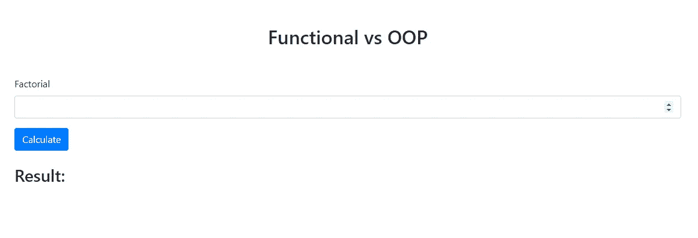

# JavaScript 中的函数式编程与面向对象编程

> 原文：<https://levelup.gitconnected.com/functional-programming-vs-oop-in-javascript-539202768406>

## 这两种范式有什么区别？


琼·加梅尔在 [Unsplash](https://unsplash.com/s/photos/javascript?utm_source=unsplash&utm_medium=referral&utm_content=creditCopyText) 上的照片

OOP 和函数式编程有什么区别？为了解决这个问题，我们将编写一个小型的网站阶乘计算器。第一种方法使用函数式编程，第二种方法使用 OOP。

## 介绍

在我们开始编码之前，我想给你一个面向对象和函数式编程的快速介绍。

两者都是[编程范例](https://en.wikipedia.org/wiki/Programming_paradigm)，不同之处在于它们允许和禁止的技术。

有些编程语言只支持一种范式，例如 [Haskell](https://www.haskell.org/) (纯函数式)。

除了支持多种范例的语言(如 [JavaScript](https://en.wikipedia.org/wiki/JavaScript) )之外，您还可以使用 JavaScript 来编写面向对象或函数式代码，甚至是两者的混合。

## 设置

在我们深入研究这两个范例之间的差异之前，我们需要设置这个项目。

为此，我们首先创建所有需要的文件和文件夹，如下所示:

```
$ mkdir func-vs-oop
$ cd ./func-vs-oop
$ cat index.html
$ cat functional.js
$ cat oop.js
```

我使用的是 *cat* 命令，因为它可以在 Linux 系统和 Windows Powershell 上运行。

接下来，我们需要在*index.html*中为阶乘计算器创建一个简单的表单。

index.html

为了给这个表单一个更好的外观和感觉，我们使用 [bootstrap](https://getbootstrap.com/) 作为 *CSS 框架*。如果您在浏览器中显示这个 HTML，它应该是这样的:



阶乘计算器

目前，这个表单不会做任何事情。

我们的目标是实现一个逻辑，您可以输入一个高达 100 的数字。点击“计算”按钮后，应在*结果分区*中显示结果。我们将以面向对象的方式和函数的方式来实现这一点。

## 功能实现

首先，我们将为函数式编程方法创建一个文件。

```
$ cat functional.js
```

首先，我们需要一个函数，在将这个文件加载到浏览器中时会调用这个函数。这个函数应该获取表单，然后将我们需要的功能添加到表单的 submit-event 中。

```
function addSubmitHandler(tag, handler) {
  const form = getElement(tag);
  form.addEventListener('submit', handler);
}addSubmitHandler('#factorial-form', factorialHandler);
```

首先，我们声明名为 *addSubmitHandler* 的函数。

这个函数接受两个参数，第一个是我们希望在 HTML 中查找的标签，第二个是我们希望绑定到元素的 submit-event 的函数。

接下来，我们通过传入 *#factorial-form* 和函数名 *factorialHandler* 来调用这个函数。标签前面的 hashtag 表示我们正在 HTML 中寻找 id 属性。

如果您现在尝试运行它，这段代码将会抛出一个错误，因为无论是函数 *getElement* 还是 *factorialHandler* 都没有在任何地方定义。

所以让我们首先在我们的 *addSubmitHandler* 函数上面定义 *getElement* ，如下所示:

```
function getElement(tag) {
  return document.querySelector(tag);
}
```

这个函数非常简单，只返回我们通过传入的标签找到的 HTML 元素。

但是我们稍后会重用这个函数。

现在让我们开始创建核心逻辑，在 *addSubmitHandler* 之上添加 *factorialHandler* 函数。

```
function factorialHandler(event) {
  event.preventDefault();
  const inputNumber = getValueFromElement('#factorial');
  try {
    const result = calculateFactorial(inputNumber);
    displayResult(result);
  } catch (error) {
    alert(error.message);
  }
}
```

我们传入事件并立即调用[*prevent default*](https://developer.mozilla.org/en-US/docs/Web/API/Event/preventDefault)。这将阻止提交事件的默认行为，你可以在不调用 *preventDefault* 的情况下尝试一下点击按钮会发生什么。

之后，我们通过调用函数*getvaluefrommelement*从输入字段获取用户输入的值。得到数字后，我们尝试使用函数 *calculateFactorial* 计算阶乘，然后通过将结果传递给函数 *displayResult* 将结果呈现到页面。

如果值的格式不正确，或者数字大于 100，我们将抛出一个错误，并显示为警报。这就是在这种特殊情况下使用 try-catch 块的原因。

下一步，我们再创建两个助手函数，*getvaluefrommelement，*和 *displayResult* 。让我们将它们添加到 *getElement* 函数的下面。

```
function getValueFromElement(tag) {
  return getElement(tag).value;
}function displayResult(result) {
  getElement('#factorial-result').innerHTML = result;
}
```

这两个函数都使用我们的 *getElement* 函数。这种可重用性是函数式编程如此有效的原因之一。

为了使其更加可重用，我们可以潜在地为 *displayResult* 添加第二个参数，称为 tag。以便我们可以动态地设置应该显示结果的元素。但是在这个例子中，我采用了硬编码的方式。

接下来，我们在*阶乘处理程序*的正上方创建*计算阶乘*函数。

```
function calculateFactorial(number) {
  if (validate(number, REQUIRED) && validate(number, MAX_LENGTH, 100) && validate(number, IS_TYPE, 'number')) {
    return factorial(number);
  } else {
    throw new Error('Invalid input — either the number is to big or it is not a number');
  }
}
```

我们验证参数“number”是否不为空，不超过 100，并且属于 number 类型。为此，我们使用一个名为 *validate* 的函数，我们接下来需要创建这个函数。如果检查通过，我们调用函数*阶乘*并返回其结果。如果这些检查没有通过，我们将抛出在*阶乘处理程序*函数中捕获的错误。

首先，让我们在 *displayResult* 下面创建 *validate* 函数和三个常量 MAX_LENGTH、IS_TYPE 和 REQUIRED。

```
const MAX_LENGTH = 'MAX_LENGTH';
const IS_TYPE = 'IS_TYPE';
const REQUIRED = 'REQUIRED';function validate(value, flag, compareValue) {
  switch (flag) {
    case REQUIRED:
      return value.trim().length > 0;
    case MAX_LENGTH:
      return value <= compareValue;
    case IS_TYPE:
      if (compareValue === 'number') {
        return !isNaN(value);
      } else if (compareValue === 'string') {
        return isNaN(value);
      }
    default:
      break;
  }
}
```

在这个函数中，我们使用一个开关来决定我们将要执行哪种验证。确定之后，就是简单的值验证了。

现在我们将在 *calculateFactorial* 声明的正上方添加实际的 *factorial* 函数。这将是这种方法的最后一个功能。

```
function factorial(number) {
  let returnValue = 1;
  for (let i = 2; i <= number; i++) {
    returnValue = returnValue * i;
  }
  return returnValue;
}
```

有许多不同的方法来执行阶乘计算，我用的是迭代法。

如果你想了解更多关于不同方法的信息，我推荐你查看 GeeksForGeeks 上的这篇文章:[https://www . geeks forgeeks . org/program-for-factorial-of-a-number/](https://www.geeksforgeeks.org/program-for-factorial-of-a-number/)

最终的 **functional.js** 文件应该是这样的:

functional.js

在这种方法中，我们专门处理函数。每个功能都有一个单一的目的，其中大部分可以在应用程序的其他部分重用。

对于这个简单的 web 应用程序，函数式方法有点矫枉过正。接下来，我们将编写相同功能的代码，但这次是面向对象的。

## 面向对象的实现

首先，我们需要将我们的*index.html*文件的 script-tag 中的 src 修改如下。

```
<script src=”oop.js” defer></script>
```

现在我们创建了 *oop.js* 文件。

```
$ cat oop.js
```

对于 OOP 方法，我们想要创建三个不同的类，一个用于验证，一个用于阶乘计算，一个用于处理表单。

我们从创建处理表单的类开始。

输入形式

在构造函数中，我们获取表单元素和输入元素，并将其存储在类变量中，也称为属性。之后，我们将方法 *factorialHandler* 添加到提交事件中。在这种情况下，我们需要将类的“this”绑定到方法上。

如果我们不这样做，我们将得到引用错误，例如调用 *this.numberInput.value* 将是未定义的。之后，我们创建类方法 *factorialHandler* ，将事件作为参数。

这个方法的代码应该看起来有些熟悉，例如，if 语句检查输入值是否有效，就像我们在 *calculateFactorial* 函数中所做的那样。

*Validator.validate* 是对我们仍然需要创建的类 *Validator* 内部的静态方法的调用。如果我们使用静态方法，我们不需要初始化一个对象的新实例。验证通过后，我们创建一个新的*阶乘类*实例，传入输入值，然后向用户显示计算结果。

接下来，我们将在 *InputForm 类*的正上方创建*验证器类*。

验证器

正如您所看到的，这个类中的所有东西都是静态的，方法*验证了*以及三个属性。因此我们不需要任何构造函数。这样做的好处是，我们不需要每次想使用这个类时都初始化它。

*validate* 与 *validate* 基本相同，validate 函数是我们的 *functional.js* ，除了我们这样做*。必修*，*本。MAX_LENGTH* 和 *this。IS_TYPE** 而不仅仅是变量名。

接下来，我们在*验证器类*的正下方创建我们的*阶乘类*。

阶乘

在初始化这个类的一个实例时，我们得到了 *resultElement* ，并把它作为一个属性和我们传入的数字存储起来。之后，我们调用方法*计算*并将它的返回值存储在一个属性中。*计算*方法包含与 *functional.js* 中的*阶乘*函数相同的代码。最后但同样重要的是，我们得到了 *display* 方法，该方法将 *resultElement* 的 *innerHTML* 设置为计算出的阶乘数。

完整的 *oop.js* 文件应该是这样的。

oop.js

我们创建了三个不同的类来处理应用程序的三个不同方面:

-验证:**验证类**

-阶乘处理:**阶乘类**

-表单处理:**输入表单类**

## 结论

这两种方法都是构建代码的有效方式。我喜欢尝试在我从事的不同项目中最有效的方法。大多数时候，甚至不可能如此清晰地区分两种范式。

我希望这个小小的比较能让您对不同的方法有一个基本的了解。

像往常一样，你可以在我的 [GitHub](https://github.com/JakobKIT/func-vs-oop) 上找到该项目的代码。