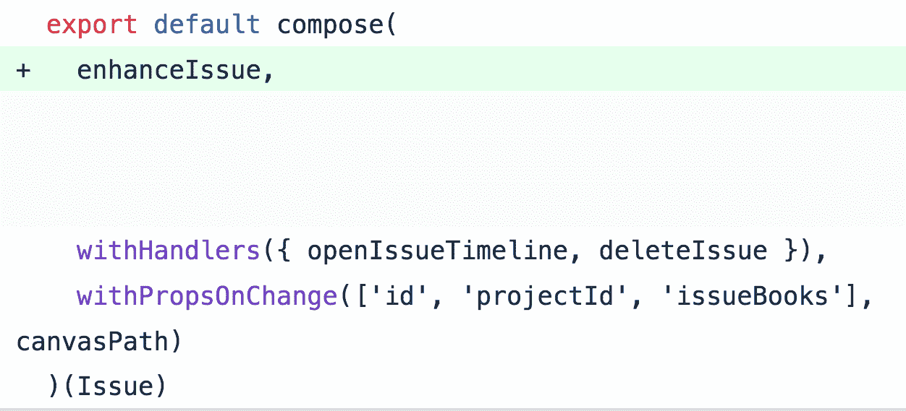

# 功能反应。可能吗？使用高阶组件探索 React 中的函数式编程技术

> 原文：<https://levelup.gitconnected.com/functional-react-is-it-possible-ceaf5ed91bfd>


布雷登·安德森在 Unsplash[拍摄的照片](https://unsplash.com/search/photos/puppy-with-glasses?utm_source=unsplash&utm_medium=referral&utm_content=creditCopyText)

**警告** —这篇帖子包含大量**代码**。如果你看到了大量的 javascript 代码，请在继续之前咨询你所爱的人、宗教领袖或者一只舒适的小狗。

**目录**

*   介绍
*   定义
*   双向编写的相同组件
*   重写
*   滚动您自己的高阶组件
*   真实世界的例子
*   优势
*   反应自然
*   潜在的不利因素
*   可供选择的事物
*   结论
*   资源

抱歉，这个标题很吸引人。让我更坦率地告诉你。

**是的。是的，它是。**

**我将向您展示如何**。但首先，介绍一下背景。

2017 年下半年开始用 React。我对 web 开发相当生疏，但是 React 的一些东西让我印象深刻——比任何其他框架都深刻。

我在以前的工作中学习了 React 的一点一滴，但这只是概念的证明和新的代码库，不会很快发布。

我非常渴望全职和 React 一起工作。幸运的是，我找到了[画板](https://drawboard.com.au)，剩下的就是历史了。

在开始之前的几个星期，我和我未来的一个同事——另一个前端开发人员——发了一封电子邮件，他给了我一份正在 web 应用上使用的技术/框架的列表。


最初，我从未听说过 [*改编*](https://github.com/acdlite/recompose) 。我只是模糊地知道什么是特设——*高阶组件*——是什么。函数式编程是在黑暗的走廊里悄悄流传的东西，是上帝提出的——一个我一无所知的高不可攀的范例。

因此，在我开始使用 Drawboard 之前，我正在编写非常典型的 React 代码。它看起来有点像这样。


从那以后，一切都变了。我很少使用关键字`class`。我们的大多数视图逻辑是由高阶组件和效用函数组成的。孤立地看很容易理解的小积木，但是组合起来却非常强大。

在我们深入编写 functional React 的宏伟的兔子洞之前，让我们从一些解释/定义开始。

**高阶**

一个函数的*阶*是指它有多深。你的典型功能是下单。在执行时——通过一些东西(参数)或其他——它做一件事，然后完成执行(通过返回一些东西或什么都不返回)。

高阶函数在**更大的** **标度**上运行。它有更远大的抱负。

> 高阶函数要么接受函数作为参数，要么返回函数。或者两者都有。


高阶函数

但这太笼统了。我们在说反应！

稍等一下。组件不就是对功能的抽象吗？


这自然使我们得出以下结论:


hoc 或更高阶组件

如果这还不十分清楚，那也没关系。但是坚持下去，我向你保证，一旦你掌握了它们的**能力**，你将会在任何地方使用更高阶的功能和组件。

如果你在过去几年中的任何时候都赶上了 React/Redux 潮流，你可能已经使用了更高阶的元件，甚至没有意识到这一点。

这里有一个常见的:


react-redux 连接

`connect`接受一些参数——`mapState`和`mapDispatch`——并吐出一个高阶分量。这个 HOC 获取你的 TodoList 组件，并吐出一个新的，*增强的*组件。从这个意义上说，`connect`的行为就像一个特设工厂。

只是为了真正把它送回家:

> 一般我们说的高阶分量 **(HOC)** ，就是一个**的东西**拿一个**分量**吐出**另一个分量**。一个新的，**增强组件**。

说够了！让我们来看看用两种不同风格编写的同一个组件。

敬代码！

这里是我们的 *Farm* 组件，写成一个类。

我夸大了一点来证明一个观点——你*实际上*实现`shouldComponentUpdate`的频率有多高？但除此之外，它是一个非常典型的组件。

这是同一个组件，从功能上来说。注意，我使用了前面提到的库中的一些助手，重新组合。稍后我会详细解释`recompose`是如何工作的。

或者更好，使用`recompose/compose:`

乍一看，这两种不同的风格可能看起来非常不同，但它们实际上做的是同一件事。

假设你有一个`Workshop`组件。它可以在一个单独的视图中使用，甚至可以在一个完全不同的应用程序中使用。你将能够从`Farm`组件中“窃取”所有的业务逻辑——你可以挑选较小的 HOC 或抓取组合的`enhance`HOC——甚至不费吹灰之力。

在典型的基于类的组件中，你会怎么做呢？你不能。这就是为什么写作对 HOCs 的功能反应如此令人敬畏。

**介绍重组:**

> “Recompose 是用于函数组件和高阶组件的 react 实用工具带。就像 lodash 代表 React 一样。”

那是直接取自`README`。简而言之，这是一个有用的 hoc 和助手集合，为您编写高质量的功能性 React 代码开辟了道路。

让我们深入研究一些`recompose`代码。我保证它非常平易近人——它在引擎盖下没有做任何超级时髦的事情。

**重新组合/mapProps(为简洁起见进行了编辑。** [**原文**](https://github.com/acdlite/recompose/blob/master/src/packages/recompose/mapProps.js) **)**

```
import { createFactory } from "react"const mapProps = propsMapper => BaseComponent => { const factory = createFactory(BaseComponent) return props => factory(propsMapper(props))}
```

你可以在道具到达你的组件之前使用`mapProps`来映射它们。假设我们的道具最初是这样的:

```
{routerProps: {location, query, hash}, tools, ...props}
```

但是您的组件并不关心 routerProps 来自哪里——它只需要它们的原样。一个例子`propsMapper`可以是:

```
const propsMapper = 
   ({routerProps, ...props}) => ({...routerProps, ...props})
```

没什么疯狂的，只是传播了`routerProps`。

所以要使用 mapProps，你需要做这样的事情:

```
const myMapProps = mapProps(propsMapper)const myEnhancedComponent = mapProps(myBaseComponent)// alternatively, all in one go:const myEnhancedComponent = mapProps(propsMapper)(myBaseComponent)
```

我想你开始掌握整个*高阶*的事情了。

现在——recompose 有一些非常有用的技巧。但是它们是基本的、通用的，并不能解决您的应用程序的所有具体问题。不用担心——你可以也应该推出你自己的高阶元件来满足你的需求。我们的代码库中有数百个。

这是我写的一个叫做`withStateOfTypeSet`的例子。

这有助于避免在许多必须存储某个属于某个集合的本地状态的组件之间重复实现相同的逻辑。对于那些不熟悉 JS 中集合行为的人——查看一下 [MDN 文档](https://developer.mozilla.org/en-US/docs/Web/JavaScript/Reference/Global_Objects/Set)。

**withStateOfTypeSet**

我希望代码是非常自文档化的。这是一个*漂亮的* HOC，它抽象出一些你在初始化或者添加/删除`Set`时必须做的奇怪事情。这里我唯一需要解释的是`recompose/withHandlers`向你的组件添加了一些函数，这些函数是用最新的道具调用的。[看看吧。](https://github.com/acdlite/recompose/blob/master/src/packages/recompose/withHandlers.js)

> 你能创作 HOCs 的范围是无限的。这些是构建应用程序的构件。

到目前为止，我只展示了学习示例。虽然很酷——但它们并没有真正展示 functional React 在极端情况下会是什么样子。

极端反应

下面是我们最大的组件之一的默认导出。它有很多行为，是这一群中最丑陋的一个。但是它的所有功能都是由许多小积木组成的。所有的`handlers`都是微小的功能。视图逻辑是一个无状态的功能组件，除了声明组件应该是什么样子之外，它什么也不做。


你可以带着这些想法深入研究

现在，我已经写了一大堆关于什么的文章。但是，让我们跳到广泛的和绝对积极的*为什么*。

我不会从总体上讲述编写函数式代码的好处——函数式代码有很多——因为这篇文章会变成一篇说教。但是探索一些特定于 React 的优点肯定在范围之内。

**组件内代码重用更加可行**

您现在可以在组件之间共享代码，而无需复制粘贴。这可能是最大的胜利。您的代码库将更加简洁，您只需在一个地方而不是 10 个地方更改业务逻辑，代码的可读性将大大提高。另外，对于新开发人员来说，开发更小的功能和组件比尝试开发 500 行的怪物要容易得多。


对不起 500 线类组件先生。去远足吧！

一旦您的整个代码库遵循相同的模式，效果就会越来越复杂。因为随着时间的推移——这是不可避免的——你会发现你已经完成了你试图建立的新事物。你已经写了 90%你需要的 hoc！所以这只是即插即用，然后你可以发货！🚢(开玩笑，但抛开乐观的妄想，有时候其实就是那样的感觉。)

通常，您最终制作的组件是由一个或多个 hoc 组成的，这些 hoc 包装了一些通用组件，比如一个模型、一个按钮或一个链接。

# **利益如何延伸到本土反应**

今年早些时候，我谈到了我在 T4 将 React Native 集成到现有 iOS 应用程序中的经历。我也在 [MelbJS](http://melbjs.com) 上讲过——幻灯片在我的[网站](https://james.now.sh/)上。这是我真正感到兴奋的事情。有一点对我来说是革命性的，那就是在两个应用程序之间共享代码的能力。

我已经将 web repo 设置为 iOS 项目中的一个子模块，因此我们为 web 编写的任何代码都可以很容易地在 iOS 应用程序中使用。这有很多很酷的部分 iOS 应用程序甚至“复制”了与 web 相同的数据层！—如果您像我们一样编写自己的 React，那么您可以跨平台共享组件业务逻辑。

让我们举一个真实世界的例子。几个月前，我们在 web 应用程序中构建了问题管理。可以把它想象成建筑师/工程师提出图纸问题的吉拉。

难道没有一些规则表明，每一个发展到足够大的软件项目最终都会构建自己的吉拉实现吗？🤔

总之，核心组件之一`Issue`的导出看起来有点像这样:


注意红色。当我开始在 React Native 的 iOS 应用程序中构建相同的功能集时，我们需要同样的逻辑。因此，一个自然的重构随之而来:



重构…


然后我可以使用这个 HOC 来连接 React Native `Issue`组件！

同样，这不是一个疯狂复杂的例子，但我希望你能看到这些想法如何扩展到整个功能，代码库，甚至像在这个例子中的交叉项目。我甚至不用去找这个例子！当我发表这篇文章的时候，我刚刚完成了这个特性的构建——仅仅从我的日常工作中，就可以很容易地找到 React 中的函数式编程为什么如此棒的例子，这真是太棒了。

我们能够如此成功/快速地用 React Native 进行实验，完全是因为我们的 web 代码库是以这种方式构建的。

你实际上可以更进一步，使用`[react-native-web](https://github.com/necolas/react-native-web)`或`[react-primitives](https://github.com/lelandrichardson/react-primitives)`共享视图逻辑，但是我还没有把这些想法带到我们的应用程序中。

**潜在的不利因素**

我不是一个狂热地推销某种方法，同时完全忽略任何陷阱的狂热爱好者。

让我们探讨一下像这样编写所有代码的一些缺点。

*   性能特征是一个灰色地带。我把这部分标为*潜在的*缺点，因为我真的不确定这一点。我并不是说功能相同的“传统”React 视图逻辑比功能相同的 React 代码的性能差*——但是我从未见过任何实验，我还没有深入研究它。这是因为到目前为止，jank 在 Bullclip web 应用程序上还没有出现任何问题。我很想知道是否有人研究过这个问题——特别是使用新的 [React dev tools profiler](https://reactjs.org/docs/optimizing-performance.html#profiling-components-with-the-devtools-profiler) 的分析功能——所以如果你有兴趣，请联系我们！*
*   *有时候，有些事情你要么不能做，要么使用这种模式会变得更加困难。使用引用是可行的，但是不够直观。如果你正在进入生命周期并做非常复杂的事情——你可能会发现使用一个类更容易。但是你可以像对待一个以功能为主的代码库中不纯的、有副作用的代码一样对待这些事情。隔离它，承认你正在使用一些不纯的代码，使用它，然后继续前进。*
*   *React 开发工具深入人心。探索组件树要困难得多(但并非不可能),因为每个 HOC 都会向树中添加另一个组件。有趣的是，我并不经常需要这样做，因为像这样写代码的好处之一就是我通常可以很快找到问题所在。*

**

*你的反应开发工具很厚*

*但是，你可以看到这是一个加分，如果你欣赏的能力，看到哪个特设添加到链中的道具。*

***探索替代方案***

*   *渲染道具。如果我没有 HOCs(切到一个启示录，反乌托邦的未来，功能在单个订单上最大化)——我最喜欢这种模式。这超出了本文的范围，但是可以查看官方的 react [文档](https://reactjs.org/docs/render-props.html)。*
*   *从类组件中挂接的纯函数集合。(有点难看但仍然允许代码重用。不过，与`this`打交道可能会有点麻烦。)*
*   *到处都是基于原型/类的(*扩展*)继承？ ***请*** *不要这样。**
*   *到处复制/粘贴代码？(我开玩笑的。斯塔普，请。)……(我开玩笑的。斯塔普，请。)*

*我希望在编写函数式反应时，我已经给出了足够多的选择。也许还能对我过去一年左右的经历有一点了解。*

*我非常喜欢将我的作品公之于众。这可以为某人节省很多时间——或者给另一个人一个机会向我解释为什么我的观点是错误的。如果你有任何问题/想告诉我为什么你认为这不好，为什么我错了或者我有味道，请联系我。我保证不会对你大喊函数式编程术语。*

*我会把所有的焦虑都放进一个 [*库里*](https://en.wikipedia.org/wiki/Currying) *。**

*你可以在 [https://james.now.sh](https://james.now.sh) 找到更多关于我的信息。或者通过跟踪我的 GitHub [@James-E-Adams](https://github.com/james-E-Adams) 。或者推特我 [@jamesadams0](https://twitter.com/jamesadams0) ！*

*资源:*

*   *[https://reactjs.org/docs/higher-order-components.html](https://reactjs.org/docs/higher-order-components.html)*
*   *[https://dr boolean . git books . io/mosely-sufficient-guide-old/content/](https://drboolean.gitbooks.io/mostly-adequate-guide-old/content/)*

*这篇文章的内容来源于我在 8 月墨尔本 React 会议上的一次演讲。你可以在 [https://james.now.sh](https://james.now.sh) 找到幻灯片。*