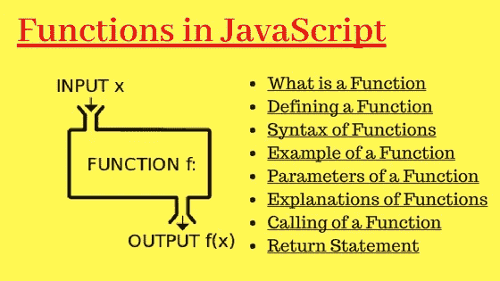

# 面向初学者的 Javascript 函数

> 原文：<https://levelup.gitconnected.com/functions-in-javascript-for-beginners-3a95004f4238>



在本文中，我们将介绍函数、它们的用途以及如何与它们保持联系。函数是封装一部分代码的一种方式，这样就可以重用特定的操作，并在特定的时间调用它来运行。

# 申报

一个声明函数的语法的例子。

```
function name (parameterrs) {
    // function body goes here
}// example
function showMessage() {
    alert("hello world"); 
}
```

注意:形参是传递给函数的命名变量，而函数实参是赋给形参的实际值。

# 命名

因为函数是动作，所以它们的名字通常是动词。保持名称简短，但要准确描述函数的功能。

```
showMessage(); 
// shows a messagegetAge(); 
// returns the agecalcSum(); 
//calculted a sum and returns the resultcreateForm(); 
// creates and returns a formcheckPermission(); 
// check a permission, returns true/false
```

# 争论

一个函数可以要求你传递一些参数(Args ),这些参数作为函数中的一个变量。这允许更好的可重用性。

```
function calcAge(currentYear, birthYear) {
    return currentYeay - birthYear; 
}
const rahAge = calcAge(2021, 2004); 
// output: 17const samAge = calcAge(2021, 2000); 
// Output:21
```

# 局部变量

在函数内部声明的变量只在函数的作用域内可见。

```
function showMessage() {
    let message = "Hello World"; 
    // local variable alert(message); 
}showMessage(); 
// Hello Worldalert(message); // error
// the variable is local to the function.
```

# 返回值

函数可以返回值——通常是由函数代码生成或操作的值。

```
const movieAgeLimit = 10; function checkAge(age) {
    if (age >= movieAgeLimit) {
        return true; 
    } else {
        return false; 
    }
    // alternative: return age >= moveAgeLimit 
}const hasAccess = checkAge(18); 
if (hasAccess) {
    alert("enjoy the movie"); 
} else {
    alert("Get out please!"); 
}
```

# 调用其他函数

它也可以用来执行一个动作或调用另一个函数。

```
const yourName = prompt("What is your name? "); function showWelcomeMessage(name) {
    alert(`Welcome ${name}`); 
}showWelcomeMessage(yourName);
```

# 👓包装材料

函数名通常是动作词，用来有效地描述函数的功能。争用值是可以传递给函数内部使用的值。在函数内部声明的因子在函数范围内是显而易见的。学位可以返回一个值或调用另一个函数/活动。使用函数来存储可重用的代码，以便在需要时调用。

非常感谢您阅读⚡