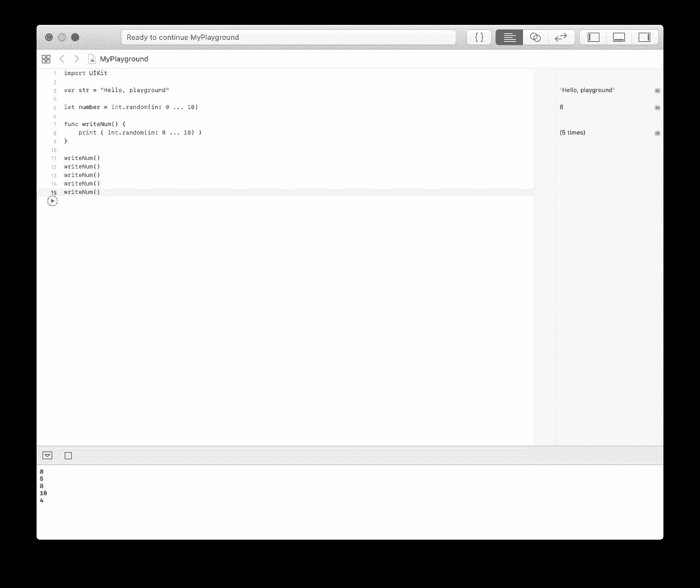

# Swift 中的功能

> 原文：<https://levelup.gitconnected.com/functions-in-swift-7e488190a011>

## 组织你的工作！

函数允许对编程语句进行分组，以表示一个可以重用的功能(或函数)。

Swift 中有很多这样的例子，所以请在我向您展示一两个例子时抓紧时间！


照片由[马库斯·沃利斯](https://unsplash.com/@marcus_wallis?utm_source=unsplash&utm_medium=referral&utm_content=creditCopyText)在 [Unsplash](https://unsplash.com/s/photos/functions?utm_source=unsplash&utm_medium=referral&utm_content=creditCopyText) 拍摄

# 先决条件:

*   能够产生一句“你好，世界！”iOS 应用程序(指南[此处](https://medium.com/@stevenpcurtis.sc/your-first-swift-application-without-a-mac-79598ad839f8))
*   能够利用游乐场跟随(此处为指南

# 术语

函数:一组可以一起执行某种操作的语句

函数签名:函数的头部

# 基本原理

您可能有几个想要在程序中重用的语句。

这方面的一个例子是在屏幕上画三角形的程序

```
Repeat three times:
    draw a line of length 10
    turn right by 60 degrees
```

你可能很乐意写一次。

如果你想在屏幕上显示两个三角形……这很快就会让人厌倦。

如果你想让屏幕充满三角形，你必须承认我们需要找到一个更好的方法。

# 实用功能

## 写在屏幕上的随机数

你可以想一个函数，打印一个 1 到 10 之间的随机数。在 Swift 中，这是`Int.random(in: 1 ... 10)`,对于一个函数，这是以如下方式编写的:

```
func writeNum() {
    print ( Int.random(in: 1 ... 10) )
}
```

这是函数**声明**。这是我们声明函数的地方，但是它永远不会运行，因为没有任何东西**调用**这个函数。

为此，我们想写多少次`writeNum()`就写多少次，我们会在屏幕上得到一个新的数字。

如果你在 Swift Playgrounds 需要一些帮助编码，请点击[这个](https://medium.com/@stevenpcurtis.sc/coding-in-swift-playgrounds-1a5563efa089)链接，但是对我来说，我打印了 5 个不同的随机数(当然你的会不同，因为这些数字是随机的)



## 带名字的随机数

也许你想给你的朋友一个随机的分数。输出将类似于

戴夫

*8*

因为名字每次都会改变，所以我们希望有一个函数能接受这个名字。那么，取入部分称为**参数**，我们可以用下面的函数来表示:

```
func writeNum(name: String) {
    print (name)
    print ( Int.random(in: 0 ... 10) )
}
```

我们用下面的语句调用这个函数

`writeNum(name: "Dave")`

让我们解释一下正在发生的事情

`writeNum`函数的第一行(函数签名)肯定已经改变了。`func writeNum(name: "Dave")`现在将详细解释:

`**func**`意味着我们正在声明一个函数

`**writeNum**`是我们命名这个函数的地方

`**(name: String)**`是参数——我们将在这里传递我们朋友的名字，在这种情况下，它必须是一个字符串。

我们称这些组件为**函数签名**。

## 多参数函数

您可以拥有任意多的参数，只需用逗号(，)分隔它们。

以下函数连接两个字符串(后面是如何调用该函数):

```
func joinStrings(one: String, two: String) {
    print (one + two)
}
joinStrings(one: "a", two: "b")
```

## 返回值的函数

您可以通过将`->`放在参数后面来返回值，所以您需要确保您确实返回值。

我们可以*返回*它们，而不是将连接的字符串打印到屏幕上。

```
func joinStringsAndReturn(one: String, two: String) {
    print (one + two)
}
joinStringsAndReturn(one: "a", two: "b")
```

现在，这实际上不会显示您在屏幕上做了什么。为此，您需要打印结果:

```
print (joinStringsAndReturn(one: "a", two: "b"))
```

这让您认为返回结果是一个好主意，因为您可以在事后决定如何处理结果。

## 返回可选值的函数

你可能知道[选项](https://medium.com/@stevenpcurtis.sc/re-implement-optionals-in-swift-41129477934c)。你可以返回它们，这意味着你的函数要么返回 0，要么返回一个值。除法就是一个很好的例子，因为被零除会导致不好的事情发生。

注意函数签名中可选的`?`。

```
func myDiv(one: Int, two: Int) -> Int? {
    if two < 1 {return nil}
    return one / two
}
myDiv(one: 1, two:0) // nil
myDiv(one: 4, two: 2) // 2
```

## 外部和内部参数名称

当参数被调用时或在函数内部时，参数可以有不同的名称。这意味着您可以缩短内部使用的一些变量。

```
func myName(name nm: String) {
    print (nm)
}
myName(name: "Steve") // Steve
```

这是一个简单的例子，但能给你一些启发

## 可变参数

这是更高级的代码。但是您可以接受未知数量的参数，而不必使用数组。

```
func sum(numbers: Int...) {
    var sum = 0
    for i in numbers {
         sum += i
    }
    print (sum)
}
sum(numbers: 1,2,3) // 6
sum(numbers: 1,2,3,4,5) // 15
```

有点棘手——但在某些情况下是必要的。

## 默认参数

有时，您可能希望有一个参数作为默认值。没问题。

```
func calcInterest(money: Int, InterestRate) -> Int {
    return money + (money * interestRate)
}
calcInterest(money: 1) // 1
calcInterest(money: 2, interestRate: 1) // 4
```

上面是一个只有整数的糟糕例子，但它仍然给了你一个想法。

## 不带参数标签的函数

您不必指定参数标签。所以你不希望你调用的函数的一部分是 where func(**argument label:**value)

```
func addTwo(_ one: Int, _ two) -> Int {
    return one + two
}
addTwo(2,4) // 6
```

# 结论

您将在 Swift 中大量使用函数。浏览这些示例，我希望您对 Swift 中的功能有很好的理解。

当然，我祝你编码愉快。

# 回购链接

我已经为你准备了下面的链接。如果你需要手动下载，请看这里的指南。

[](https://github.com/stevencurtis/SwiftCoding/tree/master/Functions/Code) [## stevencurtis/SwiftCoding

### 一组关于 Swift 编码的博文。通过在…上创建帐户，为 stevencurtis/SwiftCoding 开发做出贡献

github.com](https://github.com/stevencurtis/SwiftCoding/tree/master/Functions/Code) 

**想取得联系？试试这里的链接:**

【https://twitter.com/stevenpcurtis 